
EIGHTFINITE presents a small Vanilla+ modpack for Minecraft 1.7.10.

This README is a work in progress. Not all information might be accurate yet. Please report any inaccurate information.

This pack contains Fastcraft, by Player, enabled by default. Fastcraft enhances Minecraft with increased performance. Bug reports being made directly to Mod Authors should state Fastcraft is enabled.

<h2>Binaries</h2>
<table>
<thead><tr>
<th>Icon</th>
<th>Name</th>
<th>Type</th>
<th>&emsp;&emsp;&emsp;&ensp;  &emsp;&emsp;&emsp;&ensp;</th>
<th>License</th>
<th>Source Code</th>
<th>&emsp;&emsp;&emsp;&emsp;&emsp;&ensp;  &emsp;&emsp;&emsp;&emsp;&emsp;&ensp;</th>
<th>Description</th>
<th>Latest Release</th>
</tr></thead>
<tbody>
<tr>
<td align="center"></td>
<td><a href="https://files.minecraftforge.net/maven/net/minecraftforge/forge/index_1.7.10.html" title="Forge/FML">Forge/FML</a></td>
<td>Server Executable</td>
<td><a href="https://www.curseforge.com/members/lexmanos" title="LexManos">LexManos</a>, <a href="https://www.curseforge.com/members/cpw" title="cpw">cpw</a></td>
<td><a href="docs/legal/MinecraftForge license.txt" title="“Forge/FML” license">MinecraftForge license</a>, <a href="docs/img/permissions/forge-permissions.png" title="“Forge/FML” granted permissions">Permissions</a></td>
<td><a href="https://github.com/MinecraftForge/MinecraftForge/tree/1.7.10" title="“Forge/FML” source code">Open Source</a></td>
<td align="center"></td>
<td>Modding API.</td>
<td align="center"><code>forge-1.7.10-10.13.4.1614-1.7.10-universal.jar</code>, <code>FTBServer-1.7.10-1614.jar</code></td>
</tr>
<tr>
<td align="center"></td>
<td><a href="https://www.oracle.com/java/technologies/javase/javase8-archive-downloads.html" title="Java SE Runtime Environment 8">Java SE Runtime Environment 8</a></td>
<td>Binary</td>
<td><a href="https://www.oracle.com/" title="Oracle">Oracle</a></td>
<td><a href="docs/legal/BCL.txt" title="“Java SE Runtime Environment 8” license">BCL</a>, <a href="docs/img/permissions/java-permissions.png" title="“Java SE Runtime Environment 8” granted permissions">Permissions</a></td>
<td>Closed Source</td>
<td align="center"></td>
<td>The binaries required to run Java applications.</td>
<td align="center"><code>jre-8u201-linux-x64.tar.gz</code>, <code>jre-8u201-windows-i586.exe</code>, <code>jre-8u201-windows-x64.exe</code></td>
</tr>
<tr>
<td align="center"></td>
<td><a href="https://web.archive.org/web/20140831215145/https://minecraft.net/download" title="Minecraft Server">Minecraft Server</a> </td>
<td>Server Executable</td>
<td><a href="https://web.archive.org/web/20140625091621/https://mojang.com/" title="Mojang">Mojang</a></td>
<td><a href="docs/legal/All Rights Reserved.txt" title="“Minecraft Server” is All Rights Reserved">All Rights Reserved</a></td>
<td>Closed Source</td>
<td align="center"></td>
<td>Set up a Minecraft server.</td>
<td align="center"><code>minecraft_server.1.7.10.jar</code></td>
</tr>
<tr>
<td align="center"></td>
<td><a href="https://multimc.org/" title="MultiMC">MultiMC</a> </td>
<td>Client Executable</td>
<td><a href="https://github.com/MultiMC/MultiMC5/graphs/contributors" title="MultiMC contributors">MultiMC contributors</a></td>
<td><a href="docs/legal/Apache-2.0.txt" title="“MultiMC” license">Apache-2.0</a></td>
<td><a href="https://github.com/MultiMC/MultiMC5" title="“MultiMC” source code">Open Source</a></td>
<td align="center"></td>
<td>Launches Minecraft.         </td>
<td align="center"><code>mmc-develop-win32.zip</code></td>
</tr>
<tr>
<td align="center"></td>
<td><a href="https://nodejs.org/" title="Node">Node</a></td>
<td>Binary</td>
<td><a href="https://github.com/nodejs/node/blob/v12.10.0/AUTHORS" title="Node contributors">Node contributors</a>, <a href="https://github.com/joyent" title="Joyent">Joyent</a>, <a href="https://github.com/nodejs/node/blob/v12.10.0/LICENSE" title="others">others</a></td>
<td><a href="docs/legal/Node license.txt" title="“Node” license">Node license</a></td>
<td><a href="https://github.com/nodejs/node/tree/v12.10.0" title="“Node” source code">Open Source</a></td>
<td align="center"></td>
<td>The binaries required to run JavaScript applications.</td>
<td align="center"><code>node-v12.10.0-linux-arm64.tar.gz</code>, <code>node-v12.10.0-win-x64.7z</code>, <code>node-v12.10.0-win-x86.7z</code></td>
</tr>
</tbody>
</table>
<h2>Mods</h2>
<table>
<thead><tr>
<th>Icon</th>
<th>Name</th>
<th>Type</th>
<th>&emsp;&emsp;&emsp;&ensp;  &emsp;&emsp;&emsp;&ensp;</th>
<th>License</th>
<th>Source Code</th>
<th>&emsp;&emsp;&emsp;&emsp;&emsp;&ensp;  &emsp;&emsp;&emsp;&emsp;&emsp;&ensp;</th>
<th>Description</th>
<th>Latest Release</th>
</tr></thead>
<tbody>
<tr>
<td align="center"></td>
<td><a href="https://www.curseforge.com/minecraft/mc-mods/a-block-of-charcoal" title="A Block of Charcoal">A Block of Charcoal</a></td>
<td>Client/Server Mod</td>
<td><a href="https://www.curseforge.com/members/turkey2349" title="Turkey">Turkey</a></td>
<td><a href="docs/legal/All Rights Reserved.txt" title="“A Block of Charcoal” is All Rights Reserved">All Rights Reserved</a></td>
<td><a href="https://github.com/Turkey2349/A-Block-Of-Charcoal/tree/dev_1.7.10" title="“A Block of Charcoal” source code">Visible Source</a></td>
<td align="center"></td>
<td>Craft charcoal into blocks.</td>
<td align="center"><code>A Block of Charcoal-1.0.jar</code></td>
</tr>
<tr>
<td align="center"></td>
<td><a href="http://atomicstryker.net/advancedmachines.php" title="Advanced Machines">Advanced Machines</a></td>
<td>Client/Server Mod</td>
<td><a href="https://www.curseforge.com/members/atomicstrykergrumpy" title="AtomicStryker">AtomicStryker</a></td>
<td><a href="docs/legal/AtomicStryker license.txt" title="“Advanced Machines” license">AtomicStryker license</a></td>
<td><a href="https://github.com/AtomicStryker/atomicstrykers-minecraft-mods/tree/1.7.10/AdvancedMachinesAS" title="“Advanced Machines” source code">Open Source</a></td>
<td align="center"></td>
<td>Adds even better IC2 machines.</td>
<td align="center"><code>AdvancedMachinesAS-1.7.10.jar</code></td>
</tr>
<tr>
<td align="center"></td>
<td><a href="https://www.curseforge.com/minecraft/mc-mods/animationapi" title="AnimationAPI">AnimationAPI</a></td>
<td>Client/Server Mod</td>
<td><a href="https://www.curseforge.com/members/shcott21" title="TheHippoMaster21">TheHippoMaster21</a></td>
<td><a href="docs/legal/AGPL-3.0.txt" title="“AnimationAPI” license">AGPL-3.0</a></td>
<td><a href="https://www.curseforge.com/minecraft/mc-mods/animationapi/files/2221720" title="“AnimationAPI” source code">Open Source</a></td>
<td align="center"></td>
<td>An API to create animations more easily. Required by Ars Magica 2.</td>
<td align="center"><code>AnimationAPI-1.7.10-1.2.4.jar</code></td>
</tr>
<tr>
<td align="center"><a href="https://www.curseforge.com/minecraft/mc-mods/another-one-bites-the-dust" title="Another One Bites the Dust">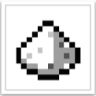</a></td>
<td><a href="https://www.curseforge.com/minecraft/mc-mods/another-one-bites-the-dust" title="Another One Bites the Dust">Another One Bites the Dust</a></td>
<td>Client/Server Mod</td>
<td><a href="https://www.curseforge.com/members/ganymedes01" title="ganymedes01">ganymedes01</a></td>
<td><a href="docs/legal/All Rights Reserved.txt" title="“Another One Bites the Dust” is All Rights Reserved">All Rights Reserved</a></td>
<td><a href="https://github.com/ganymedes01/Another-One-Bites-the-Dust" title="“Another One Bites the Dust” source code">Visible Source</a></td>
<td align="center"></td>
<td></td>
<td align="center"><code>AOBD-2.9.2.jar</code></td>
</tr>
<tr>
<td align="center"></td>
<td><a href="https://www.curseforge.com/minecraft/mc-mods/anti-id-conflict" title="Anti Id Conflict">Anti Id Conflict</a></td>
<td>Client/Server Mod</td>
<td><a href="https://www.curseforge.com/members/elix_x" title="Elix_x">Elix_x</a></td>
<td><a href="docs/legal/CC-BY-NC-ND-4.0.txt" title="“Anti Id Conflict” license">CC-BY-NC-ND-4.0</a></td>
<td></td>
<td align="center"></td>
<td></td>
<td align="center"><code>AntiIdConflict-1.3.5-1.7.10.jar</code></td>
</tr>
<tr>
<td align="center"></td>
<td><a href="https://www.curseforge.com/minecraft/mc-mods/applecore" title="AppleCore">AppleCore</a></td>
<td>Client/Server Mod</td>
<td><a href="https://www.curseforge.com/members/squeek502" title="squeek502">squeek502</a></td>
<td><a href="docs/legal/Public Domain.txt" title="“AppleCore” is dedicated to the Public Domain">Public Domain</a></td>
<td></td>
<td align="center"></td>
<td></td>
<td align="center"><code>AppleCore-mc1.7.10-3.1.1.jar</code></td>
</tr>
<tr>
<td align="center"></td>
<td><a href="https://www.curseforge.com/minecraft/mc-mods/applied-energistics-2" title="Applied Energistics 2">Applied Energistics 2</a></td>
<td>Client/Server Mod</td>
<td><a href="https://www.curseforge.com/members/algorithmx2" title="AlgorithmX2">AlgorithmX2</a></td>
<td><a href="docs/legal/LGPL-3.0.txt" title="“Applied Energistics 2” license">LGPL-3.0</a></td>
<td></td>
<td align="center"></td>
<td></td>
<td align="center"><code>appliedenergistics2-rv3-beta-6.jar</code></td>
</tr>
<tr>
<td align="center"><a href="https://www.curseforge.com/minecraft/mc-mods/armor-overlay" title="Armor Overlay">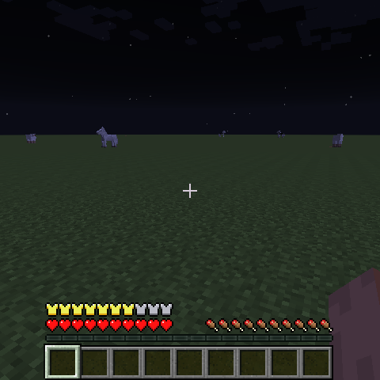</a></td>
<td><a href="https://www.curseforge.com/minecraft/mc-mods/armor-overlay" title="Armor Overlay">Armor Overlay</a></td>
<td>Client/Server Mod</td>
<td><a href="https://www.curseforge.com/members/theoldone22" title="TheOldOne22">TheOldOne22</a></td>
<td><a href="docs/legal/Public Domain.txt" title="“Armor Overlay” is dedicated to the Public Domain">Public Domain</a></td>
<td></td>
<td align="center"></td>
<td></td>
<td align="center"><code>Armor Overlay 2.0.jar</code></td>
</tr>
<tr>
<td align="center"></td>
<td><a href="https://www.curseforge.com/minecraft/mc-mods/ars-magica-2" title="Ars Magica 2">Ars Magica 2</a></td>
<td>Client/Server Mod</td>
<td><a href="https://www.curseforge.com/members/_ForgeUser9145154" title="Mithion">Mithion</a></td>
<td><a href="docs/legal/CC-BY-NC-3.0.txt" title="“Ars Magica 2” license">CC-BY-NC-3.0</a></td>
<td></td>
<td align="center"></td>
<td></td>
<td align="center"><code>1.7.10_AM2-1.4.0.009.jar</code></td>
</tr>
<tr>
<td align="center"><a href="https://www.curseforge.com/minecraft/mc-mods/ars-magica-2-plant-fix" title="Ars Magica 2 Plant Fix">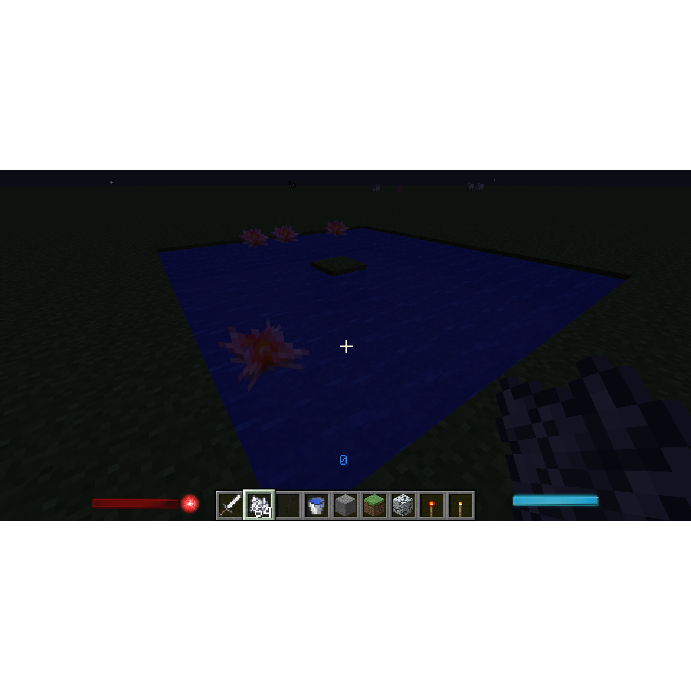</a></td>
<td><a href="https://www.curseforge.com/minecraft/mc-mods/ars-magica-2-plant-fix" title="Ars Magica 2 Plant Fix">Ars Magica 2 Plant Fix</a></td>
<td>Client/Server Mod</td>
<td><a href="https://www.curseforge.com/members/_ForgeUser19514745" title="Butchy_The_Bear">Butchy_The_Bear</a></td>
<td><a href="docs/legal/Public Domain.txt" title="“Ars Magica 2 Plant Fix” is dedicated to the Public Domain">Public Domain</a></td>
<td></td>
<td align="center"></td>
<td></td>
<td align="center"><code>AM2PlantFix-1.0.jar</code></td>
</tr>
<tr>
<td align="center"></td>
<td><a href="https://wiki.vexatos.com/wiki:asielib" title="AsieLib">AsieLib</a> </td>
<td>Client/Server Mod</td>
<td><a href="https://github.com/asiekierka" title="asie">asie</a></td>
<td></td>
<td></td>
<td align="center"></td>
<td></td>
<td align="center"><code>AsieLib-1.7.10-0.4.9.jar</code></td>
</tr>
<tr>
<td align="center"></td>
<td><a href="https://web.archive.org/web/20180706001701/https://asie.pl/files/mods/AsieTweaks/" title="AsieTweaks">AsieTweaks</a> </td>
<td>Client/Server Mod</td>
<td><a href="https://github.com/asiekierka" title="asie">asie</a></td>
<td></td>
<td></td>
<td align="center"></td>
<td></td>
<td align="center"><code>AsieTweaks-1.7.10-0.0.2.jar</code></td>
</tr>
<tr>
<td align="center"></td>
<td><a href="http://atomicstryker.net/battletowers.php" title="AtomicStryker's Battle Towers">AtomicStryker's Battle Towers</a></td>
<td>Client/Server Mod</td>
<td><a href="https://www.curseforge.com/members/atomicstrykergrumpy" title="AtomicStryker">AtomicStryker</a></td>
<td><a href="docs/legal/AtomicStryker license.txt" title="“AtomicStryker's Battle Towers” license">AtomicStryker license</a></td>
<td><a href="https://github.com/AtomicStryker/atomicstrykers-minecraft-mods/tree/1.7.10/BattleTowers" title="“AtomicStryker's Battle Towers” source code">Open Source</a></td>
<td align="center"></td>
<td></td>
<td align="center"><code>BattleTowers-1.7.10.jar</code></td>
</tr>
<tr>
<td align="center"><a href="https://www.curseforge.com/minecraft/mc-mods/atum" title="Atum">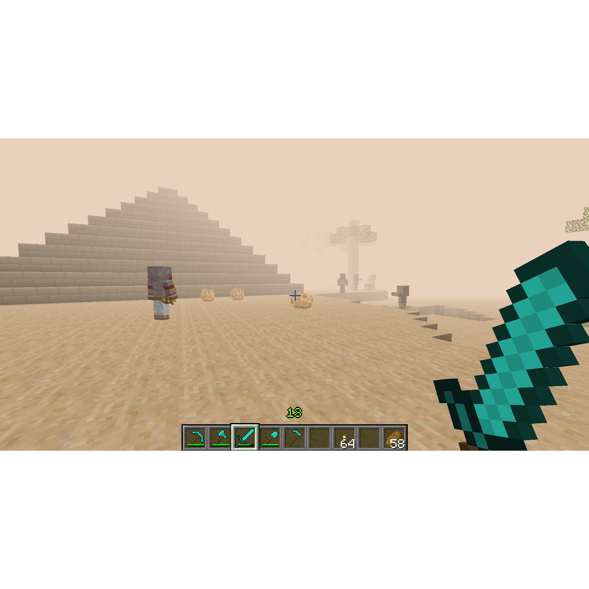</a></td>
<td><a href="https://www.curseforge.com/minecraft/mc-mods/atum" title="Atum">Atum</a></td>
<td>Client/Server Mod</td>
<td><a href="https://www.curseforge.com/members/shadowclaimer" title="Shadowclaimer">Shadowclaimer</a></td>
<td><a href="docs/legal/All Rights Reserved.txt" title="“Atum” is All Rights Reserved">All Rights Reserved</a></td>
<td></td>
<td align="center"></td>
<td></td>
<td align="center"><code>Atum-1.7.10-0.6.77.jar</code></td>
</tr>
<tr>
<td align="center"></td>
<td><a href="https://github.com/GTNewHorizons/Baubles" title="Baubles">Baubles</a> </td>
<td>Client/Server Mod</td>
<td><a href="https://www.curseforge.com/members/azanor13" title="Azanor">Azanor</a></td>
<td><a href="docs/legal/CC-BY-NC-SA-3.0.txt" title="“Baubles” license">CC-BY-NC-SA-3.0</a></td>
<td><a href="https://github.com/GTNewHorizons/Baubles" title="“Baubles” source code">Open Source</a></td>
<td align="center"></td>
<td>Adds additional equip slots used by Thaumcraft and other mods.</td>
<td align="center"><code>Baubles-1.7.10-1.0.1.11.jar</code></td>
</tr>
<tr>
<td align="center"></td>
<td><a href="https://www.curseforge.com/minecraft/mc-mods/bdlib" title="BdLib">BdLib</a></td>
<td>Client/Server Mod</td>
<td><a href="https://www.curseforge.com/members/bdew" title="bdew">bdew</a></td>
<td><a href="docs/legal/MMPL-1.0.txt" title="“BdLib” license">MMPL-1.0</a></td>
<td></td>
<td align="center"></td>
<td></td>
<td align="center"><code>bdlib-1.9.4.109-mc1.7.10.jar</code></td>
</tr>
<tr>
<td align="center"></td>
<td><a href="https://www.curseforge.com/minecraft/mc-mods/bibliocraft" title="BiblioCraft">BiblioCraft</a></td>
<td>Client/Server Mod</td>
<td><a href="https://www.curseforge.com/members/nuchaz" title="Nuchaz">Nuchaz</a></td>
<td><a href="docs/legal/BiblioCraft license.txt" title="“BiblioCraft” license">BiblioCraft license</a>, <a href="docs/img/permissions/bibliocraft-permissions.png" title="“BiblioCraft” granted permissions">Permissions</a></td>
<td></td>
<td align="center"></td>
<td></td>
<td align="center"><code>BiblioCraft[v1.11.7][MC1.7.10].jar</code></td>
</tr>
<tr>
<td align="center"></td>
<td><a href="https://www.curseforge.com/minecraft/mc-mods/bibliocraft-bibliowoods-biomes-oplenty-edition" title="BiblioCraft: BiblioWoods Biomes O'Plenty Edition">BiblioCraft: BiblioWoods Biomes O'Plenty Edition</a></td>
<td>Client/Server Mod</td>
<td><a href="https://www.curseforge.com/members/nuchaz" title="Nuchaz">Nuchaz</a></td>
<td><a href="docs/legal/BiblioCraft license.txt" title="“BiblioCraft: BiblioWoods Biomes O'Plenty Edition” license">BiblioCraft license</a>, <a href="docs/img/permissions/bibliocraft-permissions.png" title="“BiblioCraft: BiblioWoods Biomes O'Plenty Edition” granted permissions">Permissions</a></td>
<td></td>
<td align="center"></td>
<td></td>
<td align="center"><code>BiblioWoods[BiomesOPlenty][v1.9].jar</code></td>
</tr>
<tr>
<td align="center"></td>
<td><a href="https://www.curseforge.com/minecraft/mc-mods/bibliocraft-bibliowoods-forestry-edition" title="BiblioCraft: BiblioWoods Forestry Edition">BiblioCraft: BiblioWoods Forestry Edition</a></td>
<td>Client/Server Mod</td>
<td><a href="https://www.curseforge.com/members/nuchaz" title="Nuchaz">Nuchaz</a></td>
<td><a href="docs/legal/BiblioCraft license.txt" title="“BiblioCraft: BiblioWoods Forestry Edition” license">BiblioCraft license</a>, <a href="docs/img/permissions/bibliocraft-permissions.png" title="“BiblioCraft: BiblioWoods Forestry Edition” granted permissions">Permissions</a></td>
<td></td>
<td align="center"></td>
<td></td>
<td align="center"><code>BiblioWoods[Forestry][v1.7].jar</code></td>
</tr>
<tr>
<td align="center"></td>
<td><a href="https://www.curseforge.com/minecraft/mc-mods/bibliocraft-bibliowoods-natura-edition" title="BiblioCraft: BiblioWoods Natura Edition">BiblioCraft: BiblioWoods Natura Edition</a></td>
<td>Client/Server Mod</td>
<td><a href="https://www.curseforge.com/members/nuchaz" title="Nuchaz">Nuchaz</a></td>
<td><a href="docs/legal/BiblioCraft license.txt" title="“BiblioCraft: BiblioWoods Natura Edition” license">BiblioCraft license</a>, <a href="docs/img/permissions/bibliocraft-permissions.png" title="“BiblioCraft: BiblioWoods Natura Edition” granted permissions">Permissions</a></td>
<td></td>
<td align="center"></td>
<td></td>
<td align="center"><code>BiblioWoods[Natura][v1.5].jar</code></td>
</tr>
<tr>
<td align="center"></td>
<td><a href="https://www.curseforge.com/minecraft/mc-mods/big-reactors" title="Big Reactors">Big Reactors</a></td>
<td>Client/Server Mod</td>
<td><a href="https://www.curseforge.com/members/_ForgeUser23750043" title="ErogenousBeef">ErogenousBeef</a></td>
<td><a href="docs/legal/MIT.txt" title="“Big Reactors” license">MIT</a></td>
<td></td>
<td align="center"></td>
<td></td>
<td align="center"><code>BigReactors-0.4.3A.jar</code></td>
</tr>
<tr>
<td align="center"></td>
<td><a href="https://www.curseforge.com/minecraft/mc-mods/binnies-mods" title="Binnie's Mods">Binnie's Mods</a></td>
<td>Client/Server Mod</td>
<td><a href="https://www.curseforge.com/members/_ForgeUser9116757" title="Binnie567">Binnie567</a></td>
<td><a href="docs/legal/All Rights Reserved.txt" title="“Binnie's Mods” is All Rights Reserved">All Rights Reserved</a></td>
<td></td>
<td align="center"></td>
<td></td>
<td align="center"><code>binnie-mods-1.7.10-2.0.22.7.jar</code></td>
</tr>
<tr>
<td align="center"></td>
<td><a href="https://www.curseforge.com/minecraft/mc-mods/biomes-o-plenty" title="Biomes O' Plenty">Biomes O' Plenty</a></td>
<td>Client/Server Mod</td>
<td><a href="https://www.curseforge.com/members/glitchfiendmods" title="Glitchfiend">Glitchfiend</a></td>
<td><a href="docs/legal/CC-BY-NC-ND-4.0.txt" title="“Biomes O' Plenty” license">CC-BY-NC-ND-4.0</a></td>
<td></td>
<td align="center"></td>
<td></td>
<td align="center"><code>BiomesOPlenty-1.7.10-2.1.0.2308-universal.jar</code></td>
</tr>
<tr>
<td align="center"></td>
<td><a href="https://www.curseforge.com/minecraft/mc-mods/blood-magic" title="Blood Magic">Blood Magic</a></td>
<td>Client/Server Mod</td>
<td><a href="https://www.curseforge.com/members/WayofTime" title="WayofTime">WayofTime</a></td>
<td><a href="docs/legal/CC-BY-4.0.txt" title="“Blood Magic” license">CC-BY-4.0</a></td>
<td></td>
<td align="center"></td>
<td></td>
<td align="center"><code>BloodMagic-1.7.10-1.3.3-17.jar</code></td>
</tr>
<tr>
<td align="center"><a href="https://www.curseforge.com/minecraft/mc-mods/born-in-a-barn" title="Born in a Barn">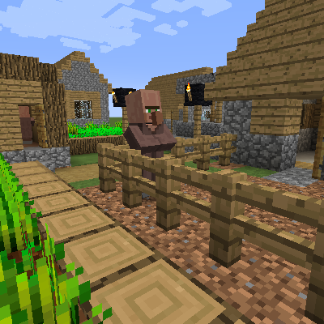</a></td>
<td><a href="https://www.curseforge.com/minecraft/mc-mods/born-in-a-barn" title="Born in a Barn">Born in a Barn</a></td>
<td>Client/Server Mod</td>
<td><a href="https://www.curseforge.com/members/Speiger" title="Speiger">Speiger</a></td>
<td><a href="docs/legal/All Rights Reserved.txt" title="“Born in a Barn” is All Rights Reserved">All Rights Reserved</a></td>
<td></td>
<td align="center"></td>
<td></td>
<td align="center"><code>Born in a Barn 1.7.x.jar</code></td>
</tr>
<tr>
<td align="center"><a href="https://www.curseforge.com/minecraft/mc-mods/botania" title="Botania">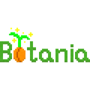</a></td>
<td><a href="https://www.curseforge.com/minecraft/mc-mods/botania" title="Botania">Botania</a></td>
<td>Client/Server Mod</td>
<td><a href="https://www.curseforge.com/members/Vazkii" title="Vazkii">Vazkii</a></td>
<td><a href="docs/legal/Botania license.txt" title="“Botania” license">Botania license</a></td>
<td></td>
<td align="center"></td>
<td></td>
<td align="center"><code>Botania r1.8-249.jar</code></td>
</tr>
<tr>
<td align="center"></td>
<td><a href="https://www.curseforge.com/minecraft/mc-mods/buildcraft" title="Buildcraft">Buildcraft</a></td>
<td>Client/Server Mod</td>
<td><a href="https://www.curseforge.com/members/CovertJaguar" title="CovertJaguar">CovertJaguar</a></td>
<td><a href="docs/legal/MMPL-1.0.txt" title="“Buildcraft” license">MMPL-1.0</a></td>
<td></td>
<td align="center"></td>
<td></td>
<td align="center"><code>buildcraft-7.1.23.jar</code></td>
</tr>
<tr>
<td align="center"><a href="https://www.curseforge.com/minecraft/mc-mods/buildcraft-compat" title="Buildcraft Compat">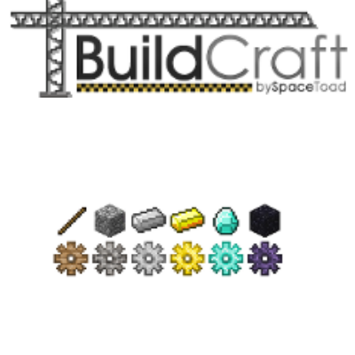</a></td>
<td><a href="https://www.curseforge.com/minecraft/mc-mods/buildcraft-compat" title="Buildcraft Compat">Buildcraft Compat</a></td>
<td>Client/Server Mod</td>
<td><a href="https://www.curseforge.com/members/CovertJaguar" title="CovertJaguar">CovertJaguar</a></td>
<td><a href="docs/legal/MMPL-1.0.txt" title="“Buildcraft Compat” license">MMPL-1.0</a></td>
<td></td>
<td align="center"></td>
<td></td>
<td align="center"><code>buildcraft-compat-7.1.7.jar</code></td>
</tr>
<tr>
<td align="center"></td>
<td><a href="https://files.vexatos.com/?dir=BuildCraftOilTweak" title="BuildCraft Oil Tweak">BuildCraft Oil Tweak</a></td>
<td>Client/Server Mod</td>
<td><a href="https://github.com/Vexatos" title="Vexatos">Vexatos</a></td>
<td></td>
<td></td>
<td align="center"></td>
<td></td>
<td align="center"><code>BuildCraftOilTweak-1.7.10-1.0.3.jar</code></td>
</tr>
<tr>
<td align="center"><a href="https://www.curseforge.com/minecraft/mc-mods/carpenters-blocks" title="Carpenter's Blocks">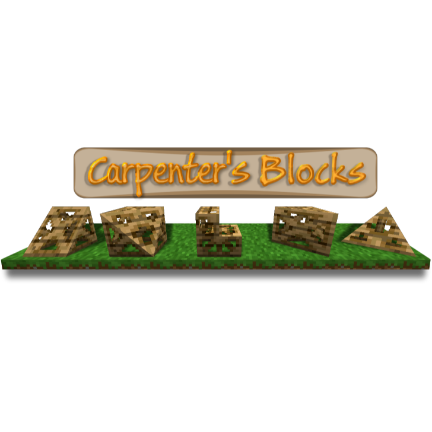</a></td>
<td><a href="https://www.curseforge.com/minecraft/mc-mods/carpenters-blocks" title="Carpenter's Blocks">Carpenter's Blocks</a></td>
<td>Client/Server Mod</td>
<td><a href="https://www.curseforge.com/members/Syntaxial" title="Syntaxial">Syntaxial</a></td>
<td><a href="docs/legal/LGPL-2.1.txt" title="“Carpenter's Blocks” license">LGPL-2.1</a>, <a href="docs/img/permissions/carpenters-blocks-permissions.png" title="“Carpenter's Blocks” granted permissions">Permissions</a></td>
<td><a href="https://github.com/Mineshopper/carpentersblocks" title="“Carpenter's Blocks” source code">Open Source</a></td>
<td align="center"></td>
<td>Adds slopes and other blocks that can take on the appearance of most other blocks.</td>
<td align="center"><code>Carpenter's Blocks v3.3.8.2 - MC 1.7.10.jar</code></td>
</tr>
<tr>
<td align="center"></td>
<td><a href="https://www.curseforge.com/minecraft/mc-mods/chicken-chunk-patcher" title="Chicken Chunk Patcher">Chicken Chunk Patcher</a></td>
<td>Client/Server Mod</td>
<td><a href="https://www.curseforge.com/members/Chocohead" title="Chocohead">Chocohead</a></td>
<td><a href="docs/legal/All Rights Reserved.txt" title="“Chicken Chunk Patcher” is All Rights Reserved">All Rights Reserved</a>, <a href="docs/img/permissions/chicken-chunk-patcher-permissions.png" title="“Chicken Chunk Patcher” granted permissions">Permissions</a></td>
<td>Closed Source</td>
<td align="center"></td>
<td>Corrects an issue in CodeChickenLib that otherwise breaks Chunk Pregenerator.</td>
<td align="center"><code>Chicken Chunk Patcher 1.1.jar</code></td>
</tr>
<tr>
<td align="center"></td>
<td><a href="https://www.curseforge.com/minecraft/mc-mods/chickenchunks" title="ChickenChunks">ChickenChunks</a></td>
<td>Client/Server Mod</td>
<td><a href="https://www.curseforge.com/members/chicken_bones" title="ChickenBones">ChickenBones</a></td>
<td><a href="docs/legal/MIT.txt" title="“ChickenChunks” license">MIT</a>, <a href="docs/img/permissions/chickenbones-permissions.png" title="“ChickenChunks” granted permissions">Permissions</a></td>
<td><a href="https://github.com/Chicken-Bones/ChickenChunks" title="“ChickenChunks” source code">Open Source</a></td>
<td align="center"></td>
<td>Adds a Chunk Loader.</td>
<td align="center"><code>ChickenChunks-1.7.10-1.3.4.19-universal.jar</code></td>
</tr>
<tr>
<td align="center"></td>
<td><a href="https://www.curseforge.com/minecraft/mc-mods/chisel" title="Chisel">Chisel</a></td>
<td>Client/Server Mod</td>
<td><a href="https://www.curseforge.com/members/tterrag1098" title="tterrag1098">tterrag1098</a></td>
<td><a href="docs/legal/GPL-2.0.txt" title="“Chisel” license">GPL-2.0</a>, <a href="docs/img/permissions/chisel-permissions.png" title="“Chisel” granted permissions">Permissions</a></td>
<td><a href="https://github.com/Chisel-Team/Chisel/tree/1.7/release" title="“Chisel” source code">Open Source</a></td>
<td align="center"></td>
<td>Craft a huge variety of decorative blocks to build with!</td>
<td align="center"><code>Chisel-2.9.5.11.jar</code></td>
</tr>
<tr>
<td align="center"><a href="https://www.curseforge.com/minecraft/mc-mods/chunkpregenerator" title="Chunk Pregenerator">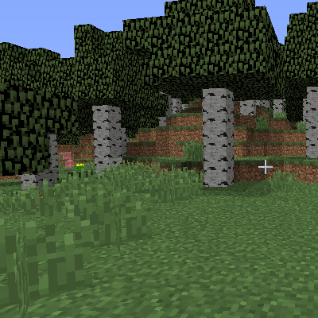</a></td>
<td><a href="https://www.curseforge.com/minecraft/mc-mods/chunkpregenerator" title="Chunk Pregenerator">Chunk Pregenerator</a></td>
<td>Client/Server Mod</td>
<td><a href="https://www.curseforge.com/members/Speiger" title="Speiger">Speiger</a></td>
<td><a href="docs/legal/All Rights Reserved.txt" title="“Chunk Pregenerator” is All Rights Reserved">All Rights Reserved</a>, <a href="docs/img/permissions/chunk-pregenerator-permissions.png" title="“Chunk Pregenerator” granted permissions">Permissions</a></td>
<td>Closed Source</td>
<td align="center"></td>
<td>Preview your worlds and generate them before setting a single step.</td>
<td align="center"><code>Chunk Pregenerator V1.7.10-2.1.jar</code></td>
</tr>
<tr>
<td align="center"><a href="https://www.curseforge.com/minecraft/mc-mods/cleanview" title="CleanView">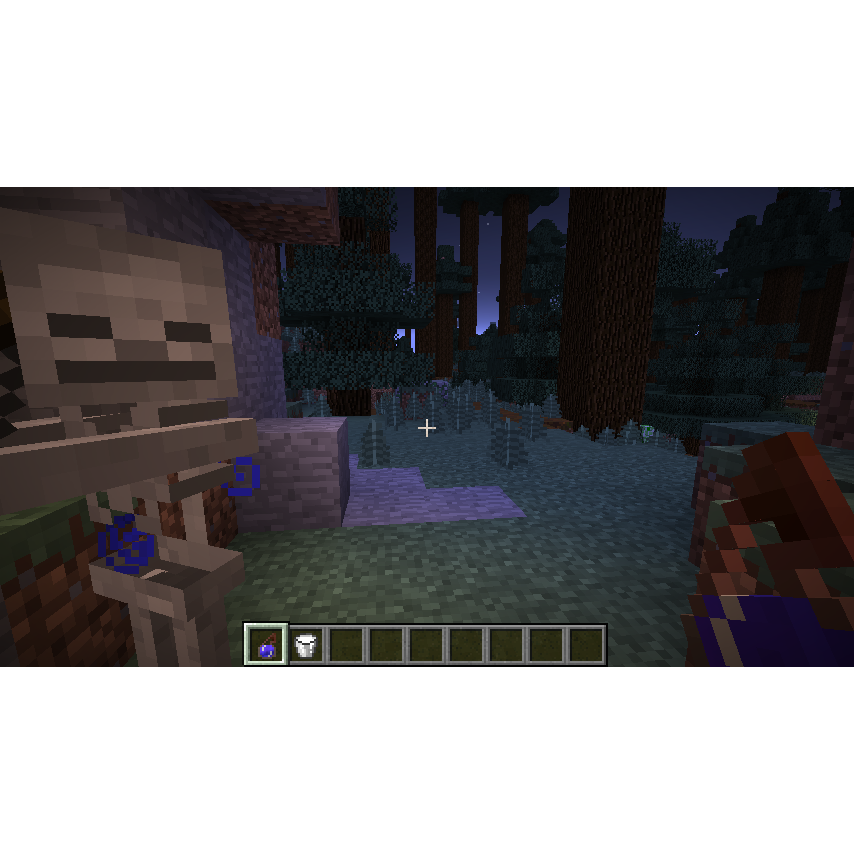</a></td>
<td><a href="https://www.curseforge.com/minecraft/mc-mods/cleanview" title="CleanView">CleanView</a></td>
<td>Client Mod</td>
<td><a href="https://www.curseforge.com/members/ZLainSama" title="ZLainSama">ZLainSama</a></td>
<td><a href="docs/legal/MMPL-1.0.txt" title="“CleanView” license">MMPL-1.0</a></td>
<td><a href="https://github.com/zlainsama/CleanView/tree/1.7" title="“CleanView” source code">Open Source</a></td>
<td align="center"></td>
<td>Removes potion effects from your view only.</td>
<td align="center"><code>CleanView-1.7.10-v2.jar</code></td>
</tr>
<tr>
<td align="center"></td>
<td><a href="https://www.curseforge.com/minecraft/mc-mods/codechickencore" title="CodeChickenCore">CodeChickenCore</a></td>
<td>Client/Server Mod</td>
<td><a href="https://www.curseforge.com/members/chicken_bones" title="ChickenBones">ChickenBones</a></td>
<td><a href="docs/legal/MIT.txt" title="“CodeChickenCore” license">MIT</a>, <a href="docs/img/permissions/chickenbones-permissions.png" title="“CodeChickenCore” granted permissions">Permissions</a></td>
<td><a href="https://github.com/Chicken-Bones/CodeChickenCore/tree/1.7.10" title="“CodeChickenCore” source code">Open Source</a></td>
<td align="center"></td>
<td>Code library for ChickenBones' mods.</td>
<td align="center"><code>CodeChickenCore-1.7.10-1.0.7.47-universal.jar</code></td>
</tr>
<tr>
<td align="center"></td>
<td><a href="https://web.archive.org/web/20190716065426/https://files.minecraftforge.net/CodeChickenLib/" title="CodeChickenLib">CodeChickenLib</a> </td>
<td>Client/Server Mod</td>
<td><a href="https://www.curseforge.com/members/chicken_bones" title="ChickenBones">ChickenBones</a></td>
<td><a href="docs/legal/LGPL-2.1.txt" title="“CodeChickenLib” license">LGPL-2.1</a>, <a href="docs/img/permissions/chickenbones-permissions.png" title="“CodeChickenLib” granted permissions">Permissions</a></td>
<td><a href="https://github.com/Chicken-Bones/CodeChickenLib/tree/1.7" title="“CodeChickenLib” source code">Open Source</a></td>
<td align="center"></td>
<td>Code library for ChickenBones' mods.</td>
<td align="center"><code>CodeChickenLib-1.7.10-1.1.3.140-universal.jar</code></td>
</tr>
<tr>
<td align="center"></td>
<td><a href="https://www.curseforge.com/minecraft/mc-mods/cofh-core" title="CoFH Core">CoFH Core</a></td>
<td>Client/Server Mod</td>
<td><a href="https://www.curseforge.com/members/TeamCoFH" title="Team CoFH">Team CoFH</a></td>
<td><a href="docs/legal/All Rights Reserved.txt" title="“CoFH Core” is All Rights Reserved">All Rights Reserved</a></td>
<td></td>
<td align="center"></td>
<td>Code library for Team CoFH's mods.</td>
<td align="center"><code>CoFHCore-[1.7.10]3.1.4-329.jar</code></td>
</tr>
<tr>
<td align="center"></td>
<td><a href="https://www.curseforge.com/minecraft/mc-mods/cofhtweaks" title="CoFHTweaks">CoFHTweaks</a></td>
<td>Server Mod</td>
<td><a href="https://www.curseforge.com/members/skyboy026" title="skyboy026">skyboy026</a></td>
<td><a href="docs/legal/All Rights Reserved.txt" title="“CoFHTweaks” is All Rights Reserved">All Rights Reserved</a></td>
<td></td>
<td align="center"></td>
<td></td>
<td align="center"><code>CoFHTweaks-[1.7.10]1.1.3B3-94.jar</code></td>
</tr>
<tr>
<td align="center"></td>
<td><a href="https://www.curseforge.com/minecraft/mc-mods/collective-framework" title="Collective Framework">Collective Framework</a></td>
<td>Client/Server Mod</td>
<td><a href="https://www.curseforge.com/members/austinv11" title="austinv11">austinv11</a></td>
<td><a href="docs/legal/GPL-2.0.txt" title="“Collective Framework” license">GPL-2.0</a></td>
<td></td>
<td align="center"></td>
<td></td>
<td align="center"><code>CollectiveFramework-1.0.0-132.jar</code></td>
</tr>
<tr>
<td align="center"><a href="https://www.curseforge.com/minecraft/mc-mods/compact-solars" title="Compact Solars">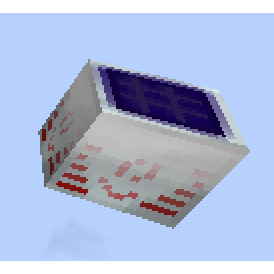</a></td>
<td><a href="https://www.curseforge.com/minecraft/mc-mods/compact-solars" title="Compact Solars">Compact Solars</a></td>
<td>Client/Server Mod</td>
<td><a href="https://www.curseforge.com/members/progwml6" title="progwml6">progwml6</a></td>
<td><a href="docs/legal/GPL-3.0.txt" title="“Compact Solars” license">GPL-3.0</a></td>
<td></td>
<td align="center"></td>
<td></td>
<td align="center"><code>CompactSolars-1.7.10-4.4.39.315-universal.jar</code></td>
</tr>
<tr>
<td align="center"><a href="https://www.curseforge.com/minecraft/mc-mods/computercraft" title="ComputerCraft">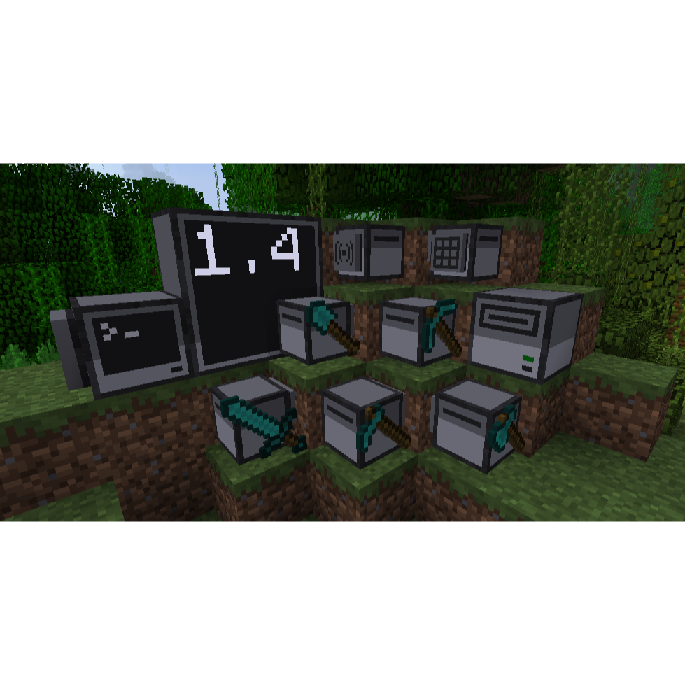</a></td>
<td><a href="https://www.curseforge.com/minecraft/mc-mods/computercraft" title="ComputerCraft">ComputerCraft</a></td>
<td>Client/Server Mod</td>
<td><a href="https://www.curseforge.com/members/dan200" title="dan200">dan200</a></td>
<td><a href="docs/legal/ComputerCraft license.txt" title="“ComputerCraft” license">ComputerCraft license</a></td>
<td></td>
<td align="center"></td>
<td></td>
<td align="center"><code>ComputerCraft1.75.jar</code></td>
</tr>
<tr>
<td align="center"></td>
<td><a href="https://www.curseforge.com/minecraft/mc-mods/computercraftedu" title="ComputerCraftEdu">ComputerCraftEdu</a></td>
<td>Client/Server Mod</td>
<td><a href="https://www.curseforge.com/members/dan200" title="dan200">dan200</a></td>
<td><a href="docs/legal/All Rights Reserved.txt" title="“ComputerCraftEdu” is All Rights Reserved">All Rights Reserved</a></td>
<td></td>
<td align="center"></td>
<td></td>
<td align="center"><code>ComputerCraftEdu1.74.jar</code></td>
</tr>
<tr>
<td align="center"></td>
<td><a href="https://www.curseforge.com/minecraft/mc-mods/custom-main-menu" title="Custom Main Menu">Custom Main Menu</a></td>
<td>Client Mod</td>
<td><a href="https://www.curseforge.com/members/Lumien" title="Lumien">Lumien</a></td>
<td><a href="docs/legal/All Rights Reserved.txt" title="“Custom Main Menu” is All Rights Reserved">All Rights Reserved</a></td>
<td></td>
<td align="center"></td>
<td></td>
<td align="center"><code>CustomMainMenu-MC1.7.10-1.9.2.jar</code></td>
</tr>
<tr>
<td align="center"></td>
<td><a href="https://www.minecraftforum.net/forums/mapping-and-modding-java-edition/minecraft-mods/1290701-davidees-gui-library-create-better-guis-updated" title="Davidee's GUI Library">Davidee's GUI Library</a> </td>
<td>Client/Server Mod</td>
<td></td>
<td></td>
<td></td>
<td align="center"></td>
<td></td>
<td align="center"><code>GUILib.jar</code></td>
</tr>
<tr>
<td align="center"><a href="https://www.curseforge.com/minecraft/mc-mods/dense-ores" title="Dense Ores">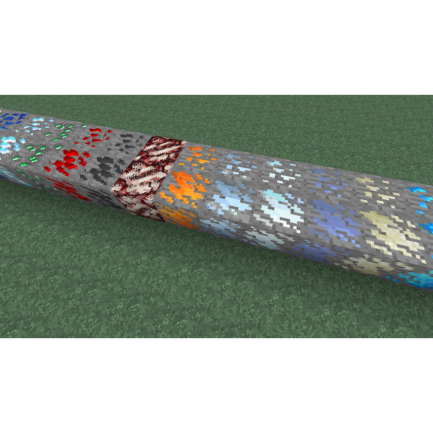</a></td>
<td><a href="https://www.curseforge.com/minecraft/mc-mods/dense-ores" title="Dense Ores">Dense Ores</a></td>
<td>Client/Server Mod</td>
<td><a href="https://www.curseforge.com/members/RWTema" title="RWTema">RWTema</a></td>
<td><a href="docs/legal/CC-BY-4.0.txt" title="“Dense Ores” license">CC-BY-4.0</a></td>
<td></td>
<td align="center"></td>
<td></td>
<td align="center"><code>denseores-1.6.2.jar</code></td>
</tr>
<tr>
<td align="center"></td>
<td><a href="https://www.curseforge.com/minecraft/mc-mods/dragonapi" title="DragonAPI">DragonAPI</a></td>
<td>Client/Server Mod</td>
<td><a href="https://www.curseforge.com/members/ReikaKalseki" title="ReikaKalseki">ReikaKalseki</a></td>
<td><a href="docs/legal/All Rights Reserved.txt" title="“DragonAPI” is All Rights Reserved">All Rights Reserved</a></td>
<td></td>
<td align="center"></td>
<td></td>
<td align="center"><code>DragonAPI 1.7.10 V23b.jar</code></td>
</tr>
<tr>
<td align="center"></td>
<td><a href="https://www.curseforge.com/minecraft/mc-mods/dynamic-lights" title="Dynamic Lights">Dynamic Lights</a></td>
<td>Client Mod</td>
<td><a href="https://www.curseforge.com/members/atomicstrykergrumpy" title="AtomicStryker">AtomicStryker</a></td>
<td><a href="docs/legal/AtomicStryker license.txt" title="“Dynamic Lights” license">AtomicStryker license</a></td>
<td><a href="https://github.com/AtomicStryker/atomicstrykers-minecraft-mods/tree/1.7.10/DynamicLights" title="“Dynamic Lights” source code">Open Source</a></td>
<td align="center"></td>
<td></td>
<td align="center"><code>Dynamic Lights-1.3.9a-MC1.7.10.jar</code></td>
</tr>
<tr>
<td align="center"></td>
<td><a href="https://www.curseforge.com/minecraft/mc-mods/ender-io" title="Ender IO">Ender IO</a></td>
<td>Client/Server Mod</td>
<td><a href="https://www.curseforge.com/members/CrazyPants" title="CrazyPants">CrazyPants</a></td>
<td><a href="docs/legal/Public Domain.txt" title="“Ender IO” is dedicated to the Public Domain">Public Domain</a></td>
<td></td>
<td align="center"></td>
<td></td>
<td align="center"><code>EnderIO-1.7.10-2.3.0.429_beta.jar</code></td>
</tr>
<tr>
<td align="center"></td>
<td><a href="https://www.curseforge.com/minecraft/mc-mods/ender-storage" title="Ender Storage">Ender Storage</a></td>
<td>Client/Server Mod</td>
<td><a href="https://www.curseforge.com/members/chicken_bones" title="ChickenBones">ChickenBones</a></td>
<td><a href="docs/legal/All Rights Reserved.txt" title="“Ender Storage” is All Rights Reserved">All Rights Reserved</a></td>
<td></td>
<td align="center"></td>
<td></td>
<td align="center"><code>EnderStorage-1.7.10-1.4.7.37-universal.jar</code></td>
</tr>
<tr>
<td align="center"><a href="https://www.curseforge.com/minecraft/mc-mods/ender-zoo" title="Ender Zoo">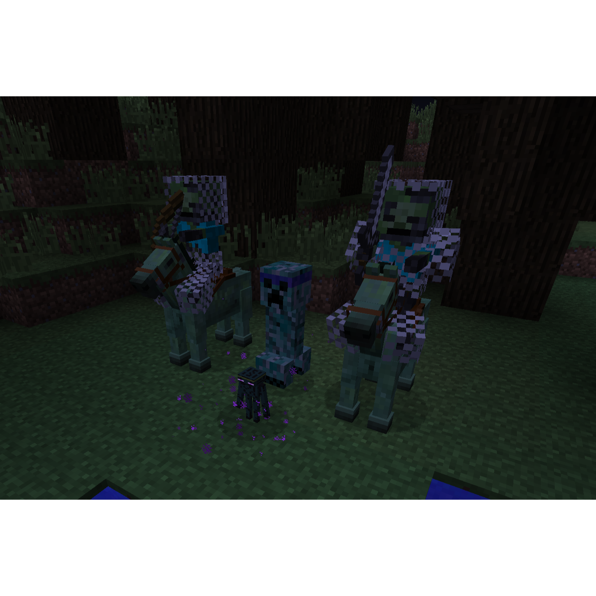</a></td>
<td><a href="https://www.curseforge.com/minecraft/mc-mods/ender-zoo" title="Ender Zoo">Ender Zoo</a></td>
<td>Client/Server Mod</td>
<td><a href="https://www.curseforge.com/members/CrazyPants" title="CrazyPants">CrazyPants</a></td>
<td><a href="docs/legal/Public Domain.txt" title="“Ender Zoo” is dedicated to the Public Domain">Public Domain</a></td>
<td></td>
<td align="center"></td>
<td></td>
<td align="center"><code>EnderZoo-1.7.10-1.0.15.32.jar</code></td>
</tr>
<tr>
<td align="center"></td>
<td><a href="https://www.curseforge.com/minecraft/mc-mods/endercore" title="EnderCore">EnderCore</a></td>
<td>Client/Server Mod</td>
<td><a href="https://www.curseforge.com/members/tterrag1098" title="tterrag1098">tterrag1098</a></td>
<td><a href="docs/legal/Public Domain.txt" title="“EnderCore” is dedicated to the Public Domain">Public Domain</a></td>
<td></td>
<td align="center"></td>
<td></td>
<td align="center"><code>EnderCore-1.7.10-0.2.0.39_beta.jar</code></td>
</tr>
<tr>
<td align="center"></td>
<td><a href="https://www.curseforge.com/minecraft/mc-mods/endertech" title="EnderTech">EnderTech</a></td>
<td>Client/Server Mod</td>
<td><a href="https://www.curseforge.com/members/CarrotCodes" title="CarrotCodes">CarrotCodes</a></td>
<td><a href="docs/legal/ISC.txt" title="“EnderTech” license">ISC</a> and <a href="docs/legal/CC-BY-NC-ND-4.0.txt" title="“EnderTech” license">CC-BY-NC-ND-4.0</a></td>
<td></td>
<td align="center"></td>
<td></td>
<td align="center"><code>EnderTech-1.7.10-0.3.2.405.jar</code></td>
</tr>
<tr>
<td align="center"></td>
<td><a href="https://www.curseforge.com/minecraft/mc-mods/ee3" title="Equivalent Exchange 3">Equivalent Exchange 3</a></td>
<td>Client/Server Mod</td>
<td><a href="https://www.curseforge.com/members/Pahimar" title="Pahimar">Pahimar</a></td>
<td><a href="docs/legal/LGPL-3.0.txt" title="“Equivalent Exchange 3” license">LGPL-3.0</a></td>
<td></td>
<td align="center"></td>
<td></td>
<td align="center"><code>EquivalentExchange3-1.7.10-0.3.0.547.jar</code></td>
</tr>
<tr>
<td align="center"><a href="https://www.curseforge.com/minecraft/mc-mods/et-futurum" title="Et Futurum">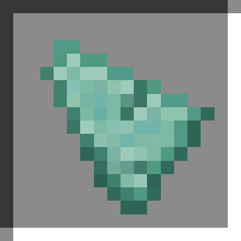</a></td>
<td><a href="https://www.curseforge.com/minecraft/mc-mods/et-futurum" title="Et Futurum">Et Futurum</a></td>
<td>Client/Server Mod</td>
<td><a href="https://www.curseforge.com/members/ganymedes01" title="ganymedes01">ganymedes01</a></td>
<td><a href="docs/legal/Public Domain.txt" title="“Et Futurum” is dedicated to the Public Domain">Public Domain</a></td>
<td></td>
<td align="center"></td>
<td></td>
<td align="center"><code>Et Futurum-1.5.5.jar</code></td>
</tr>
<tr>
<td align="center"></td>
<td><a href="https://www.curseforge.com/minecraft/mc-mods/ex-nihilo" title="Ex Nihilo">Ex Nihilo</a></td>
<td>Client/Server Mod</td>
<td><a href="https://www.curseforge.com/members/Erasmus_Crowley" title="Erasmus_Crowley">Erasmus_Crowley</a></td>
<td><a href="docs/legal/GPL-3.0.txt" title="“Ex Nihilo” license">GPL-3.0</a></td>
<td></td>
<td align="center"></td>
<td></td>
<td align="center"><code>Ex-Nihilo-1.38-53.jar</code></td>
</tr>
<tr>
<td align="center"></td>
<td><a href="https://www.curseforge.com/minecraft/mc-mods/extra-utilities" title="Extra Utilities">Extra Utilities</a></td>
<td>Client/Server Mod</td>
<td><a href="https://www.curseforge.com/members/RWTema" title="RWTema">RWTema</a></td>
<td><a href="docs/legal/All Rights Reserved.txt" title="“Extra Utilities” is All Rights Reserved">All Rights Reserved</a></td>
<td></td>
<td align="center"></td>
<td></td>
<td align="center"><code>extrautilities-1.2.12.jar</code></td>
</tr>
<tr>
<td align="center"></td>
<td><a href="https://web.archive.org/web/20200929233519/https://asie.pl/files/mods/Factorization/" title="Factorization">Factorization</a> </td>
<td>Client/Server Mod</td>
<td></td>
<td></td>
<td><a href="https://github.com/purpleposeidon/Factorization/tree/1.7.10-lingering" title="“Factorization” source code">Open Source</a></td>
<td align="center"></td>
<td></td>
<td align="center"><code>Factorization-1.7.10-0.8.109.jar</code></td>
</tr>
<tr>
<td align="center"></td>
<td><a href="https://www.curseforge.com/minecraft/mc-mods/fastcraft" title="FastCraft">FastCraft</a></td>
<td>Client/Server Mod</td>
<td><a href="https://www.curseforge.com/members/Player" title="Player">Player</a></td>
<td><a href="docs/legal/All Rights Reserved.txt" title="“FastCraft” is All Rights Reserved">All Rights Reserved</a></td>
<td></td>
<td align="center"></td>
<td></td>
<td align="center"><code>fastcraft-1.25.jar</code></td>
</tr>
<tr>
<td align="center"></td>
<td><a href="https://www.curseforge.com/minecraft/mc-mods/flatsigns" title="FlatSigns">FlatSigns</a></td>
<td>Client/Server Mod</td>
<td><a href="https://www.curseforge.com/members/Myrathi" title="Myrathi">Myrathi</a></td>
<td><a href="docs/legal/CC-BY-NC-ND-3.0.txt" title="“FlatSigns” license">CC-BY-NC-ND-3.0</a></td>
<td></td>
<td align="center"></td>
<td></td>
<td align="center"><code>FlatSigns-1.7.10-universal-2.1.0.19.jar</code></td>
</tr>
<tr>
<td align="center"><a href="https://www.curseforge.com/minecraft/mc-mods/forestry" title="Forestry">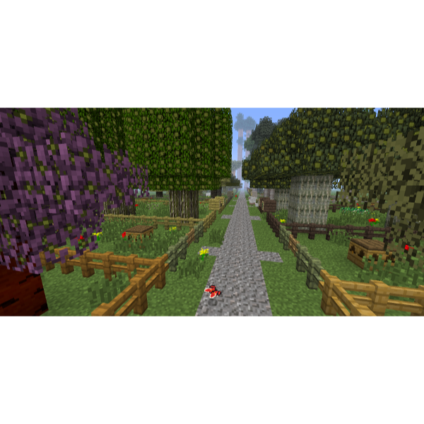</a></td>
<td><a href="https://www.curseforge.com/minecraft/mc-mods/forestry" title="Forestry">Forestry</a></td>
<td>Client/Server Mod</td>
<td><a href="https://www.curseforge.com/members/SirSengir" title="SirSengir">SirSengir</a></td>
<td><a href="docs/legal/LGPL-3.0.txt" title="“Forestry” license">LGPL-3.0</a></td>
<td></td>
<td align="center"></td>
<td></td>
<td align="center"><code>forestry_1.7.10-4.2.16.64.jar</code></td>
</tr>
<tr>
<td align="center"></td>
<td><a href="https://web.archive.org/web/20190715135026/https://files.minecraftforge.net/ForgeMultipart/" title="Forge Multi Part">Forge Multi Part</a> </td>
<td>Client/Server Mod</td>
<td></td>
<td></td>
<td></td>
<td align="center"></td>
<td></td>
<td align="center"><code>ForgeMultipart-1.7.10-1.2.0.347-universal.jar</code></td>
</tr>
<tr>
<td align="center"><a href="https://www.curseforge.com/minecraft/mc-mods/forge-relocation" title="Forge Relocation">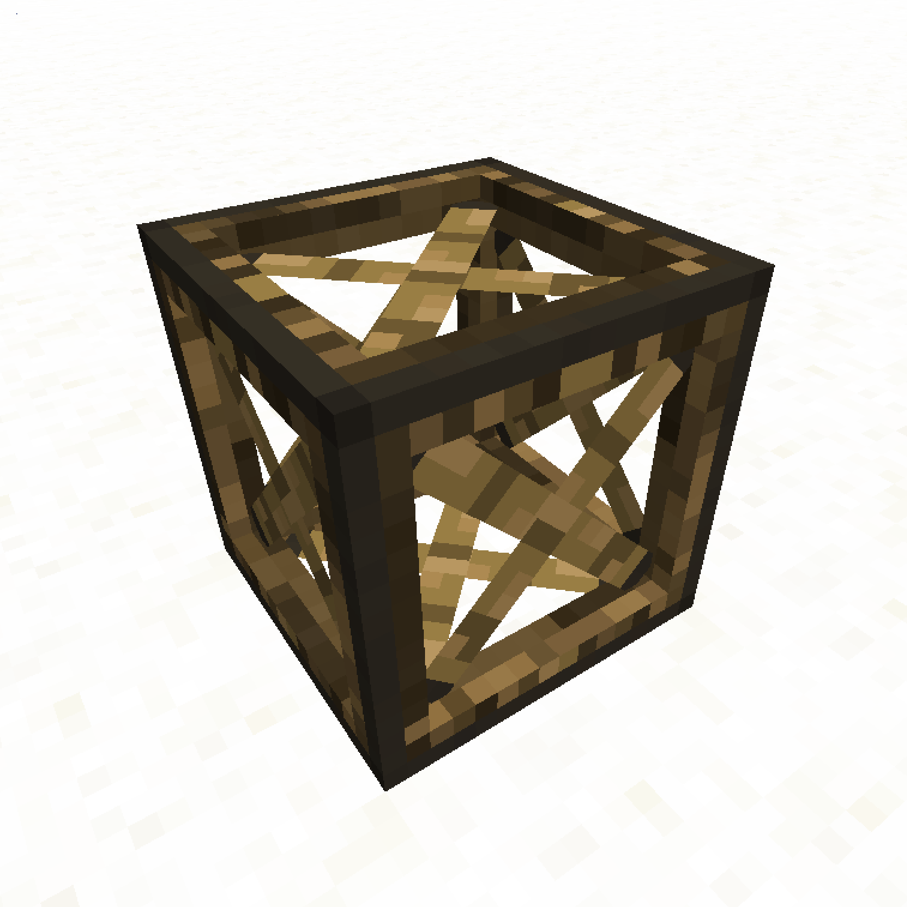</a></td>
<td><a href="https://www.curseforge.com/minecraft/mc-mods/forge-relocation" title="Forge Relocation">Forge Relocation</a></td>
<td>Client/Server Mod</td>
<td><a href="https://www.curseforge.com/members/Mr_TJP" title="Mr_TJP">Mr_TJP</a></td>
<td><a href="docs/legal/GPL-3.0.txt" title="“Forge Relocation” license">GPL-3.0</a> with <a href="docs/legal/GPL-3.0-linking-exception.txt" title="“Forge Relocation” exception">GPL-3.0-linking-exception</a></td>
<td></td>
<td align="center"></td>
<td></td>
<td align="center"><code>ForgeRelocation-0.0.1.4-universal.jar</code></td>
</tr>
<tr>
<td align="center"></td>
<td><a href="https://www.curseforge.com/minecraft/mc-mods/forge-relocation-fmp-plugin" title="Forge Relocation - FMP Plugin">Forge Relocation - FMP Plugin</a></td>
<td>Client/Server Mod</td>
<td><a href="https://www.curseforge.com/members/Mr_TJP" title="Mr_TJP">Mr_TJP</a></td>
<td><a href="docs/legal/GPL-3.0.txt" title="“Forge Relocation - FMP Plugin” license">GPL-3.0</a> with <a href="docs/legal/GPL-3.0-linking-exception.txt" title="“Forge Relocation - FMP Plugin” exception">GPL-3.0-linking-exception</a></td>
<td></td>
<td align="center"></td>
<td></td>
<td align="center"><code>ForgeRelocationFMP-0.0.1.2-universal.jar</code></td>
</tr>
<tr>
<td align="center"></td>
<td><a href="https://www.curseforge.com/minecraft/mc-mods/ftblib" title="FTB Library">FTB Library</a></td>
<td>Client/Server Mod</td>
<td><a href="https://www.curseforge.com/members/FTB_ModpackTeam" title="FTB_ModpackTeam">FTB_ModpackTeam</a></td>
<td><a href="docs/legal/MIT.txt" title="“FTB Library” license">MIT</a></td>
<td></td>
<td align="center"></td>
<td></td>
<td align="center"><code>FTBLib-1.7.10-1.0.18.3.jar</code></td>
</tr>
<tr>
<td align="center"></td>
<td><a href="https://www.curseforge.com/minecraft/mc-mods/ftb-utilities" title="FTB Utilities">FTB Utilities</a></td>
<td>Client/Server Mod</td>
<td><a href="https://www.curseforge.com/members/FTB_ModpackTeam" title="FTB_ModpackTeam">FTB_ModpackTeam</a></td>
<td><a href="docs/legal/MIT.txt" title="“FTB Utilities” license">MIT</a></td>
<td></td>
<td align="center"></td>
<td></td>
<td align="center"><code>FTBUtilities-1.7.10-1.0.18.3.jar</code></td>
</tr>
<tr>
<td align="center"></td>
<td><a href="https://www.curseforge.com/minecraft/mc-mods/funky-locomotion" title="Funky Locomotion">Funky Locomotion</a></td>
<td>Client/Server Mod</td>
<td><a href="https://www.curseforge.com/members/RWTema" title="RWTema">RWTema</a></td>
<td><a href="docs/legal/All Rights Reserved.txt" title="“Funky Locomotion” is All Rights Reserved">All Rights Reserved</a></td>
<td></td>
<td align="center"></td>
<td></td>
<td align="center"><code>funky-locomotion-1.7.10-beta-7.jar</code></td>
</tr>
<tr>
<td align="center"></td>
<td><a href="https://web.archive.org/web/20180804195533/http://asie.pl/files/mods/FactorizationAddons-Fork/" title="FZAddons">FZAddons</a> </td>
<td>Client/Server Mod</td>
<td></td>
<td>, <a href="docs/img/permissions/fzaddons-permissions.png" title="“FZAddons” granted permissions">Permissions</a></td>
<td></td>
<td align="center"></td>
<td></td>
<td align="center"><code>FactorizationAddons-1.7.10.jar</code></td>
</tr>
<tr>
<td align="center"><a href="https://www.curseforge.com/minecraft/mc-mods/gendustry" title="Gendustry">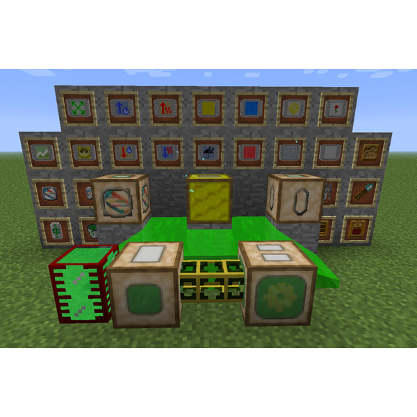</a></td>
<td><a href="https://www.curseforge.com/minecraft/mc-mods/gendustry" title="Gendustry">Gendustry</a></td>
<td>Client/Server Mod</td>
<td><a href="https://www.curseforge.com/members/bdew" title="bdew">bdew</a></td>
<td><a href="docs/legal/MMPL-1.0.txt" title="“Gendustry” license">MMPL-1.0</a></td>
<td></td>
<td align="center"></td>
<td></td>
<td align="center"><code>gendustry-1.6.4.135-mc1.7.10.jar</code></td>
</tr>
<tr>
<td align="center"></td>
<td><a href="https://web.archive.org/web/20180204190820/https://files.jellysquid.me/mirrors/aether/" title="Gilded Games Util">Gilded Games Util</a> </td>
<td>Client/Server Mod</td>
<td></td>
<td></td>
<td></td>
<td align="center"></td>
<td></td>
<td align="center"><code>GildedGamesUtil-1.7.10-1.7.0.jar</code></td>
</tr>
<tr>
<td align="center"></td>
<td><a href="https://web.archive.org/web/20200301051838/https://shadersmod.com/version-1-7-10/" title="GLSL Shaders Mod">GLSL Shaders Mod</a></td>
<td>Client Mod</td>
<td><a href="https://www.minecraftforum.net/members/karyonix" title="karyonix">karyonix</a></td>
<td><a href="docs/legal/All Rights Reserved.txt" title="“GLSL Shaders Mod” is All Rights Reserved">All Rights Reserved</a>, <a href="docs/img/permissions/glsl-shaders-mod-permissions.png" title="“GLSL Shaders Mod” granted permissions">Permissions</a></td>
<td>Closed Source</td>
<td align="center"></td>
<td>   Provides barebones shader support if you're experiencing problems with OptiFine.</td>
<td align="center"><code>ShadersModCore-v2.3.31-mc1.7.10-f.jar</code></td>
</tr>
<tr>
<td align="center"></td>
<td><a href="https://www.curseforge.com/minecraft/mc-mods/guide-api" title="Guide-API">Guide-API</a></td>
<td>Client/Server Mod</td>
<td><a href="https://www.curseforge.com/members/TehNut" title="TehNut">TehNut</a></td>
<td><a href="docs/legal/MIT.txt" title="“Guide-API” license">MIT</a></td>
<td></td>
<td align="center"></td>
<td></td>
<td align="center"><code>Guide-API-1.7.10-1.0.1-29.jar</code></td>
</tr>
<tr>
<td align="center"><a href="https://www.curseforge.com/minecraft/mc-mods/hat-stand" title="Hat Stand">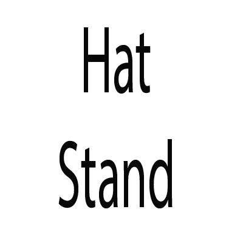</a></td>
<td><a href="https://www.curseforge.com/minecraft/mc-mods/hat-stand" title="Hat Stand">Hat Stand</a></td>
<td>Client/Server Mod</td>
<td><a href="https://www.curseforge.com/members/iChun" title="iChun">iChun</a></td>
<td><a href="docs/legal/LGPL-3.0.txt" title="“Hat Stand” license">LGPL-3.0</a></td>
<td></td>
<td align="center"></td>
<td></td>
<td align="center"><code>HatStand-4.0.0.jar</code></td>
</tr>
<tr>
<td align="center"></td>
<td><a href="https://www.curseforge.com/minecraft/mc-mods/hats" title="Hats">Hats</a></td>
<td>Client/Server Mod</td>
<td><a href="https://www.curseforge.com/members/iChun" title="iChun">iChun</a></td>
<td><a href="docs/legal/LGPL-3.0.txt" title="“Hats” license">LGPL-3.0</a></td>
<td></td>
<td align="center"></td>
<td></td>
<td align="center"><code>Hats-4.0.1.jar</code></td>
</tr>
<tr>
<td align="center"><a href="https://www.curseforge.com/minecraft/mc-mods/helpfixer" title="HelpFixer">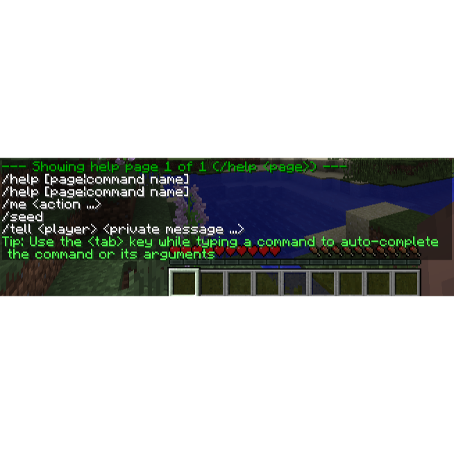</a></td>
<td><a href="https://www.curseforge.com/minecraft/mc-mods/helpfixer" title="HelpFixer">HelpFixer</a></td>
<td>Client/Server Mod</td>
<td><a href="https://www.curseforge.com/members/matthewprenger" title="matthewprenger">matthewprenger</a></td>
<td><a href="docs/legal/WTFPL.txt" title="“HelpFixer” license">WTFPL</a></td>
<td></td>
<td align="center"></td>
<td></td>
<td align="center"><code>HelpFixer-1.0.7.jar</code></td>
</tr>
<tr>
<td align="center"><a href="https://www.curseforge.com/minecraft/mc-mods/ichunutil" title="iChunUtil">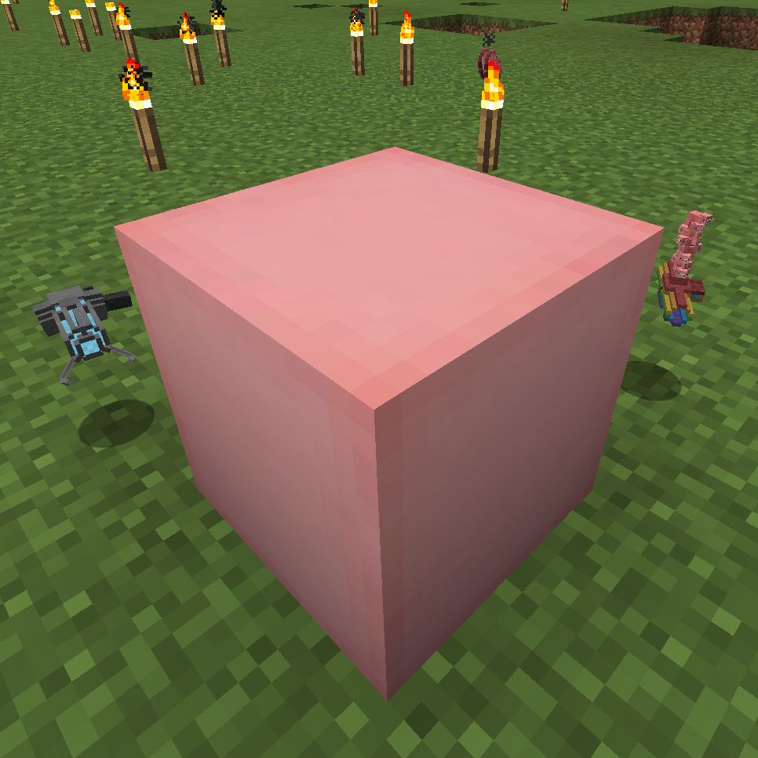</a></td>
<td><a href="https://www.curseforge.com/minecraft/mc-mods/ichunutil" title="iChunUtil">iChunUtil</a></td>
<td>Client/Server Mod</td>
<td><a href="https://www.curseforge.com/members/iChun" title="iChun">iChun</a></td>
<td><a href="docs/legal/LGPL-3.0.txt" title="“iChunUtil” license">LGPL-3.0</a></td>
<td></td>
<td align="center"></td>
<td></td>
<td align="center"><code>iChunUtil-4.2.3.jar</code></td>
</tr>
<tr>
<td align="center"></td>
<td><a href="https://www.curseforge.com/minecraft/mc-mods/immersive-engineering" title="Immersive Engineering">Immersive Engineering</a></td>
<td>Client/Server Mod</td>
<td><a href="https://www.curseforge.com/members/BluSunrize" title="BluSunrize">BluSunrize</a></td>
<td><a href="docs/legal/All Rights Reserved.txt" title="“Immersive Engineering” is All Rights Reserved">All Rights Reserved</a></td>
<td></td>
<td align="center"></td>
<td></td>
<td align="center"><code>ImmersiveEngineering-0.7.7.jar</code></td>
</tr>
<tr>
<td align="center"><a href="https://www.curseforge.com/minecraft/mc-mods/in-game-wiki-mod" title="In-Game Wiki Mod">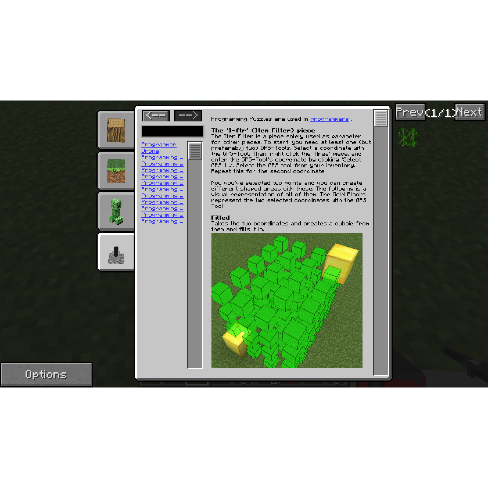</a></td>
<td><a href="https://www.curseforge.com/minecraft/mc-mods/in-game-wiki-mod" title="In-Game Wiki Mod">In-Game Wiki Mod</a></td>
<td>Client/Server Mod</td>
<td><a href="https://www.curseforge.com/members/MineMaarten" title="MineMaarten">MineMaarten</a></td>
<td><a href="docs/legal/GPL-2.0.txt" title="“In-Game Wiki Mod” license">GPL-2.0</a></td>
<td></td>
<td align="center"></td>
<td></td>
<td align="center"><code>IGW-Mod-1.7.10-1.1.12-34-universal.jar</code></td>
</tr>
<tr>
<td align="center"><a href="https://www.curseforge.com/minecraft/mc-mods/industrial-craft" title="Industrial Craft">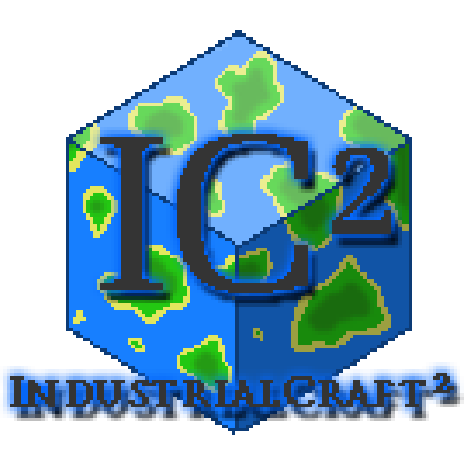</a></td>
<td><a href="https://www.curseforge.com/minecraft/mc-mods/industrial-craft" title="Industrial Craft">Industrial Craft</a></td>
<td>Client/Server Mod</td>
<td><a href="https://www.curseforge.com/members/Player" title="Player">Player</a></td>
<td><a href="docs/legal/All Rights Reserved.txt" title="“Industrial Craft” is All Rights Reserved">All Rights Reserved</a></td>
<td></td>
<td align="center"></td>
<td></td>
<td align="center"><code>industrialcraft-2-2.2.827-experimental.jar</code></td>
</tr>
<tr>
<td align="center"></td>
<td><a href="https://www.curseforge.com/minecraft/mc-mods/inpurecore" title="INpureCore">INpureCore</a></td>
<td>Client/Server Mod</td>
<td><a href="https://www.curseforge.com/members/INpureProjects" title="INpureProjects">INpureProjects</a></td>
<td><a href="docs/legal/IDGAF.txt" title="“INpureCore” license">IDGAF</a></td>
<td></td>
<td align="center"></td>
<td></td>
<td align="center"><code>INpureCore-[1.7.10]1.0.0B9-62.jar</code></td>
</tr>
<tr>
<td align="center"></td>
<td><a href="https://www.curseforge.com/minecraft/mc-mods/inventory-tweaks" title="Inventory Tweaks">Inventory Tweaks</a></td>
<td>Client/Server Mod</td>
<td><a href="https://www.curseforge.com/members/Kobata" title="Kobata">Kobata</a></td>
<td><a href="docs/legal/MIT.txt" title="“Inventory Tweaks” license">MIT</a></td>
<td></td>
<td align="center"></td>
<td></td>
<td align="center"><code>InventoryTweaks-1.59-dev-152.jar</code></td>
</tr>
<tr>
<td align="center"><a href="https://www.curseforge.com/minecraft/mc-mods/iron-chests" title="Iron Chests">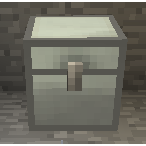</a></td>
<td><a href="https://www.curseforge.com/minecraft/mc-mods/iron-chests" title="Iron Chests">Iron Chests</a></td>
<td>Client/Server Mod</td>
<td><a href="https://www.curseforge.com/members/progwml6" title="progwml6">progwml6</a></td>
<td><a href="docs/legal/GPL-3.0.txt" title="“Iron Chests” license">GPL-3.0</a></td>
<td></td>
<td align="center"></td>
<td></td>
<td align="center"><code>ironchest-1.7.10-6.0.62.742-universal.jar</code></td>
</tr>
<tr>
<td align="center"><a href="https://www.curseforge.com/minecraft/mc-mods/jabba" title="Jabba">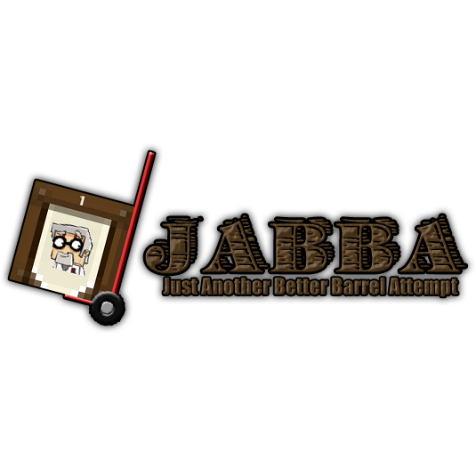</a></td>
<td><a href="https://www.curseforge.com/minecraft/mc-mods/jabba" title="Jabba">Jabba</a></td>
<td>Client/Server Mod</td>
<td><a href="https://www.curseforge.com/members/ProfMobius" title="ProfMobius">ProfMobius</a></td>
<td><a href="docs/legal/CC-BY-NC-SA-4.0.txt" title="“Jabba” license">CC-BY-NC-SA-4.0</a></td>
<td></td>
<td align="center"></td>
<td></td>
<td align="center"><code>Jabba-1.2.2_1.7.10.jar</code></td>
</tr>
<tr>
<td align="center"></td>
<td><a href="https://web.archive.org/web/20190715173858/https://forum.minecraftuser.jp/viewtopic.php?f=13&t=17975" title="JointBlock">JointBlock</a></td>
<td>Client/Server Mod</td>
<td></td>
<td></td>
<td></td>
<td align="center"></td>
<td></td>
<td align="center"><code>JBRobotModel1710-0.6.0.jar</code>, <code>JointBlock1710-0.6.2.jar</code></td>
</tr>
<tr>
<td align="center"></td>
<td><a href="https://www.curseforge.com/minecraft/mc-mods/journeymap" title="JourneyMap">JourneyMap</a></td>
<td>Client/Server Mod</td>
<td><a href="https://www.curseforge.com/members/techbrew" title="techbrew">techbrew</a></td>
<td><a href="docs/legal/All Rights Reserved.txt" title="“JourneyMap” is All Rights Reserved">All Rights Reserved</a></td>
<td></td>
<td align="center"></td>
<td></td>
<td align="center"><code>journeymap-1.7.10-5.1.4p2-unlimited.jar</code></td>
</tr>
<tr>
<td align="center"></td>
<td><a href="https://retro-hack.blogspot.com/p/minecraft-joypad-mod.html" title="Joypad Mod">Joypad Mod</a> </td>
<td>Client Mod</td>
<td><a href="https://github.com/ljsimin" title="Ljubomir Simin">Ljubomir Simin</a></td>
<td><a href="docs/legal/All Rights Reserved.txt" title="“Joypad Mod” is All Rights Reserved">All Rights Reserved</a></td>
<td><a href="https://github.com/ljsimin/MinecraftJoypadSplitscreenMod/tree/1.7.10" title="“Joypad Mod” source code">Visible Source</a></td>
<td align="center"></td>
<td>   Adds controller support.</td>
<td align="center"><code>JoypadMod-1.7.10-10.13.4.1614-1.7.10.jar</code></td>
</tr>
<tr>
<td align="center"></td>
<td><a href="https://dedelner.net/kuda-shaders/" title="KUDA-Shaders">KUDA-Shaders</a></td>
<td>Shader Files</td>
<td></td>
<td></td>
<td></td>
<td align="center"></td>
<td></td>
<td align="center"><code>KUDA-Shaders v6.5.56.zip</code></td>
</tr>
<tr>
<td align="center"></td>
<td><a href="https://www.curseforge.com/minecraft/mc-mods/lookingglass" title="LookingGlass">LookingGlass</a></td>
<td>Client/Server Mod</td>
<td><a href="https://www.curseforge.com/members/XCompWiz" title="XCompWiz">XCompWiz</a></td>
<td><a href="docs/legal/GPL-3.0.txt" title="“LookingGlass” license">GPL-3.0</a></td>
<td></td>
<td align="center"></td>
<td></td>
<td align="center"><code>LookingGlass-1.7.10-0.2.0.01.jar</code></td>
</tr>
<tr>
<td align="center"></td>
<td><a href="https://bitbucket.org/Namikon/gameoflights" title="LootGames">LootGames</a> </td>
<td>Client/Server Mod</td>
<td></td>
<td></td>
<td></td>
<td align="center"></td>
<td></td>
<td align="center"><code>LootGames-1.7.10-1.0.18.jar</code></td>
</tr>
<tr>
<td align="center"><a href="https://www.curseforge.com/minecraft/mc-mods/magic-bees" title="Magic Bees">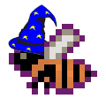</a></td>
<td><a href="https://www.curseforge.com/minecraft/mc-mods/magic-bees" title="Magic Bees">Magic Bees</a></td>
<td>Client/Server Mod</td>
<td><a href="https://www.curseforge.com/members/MysteriousAges" title="MysteriousAges">MysteriousAges</a></td>
<td><a href="docs/legal/WTFPL.txt" title="“Magic Bees” license">WTFPL</a></td>
<td></td>
<td align="center"></td>
<td></td>
<td align="center"><code>magicbees-1.7.10-2.4.4.jar</code></td>
</tr>
<tr>
<td align="center"><a href="https://www.curseforge.com/minecraft/mc-mods/mantle" title="Mantle">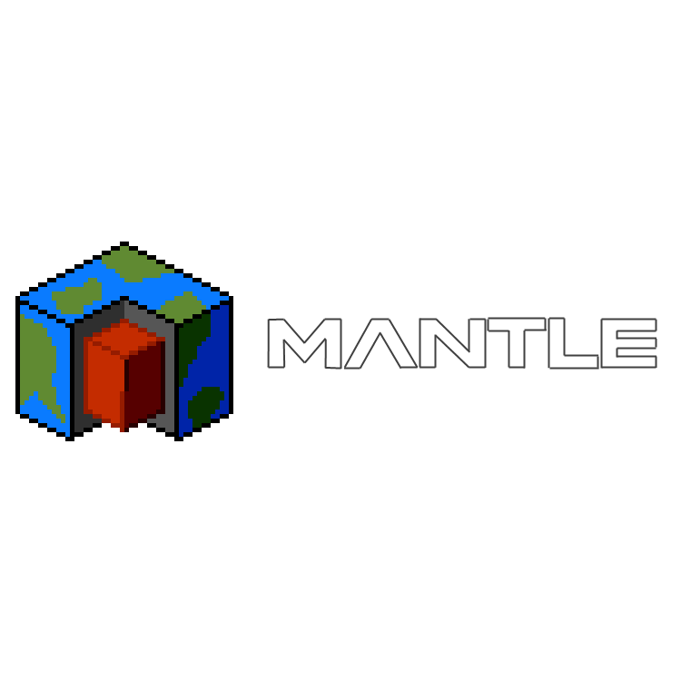</a></td>
<td><a href="https://www.curseforge.com/minecraft/mc-mods/mantle" title="Mantle">Mantle</a></td>
<td>Client/Server Mod</td>
<td><a href="https://www.curseforge.com/members/mDiyo" title="mDiyo">mDiyo</a></td>
<td><a href="docs/legal/MIT.txt" title="“Mantle” license">MIT</a></td>
<td></td>
<td align="center"></td>
<td></td>
<td align="center"><code>Mantle-1.7.10-0.3.2b.jar</code></td>
</tr>
<tr>
<td align="center"></td>
<td><a href="https://www.curseforge.com/minecraft/mc-mods/mcjtylib" title="McJtyLib">McJtyLib</a></td>
<td>Client/Server Mod</td>
<td><a href="https://www.curseforge.com/members/McJty" title="McJty">McJty</a></td>
<td><a href="docs/legal/MIT.txt" title="“McJtyLib” license">MIT</a></td>
<td></td>
<td align="center"></td>
<td></td>
<td align="center"><code>mcjtylib-1.8.1.jar</code></td>
</tr>
<tr>
<td align="center"></td>
<td><a href="https://web.archive.org/web/20150902000038/http://www.minecraftforum.net:80/forums/mapping-and-modding/minecraft-mods/2345701-memory-cleaner-wipe-the-memory-of-your-game" title="Memory Cleaner">Memory Cleaner</a> </td>
<td>Client Mod</td>
<td></td>
<td></td>
<td></td>
<td align="center"></td>
<td></td>
<td align="center"><code>MemoryCleaner-1.4-mc.1.7.10.jar</code></td>
</tr>
<tr>
<td align="center"><a href="https://www.curseforge.com/minecraft/mc-mods/minefactory-reloaded" title="Minefactory Reloaded">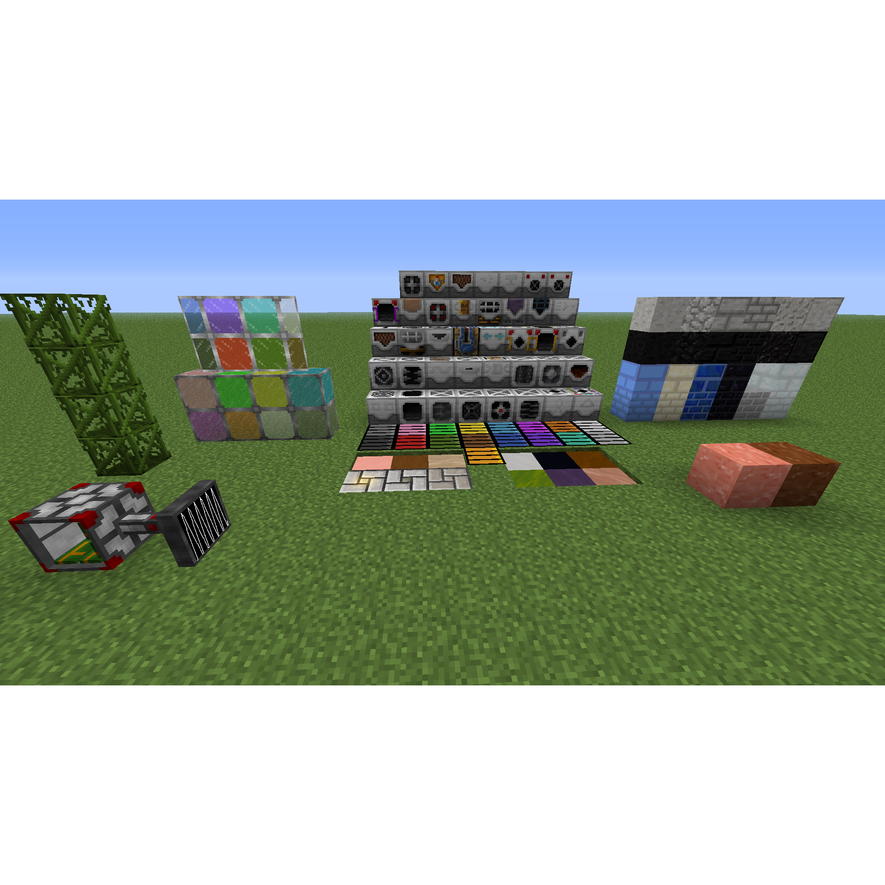</a></td>
<td><a href="https://www.curseforge.com/minecraft/mc-mods/minefactory-reloaded" title="Minefactory Reloaded">Minefactory Reloaded</a></td>
<td>Client/Server Mod</td>
<td><a href="https://www.curseforge.com/members/skyboy026" title="skyboy026">skyboy026</a></td>
<td><a href="docs/legal/All Rights Reserved.txt" title="“Minefactory Reloaded” is All Rights Reserved">All Rights Reserved</a></td>
<td></td>
<td align="center"></td>
<td></td>
<td align="center"><code>MineFactoryReloaded-[1.7.10]2.8.2B1-201.jar</code></td>
</tr>
<tr>
<td align="center"></td>
<td><a href="https://www.curseforge.com/minecraft/mc-mods/minetweaker3" title="MineTweaker3">MineTweaker3</a></td>
<td>Client/Server Mod</td>
<td><a href="https://www.curseforge.com/members/StanH" title="StanH">StanH</a></td>
<td><a href="docs/legal/All Rights Reserved.txt" title="“MineTweaker3” is All Rights Reserved">All Rights Reserved</a></td>
<td></td>
<td align="center"></td>
<td></td>
<td align="center"><code>MineTweaker3-1.7.10-3.0.10B.jar</code></td>
</tr>
<tr>
<td align="center"></td>
<td><a href="https://www.curseforge.com/minecraft/mc-mods/mo-creatures" title="Mo' Creatures">Mo' Creatures</a></td>
<td>Client/Server Mod</td>
<td><a href="https://www.curseforge.com/members/DrZhark" title="DrZhark">DrZhark</a></td>
<td><a href="docs/legal/All Rights Reserved.txt" title="“Mo' Creatures” is All Rights Reserved">All Rights Reserved</a></td>
<td></td>
<td align="center"></td>
<td></td>
<td align="center"><code>DrZharks MoCreatures Mod v6.3.1.zip</code></td>
</tr>
<tr>
<td align="center"></td>
<td><a href="https://www.minecraftforum.net/forums/mapping-and-modding-java-edition/minecraft-mods/1290704-mob-spawn-controls-2-back-better-than-ever-updated" title="Mob Spawn Controls 2">Mob Spawn Controls 2</a> </td>
<td>Client/Server Mod</td>
<td></td>
<td></td>
<td></td>
<td align="center"></td>
<td></td>
<td align="center"><code>MSC2.jar</code></td>
</tr>
<tr>
<td align="center"></td>
<td><a href="https://www.curseforge.com/minecraft/mc-mods/modular-powersuits" title="Modular Powersuits">Modular Powersuits</a></td>
<td>Client/Server Mod</td>
<td><a href="https://www.curseforge.com/members/MachineMuse" title="MachineMuse">MachineMuse</a></td>
<td><a href="docs/legal/BSD-3-Clause.txt" title="“Modular Powersuits” license">BSD-3-Clause</a></td>
<td></td>
<td align="center"></td>
<td></td>
<td align="center"><code>ModularPowersuits-1.7.10-0.11.1.117.jar</code></td>
</tr>
<tr>
<td align="center"></td>
<td><a href="https://www.curseforge.com/minecraft/mc-mods/morph" title="Morph">Morph</a></td>
<td>Client/Server Mod</td>
<td><a href="https://www.curseforge.com/members/iChun" title="iChun">iChun</a></td>
<td><a href="docs/legal/LGPL-3.0.txt" title="“Morph” license">LGPL-3.0</a></td>
<td></td>
<td align="center"></td>
<td></td>
<td align="center"><code>Morph-Beta-0.9.3.jar</code></td>
</tr>
<tr>
<td align="center"></td>
<td><a href="https://www.curseforge.com/minecraft/mc-mods/morpheus" title="Morpheus">Morpheus</a></td>
<td>Client/Server Mod</td>
<td><a href="https://www.curseforge.com/members/Quetzi" title="Quetzi">Quetzi</a></td>
<td><a href="docs/legal/All Rights Reserved.txt" title="“Morpheus” is All Rights Reserved">All Rights Reserved</a></td>
<td></td>
<td align="center"></td>
<td></td>
<td align="center"><code>Morpheus-1.7.10-1.6.21.jar</code></td>
</tr>
<tr>
<td align="center"></td>
<td><a href="https://www.curseforge.com/minecraft/mc-mods/mrtjpcore" title="MrTJPCore">MrTJPCore</a></td>
<td>Client/Server Mod</td>
<td><a href="https://www.curseforge.com/members/Mr_TJP" title="Mr_TJP">Mr_TJP</a></td>
<td><a href="docs/legal/LGPL-3.0.txt" title="“MrTJPCore” license">LGPL-3.0</a></td>
<td></td>
<td align="center"></td>
<td></td>
<td align="center"><code>MrTJPCore-1.1.0.33-universal.jar</code></td>
</tr>
<tr>
<td align="center"></td>
<td><a href="https://www.curseforge.com/minecraft/mc-mods/mystcraft" title="Mystcraft">Mystcraft</a></td>
<td>Client/Server Mod</td>
<td><a href="https://www.curseforge.com/members/XCompWiz" title="XCompWiz">XCompWiz</a></td>
<td><a href="docs/legal/All Rights Reserved.txt" title="“Mystcraft” is All Rights Reserved">All Rights Reserved</a></td>
<td></td>
<td align="center"></td>
<td></td>
<td align="center"><code>mystcraft-1.7.10-0.12.3.04.jar</code></td>
</tr>
<tr>
<td align="center"><a href="https://www.curseforge.com/minecraft/mc-mods/natura" title="Natura">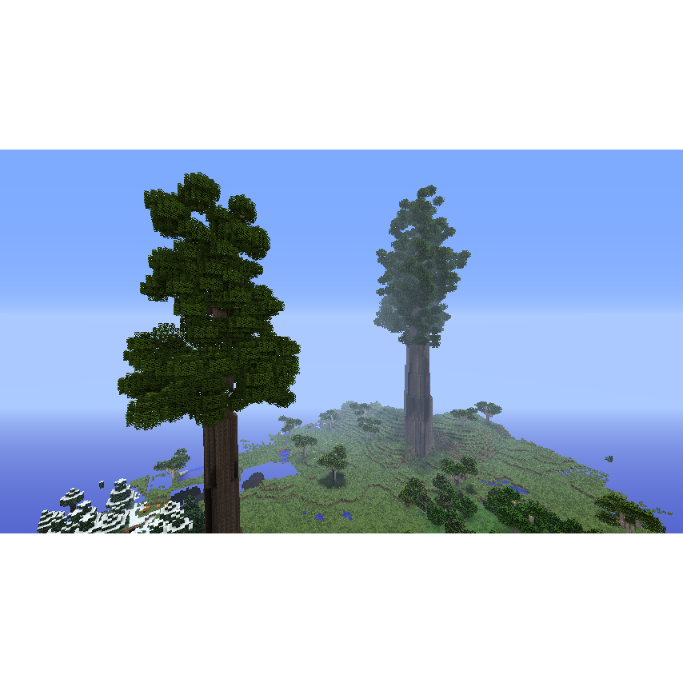</a></td>
<td><a href="https://www.curseforge.com/minecraft/mc-mods/natura" title="Natura">Natura</a></td>
<td>Client/Server Mod</td>
<td><a href="https://www.curseforge.com/members/mDiyo" title="mDiyo">mDiyo</a></td>
<td><a href="docs/legal/CC-BY-3.0.txt" title="“Natura” license">CC-BY-3.0</a></td>
<td></td>
<td align="center"></td>
<td></td>
<td align="center"><code>natura-1.7.10-2.2.1a2.jar</code></td>
</tr>
<tr>
<td align="center"><a href="https://www.curseforge.com/minecraft/mc-mods/natures-compass" title="Nature's Compass">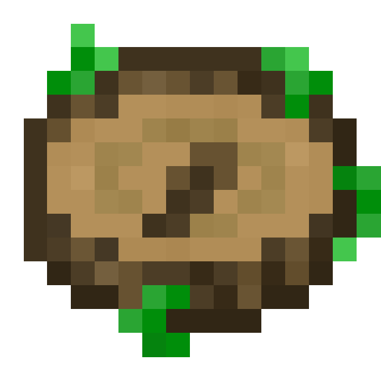</a></td>
<td><a href="https://www.curseforge.com/minecraft/mc-mods/natures-compass" title="Nature's Compass">Nature's Compass</a></td>
<td>Client/Server Mod</td>
<td><a href="https://www.curseforge.com/members/chaosyr" title="Chaosyr">Chaosyr</a></td>
<td><a href="docs/legal/CC-BY-NC-SA-4.0.txt" title="“Nature's Compass” license">CC-BY-NC-SA-4.0</a></td>
<td></td>
<td align="center"></td>
<td></td>
<td align="center"><code>NaturesCompass-1.7.10-1.3.1.jar</code></td>
</tr>
<tr>
<td align="center"><a href="https://www.curseforge.com/minecraft/mc-mods/nei-addons" title="NEI Addons">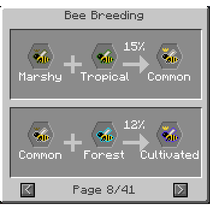</a></td>
<td><a href="https://www.curseforge.com/minecraft/mc-mods/nei-addons" title="NEI Addons">NEI Addons</a></td>
<td>Client/Server Mod</td>
<td><a href="https://www.curseforge.com/members/bdew" title="bdew">bdew</a></td>
<td><a href="docs/legal/MMPL-1.0.txt" title="“NEI Addons” license">MMPL-1.0</a></td>
<td></td>
<td align="center"></td>
<td></td>
<td align="center"><code>neiaddons-1.12.15.41-mc1.7.10.jar</code></td>
</tr>
<tr>
<td align="center"><a href="https://www.curseforge.com/minecraft/mc-mods/nei-integration" title="NEI Integration">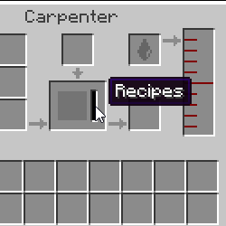</a></td>
<td><a href="https://www.curseforge.com/minecraft/mc-mods/nei-integration" title="NEI Integration">NEI Integration</a></td>
<td>Client/Server Mod</td>
<td><a href="https://www.curseforge.com/members/Tonius" title="Tonius">Tonius</a></td>
<td><a href="docs/legal/MIT.txt" title="“NEI Integration” license">MIT</a></td>
<td></td>
<td align="center"></td>
<td></td>
<td align="center"><code>NEIIntegration-MC1.7.10-1.1.2.jar</code></td>
</tr>
<tr>
<td align="center"></td>
<td><a href="https://www.curseforge.com/minecraft/mc-mods/notenoughcodecs" title="NotEnoughCodecs">NotEnoughCodecs</a></td>
<td>Client/Server Mod</td>
<td><a href="https://www.curseforge.com/members/OpenMods" title="OpenMods">OpenMods</a></td>
<td><a href="docs/legal/LGPL-2.1.txt" title="“NotEnoughCodecs” license">LGPL-2.1</a></td>
<td></td>
<td align="center"></td>
<td></td>
<td align="center"><code>NotEnoughCodecs-1.7.10-0.4.jar</code></td>
</tr>
<tr>
<td align="center"></td>
<td><a href="https://www.curseforge.com/minecraft/mc-mods/notenoughitems" title="NotEnoughItems">NotEnoughItems</a></td>
<td>Client/Server Mod</td>
<td><a href="https://www.curseforge.com/members/chicken_bones" title="ChickenBones">ChickenBones</a></td>
<td><a href="docs/legal/All Rights Reserved.txt" title="“NotEnoughItems” is All Rights Reserved">All Rights Reserved</a></td>
<td></td>
<td align="center"></td>
<td></td>
<td align="center"><code>NotEnoughItems-1.7.10-1.0.5.120-universal.jar</code></td>
</tr>
<tr>
<td align="center"></td>
<td><a href="https://www.curseforge.com/minecraft/mc-mods/nuclear-control-2" title="Nuclear Control 2">Nuclear Control 2</a></td>
<td>Client/Server Mod</td>
<td><a href="https://www.curseforge.com/members/Xbony2" title="Xbony2">Xbony2</a></td>
<td><a href="docs/legal/BSD-3-Clause.txt" title="“Nuclear Control 2” license">BSD-3-Clause</a></td>
<td></td>
<td align="center"></td>
<td></td>
<td align="center"><code>IC2NuclearControl-2.4.3a.jar</code></td>
</tr>
<tr>
<td align="center"><a href="https://www.curseforge.com/minecraft/mc-mods/numina" title="Numina">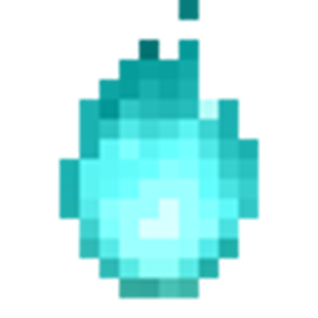</a></td>
<td><a href="https://www.curseforge.com/minecraft/mc-mods/numina" title="Numina">Numina</a></td>
<td>Client/Server Mod</td>
<td><a href="https://www.curseforge.com/members/MachineMuse" title="MachineMuse">MachineMuse</a></td>
<td><a href="docs/legal/BSD-3-Clause.txt" title="“Numina” license">BSD-3-Clause</a></td>
<td></td>
<td align="center"></td>
<td></td>
<td align="center"><code>Numina-0.4.1.106.jar</code></td>
</tr>
<tr>
<td align="center"></td>
<td><a href="https://www.curseforge.com/minecraft/mc-mods/obsidiplates" title="ObsidiPlates">ObsidiPlates</a></td>
<td>Client/Server Mod</td>
<td><a href="https://www.curseforge.com/members/Myrathi" title="Myrathi">Myrathi</a></td>
<td><a href="docs/legal/CC-BY-NC-ND-3.0.txt" title="“ObsidiPlates” license">CC-BY-NC-ND-3.0</a></td>
<td></td>
<td align="center"></td>
<td></td>
<td align="center"><code>ObsidiPlates-1.7.10-universal-3.0.0.18.jar</code></td>
</tr>
<tr>
<td align="center"></td>
<td><a href="https://www.curseforge.com/minecraft/mc-mods/openblocks" title="OpenBlocks">OpenBlocks</a></td>
<td>Client/Server Mod</td>
<td><a href="https://www.curseforge.com/members/OpenMods" title="OpenMods">OpenMods</a></td>
<td><a href="docs/legal/MIT.txt" title="“OpenBlocks” license">MIT</a></td>
<td></td>
<td align="center"></td>
<td></td>
<td align="center"><code>OpenBlocks-1.7.10-1.6.jar</code></td>
</tr>
<tr>
<td align="center"></td>
<td><a href="https://www.curseforge.com/minecraft/mc-mods/openeye" title="OpenEye">OpenEye</a></td>
<td>Client/Server Mod</td>
<td><a href="https://www.curseforge.com/members/OpenMods" title="OpenMods">OpenMods</a></td>
<td><a href="docs/legal/MIT.txt" title="“OpenEye” license">MIT</a></td>
<td></td>
<td align="center"></td>
<td></td>
<td align="center"><code>OpenEye-1.7.10-0.8.jar</code></td>
</tr>
<tr>
<td align="center"></td>
<td><a href="https://www.curseforge.com/minecraft/mc-mods/openmodslib" title="OpenModsLib">OpenModsLib</a></td>
<td>Client/Server Mod</td>
<td><a href="https://www.curseforge.com/members/OpenMods" title="OpenMods">OpenMods</a></td>
<td><a href="docs/legal/MIT.txt" title="“OpenModsLib” license">MIT</a></td>
<td></td>
<td align="center"></td>
<td></td>
<td align="center"><code>OpenModsLib-1.7.10-0.10.1.jar</code></td>
</tr>
<tr>
<td align="center"></td>
<td><a href="https://www.curseforge.com/minecraft/mc-mods/openperipheraladdons" title="OpenPeripheralAddons">OpenPeripheralAddons</a></td>
<td>Client/Server Mod</td>
<td><a href="https://www.curseforge.com/members/OpenMods" title="OpenMods">OpenMods</a></td>
<td><a href="docs/legal/MIT.txt" title="“OpenPeripheralAddons” license">MIT</a></td>
<td></td>
<td align="center"></td>
<td></td>
<td align="center"><code>OpenPeripheralAddons-1.7.10-0.6.jar</code></td>
</tr>
<tr>
<td align="center"></td>
<td><a href="https://www.curseforge.com/minecraft/mc-mods/openperipheralcore" title="OpenPeripheralCore">OpenPeripheralCore</a></td>
<td>Client/Server Mod</td>
<td><a href="https://www.curseforge.com/members/OpenMods" title="OpenMods">OpenMods</a></td>
<td><a href="docs/legal/MIT.txt" title="“OpenPeripheralCore” license">MIT</a></td>
<td></td>
<td align="center"></td>
<td></td>
<td align="center"><code>OpenPeripheralCore-1.7.10-1.4.jar</code></td>
</tr>
<tr>
<td align="center"></td>
<td><a href="https://www.curseforge.com/minecraft/mc-mods/openperipheralintegration" title="OpenPeripheralIntegration">OpenPeripheralIntegration</a></td>
<td>Client/Server Mod</td>
<td><a href="https://www.curseforge.com/members/OpenMods" title="OpenMods">OpenMods</a></td>
<td><a href="docs/legal/MIT.txt" title="“OpenPeripheralIntegration” license">MIT</a></td>
<td></td>
<td align="center"></td>
<td></td>
<td align="center"><code>OpenPeripheralIntegration-1.7.10-0.6.jar</code></td>
</tr>
<tr>
<td align="center"></td>
<td><a href="https://optifine.net/home" title="OptiFine HD Ultra">OptiFine HD Ultra</a> </td>
<td>Client Mod</td>
<td><a href="https://www.minecraftforum.net/members/sp614x" title="sp614x">sp614x</a></td>
<td></td>
<td>Closed Source</td>
<td align="center"></td>
<td></td>
<td align="center"><code>OptiFine_1.7.10_HD_U_E7.jar</code></td>
</tr>
<tr>
<td align="center"><a href="https://www.curseforge.com/minecraft/mc-mods/peripherals" title="Peripherals++">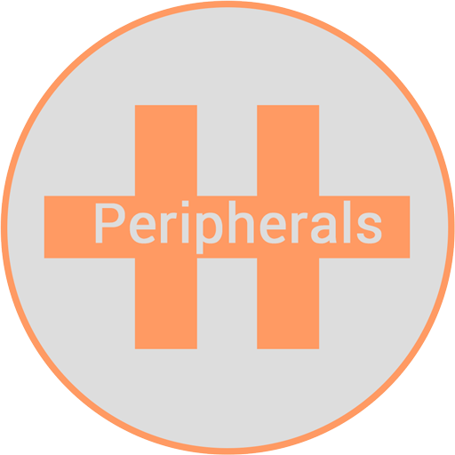</a></td>
<td><a href="https://www.curseforge.com/minecraft/mc-mods/peripherals" title="Peripherals++">Peripherals++</a></td>
<td>Client/Server Mod</td>
<td><a href="https://www.curseforge.com/members/austinv11" title="austinv11">austinv11</a></td>
<td><a href="docs/legal/GPL-2.0.txt" title="“Peripherals++” license">GPL-2.0</a></td>
<td></td>
<td align="center"></td>
<td></td>
<td align="center"><code>Peripherals++-1.3.6.jar</code></td>
</tr>
<tr>
<td align="center"><a href="https://www.curseforge.com/minecraft/mc-mods/pneumaticcraft" title="PneumaticCraft">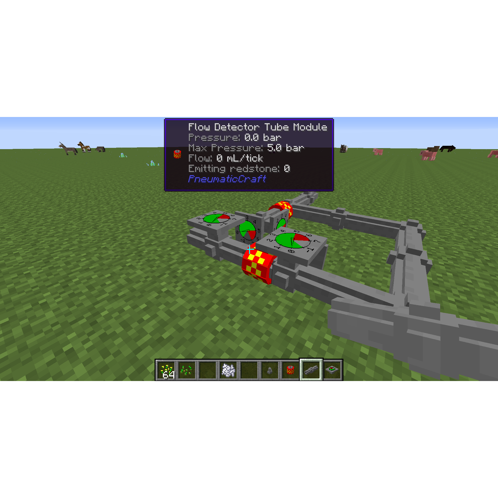</a></td>
<td><a href="https://www.curseforge.com/minecraft/mc-mods/pneumaticcraft" title="PneumaticCraft">PneumaticCraft</a></td>
<td>Client/Server Mod</td>
<td><a href="https://www.curseforge.com/members/MineMaarten" title="MineMaarten">MineMaarten</a></td>
<td><a href="docs/legal/GPL-3.0.txt" title="“PneumaticCraft” license">GPL-3.0</a></td>
<td></td>
<td align="center"></td>
<td></td>
<td align="center"><code>PneumaticCraft-1.7.10-1.12.7-152-universal.jar</code></td>
</tr>
<tr>
<td align="center"></td>
<td><a href="https://www.curseforge.com/minecraft/mc-mods/portal-gun" title="Portal Gun">Portal Gun</a></td>
<td>Client/Server Mod</td>
<td><a href="https://www.curseforge.com/members/iChun" title="iChun">iChun</a></td>
<td><a href="docs/legal/All Rights Reserved.txt" title="“Portal Gun” is All Rights Reserved">All Rights Reserved</a></td>
<td></td>
<td align="center"></td>
<td></td>
<td align="center"><code>PortalGun-4.0.0-beta-6-fix-1.jar</code></td>
</tr>
<tr>
<td align="center"><a href="https://www.curseforge.com/minecraft/mc-mods/project-red-base" title="Project Red - Base">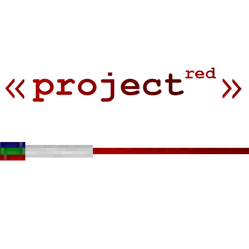</a></td>
<td><a href="https://www.curseforge.com/minecraft/mc-mods/project-red-base" title="Project Red - Base">Project Red - Base</a></td>
<td>Client/Server Mod</td>
<td><a href="https://www.curseforge.com/members/Mr_TJP" title="Mr_TJP">Mr_TJP</a></td>
<td><a href="docs/legal/ProjectRed license.txt" title="“Project Red - Base” license">ProjectRed license</a></td>
<td></td>
<td align="center"></td>
<td></td>
<td align="center"><code>ProjectRed-1.7.10-4.7.0pre12.95-Base.jar</code></td>
</tr>
<tr>
<td align="center"></td>
<td><a href="https://www.curseforge.com/minecraft/mc-mods/project-red-compat" title="Project Red - Compat">Project Red - Compat</a></td>
<td>Client/Server Mod</td>
<td><a href="https://www.curseforge.com/members/Mr_TJP" title="Mr_TJP">Mr_TJP</a></td>
<td><a href="docs/legal/ProjectRed license.txt" title="“Project Red - Compat” license">ProjectRed license</a></td>
<td></td>
<td align="center"></td>
<td></td>
<td align="center"><code>ProjectRed-1.7.10-4.7.0pre12.95-Compat.jar</code></td>
</tr>
<tr>
<td align="center"></td>
<td><a href="https://www.curseforge.com/minecraft/mc-mods/project-red-fabrication" title="Project Red - Fabrication">Project Red - Fabrication</a></td>
<td>Client/Server Mod</td>
<td><a href="https://www.curseforge.com/members/Mr_TJP" title="Mr_TJP">Mr_TJP</a></td>
<td><a href="docs/legal/ProjectRed license.txt" title="“Project Red - Fabrication” license">ProjectRed license</a></td>
<td></td>
<td align="center"></td>
<td></td>
<td align="center"><code>ProjectRed-1.7.10-4.7.0pre12.95-Fabrication.jar</code></td>
</tr>
<tr>
<td align="center"></td>
<td><a href="https://www.curseforge.com/minecraft/mc-mods/project-red-integration" title="Project Red - Integration">Project Red - Integration</a></td>
<td>Client/Server Mod</td>
<td><a href="https://www.curseforge.com/members/Mr_TJP" title="Mr_TJP">Mr_TJP</a></td>
<td><a href="docs/legal/ProjectRed license.txt" title="“Project Red - Integration” license">ProjectRed license</a></td>
<td></td>
<td align="center"></td>
<td></td>
<td align="center"><code>ProjectRed-1.7.10-4.7.0pre12.95-Integration.jar</code></td>
</tr>
<tr>
<td align="center"></td>
<td><a href="https://www.curseforge.com/minecraft/mc-mods/project-red-lighting" title="Project Red - Lighting">Project Red - Lighting</a></td>
<td>Client/Server Mod</td>
<td><a href="https://www.curseforge.com/members/Mr_TJP" title="Mr_TJP">Mr_TJP</a></td>
<td><a href="docs/legal/ProjectRed license.txt" title="“Project Red - Lighting” license">ProjectRed license</a></td>
<td></td>
<td align="center"></td>
<td></td>
<td align="center"><code>ProjectRed-1.7.10-4.7.0pre12.95-Lighting.jar</code></td>
</tr>
<tr>
<td align="center"></td>
<td><a href="https://www.curseforge.com/minecraft/mc-mods/project-red-mechanical" title="Project Red - Mechanical">Project Red - Mechanical</a></td>
<td>Client/Server Mod</td>
<td><a href="https://www.curseforge.com/members/Mr_TJP" title="Mr_TJP">Mr_TJP</a></td>
<td><a href="docs/legal/ProjectRed license.txt" title="“Project Red - Mechanical” license">ProjectRed license</a></td>
<td></td>
<td align="center"></td>
<td></td>
<td align="center"><code>ProjectRed-1.7.10-4.7.0pre12.95-Mechanical.jar</code></td>
</tr>
<tr>
<td align="center"></td>
<td><a href="https://www.curseforge.com/minecraft/mc-mods/project-red-world" title="Project Red - World">Project Red - World</a></td>
<td>Client/Server Mod</td>
<td><a href="https://www.curseforge.com/members/Mr_TJP" title="Mr_TJP">Mr_TJP</a></td>
<td><a href="docs/legal/All Rights Reserved.txt" title="“Project Red - World” is All Rights Reserved">All Rights Reserved</a></td>
<td></td>
<td align="center"></td>
<td></td>
<td align="center"><code>ProjectRed-1.7.10-4.7.0pre12.95-World.jar</code></td>
</tr>
<tr>
<td align="center"></td>
<td><a href="https://www.curseforge.com/minecraft/mc-mods/railcraft" title="Railcraft">Railcraft</a></td>
<td>Client/Server Mod</td>
<td><a href="https://www.curseforge.com/members/CovertJaguar" title="CovertJaguar">CovertJaguar</a></td>
<td><a href="docs/legal/Railcraft license.txt" title="“Railcraft” license">Railcraft license</a></td>
<td></td>
<td align="center"></td>
<td></td>
<td align="center"><code>Railcraft_1.7.10-9.12.2.1.jar</code></td>
</tr>
<tr>
<td align="center"></td>
<td><a href="https://www.curseforge.com/minecraft/mc-mods/redstone-arsenal" title="Redstone Arsenal">Redstone Arsenal</a></td>
<td>Client/Server Mod</td>
<td><a href="https://www.curseforge.com/members/TeamCoFH" title="Team CoFH">Team CoFH</a></td>
<td><a href="docs/legal/All Rights Reserved.txt" title="“Redstone Arsenal” is All Rights Reserved">All Rights Reserved</a></td>
<td></td>
<td align="center"></td>
<td></td>
<td align="center"><code>RedstoneArsenal-[1.7.10]1.1.2-92.jar</code></td>
</tr>
<tr>
<td align="center"></td>
<td><a href="https://www.curseforge.com/minecraft/mc-mods/resource-loader" title="Resource Loader">Resource Loader</a></td>
<td>Client Mod</td>
<td><a href="https://www.curseforge.com/members/Lumien" title="Lumien">Lumien</a></td>
<td><a href="docs/legal/All Rights Reserved.txt" title="“Resource Loader” is All Rights Reserved">All Rights Reserved</a></td>
<td></td>
<td align="center"></td>
<td></td>
<td align="center"><code>ResourceLoader-MC1.7.10-1.3.jar</code></td>
</tr>
<tr>
<td align="center"><a href="https://www.curseforge.com/minecraft/mc-mods/rftools" title="RFTools">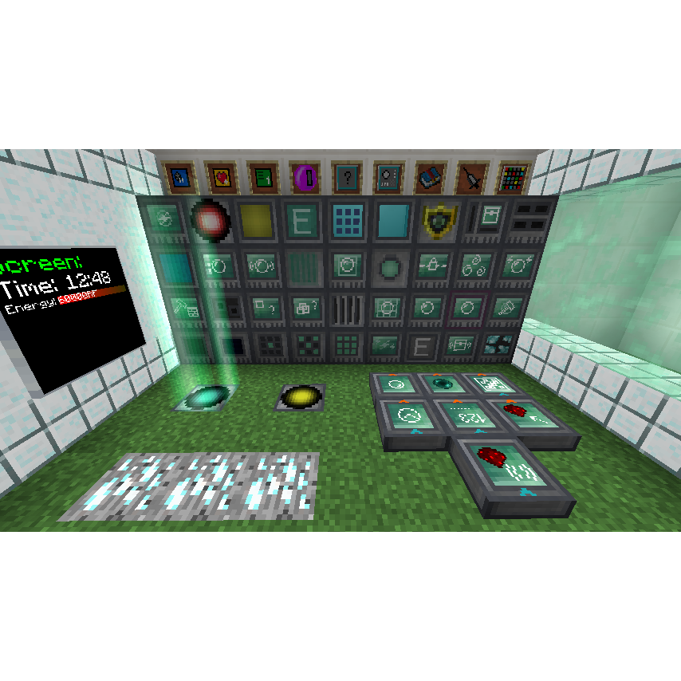</a></td>
<td><a href="https://www.curseforge.com/minecraft/mc-mods/rftools" title="RFTools">RFTools</a></td>
<td>Client/Server Mod</td>
<td><a href="https://www.curseforge.com/members/McJty" title="McJty">McJty</a></td>
<td><a href="docs/legal/MIT.txt" title="“RFTools” license">MIT</a></td>
<td></td>
<td align="center"></td>
<td></td>
<td align="center"><code>rftools-4.23.jar</code></td>
</tr>
<tr>
<td align="center"></td>
<td><a href="https://www.curseforge.com/minecraft/mc-mods/rotarycraft" title="RotaryCraft">RotaryCraft</a></td>
<td>Client/Server Mod</td>
<td><a href="https://www.curseforge.com/members/ReikaKalseki" title="ReikaKalseki">ReikaKalseki</a></td>
<td><a href="docs/legal/All Rights Reserved.txt" title="“RotaryCraft” is All Rights Reserved">All Rights Reserved</a></td>
<td></td>
<td align="center"></td>
<td></td>
<td align="center"><code>RotaryCraft 1.7.10 V23b.jar</code></td>
</tr>
<tr>
<td align="center"></td>
<td><a href="https://web.archive.org/web/20180217153136/https://www.minecraftforum.net/forums/mapping-and-modding-java-edition/minecraft-mods/wip-mods/1446206-shadow-world-1-3-3-1-3-3b" title="Shadow World">Shadow World</a></td>
<td>Client/Server Mod</td>
<td><a href="https://github.com/jajo-11" title="JaJo_11">JaJo_11</a></td>
<td></td>
<td></td>
<td align="center"></td>
<td></td>
<td align="center"><code>shadowworld-1.3.3.jar</code></td>
</tr>
<tr>
<td align="center"></td>
<td><a href="https://web.archive.org/web/20180217153136/https://www.minecraftforum.net/forums/mapping-and-modding-java-edition/minecraft-mods/wip-mods/1446206-shadow-world-1-3-3-1-3-3b" title="Shadow World Dynamic Lights">Shadow World Dynamic Lights</a></td>
<td>Client Mod</td>
<td><a href="https://github.com/jajo-11" title="JaJo_11">JaJo_11</a></td>
<td></td>
<td></td>
<td align="center"></td>
<td></td>
<td align="center"><code>shadowworld_DynamicLights_1.0.0.jar</code></td>
</tr>
<tr>
<td align="center"></td>
<td><a href="https://sonicether.com/shaders/download/v11-0/" title="Sonic Ether's Unbelievable Shaders">Sonic Ether's Unbelievable Shaders</a></td>
<td>Shader Files</td>
<td></td>
<td></td>
<td></td>
<td align="center"></td>
<td></td>
<td align="center"><code>SEUS-v11.0.zip</code></td>
</tr>
<tr>
<td align="center"></td>
<td><a href="https://www.curseforge.com/minecraft/mc-mods/stalker-creepers" title="Stalker Creepers">Stalker Creepers</a></td>
<td>Client/Server Mod</td>
<td><a href="https://www.curseforge.com/members/atomicstrykergrumpy" title="AtomicStryker">AtomicStryker</a></td>
<td><a href="docs/legal/AtomicStryker license.txt" title="“Stalker Creepers” license">AtomicStryker license</a></td>
<td></td>
<td align="center"></td>
<td></td>
<td align="center"><code>StalkerCreepers-1.7.10.jar</code></td>
</tr>
<tr>
<td align="center"></td>
<td><a href="https://web.archive.org/web/20190715173858/https://forum.minecraftuser.jp/viewtopic.php?f=13&t=17975" title="StarMiner">StarMiner</a></td>
<td>Client/Server Mod</td>
<td></td>
<td></td>
<td></td>
<td align="center"></td>
<td></td>
<td align="center"><code>Starminer1710-0.9.9.jar</code></td>
</tr>
<tr>
<td align="center"><a href="https://www.curseforge.com/minecraft/mc-mods/steves-carts-2" title="Steve's Carts 2">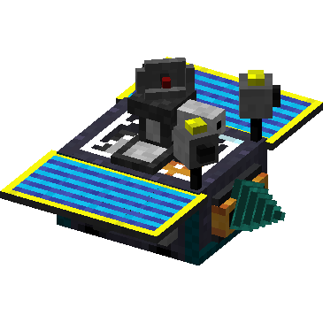</a></td>
<td><a href="https://www.curseforge.com/minecraft/mc-mods/steves-carts-2" title="Steve's Carts 2">Steve's Carts 2</a></td>
<td>Client/Server Mod</td>
<td><a href="https://www.curseforge.com/members/Vswe" title="Vswe">Vswe</a></td>
<td><a href="docs/legal/All Rights Reserved.txt" title="“Steve's Carts 2” is All Rights Reserved">All Rights Reserved</a></td>
<td></td>
<td align="center"></td>
<td></td>
<td align="center"><code>StevesCarts2.0.0.b18.jar</code></td>
</tr>
<tr>
<td align="center"><a href="https://www.curseforge.com/minecraft/mc-mods/steves-factory-manager" title="Steve's Factory Manager">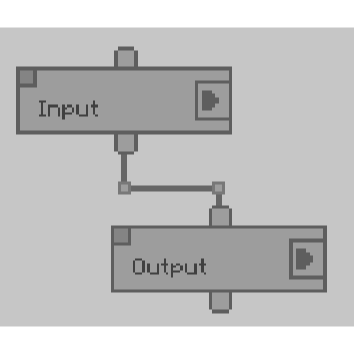</a></td>
<td><a href="https://www.curseforge.com/minecraft/mc-mods/steves-factory-manager" title="Steve's Factory Manager">Steve's Factory Manager</a></td>
<td>Client/Server Mod</td>
<td><a href="https://www.curseforge.com/members/Vswe" title="Vswe">Vswe</a></td>
<td><a href="docs/legal/All Rights Reserved.txt" title="“Steve's Factory Manager” is All Rights Reserved">All Rights Reserved</a></td>
<td></td>
<td align="center"></td>
<td></td>
<td align="center"><code>StevesFactoryManagerA93.jar</code></td>
</tr>
<tr>
<td align="center"><a href="https://www.curseforge.com/minecraft/mc-mods/storage-drawers" title="Storage Drawers">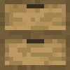</a></td>
<td><a href="https://www.curseforge.com/minecraft/mc-mods/storage-drawers" title="Storage Drawers">Storage Drawers</a></td>
<td>Client/Server Mod</td>
<td><a href="https://www.curseforge.com/members/jaquadro" title="jaquadro">jaquadro</a></td>
<td><a href="docs/legal/MIT.txt" title="“Storage Drawers” license">MIT</a></td>
<td></td>
<td align="center"></td>
<td></td>
<td align="center"><code>StorageDrawers-1.7.10-1.10.9.jar</code></td>
</tr>
<tr>
<td align="center"><a href="https://www.curseforge.com/minecraft/mc-mods/storage-drawers-nei-fix" title="Storage Drawers NEI Fix">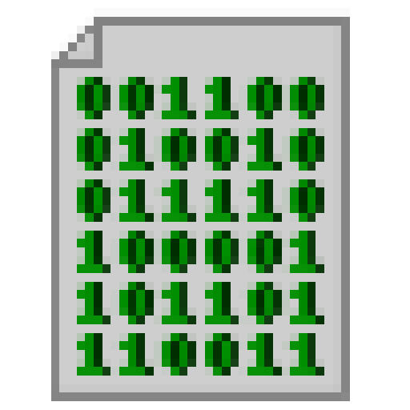</a></td>
<td><a href="https://www.curseforge.com/minecraft/mc-mods/storage-drawers-nei-fix" title="Storage Drawers NEI Fix">Storage Drawers NEI Fix</a></td>
<td>Client/Server Mod</td>
<td><a href="https://www.curseforge.com/members/domi1819" title="domi1819">domi1819</a></td>
<td><a href="docs/legal/MIT.txt" title="“Storage Drawers NEI Fix” license">MIT</a></td>
<td></td>
<td align="center"></td>
<td></td>
<td align="center"><code>sdnf-1.0.jar</code></td>
</tr>
<tr>
<td align="center"><a href="https://www.curseforge.com/minecraft/mc-mods/storage-drawers-biomes-o-plenty-pack" title="Storage Drawers: Biomes O' Plenty Pack">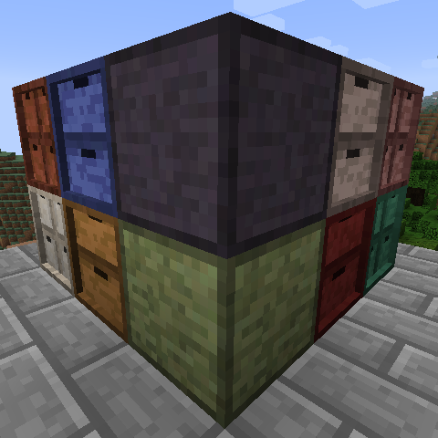</a></td>
<td><a href="https://www.curseforge.com/minecraft/mc-mods/storage-drawers-biomes-o-plenty-pack" title="Storage Drawers: Biomes O' Plenty Pack">Storage Drawers: Biomes O' Plenty Pack</a></td>
<td>Client/Server Mod</td>
<td><a href="https://www.curseforge.com/members/jaquadro" title="jaquadro">jaquadro</a></td>
<td><a href="docs/legal/MIT.txt" title="“Storage Drawers: Biomes O' Plenty Pack” license">MIT</a></td>
<td></td>
<td align="center"></td>
<td></td>
<td align="center"><code>StorageDrawers-BiomesOPlenty-1.7.10-1.1.1.jar</code></td>
</tr>
<tr>
<td align="center"><a href="https://www.curseforge.com/minecraft/mc-mods/storage-drawers-erebus-pack" title="Storage Drawers: Erebus Pack">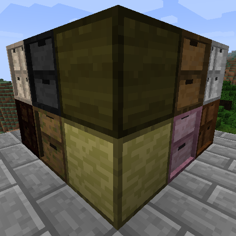</a></td>
<td><a href="https://www.curseforge.com/minecraft/mc-mods/storage-drawers-erebus-pack" title="Storage Drawers: Erebus Pack">Storage Drawers: Erebus Pack</a></td>
<td>Client/Server Mod</td>
<td><a href="https://www.curseforge.com/members/jaquadro" title="jaquadro">jaquadro</a></td>
<td><a href="docs/legal/MIT.txt" title="“Storage Drawers: Erebus Pack” license">MIT</a></td>
<td></td>
<td align="center"></td>
<td></td>
<td align="center"><code>StorageDrawers-Erebus-1.7.10-1.1.1.jar</code></td>
</tr>
<tr>
<td align="center"><a href="https://www.curseforge.com/minecraft/mc-mods/storage-drawers-forestry-pack" title="Storage Drawers: Forestry Pack">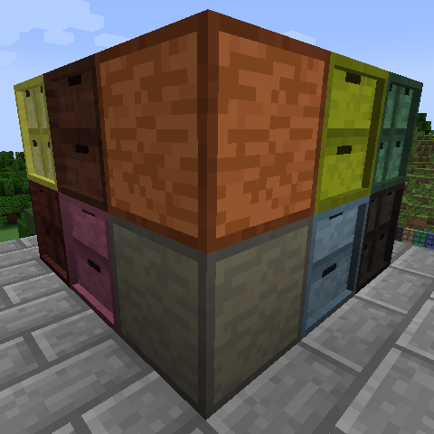</a></td>
<td><a href="https://www.curseforge.com/minecraft/mc-mods/storage-drawers-forestry-pack" title="Storage Drawers: Forestry Pack">Storage Drawers: Forestry Pack</a></td>
<td>Client/Server Mod</td>
<td><a href="https://www.curseforge.com/members/jaquadro" title="jaquadro">jaquadro</a></td>
<td><a href="docs/legal/MIT.txt" title="“Storage Drawers: Forestry Pack” license">MIT</a></td>
<td></td>
<td align="center"></td>
<td></td>
<td align="center"><code>StorageDrawers-Forestry-1.7.10-1.1.2.jar</code></td>
</tr>
<tr>
<td align="center"><a href="https://www.curseforge.com/minecraft/mc-mods/storage-drawers-misc-pack" title="Storage Drawers: Misc Pack">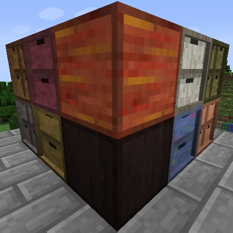</a></td>
<td><a href="https://www.curseforge.com/minecraft/mc-mods/storage-drawers-misc-pack" title="Storage Drawers: Misc Pack">Storage Drawers: Misc Pack</a></td>
<td>Client/Server Mod</td>
<td><a href="https://www.curseforge.com/members/jaquadro" title="jaquadro">jaquadro</a></td>
<td><a href="docs/legal/MIT.txt" title="“Storage Drawers: Misc Pack” license">MIT</a></td>
<td></td>
<td align="center"></td>
<td></td>
<td align="center"><code>StorageDrawers-Misc-1.7.10-1.1.2.jar</code></td>
</tr>
<tr>
<td align="center"><a href="https://www.curseforge.com/minecraft/mc-mods/storage-drawers-natura-pack" title="Storage Drawers: Natura Pack">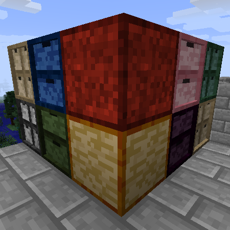</a></td>
<td><a href="https://www.curseforge.com/minecraft/mc-mods/storage-drawers-natura-pack" title="Storage Drawers: Natura Pack">Storage Drawers: Natura Pack</a></td>
<td>Client/Server Mod</td>
<td><a href="https://www.curseforge.com/members/jaquadro" title="jaquadro">jaquadro</a></td>
<td><a href="docs/legal/MIT.txt" title="“Storage Drawers: Natura Pack” license">MIT</a></td>
<td></td>
<td align="center"></td>
<td></td>
<td align="center"><code>StorageDrawers-Natura-1.7.10-1.1.1.jar</code></td>
</tr>
<tr>
<td align="center"></td>
<td><a href="https://www.curseforge.com/minecraft/mc-mods/thaumcraft" title="Thaumcraft">Thaumcraft</a></td>
<td>Client/Server Mod</td>
<td><a href="https://www.curseforge.com/members/azanor13" title="Azanor">Azanor</a></td>
<td><a href="docs/legal/All Rights Reserved.txt" title="“Thaumcraft” is All Rights Reserved">All Rights Reserved</a></td>
<td></td>
<td align="center"></td>
<td></td>
<td align="center"><code>Thaumcraft-1.7.10-4.2.3.5.jar</code></td>
</tr>
<tr>
<td align="center"><a href="https://github.com/GTNewHorizons/Thaumic_Exploration" title="Thaumic Exploration">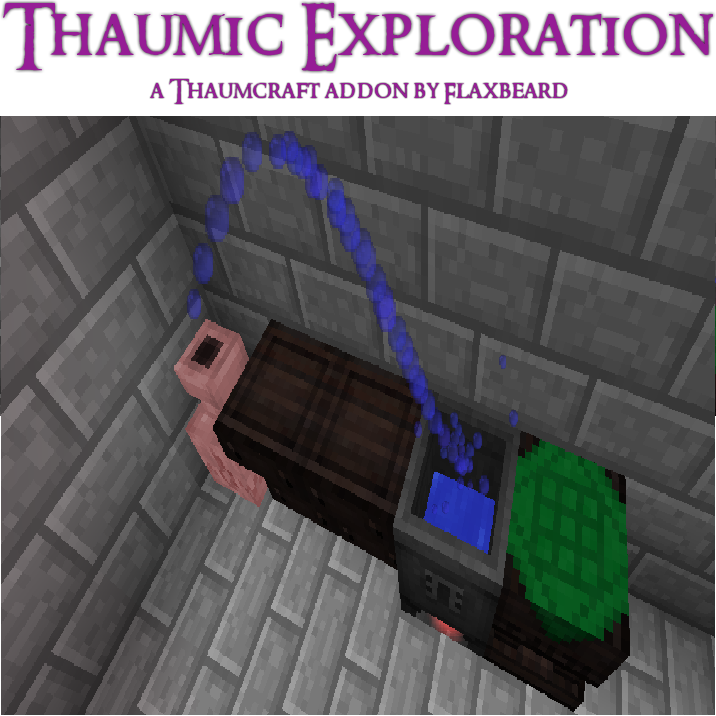</a></td>
<td><a href="https://github.com/GTNewHorizons/Thaumic_Exploration" title="Thaumic Exploration">Thaumic Exploration</a> </td>
<td>Client/Server Mod</td>
<td></td>
<td></td>
<td></td>
<td align="center"></td>
<td></td>
<td align="center"><code>Thaumic-Exploration-[1.7.10] 1.1.73-0.jar</code></td>
</tr>
<tr>
<td align="center"><a href="https://www.curseforge.com/minecraft/mc-mods/thaumic-tinkerer" title="Thaumic Tinkerer">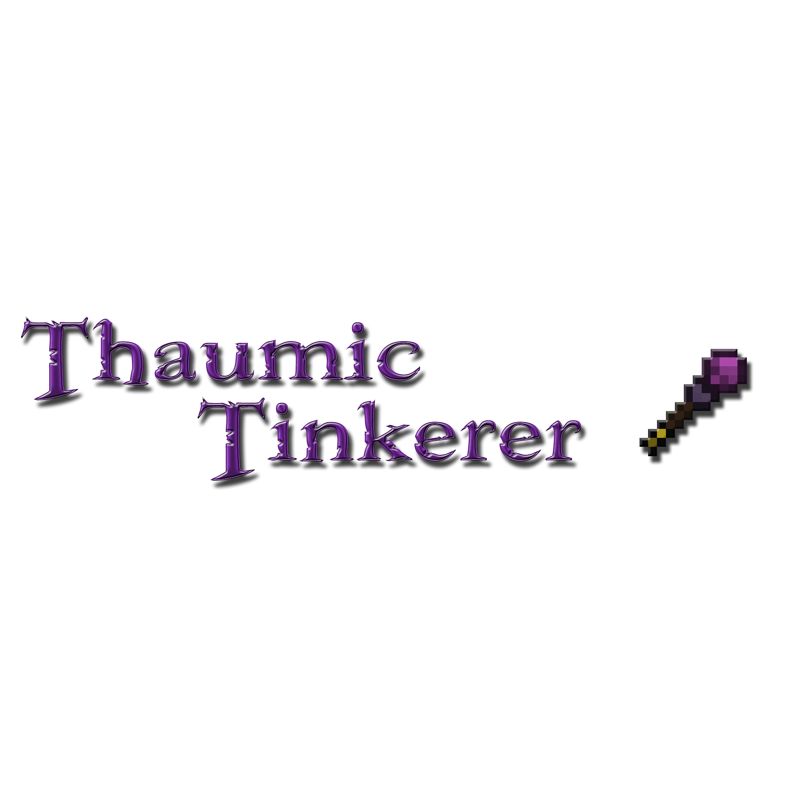</a></td>
<td><a href="https://www.curseforge.com/minecraft/mc-mods/thaumic-tinkerer" title="Thaumic Tinkerer">Thaumic Tinkerer</a></td>
<td>Client/Server Mod</td>
<td><a href="https://www.curseforge.com/members/nekosune" title="nekosune">nekosune</a></td>
<td><a href="docs/legal/CC-BY-NC-SA-3.0.txt" title="“Thaumic Tinkerer” license">CC-BY-NC-SA-3.0</a></td>
<td></td>
<td align="center"></td>
<td></td>
<td align="center"><code>ThaumicTinkerer-2.5-1.7.10-164.jar</code></td>
</tr>
<tr>
<td align="center"></td>
<td><a href="https://web.archive.org/web/20180204190820/https://files.jellysquid.me/mirrors/aether/" title="The Aether II">The Aether II</a> </td>
<td>Client/Server Mod</td>
<td></td>
<td></td>
<td></td>
<td align="center"></td>
<td></td>
<td align="center"><code>AetherII-1.7.10-1.7.0.jar</code></td>
</tr>
<tr>
<td align="center"><a href="https://www.curseforge.com/minecraft/mc-mods/the-erebus" title="The Erebus">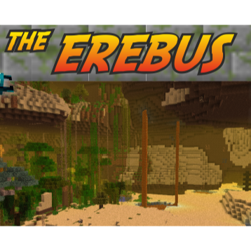</a></td>
<td><a href="https://www.curseforge.com/minecraft/mc-mods/the-erebus" title="The Erebus">The Erebus</a></td>
<td>Client/Server Mod</td>
<td><a href="https://www.curseforge.com/members/Vadis365" title="Vadis365">Vadis365</a></td>
<td><a href="docs/legal/All Rights Reserved.txt" title="“The Erebus” is All Rights Reserved">All Rights Reserved</a></td>
<td></td>
<td align="center"></td>
<td></td>
<td align="center"><code>TheErebus-0.4.7.jar</code></td>
</tr>
<tr>
<td align="center"></td>
<td><a href="https://www.curseforge.com/minecraft/mc-mods/the-twilight-forest" title="The Twilight Forest">The Twilight Forest</a></td>
<td>Client/Server Mod</td>
<td><a href="https://www.curseforge.com/members/Benimatic" title="Benimatic">Benimatic</a></td>
<td><a href="docs/legal/LGPL-2.1.txt" title="“The Twilight Forest” license">LGPL-2.1</a></td>
<td></td>
<td align="center"></td>
<td></td>
<td align="center"><code>twilightforest-1.7.10-2.3.7.jar</code></td>
</tr>
<tr>
<td align="center"><a href="https://www.curseforge.com/minecraft/mc-mods/thermal-dynamics" title="Thermal Dynamics">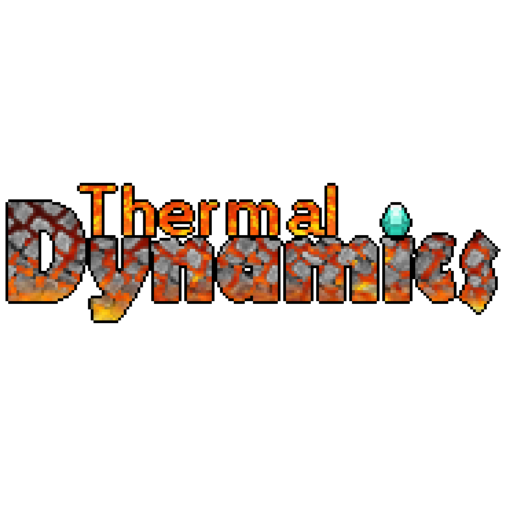</a></td>
<td><a href="https://www.curseforge.com/minecraft/mc-mods/thermal-dynamics" title="Thermal Dynamics">Thermal Dynamics</a></td>
<td>Client/Server Mod</td>
<td><a href="https://www.curseforge.com/members/TeamCoFH" title="Team CoFH">Team CoFH</a></td>
<td><a href="docs/legal/All Rights Reserved.txt" title="“Thermal Dynamics” is All Rights Reserved">All Rights Reserved</a></td>
<td></td>
<td align="center"></td>
<td></td>
<td align="center"><code>ThermalDynamics-[1.7.10]1.2.1-172.jar</code></td>
</tr>
<tr>
<td align="center"><a href="https://www.curseforge.com/minecraft/mc-mods/thermal-expansion" title="Thermal Expansion">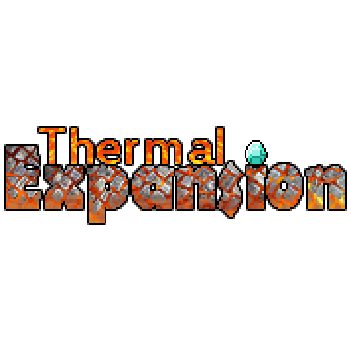</a></td>
<td><a href="https://www.curseforge.com/minecraft/mc-mods/thermal-expansion" title="Thermal Expansion">Thermal Expansion</a></td>
<td>Client/Server Mod</td>
<td><a href="https://www.curseforge.com/members/TeamCoFH" title="Team CoFH">Team CoFH</a></td>
<td><a href="docs/legal/All Rights Reserved.txt" title="“Thermal Expansion” is All Rights Reserved">All Rights Reserved</a></td>
<td></td>
<td align="center"></td>
<td></td>
<td align="center"><code>ThermalExpansion-[1.7.10]4.1.5-248.jar</code></td>
</tr>
<tr>
<td align="center"></td>
<td><a href="https://www.curseforge.com/minecraft/mc-mods/thermal-foundation" title="Thermal Foundation">Thermal Foundation</a></td>
<td>Client/Server Mod</td>
<td><a href="https://www.curseforge.com/members/TeamCoFH" title="Team CoFH">Team CoFH</a></td>
<td><a href="docs/legal/All Rights Reserved.txt" title="“Thermal Foundation” is All Rights Reserved">All Rights Reserved</a></td>
<td></td>
<td align="center"></td>
<td></td>
<td align="center"><code>ThermalFoundation-[1.7.10]1.2.6-118.jar</code></td>
</tr>
<tr>
<td align="center"><a href="https://www.curseforge.com/minecraft/mc-mods/tic-tooltips" title="TiC Tooltips">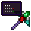</a></td>
<td><a href="https://www.curseforge.com/minecraft/mc-mods/tic-tooltips" title="TiC Tooltips">TiC Tooltips</a></td>
<td>Client/Server Mod</td>
<td><a href="https://www.curseforge.com/members/squeek502" title="squeek502">squeek502</a></td>
<td><a href="docs/legal/Public Domain.txt" title="“TiC Tooltips” is dedicated to the Public Domain">Public Domain</a></td>
<td></td>
<td align="center"></td>
<td></td>
<td align="center"><code>TiCTooltips-mc1.7.10-1.2.5.jar</code></td>
</tr>
<tr>
<td align="center"></td>
<td><a href="https://www.curseforge.com/minecraft/mc-mods/tinkers-construct" title="Tinkers Construct">Tinkers Construct</a></td>
<td>Client/Server Mod</td>
<td><a href="https://www.curseforge.com/members/mDiyo" title="mDiyo">mDiyo</a></td>
<td><a href="docs/legal/MIT.txt" title="“Tinkers Construct” license">MIT</a></td>
<td></td>
<td align="center"></td>
<td></td>
<td align="center"><code>TConstruct-1.7.10-1.8.8.build991.jar</code></td>
</tr>
<tr>
<td align="center"><a href="https://www.curseforge.com/minecraft/mc-mods/tinkers-mechworks" title="Tinkers' Mechworks">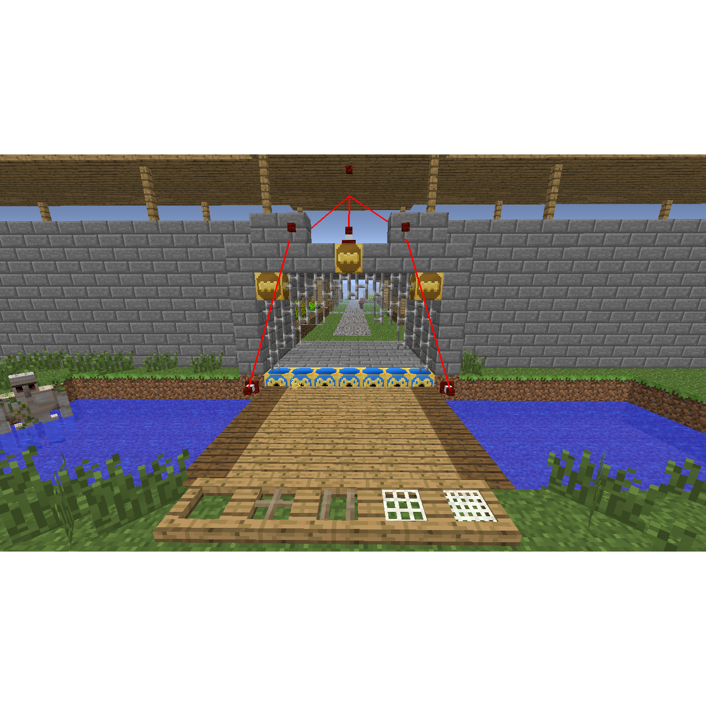</a></td>
<td><a href="https://www.curseforge.com/minecraft/mc-mods/tinkers-mechworks" title="Tinkers' Mechworks">Tinkers' Mechworks</a></td>
<td>Client/Server Mod</td>
<td><a href="https://www.curseforge.com/members/mDiyo" title="mDiyo">mDiyo</a></td>
<td><a href="docs/legal/CC-BY-3.0.txt" title="“Tinkers' Mechworks” license">CC-BY-3.0</a></td>
<td></td>
<td align="center"></td>
<td></td>
<td align="center"><code>TMechworks-1.7.10-0.2.15.106.jar</code></td>
</tr>
<tr>
<td align="center"></td>
<td><a href="https://www.curseforge.com/minecraft/mc-mods/translocators" title="Translocators">Translocators</a></td>
<td>Client/Server Mod</td>
<td><a href="https://www.curseforge.com/members/chicken_bones" title="ChickenBones">ChickenBones</a></td>
<td><a href="docs/legal/All Rights Reserved.txt" title="“Translocators” is All Rights Reserved">All Rights Reserved</a></td>
<td></td>
<td align="center"></td>
<td></td>
<td align="center"><code>Translocator-1.7.10-1.1.2.16-universal.jar</code></td>
</tr>
<tr>
<td align="center"></td>
<td><a href="https://www.curseforge.com/minecraft/mc-mods/unidict" title="UniDict">UniDict</a></td>
<td>Client/Server Mod</td>
<td><a href="https://www.curseforge.com/members/WanionCane" title="WanionCane">WanionCane</a></td>
<td><a href="docs/legal/MPL-2.0.txt" title="“UniDict” license">MPL-2.0</a></td>
<td></td>
<td align="center"></td>
<td></td>
<td align="center"><code>UniDict-1.7.10-2.9.2.jar</code></td>
</tr>
<tr>
<td align="center"><a href="https://www.curseforge.com/minecraft/mc-mods/uniq" title="UniQ">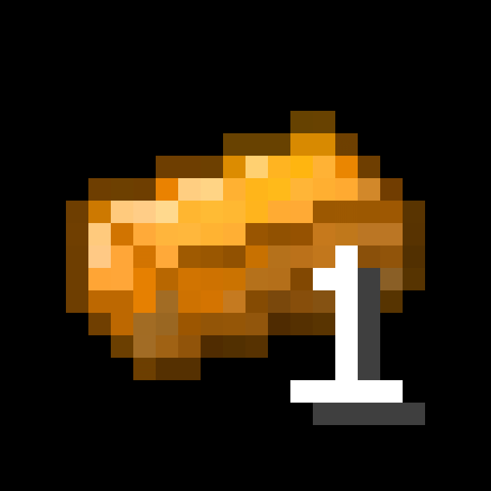</a></td>
<td><a href="https://www.curseforge.com/minecraft/mc-mods/uniq" title="UniQ">UniQ</a></td>
<td>Client/Server Mod</td>
<td><a href="https://www.curseforge.com/members/domi1819" title="domi1819">domi1819</a></td>
<td><a href="docs/legal/MIT.txt" title="“UniQ” license">MIT</a></td>
<td></td>
<td align="center"></td>
<td></td>
<td align="center"><code>uniq-1.6.jar</code></td>
</tr>
<tr>
<td align="center"></td>
<td><a href="https://www.curseforge.com/minecraft/mc-mods/waila" title="Waila">Waila</a></td>
<td>Client/Server Mod</td>
<td><a href="https://www.curseforge.com/members/ProfMobius" title="ProfMobius">ProfMobius</a></td>
<td><a href="docs/legal/CC-BY-NC-SA-4.0.txt" title="“Waila” license">CC-BY-NC-SA-4.0</a></td>
<td></td>
<td align="center"></td>
<td></td>
<td align="center"><code>Waila-1.5.10_1.7.10.jar</code></td>
</tr>
<tr>
<td align="center"></td>
<td><a href="https://www.curseforge.com/minecraft/mc-mods/waila-harvestability" title="Waila Harvestability">Waila Harvestability</a></td>
<td>Client/Server Mod</td>
<td><a href="https://www.curseforge.com/members/squeek502" title="squeek502">squeek502</a></td>
<td><a href="docs/legal/Public Domain.txt" title="“Waila Harvestability” is dedicated to the Public Domain">Public Domain</a></td>
<td></td>
<td align="center"></td>
<td></td>
<td align="center"><code>WailaHarvestability-mc1.7.10-1.1.6.jar</code></td>
</tr>
<tr>
<td align="center"></td>
<td><a href="https://www.curseforge.com/minecraft/mc-mods/witchery" title="Witchery">Witchery</a></td>
<td>Client/Server Mod</td>
<td><a href="https://www.curseforge.com/members/Emoniph" title="Emoniph">Emoniph</a></td>
<td><a href="docs/legal/All Rights Reserved.txt" title="“Witchery” is All Rights Reserved">All Rights Reserved</a></td>
<td></td>
<td align="center"></td>
<td></td>
<td align="center"><code>witchery-1.7.10-0.24.1.jar</code></td>
</tr>
<tr>
<td align="center"></td>
<td><a href="https://www.curseforge.com/minecraft/mc-mods/wr-cbe-universal" title="WR-CBE-Universal">WR-CBE-Universal</a></td>
<td>Client/Server Mod</td>
<td><a href="https://www.curseforge.com/members/chicken_bones" title="ChickenBones">ChickenBones</a></td>
<td><a href="docs/legal/All Rights Reserved.txt" title="“WR-CBE-Universal” is All Rights Reserved">All Rights Reserved</a></td>
<td></td>
<td align="center"></td>
<td></td>
<td align="center"><code>WR-CBE-1.7.10-1.4.1.9-universal.jar</code></td>
</tr>
<tr>
<td align="center"></td>
<td><a href="https://github.com/GTNewHorizons/Yamcl" title="YAMCore">YAMCore</a> </td>
<td>Client/Server Mod</td>
<td></td>
<td></td>
<td></td>
<td align="center"></td>
<td></td>
<td align="center"><code>YAMCore-1.7.10-0.5.78.jar</code></td>
</tr>
</tbody>
</table>
<h2>Java Libraries</h2>
<table>
<thead><tr>
<th>Icon</th>
<th>Name</th>
<th>Type</th>
<th>&emsp;&emsp;&emsp;&ensp;  &emsp;&emsp;&emsp;&ensp;</th>
<th>License</th>
<th>Source Code</th>
<th>&emsp;&emsp;&emsp;&emsp;&emsp;&ensp;  &emsp;&emsp;&emsp;&emsp;&emsp;&ensp;</th>
<th>Description</th>
<th>Latest Release</th>
</tr></thead>
<tbody>
<tr>
<td align="center"></td>
<td><a href="https://akka.io/" title="Akka Actor">Akka Actor</a> </td>
<td>Library</td>
<td></td>
<td></td>
<td></td>
<td align="center"></td>
<td></td>
<td align="center"><code>akka-actor_2.11-2.3.3.jar</code></td>
</tr>
<tr>
<td align="center"></td>
<td><a href="https://commons.apache.org/proper/commons-codec/" title="Apache Commons Codec">Apache Commons Codec</a> </td>
<td>Library</td>
<td></td>
<td></td>
<td></td>
<td align="center"></td>
<td></td>
<td align="center"><code>commons-codec-1.9.jar</code></td>
</tr>
<tr>
<td align="center"></td>
<td><a href="https://commons.apache.org/proper/commons-compress/" title="Apache Commons Compress">Apache Commons Compress</a> </td>
<td>Library</td>
<td></td>
<td></td>
<td></td>
<td align="center"></td>
<td></td>
<td align="center"><code>commons-compress-1.8.1.jar</code></td>
</tr>
<tr>
<td align="center"></td>
<td><a href="https://hc.apache.org/httpcomponents-client-ga/" title="Apache Commons HttpClient">Apache Commons HttpClient</a> </td>
<td>Library</td>
<td></td>
<td></td>
<td></td>
<td align="center"></td>
<td>Library required by The Aether II.</td>
<td align="center"><code>httpclient-4.5.4.jar</code></td>
</tr>
<tr>
<td align="center"></td>
<td><a href="https://hc.apache.org/httpcomponents-core-ga/" title="Apache Commons HttpCore">Apache Commons HttpCore</a> </td>
<td>Library</td>
<td></td>
<td></td>
<td></td>
<td align="center"></td>
<td>Library required by The Aether II.</td>
<td align="center"><code>httpcore-4.4.8.jar</code></td>
</tr>
<tr>
<td align="center"></td>
<td><a href="https://commons.apache.org/proper/commons-lang/" title="Apache Commons Lang">Apache Commons Lang</a> </td>
<td>Library</td>
<td></td>
<td></td>
<td></td>
<td align="center"></td>
<td></td>
<td align="center"><code>commons-lang3-3.3.2.jar</code></td>
</tr>
<tr>
<td align="center"></td>
<td><a href="https://commons.apache.org/proper/commons-logging/" title="Apache Commons Logging">Apache Commons Logging</a> </td>
<td>Library</td>
<td></td>
<td></td>
<td></td>
<td align="center"></td>
<td>Library required by The Aether II.</td>
<td align="center"><code>commons-logging-1.2.jar</code></td>
</tr>
<tr>
<td align="center"></td>
<td><a href="https://asm.ow2.io/" title="ASM">ASM</a> </td>
<td>Library</td>
<td></td>
<td></td>
<td></td>
<td align="center"></td>
<td></td>
<td align="center"><code>asm-all-5.0.3.jar</code></td>
</tr>
<tr>
<td align="center"><a href="https://ejml.org/" title="EJML Core">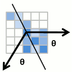</a></td>
<td><a href="https://ejml.org/" title="EJML Core">EJML Core</a></td>
<td>Library</td>
<td></td>
<td></td>
<td></td>
<td align="center"></td>
<td></td>
<td align="center"><code>EJML-core-0.26.jar</code></td>
</tr>
<tr>
<td align="center"></td>
<td><a href="https://github.com/google/guava" title="Google Guava">Google Guava</a> </td>
<td>Library</td>
<td></td>
<td></td>
<td></td>
<td align="center"></td>
<td></td>
<td align="center"><code>guava-17.0.jar</code></td>
</tr>
<tr>
<td align="center"></td>
<td><a href="http://p7zip.sourceforge.net/" title="Java LZMA SDK">Java LZMA SDK</a> </td>
<td>Library</td>
<td><a href="https://sourceforge.net/u/myspace/profile/" title="my space">my space</a></td>
<td><a href="docs/legal/LGPL-2.1.txt" title="“Java LZMA SDK” license">LGPL-2.1</a></td>
<td><a href="https://archive.org/download/java_lzma_0090/java_lzma_0090.zip/" title="“Java LZMA SDK” source code">Open Source</a></td>
<td align="center"></td>
<td></td>
<td align="center"><code>lzma-0.0.1.jar</code></td>
</tr>
<tr>
<td align="center"></td>
<td><a href="https://jopt-simple.github.io/jopt-simple/" title="JOpt Simple">JOpt Simple</a> </td>
<td>Library</td>
<td></td>
<td></td>
<td></td>
<td align="center"></td>
<td></td>
<td align="center"><code>jopt-simple-4.5.jar</code></td>
</tr>
<tr>
<td align="center"></td>
<td><a href="https://github.com/Mojang/LegacyLauncher" title="Minecraft LaunchWrapper">Minecraft LaunchWrapper</a> </td>
<td>Library</td>
<td><a href="https://web.archive.org/web/20140625091621/https://mojang.com/" title="Mojang">Mojang</a></td>
<td><a href="docs/legal/All Rights Reserved.txt" title="“Minecraft LaunchWrapper” is All Rights Reserved">All Rights Reserved</a></td>
<td><a href="https://github.com/Mojang/LegacyLauncher" title="“Minecraft LaunchWrapper” source code">Visible Source</a></td>
<td align="center"></td>
<td></td>
<td align="center"><code>launchwrapper-1.12.jar</code></td>
</tr>
<tr>
<td align="center"></td>
<td><a href="https://github.com/Gagravarr/VorbisJava" title="Ogg and Vorbis for Java, Core">Ogg and Vorbis for Java, Core</a> </td>
<td>Library</td>
<td></td>
<td></td>
<td></td>
<td align="center"></td>
<td></td>
<td align="center"><code>vorbis-java-core-0.8-20150201.161816-1.jar</code></td>
</tr>
<tr>
<td align="center"></td>
<td><a href="https://scala.github.io/actors-migration/" title="Scala Actor Migration Kit">Scala Actor Migration Kit</a> </td>
<td>Library</td>
<td></td>
<td></td>
<td></td>
<td align="center"></td>
<td></td>
<td align="center"><code>scala-actors-migration_2.11-1.1.0.jar</code></td>
</tr>
<tr>
<td align="center"></td>
<td><a href="https://www.scala-lang.org/" title="Scala Compiler API">Scala Compiler API</a> </td>
<td>Library</td>
<td></td>
<td></td>
<td></td>
<td align="center"></td>
<td></td>
<td align="center"><code>scala-compiler-2.11.1.jar</code></td>
</tr>
<tr>
<td align="center"></td>
<td><a href="https://www.scala-lang.org/" title="Scala Continuations Library">Scala Continuations Library</a> </td>
<td>Library</td>
<td></td>
<td></td>
<td></td>
<td align="center"></td>
<td></td>
<td align="center"><code>scala-continuations-library_2.11-1.0.2.jar</code></td>
</tr>
<tr>
<td align="center"></td>
<td><a href="https://www.scala-lang.org/" title="Scala Continuations Plugin">Scala Continuations Plugin</a> </td>
<td>Library</td>
<td></td>
<td></td>
<td></td>
<td align="center"></td>
<td></td>
<td align="center"><code>scala-continuations-plugin_2.11.1-1.0.2.jar</code></td>
</tr>
<tr>
<td align="center"></td>
<td><a href="https://www.scala-lang.org/" title="Scala Library API">Scala Library API</a> </td>
<td>Library</td>
<td></td>
<td></td>
<td></td>
<td align="center"></td>
<td></td>
<td align="center"><code>scala-library-2.11.1.jar</code></td>
</tr>
<tr>
<td align="center"></td>
<td><a href="https://www.scala-lang.org/" title="Scala Reflection API">Scala Reflection API</a> </td>
<td>Library</td>
<td></td>
<td></td>
<td></td>
<td align="center"></td>
<td></td>
<td align="center"><code>scala-reflect-2.11.1.jar</code></td>
</tr>
<tr>
<td align="center"></td>
<td><a href="https://www.scala-lang.org/" title="Scala Standard Parser Combinator Library">Scala Standard Parser Combinator Library</a> </td>
<td>Library</td>
<td></td>
<td></td>
<td></td>
<td align="center"></td>
<td></td>
<td align="center"><code>scala-parser-combinators_2.11-1.0.1.jar</code></td>
</tr>
<tr>
<td align="center"></td>
<td><a href="https://www.scala-lang.org/" title="Scala Swing API">Scala Swing API</a> </td>
<td>Library</td>
<td></td>
<td></td>
<td></td>
<td align="center"></td>
<td></td>
<td align="center"><code>scala-swing_2.11-1.0.1.jar</code></td>
</tr>
<tr>
<td align="center"></td>
<td><a href="https://www.scala-lang.org/" title="Scala XML API">Scala XML API</a> </td>
<td>Library</td>
<td></td>
<td></td>
<td></td>
<td align="center"></td>
<td></td>
<td align="center"><code>scala-xml_2.11-1.0.2.jar</code></td>
</tr>
<tr>
<td align="center"></td>
<td><a href="http://slick.ninjacave.com/slick-util/" title="Slick-Util">Slick-Util</a> </td>
<td>Library</td>
<td></td>
<td></td>
<td></td>
<td align="center"></td>
<td></td>
<td align="center"><code>slick-util-0.0b9db0b2.jar</code></td>
</tr>
<tr>
<td align="center"></td>
<td><a href="https://lightbend.github.io/config/" title="Typesafe Config">Typesafe Config</a> </td>
<td>Library</td>
<td></td>
<td></td>
<td></td>
<td align="center"></td>
<td></td>
<td align="center"><code>config-1.2.1.jar</code></td>
</tr>
</tbody>
</table>
<h2>Node Modules</h2>
<table>
<thead><tr>
<th>Icon</th>
<th>Name</th>
<th>Type</th>
<th>&emsp;&emsp;&emsp;&ensp;  &emsp;&emsp;&emsp;&ensp;</th>
<th>License</th>
<th>Source Code</th>
<th>&emsp;&emsp;&emsp;&emsp;&emsp;&ensp;  &emsp;&emsp;&emsp;&emsp;&emsp;&ensp;</th>
<th>Description</th>
<th>Latest Release</th>
</tr></thead>
<tbody>
<tr>
<td align="center"></td>
<td><a href="https://www.npmjs.com/package/@electron/get" title="@electron/get">@electron/get</a></td>
<td>Package</td>
<td><a href="https://github.com/MarshallOfSound" title="Samuel Attard">Samuel Attard</a></td>
<td><a href="docs/legal/MIT.txt" title="“@electron/get” license">MIT</a>
<td><a href="https://github.com/electron/get" title="“@electron/get” source code">Open Source</a></td>
<td align="center"></td>
<td>Utility for downloading artifacts from different versions of Electron. Required by electron.</td>
<td align="center"><code>@electron/get@1.12.3</code></td>
</tr>
<tr>
<td align="center"></td>
<td><a href="https://www.npmjs.com/package/fs-extra" title="@electron/get/fs-extra">@electron/get/fs-extra</a></td>
<td>Package</td>
<td><a href="https://github.com/jprichardson" title="JP Richardson">JP Richardson</a></td>
<td><a href="docs/legal/MIT.txt" title="“@electron/get/fs-extra” license">MIT</a>
<td><a href="https://github.com/jprichardson/node-fs-extra" title="“@electron/get/fs-extra” source code">Open Source</a></td>
<td align="center"></td>
<td>Fs-extra contains methods that aren't included in the vanilla Node fs package. Such as mkdir -p, cp -r, and rm -rf. Required by @electron/get.</td>
<td align="center"><code>fs-extra@8.1.0</code></td>
</tr>
<tr>
<td align="center"></td>
<td><a href="https://www.npmjs.com/package/@postman/form-data" title="@postman/form-data">@postman/form-data</a></td>
<td>Package</td>
<td><a href="https://github.com/postmanlabs" title="postmanlabs">postmanlabs</a></td>
<td><a href="docs/legal/MIT.txt" title="“@postman/form-data” license">MIT</a>
<td><a href="https://github.com/postmanlabs/form-data" title="“@postman/form-data” source code">Open Source</a></td>
<td align="center"></td>
<td>A library to create readable "multipart/form-data" streams. Can be used to submit forms and file uploads to other web applications. Required by postman-request.</td>
<td align="center"><code>@postman/form-data@3.1.1</code></td>
</tr>
<tr>
<td align="center"></td>
<td><a href="https://www.npmjs.com/package/@postman/tunnel-agent" title="@postman/tunnel-agent">@postman/tunnel-agent</a></td>
<td>Package</td>
<td><a href="https://github.com/postmanlabs" title="Postman Labs">Postman Labs</a></td>
<td><a href="docs/legal/Apache-2.0.txt" title="“@postman/tunnel-agent” license">Apache-2.0</a>
<td><a href="https://github.com/postmanlabs/tunnel-agent" title="“@postman/tunnel-agent” source code">Open Source</a></td>
<td align="center"></td>
<td>HTTP proxy tunneling agent. Required by postman-request.</td>
<td align="center"><code>@postman/tunnel-agent@0.6.3</code></td>
</tr>
<tr>
<td align="center"></td>
<td><a href="https://www.npmjs.com/package/@sindresorhus/is" title="@sindresorhus/is">@sindresorhus/is</a></td>
<td>Package</td>
<td><a href="https://github.com/sindresorhus" title="Sindre Sorhus">Sindre Sorhus</a></td>
<td><a href="docs/legal/MIT.txt" title="“@sindresorhus/is” license">MIT</a>
<td><a href="https://github.com/sindresorhus/is" title="“@sindresorhus/is” source code">Open Source</a></td>
<td align="center"></td>
<td>Type check values.</td>
<td align="center"><code>@sindresorhus/is@4.0.0</code></td>
</tr>
<tr>
<td align="center"></td>
<td><a href="https://www.npmjs.com/package/@szmarczak/http-timer" title="@szmarczak/http-timer">@szmarczak/http-timer</a></td>
<td>Package</td>
<td><a href="https://github.com/szmarczak" title="Szymon Marczak">Szymon Marczak</a></td>
<td><a href="docs/legal/MIT.txt" title="“@szmarczak/http-timer” license">MIT</a>
<td><a href="https://github.com/szmarczak/http-timer" title="“@szmarczak/http-timer” source code">Open Source</a></td>
<td align="center"></td>
<td>Timings for HTTP requests. Required by got.</td>
<td align="center"><code>@szmarczak/http-timer@1.1.2</code></td>
</tr>
<tr>
<td align="center"></td>
<td><a href="https://www.npmjs.com/package/ajv" title="ajv">ajv</a></td>
<td>Package</td>
<td><a href="https://github.com/ajv-validator" title="Evgeny Poberezkin">Evgeny Poberezkin</a></td>
<td><a href="docs/legal/MIT.txt" title="“ajv” license">MIT</a>
<td><a href="https://github.com/ajv-validator/ajv" title="“ajv” source code">Open Source</a></td>
<td align="center"></td>
<td>Another JSON Schema Validator. Required by har-validator.</td>
<td align="center"><code>ajv@6.12.6</code></td>
</tr>
<tr>
<td align="center"></td>
<td><a href="https://www.npmjs.com/package/asn1" title="asn1">asn1</a></td>
<td>Package</td>
<td><a href="https://github.com/mcavage" title="Mark Cavage">Mark Cavage</a></td>
<td><a href="docs/legal/MIT.txt" title="“asn1” license">MIT</a>
<td><a href="https://github.com/joyent/node-asn1" title="“asn1” source code">Open Source</a></td>
<td align="center"></td>
<td>Contains parsers and serializers for ASN.1 (currently BER only). Required by sshpk.</td>
<td align="center"><code>asn1@0.2.4</code></td>
</tr>
<tr>
<td align="center"></td>
<td><a href="https://www.npmjs.com/package/assert-plus" title="assert-plus">assert-plus</a></td>
<td>Package</td>
<td><a href="https://github.com/joyent" title="Joyent">Joyent</a>, <a href="https://github.com/joyent/node-assert-plus/blob/master/AUTHORS" title="assert-plus authors">assert-plus authors</a></td>
<td><a href="docs/legal/MIT.txt" title="“assert-plus” license">MIT</a>
<td><a href="https://github.com/joyent/node-assert-plus" title="“assert-plus” source code">Open Source</a></td>
<td align="center"></td>
<td>Extra assertions on top of Node's assert module. Required by dashdash, getpass, http-signature, jsprim, sshpk, verror.</td>
<td align="center"><code>assert-plus@1.0.0</code></td>
</tr>
<tr>
<td align="center"></td>
<td><a href="https://www.npmjs.com/package/asynckit" title="asynckit">asynckit</a></td>
<td>Package</td>
<td><a href="https://github.com/alexindigo" title="Alex Indigo">Alex Indigo</a></td>
<td><a href="docs/legal/MIT.txt" title="“asynckit” license">MIT</a>
<td><a href="https://github.com/alexindigo/asynckit" title="“asynckit” source code">Open Source</a></td>
<td align="center"></td>
<td>Minimal async jobs utility library, with streams support. Required by @postman/form-data.</td>
<td align="center"><code>asynckit@0.4.0</code></td>
</tr>
<tr>
<td align="center"></td>
<td><a href="https://www.npmjs.com/package/aws-sign2" title="aws-sign2">aws-sign2</a></td>
<td>Package</td>
<td><a href="https://github.com/mikeal" title="Mikeal Rogers">Mikeal Rogers</a></td>
<td><a href="docs/legal/Apache-2.0.txt" title="“aws-sign2” license">Apache-2.0</a>
<td><a href="https://github.com/request/aws-sign" title="“aws-sign2” source code">Open Source</a></td>
<td align="center"></td>
<td>AWS signing. Originally pulled from LearnBoost/knox, maintained as vendor in request, now a standalone module. Required by postman-request.</td>
<td align="center"><code>aws-sign2@0.7.0</code></td>
</tr>
<tr>
<td align="center"></td>
<td><a href="https://www.npmjs.com/package/aws4" title="aws4">aws4</a></td>
<td>Package</td>
<td><a href="https://github.com/mhart" title="Michael Hart">Michael Hart</a></td>
<td><a href="docs/legal/MIT.txt" title="“aws4” license">MIT</a>
<td><a href="https://github.com/mhart/aws4" title="“aws4” source code">Open Source</a></td>
<td align="center"></td>
<td>Signs and prepares requests using AWS Signature Version 4. Required by postman-request.</td>
<td align="center"><code>aws4@1.11.0</code></td>
</tr>
<tr>
<td align="center"></td>
<td><a href="https://www.npmjs.com/package/base64-js" title="base64-js">base64-js</a></td>
<td>Package</td>
<td><a href="https://github.com/beatgammit" title="T. Jameson Little">T. Jameson Little</a></td>
<td><a href="docs/legal/MIT.txt" title="“base64-js” license">MIT</a>
<td><a href="https://github.com/beatgammit/base64-js" title="“base64-js” source code">Open Source</a></td>
<td align="center"></td>
<td>Base64 encoding/decoding in pure JS. Required by brotli.</td>
<td align="center"><code>base64-js@1.5.1</code></td>
</tr>
<tr>
<td align="center"></td>
<td><a href="https://www.npmjs.com/package/bcrypt-pbkdf" title="bcrypt-pbkdf">bcrypt-pbkdf</a></td>
<td>Package</td>
<td><a href="https://github.com/joyent" title="Joyent">Joyent</a>, <a href="https://github.com/joyent/node-bcrypt-pbkdf/blob/master/LICENSE" title="Niels Provos">Niels Provos</a>, <a href="https://github.com/joyent/node-bcrypt-pbkdf/blob/master/LICENSE" title="Ted Unangst">Ted Unangst</a></td>
<td><a href="docs/legal/BSD-3-Clause.txt" title="“bcrypt-pbkdf” license">BSD-3-Clause</a> and <a href="docs/legal/MIT.txt" title="“bcrypt-pbkdf” license">MIT</a>
<td><a href="https://github.com/joyent/node-bcrypt-pbkdf" title="“bcrypt-pbkdf” source code">Open Source</a></td>
<td align="center"></td>
<td>Port of the OpenBSD bcrypt_pbkdf function to pure JS. Required by sshpk.</td>
<td align="center"><code>bcrypt-pbkdf@1.0.2</code></td>
</tr>
<tr>
<td align="center"></td>
<td><a href="https://www.npmjs.com/package/bluebird" title="bluebird">bluebird</a></td>
<td>Package</td>
<td><a href="https://github.com/petkaantonov" title="Petka Antonov">Petka Antonov</a></td>
<td><a href="docs/legal/MIT.txt" title="“bluebird” license">MIT</a>
<td><a href="https://github.com/petkaantonov/bluebird" title="“bluebird” source code">Open Source</a></td>
<td align="center"></td>
<td>Full featured Promises/A+ implementation with exceptionally good performance. Required by request-promise.</td>
<td align="center"><code>bluebird@3.7.2</code></td>
</tr>
<tr>
<td align="center"></td>
<td><a href="https://www.npmjs.com/package/boolbase" title="boolbase">boolbase</a></td>
<td>Package</td>
<td><a href="https://github.com/fb55" title="Felix Böhm">Felix Böhm</a></td>
<td><a href="docs/legal/ISC.txt" title="“boolbase” license">ISC</a>
<td><a href="https://github.com/fb55/boolbase" title="“boolbase” source code">Open Source</a></td>
<td align="center"></td>
<td>Two functions: One that returns true, one that returns false. Required by css-select, nth-check.</td>
<td align="center"><code>boolbase@1.0.0</code></td>
</tr>
<tr>
<td align="center"></td>
<td><a href="https://www.npmjs.com/package/brotli" title="brotli">brotli</a></td>
<td>Package</td>
<td><a href="https://github.com/devongovett" title="Devon Govett">Devon Govett</a></td>
<td><a href="docs/legal/MIT.txt" title="“brotli” license">MIT</a>
<td><a href="https://github.com/devongovett/brotli.js" title="“brotli” source code">Open Source</a></td>
<td align="center"></td>
<td>A port of the Brotli compression algorithm as used in WOFF2. Required by postman-request.</td>
<td align="center"><code>brotli@1.3.2</code></td>
</tr>
<tr>
<td align="center"></td>
<td><a href="https://www.npmjs.com/package/buffer-crc32" title="buffer-crc32">buffer-crc32</a></td>
<td>Package</td>
<td><a href="https://github.com/brianloveswords" title="Brian J. Brennan">Brian J. Brennan</a></td>
<td><a href="docs/legal/MIT.txt" title="“buffer-crc32” license">MIT</a>
<td><a href="https://github.com/brianloveswords/buffer-crc32" title="“buffer-crc32” source code">Open Source</a></td>
<td align="center"></td>
<td>A pure javascript CRC32 algorithm that plays nice with binary data. Required by yauzl.</td>
<td align="center"><code>buffer-crc32@0.2.13</code></td>
</tr>
<tr>
<td align="center"></td>
<td><a href="https://www.npmjs.com/package/buffer-from" title="buffer-from">buffer-from</a></td>
<td>Package</td>
<td><a href="https://github.com/LinusU" title="Linus Unnebäck">Linus Unnebäck</a></td>
<td><a href="docs/legal/MIT.txt" title="“buffer-from” license">MIT</a>
<td><a href="https://github.com/LinusU/buffer-from" title="“buffer-from” source code">Open Source</a></td>
<td align="center"></td>
<td>A ponyfill for `Buffer.from`, uses native implementation if available. Required by concat-stream.</td>
<td align="center"><code>buffer-from@1.1.1</code></td>
</tr>
<tr>
<td align="center"></td>
<td><a href="https://www.npmjs.com/package/cacheable-request" title="cacheable-request">cacheable-request</a></td>
<td>Package</td>
<td><a href="https://github.com/lukechilds" title="Luke Childs">Luke Childs</a></td>
<td><a href="docs/legal/MIT.txt" title="“cacheable-request” license">MIT</a>
<td><a href="https://github.com/lukechilds/cacheable-request" title="“cacheable-request” source code">Open Source</a></td>
<td align="center"></td>
<td>Wrap native HTTP requests with RFC compliant cache support. Required by got.</td>
<td align="center"><code>cacheable-request@6.1.0</code></td>
</tr>
<tr>
<td align="center"></td>
<td><a href="https://www.npmjs.com/package/get-stream" title="cacheable-request/get-stream">cacheable-request/get-stream</a></td>
<td>Package</td>
<td><a href="https://github.com/sindresorhus" title="Sindre Sorhus">Sindre Sorhus</a></td>
<td><a href="docs/legal/MIT.txt" title="“cacheable-request/get-stream” license">MIT</a>
<td><a href="https://github.com/sindresorhus/get-stream" title="“cacheable-request/get-stream” source code">Open Source</a></td>
<td align="center"></td>
<td>Get a stream as a string, buffer, or array. Required by cacheable-request.</td>
<td align="center"><code>get-stream@5.2.0</code></td>
</tr>
<tr>
<td align="center"></td>
<td><a href="https://www.npmjs.com/package/lowercase-keys" title="cacheable-request/lowercase-keys">cacheable-request/lowercase-keys</a></td>
<td>Package</td>
<td><a href="https://github.com/sindresorhus" title="Sindre Sorhus">Sindre Sorhus</a></td>
<td><a href="docs/legal/MIT.txt" title="“cacheable-request/lowercase-keys” license">MIT</a>
<td><a href="https://github.com/sindresorhus/lowercase-keys" title="“cacheable-request/lowercase-keys” source code">Open Source</a></td>
<td align="center"></td>
<td>Lowercase the keys of an object. Required by cacheable-request.</td>
<td align="center"><code>lowercase-keys@2.0.0</code></td>
</tr>
<tr>
<td align="center"></td>
<td><a href="https://www.npmjs.com/package/caseless" title="caseless">caseless</a></td>
<td>Package</td>
<td><a href="https://github.com/mikeal" title="Mikeal Rogers">Mikeal Rogers</a></td>
<td><a href="docs/legal/Apache-2.0.txt" title="“caseless” license">Apache-2.0</a>
<td><a href="https://github.com/request/caseless" title="“caseless” source code">Open Source</a></td>
<td align="center"></td>
<td>Caseless object set/get/has, very useful when working with HTTP headers. Required by postman-request.</td>
<td align="center"><code>caseless@0.12.0</code></td>
</tr>
<tr>
<td align="center"></td>
<td><a href="https://github.com/cheeriojs/cheerio" title="cheerio">cheerio</a></td>
<td>Package</td>
<td><a href="https://github.com/matthewmueller" title="Matthew Mueller">Matthew Mueller</a></td>
<td><a href="docs/legal/MIT.txt" title="“cheerio” license">MIT</a>
<td><a href="https://github.com/cheeriojs/cheerio" title="“cheerio” source code">Open Source</a></td>
<td align="center"></td>
<td>Tiny, fast, and elegant implementation of core jQuery designed specifically for the server. Required by cloudscraper.</td>
<td align="center"><code>cheeriojs/cheerio#main</code>, <code>cheeriojs/cheerio#8fef5aa3e3ca5fec8a69c86f3d7dc2a0eb7c8e31</code> (based on <code>cheerio@1.0.0-rc.5</code>)</td>
</tr>
<tr>
<td align="center"></td>
<td><a href="https://www.npmjs.com/package/cheerio-select" title="cheerio-select">cheerio-select</a></td>
<td>Package</td>
<td><a href="https://github.com/cheeriojs" title="Felix Boehm">Felix Boehm</a></td>
<td><a href="docs/legal/BSD-2-Clause.txt" title="“cheerio-select” license">BSD-2-Clause</a>
<td><a href="https://github.com/cheeriojs/cheerio-select" title="“cheerio-select” source code">Open Source</a></td>
<td align="center"></td>
<td>CSS selector engine supporting jQuery selectors. Required by cheerio.</td>
<td align="center"><code>cheerio-select@1.1.0</code></td>
</tr>
<tr>
<td align="center"></td>
<td><a href="https://www.npmjs.com/package/clone-response" title="clone-response">clone-response</a></td>
<td>Package</td>
<td><a href="https://github.com/lukechilds" title="Luke Childs">Luke Childs</a></td>
<td><a href="docs/legal/MIT.txt" title="“clone-response” license">MIT</a>
<td><a href="https://github.com/lukechilds/clone-response" title="“clone-response” source code">Open Source</a></td>
<td align="center"></td>
<td>Clone a Node HTTP response stream. Required by cacheable-request.</td>
<td align="center"><code>clone-response@1.0.2</code></td>
</tr>
<tr>
<td align="center"></td>
<td><a href="https://github.com/EIGHTFINITE/cloudscraper" title="cloudscraper">cloudscraper</a></td>
<td>Package</td>
<td><a href="https://github.com/codemanki" title="Oleksii Sribnyi">Oleksii Sribnyi</a>, <a href="https://github.com/codemanki/cloudscraper/blob/master/LICENSE" title="Anorov">Anorov</a></td>
<td><a href="docs/legal/MIT.txt" title="“cloudscraper” license">MIT</a>
<td><a href="https://github.com/EIGHTFINITE/cloudscraper" title="“cloudscraper” source code">Open Source</a></td>
<td align="center"></td>
<td>Bypasses cloudflare's anti-ddos page.</td>
<td align="center"><code>EIGHTFINITE/cloudscraper#master</code>, <code>EIGHTFINITE/cloudscraper#33fd0b1269920097e8722529eee1abf1bfb2b371</code> (based on <code>cloudscraper@4.6.0</code>)</td>
</tr>
<tr>
<td align="center"></td>
<td><a href="https://www.npmjs.com/package/combined-stream" title="combined-stream">combined-stream</a></td>
<td>Package</td>
<td><a href="https://github.com/felixge" title="Felix Geisendörfer">Felix Geisendörfer</a></td>
<td><a href="docs/legal/MIT.txt" title="“combined-stream” license">MIT</a>
<td><a href="https://github.com/felixge/node-combined-stream" title="“combined-stream” source code">Open Source</a></td>
<td align="center"></td>
<td>A stream that emits multiple other streams one after another. Required by @postman/form-data, postman-request.</td>
<td align="center"><code>combined-stream@1.0.8</code></td>
</tr>
<tr>
<td align="center"></td>
<td><a href="https://www.npmjs.com/package/concat-stream" title="concat-stream">concat-stream</a></td>
<td>Package</td>
<td><a href="https://github.com/maxogden" title="Max Ogden">Max Ogden</a></td>
<td><a href="docs/legal/MIT.txt" title="“concat-stream” license">MIT</a>
<td><a href="https://github.com/maxogden/concat-stream" title="“concat-stream” source code">Open Source</a></td>
<td align="center"></td>
<td>Writable stream that concatenates strings or binary data and calls a callback with the result. Required by extract-zip.</td>
<td align="center"><code>concat-stream@1.6.2</code></td>
</tr>
<tr>
<td align="center"></td>
<td><a href="https://www.npmjs.com/package/core-util-is" title="core-util-is">core-util-is</a></td>
<td>Package</td>
<td><a href="https://github.com/isaacs/core-util-is/graphs/contributors" title="Node contributors">Node contributors</a></td>
<td><a href="docs/legal/MIT.txt" title="“core-util-is” license">MIT</a>
<td><a href="https://github.com/isaacs/core-util-is" title="“core-util-is” source code">Open Source</a></td>
<td align="center"></td>
<td>The `util.is*` functions introduced in Node v0.12. Required by readable-stream, verror.</td>
<td align="center"><code>core-util-is@1.0.2</code></td>
</tr>
<tr>
<td align="center"></td>
<td><a href="https://www.npmjs.com/package/css-select" title="css-select">css-select</a></td>
<td>Package</td>
<td><a href="https://github.com/fb55" title="Felix Böhm">Felix Böhm</a></td>
<td><a href="docs/legal/BSD-2-Clause.txt" title="“css-select” license">BSD-2-Clause</a>
<td><a href="https://github.com/fb55/css-select" title="“css-select” source code">Open Source</a></td>
<td align="center"></td>
<td>A CSS selector compiler/engine. Required by cheerio-select.</td>
<td align="center"><code>css-select@3.1.2</code></td>
</tr>
<tr>
<td align="center"></td>
<td><a href="https://www.npmjs.com/package/css-what" title="css-what">css-what</a></td>
<td>Package</td>
<td><a href="https://github.com/fb55" title="Felix Böhm">Felix Böhm</a></td>
<td><a href="docs/legal/BSD-2-Clause.txt" title="“css-what” license">BSD-2-Clause</a>
<td><a href="https://github.com/fb55/css-what" title="“css-what” source code">Open Source</a></td>
<td align="center"></td>
<td>A CSS selector parser. Required by cheerio-select, css-select.</td>
<td align="center"><code>css-what@4.0.0</code></td>
</tr>
<tr>
<td align="center"></td>
<td><a href="https://www.npmjs.com/package/dashdash" title="dashdash">dashdash</a></td>
<td>Package</td>
<td><a href="https://github.com/trentm" title="Trent Mick">Trent Mick</a>, <a href="https://github.com/joyent" title="Joyent">Joyent</a></td>
<td><a href="docs/legal/MIT.txt" title="“dashdash” license">MIT</a>
<td><a href="https://github.com/trentm/node-dashdash" title="“dashdash” source code">Open Source</a></td>
<td align="center"></td>
<td>A light, featureful and explicit option parsing library. Required by sshpk.</td>
<td align="center"><code>dashdash@1.14.1</code></td>
</tr>
<tr>
<td align="center"></td>
<td><a href="https://www.npmjs.com/package/debug" title="debug">debug</a></td>
<td>Package</td>
<td><a href="https://github.com/tj" title="TJ Holowaychuk">TJ Holowaychuk</a></td>
<td><a href="docs/legal/MIT.txt" title="“debug” license">MIT</a>
<td><a href="https://github.com/visionmedia/debug" title="“debug” source code">Open Source</a></td>
<td align="center"></td>
<td>Small debugging utility. Required by @electron/get, sumchecker.</td>
<td align="center"><code>debug@4.3.1</code></td>
</tr>
<tr>
<td align="center"></td>
<td><a href="https://www.npmjs.com/package/decompress-response" title="decompress-response">decompress-response</a></td>
<td>Package</td>
<td><a href="https://github.com/sindresorhus" title="Sindre Sorhus">Sindre Sorhus</a></td>
<td><a href="docs/legal/MIT.txt" title="“decompress-response” license">MIT</a>
<td><a href="https://github.com/sindresorhus/decompress-response" title="“decompress-response” source code">Open Source</a></td>
<td align="center"></td>
<td>Decompress a HTTP response if needed. Required by got.</td>
<td align="center"><code>decompress-response@3.3.0</code></td>
</tr>
<tr>
<td align="center"></td>
<td><a href="https://www.npmjs.com/package/defer-to-connect" title="defer-to-connect">defer-to-connect</a></td>
<td>Package</td>
<td><a href="https://github.com/szmarczak" title="Szymon Marczak">Szymon Marczak</a></td>
<td><a href="docs/legal/MIT.txt" title="“defer-to-connect” license">MIT</a>
<td><a href="https://github.com/szmarczak/defer-to-connect" title="“defer-to-connect” source code">Open Source</a></td>
<td align="center"></td>
<td>The safe way to handle the `connect` socket event. Required by @szmarczak/http-timer.</td>
<td align="center"><code>defer-to-connect@1.1.3</code></td>
</tr>
<tr>
<td align="center"></td>
<td><a href="https://www.npmjs.com/package/delayed-stream" title="delayed-stream">delayed-stream</a></td>
<td>Package</td>
<td><a href="https://github.com/felixge" title="Felix Geisendörfer">Felix Geisendörfer</a></td>
<td><a href="docs/legal/MIT.txt" title="“delayed-stream” license">MIT</a>
<td><a href="https://github.com/felixge/node-delayed-stream" title="“delayed-stream” source code">Open Source</a></td>
<td align="center"></td>
<td>Buffers events from a stream until you are ready to handle them. Required by combined-stream.</td>
<td align="center"><code>delayed-stream@1.0.0</code></td>
</tr>
<tr>
<td align="center"></td>
<td><a href="https://www.npmjs.com/package/dom-serializer" title="dom-serializer">dom-serializer</a></td>
<td>Package</td>
<td><a href="https://github.com/cheeriojs/dom-serializer/graphs/contributors" title="cheerio contributors">cheerio contributors</a></td>
<td><a href="docs/legal/MIT.txt" title="“dom-serializer” license">MIT</a>
<td><a href="https://github.com/cheeriojs/dom-serializer" title="“dom-serializer” source code">Open Source</a></td>
<td align="center"></td>
<td>Render dom nodes to string. Required by cheerio, domutils.</td>
<td align="center"><code>dom-serializer@1.2.0</code></td>
</tr>
<tr>
<td align="center"></td>
<td><a href="https://www.npmjs.com/package/domelementtype" title="domelementtype">domelementtype</a></td>
<td>Package</td>
<td><a href="https://github.com/fb55" title="Felix Böhm">Felix Böhm</a></td>
<td><a href="docs/legal/BSD-2-Clause.txt" title="“domelementtype” license">BSD-2-Clause</a>
<td><a href="https://github.com/fb55/domelementtype" title="“domelementtype” source code">Open Source</a></td>
<td align="center"></td>
<td>All the types of nodes in htmlparser2's dom. Required by cheerio-select, dom-serializer, domhandler, domutils, htmlparser2.</td>
<td align="center"><code>domelementtype@2.1.0</code></td>
</tr>
<tr>
<td align="center"></td>
<td><a href="https://www.npmjs.com/package/domhandler" title="domhandler">domhandler</a></td>
<td>Package</td>
<td><a href="https://github.com/fb55" title="Felix Böhm">Felix Böhm</a></td>
<td><a href="docs/legal/BSD-2-Clause.txt" title="“domhandler” license">BSD-2-Clause</a>
<td><a href="https://github.com/fb55/domhandler" title="“domhandler” source code">Open Source</a></td>
<td align="center"></td>
<td>Handler for htmlparser2 that turns pages into a dom. Required by cheerio, cheerio-select, css-select, dom-serializer, domutils, htmlparser2.</td>
<td align="center"><code>domhandler@4.0.0</code></td>
</tr>
<tr>
<td align="center"></td>
<td><a href="https://www.npmjs.com/package/domutils" title="domutils">domutils</a></td>
<td>Package</td>
<td><a href="https://github.com/fb55" title="Felix Böhm">Felix Böhm</a></td>
<td><a href="docs/legal/BSD-2-Clause.txt" title="“domutils” license">BSD-2-Clause</a>
<td><a href="https://github.com/fb55/domutils" title="“domutils” source code">Open Source</a></td>
<td align="center"></td>
<td>Utilities for working with htmlparser2's dom. Required by cheerio-select, css-select, htmlparser2.</td>
<td align="center"><code>domutils@2.4.4</code></td>
</tr>
<tr>
<td align="center"></td>
<td><a href="https://www.npmjs.com/package/duplexer3" title="duplexer3">duplexer3</a></td>
<td>Package</td>
<td><a href="https://github.com/deoxxa" title="Conrad Pankoff">Conrad Pankoff</a></td>
<td><a href="docs/legal/BSD-3-Clause.txt" title="“duplexer3” license">BSD-3-Clause</a>
<td><a href="https://github.com/floatdrop/duplexer3" title="“duplexer3” source code">Open Source</a></td>
<td align="center"></td>
<td>Like duplexer but using streams3. Required by got.</td>
<td align="center"><code>duplexer3@0.1.4</code></td>
</tr>
<tr>
<td align="center"></td>
<td><a href="https://www.npmjs.com/package/ecc-jsbn" title="ecc-jsbn">ecc-jsbn</a></td>
<td>Package</td>
<td><a href="https://github.com/quartzjer" title="Jeremie Miller">Jeremie Miller</a></td>
<td><a href="docs/legal/MIT.txt" title="“ecc-jsbn” license">MIT</a>
<td><a href="https://github.com/aduh95/ecc-jsbn" title="“ecc-jsbn” source code">Open Source</a></td>
<td align="center"></td>
<td>ECC JS code based on JSBN. Required by sshpk.</td>
<td align="center"><code>ecc-jsbn@0.1.2</code></td>
</tr>
<tr>
<td align="center"></td>
<td><a href="https://www.npmjs.com/package/electron" title="electron">electron</a></td>
<td>Package</td>
<td><a href="https://github.com/github" title="GitHub">GitHub</a></td>
<td><a href="docs/legal/MIT.txt" title="“electron” license">MIT</a>
<td><a href="https://github.com/electron/electron" title="“electron” source code">Open Source</a></td>
<td align="center"></td>
<td>Build cross platform desktop apps with JavaScript, HTML, and CSS.</td>
<td align="center"><code>electron@11.2.1</code></td>
</tr>
<tr>
<td align="center"></td>
<td><a href="https://www.npmjs.com/package/end-of-stream" title="end-of-stream">end-of-stream</a></td>
<td>Package</td>
<td><a href="https://github.com/mafintosh" title="Mathias Buus">Mathias Buus</a></td>
<td><a href="docs/legal/MIT.txt" title="“end-of-stream” license">MIT</a>
<td><a href="https://github.com/mafintosh/end-of-stream" title="“end-of-stream” source code">Open Source</a></td>
<td align="center"></td>
<td>Call a callback when a readable/writable/duplex stream has completed or failed. Required by pump.</td>
<td align="center"><code>end-of-stream@1.4.4</code></td>
</tr>
<tr>
<td align="center"></td>
<td><a href="https://www.npmjs.com/package/entities" title="entities">entities</a></td>
<td>Package</td>
<td><a href="https://github.com/fb55" title="Felix Böhm">Felix Böhm</a></td>
<td><a href="docs/legal/BSD-2-Clause.txt" title="“entities” license">BSD-2-Clause</a>
<td><a href="https://github.com/fb55/entities" title="“entities” source code">Open Source</a></td>
<td align="center"></td>
<td>Encode & decode XML and HTML entities with ease. Required by dom-serializer, htmlparser2.</td>
<td align="center"><code>entities@2.2.0</code></td>
</tr>
<tr>
<td align="center"></td>
<td><a href="https://www.npmjs.com/package/env-paths" title="env-paths">env-paths</a></td>
<td>Package</td>
<td><a href="https://github.com/sindresorhus" title="Sindre Sorhus">Sindre Sorhus</a></td>
<td><a href="docs/legal/MIT.txt" title="“env-paths” license">MIT</a>
<td><a href="https://github.com/sindresorhus/env-paths" title="“env-paths” source code">Open Source</a></td>
<td align="center"></td>
<td>Get paths for storing things like data, config, cache, etc. Required by @electron/get.</td>
<td align="center"><code>env-paths@2.2.0</code></td>
</tr>
<tr>
<td align="center"></td>
<td><a href="https://www.npmjs.com/package/escape-string-regexp" title="escape-string-regexp">escape-string-regexp</a></td>
<td>Package</td>
<td><a href="https://github.com/sindresorhus" title="Sindre Sorhus">Sindre Sorhus</a></td>
<td><a href="docs/legal/MIT.txt" title="“escape-string-regexp” license">MIT</a>
<td><a href="https://github.com/sindresorhus/escape-string-regexp" title="“escape-string-regexp” source code">Open Source</a></td>
<td align="center"></td>
<td>Escape RegExp special characters. Required by strip-outer, trim-repeated.</td>
<td align="center"><code>escape-string-regexp@1.0.5</code></td>
</tr>
<tr>
<td align="center"></td>
<td><a href="https://www.npmjs.com/package/extend" title="extend">extend</a></td>
<td>Package</td>
<td><a href="https://github.com/justmoon" title="Stefan Thomas">Stefan Thomas</a></td>
<td><a href="docs/legal/MIT.txt" title="“extend” license">MIT</a>
<td><a href="https://github.com/justmoon/node-extend" title="“extend” source code">Open Source</a></td>
<td align="center"></td>
<td>Port of jQuery.extend for Node and the browser. Required by postman-request.</td>
<td align="center"><code>extend@3.0.2</code></td>
</tr>
<tr>
<td align="center"></td>
<td><a href="https://www.npmjs.com/package/extract-zip" title="extract-zip">extract-zip</a></td>
<td>Package</td>
<td><a href="https://github.com/maxogden" title="Max Ogden">Max Ogden</a>, <a href="https://github.com/maxogden/extract-zip/graphs/contributors" title="extract-zip contributors">extract-zip contributors</a></td>
<td><a href="docs/legal/BSD-2-Clause.txt" title="“extract-zip” license">BSD-2-Clause</a>
<td><a href="https://github.com/maxogden/extract-zip" title="“extract-zip” source code">Open Source</a></td>
<td align="center"></td>
<td>Unzip a zip file into a directory using 100% javascript. Required by electron.</td>
<td align="center"><code>extract-zip@1.7.0</code></td>
</tr>
<tr>
<td align="center"></td>
<td><a href="https://www.npmjs.com/package/debug" title="extract-zip/debug">extract-zip/debug</a></td>
<td>Package</td>
<td><a href="https://github.com/tj" title="TJ Holowaychuk">TJ Holowaychuk</a></td>
<td><a href="docs/legal/MIT.txt" title="“extract-zip/debug” license">MIT</a>
<td><a href="https://github.com/visionmedia/debug" title="“extract-zip/debug” source code">Open Source</a></td>
<td align="center"></td>
<td>Small debugging utility. Required by extract-zip.</td>
<td align="center"><code>debug@2.6.9</code></td>
</tr>
<tr>
<td align="center"></td>
<td><a href="https://www.npmjs.com/package/ms" title="extract-zip/ms">extract-zip/ms</a></td>
<td>Package</td>
<td><a href="https://github.com/zeit" title="ZEIT">ZEIT</a></td>
<td><a href="docs/legal/MIT.txt" title="“extract-zip/ms” license">MIT</a>
<td><a href="https://github.com/zeit/ms" title="“extract-zip/ms” source code">Open Source</a></td>
<td align="center"></td>
<td>Tiny milisecond conversion utility. Required by extract-zip/debug.</td>
<td align="center"><code>ms@2.0.0</code></td>
</tr>
<tr>
<td align="center"></td>
<td><a href="https://www.npmjs.com/package/extsprintf" title="extsprintf">extsprintf</a></td>
<td>Package</td>
<td><a href="https://github.com/joyent" title="Joyent">Joyent</a></td>
<td><a href="docs/legal/MIT.txt" title="“extsprintf” license">MIT</a>
<td><a href="https://github.com/joyent/node-extsprintf" title="“extsprintf” source code">Open Source</a></td>
<td align="center"></td>
<td>Extended POSIX-style sprintf. Required by jsprim, verror.</td>
<td align="center"><code>extsprintf@1.3.0</code></td>
</tr>
<tr>
<td align="center"></td>
<td><a href="https://www.npmjs.com/package/fast-deep-equal" title="fast-deep-equal">fast-deep-equal</a></td>
<td>Package</td>
<td><a href="https://github.com/epoberezkin" title="Evgeny Poberezkin">Evgeny Poberezkin</a></td>
<td><a href="docs/legal/MIT.txt" title="“fast-deep-equal” license">MIT</a>
<td><a href="https://github.com/epoberezkin/fast-deep-equal" title="“fast-deep-equal” source code">Open Source</a></td>
<td align="center"></td>
<td>Fast deep equal. Required by ajv.</td>
<td align="center"><code>fast-deep-equal@3.1.3</code></td>
</tr>
<tr>
<td align="center"></td>
<td><a href="https://www.npmjs.com/package/fast-json-stable-stringify" title="fast-json-stable-stringify">fast-json-stable-stringify</a></td>
<td>Package</td>
<td><a href="https://github.com/epoberezkin" title="Evgeny Poberezkin">Evgeny Poberezkin</a>, <a href="https://github.com/substack" title="James Halliday">James Halliday</a></td>
<td><a href="docs/legal/MIT.txt" title="“fast-json-stable-stringify” license">MIT</a>
<td><a href="https://github.com/epoberezkin/fast-json-stable-stringify" title="“fast-json-stable-stringify” source code">Open Source</a></td>
<td align="center"></td>
<td>Deterministic `JSON.stringify()` - a faster version of substack's json-stable-strigify without jsonify. Required by ajv.</td>
<td align="center"><code>fast-json-stable-stringify@2.1.0</code></td>
</tr>
<tr>
<td align="center"></td>
<td><a href="https://www.npmjs.com/package/fd-slicer" title="fd-slicer">fd-slicer</a></td>
<td>Package</td>
<td><a href="https://github.com/andrewrk" title="Andrew Kelley">Andrew Kelley</a></td>
<td><a href="docs/legal/MIT.txt" title="“fd-slicer” license">MIT</a>
<td><a href="https://github.com/andrewrk/node-fd-slicer" title="“fd-slicer” source code">Open Source</a></td>
<td align="center"></td>
<td>Safely create multiple ReadStream or WriteStream objects from the same file descriptor. Required by yauzl.</td>
<td align="center"><code>fd-slicer@1.1.0</code></td>
</tr>
<tr>
<td align="center"></td>
<td><a href="https://www.npmjs.com/package/filename-reserved-regex" title="filename-reserved-regex">filename-reserved-regex</a></td>
<td>Package</td>
<td><a href="https://github.com/sindresorhus" title="Sindre Sorhus">Sindre Sorhus</a></td>
<td><a href="docs/legal/MIT.txt" title="“filename-reserved-regex” license">MIT</a>
<td><a href="https://github.com/sindresorhus/filename-reserved-regex" title="“filename-reserved-regex” source code">Open Source</a></td>
<td align="center"></td>
<td>Regular expression for matching reserved filename characters. Required by filenamify.</td>
<td align="center"><code>filename-reserved-regex@2.0.0</code></td>
</tr>
<tr>
<td align="center"></td>
<td><a href="https://www.npmjs.com/package/filenamify" title="filenamify">filenamify</a></td>
<td>Package</td>
<td><a href="https://github.com/sindresorhus" title="Sindre Sorhus">Sindre Sorhus</a></td>
<td><a href="docs/legal/MIT.txt" title="“filenamify” license">MIT</a>
<td><a href="https://github.com/sindresorhus/filenamify" title="“filenamify” source code">Open Source</a></td>
<td align="center"></td>
<td>Convert a string to a valid safe filename. Required by @electron/get.</td>
<td align="center"><code>filenamify@4.2.0</code></td>
</tr>
<tr>
<td align="center"></td>
<td><a href="https://www.npmjs.com/package/forever-agent" title="forever-agent">forever-agent</a></td>
<td>Package</td>
<td><a href="https://github.com/mikeal" title="Mikeal Rogers">Mikeal Rogers</a></td>
<td><a href="docs/legal/Apache-2.0.txt" title="“forever-agent” license">Apache-2.0</a>
<td><a href="https://github.com/request/forever-agent" title="“forever-agent” source code">Open Source</a></td>
<td align="center"></td>
<td>HTTP Agent that keeps socket connections alive between keep-alive requests. Formerly part of mikeal/request, now a standalone module. Required by postman-request.</td>
<td align="center"><code>forever-agent@0.6.1</code></td>
</tr>
<tr>
<td align="center"></td>
<td><a href="https://github.com/EIGHTFINITE/fs-extra" title="fs-extra">fs-extra</a></td>
<td>Package</td>
<td><a href="https://github.com/jprichardson" title="JP Richardson">JP Richardson</a></td>
<td><a href="docs/legal/MIT.txt" title="“fs-extra” license">MIT</a>
<td><a href="https://github.com/EIGHTFINITE/fs-extra" title="“fs-extra” source code">Open Source</a></td>
<td align="center"></td>
<td>Fs-extra contains methods that aren't included in the vanilla Node fs package. Such as recursive mkdir, copy, and remove.</td>
<td align="center"><code>EIGHTFINITE/fs-extra#master</code>, <code>EIGHTFINITE/fs-extra#dd8c62cea6e1d969a49566e9ffad13630362cb16</code> (based on <code>fs-extra@9.1.0</code>)</td>
</tr>
<tr>
<td align="center"></td>
<td><a href="https://www.npmjs.com/package/jsonfile" title="fs-extra/jsonfile">fs-extra/jsonfile</a></td>
<td>Package</td>
<td><a href="https://github.com/jprichardson" title="JP Richardson">JP Richardson</a></td>
<td><a href="docs/legal/MIT.txt" title="“fs-extra/jsonfile” license">MIT</a>
<td><a href="https://github.com/jprichardson/node-jsonfile" title="“fs-extra/jsonfile” source code">Open Source</a></td>
<td align="center"></td>
<td>Easily read/write JSON files. Required by fs-extra.</td>
<td align="center"><code>jsonfile@6.1.0</code></td>
</tr>
<tr>
<td align="center"></td>
<td><a href="https://www.npmjs.com/package/universalify" title="fs-extra/universalify">fs-extra/universalify</a></td>
<td>Package</td>
<td><a href="https://github.com/RyanZim" title="Ryan Zimmerman">Ryan Zimmerman</a></td>
<td><a href="docs/legal/MIT.txt" title="“fs-extra/universalify” license">MIT</a>
<td><a href="https://github.com/RyanZim/universalify" title="“fs-extra/universalify” source code">Open Source</a></td>
<td align="center"></td>
<td>Make a callback- or promise-based function support both promises and callbacks. Required by fs-extra, fs-extra/jsonfile.</td>
<td align="center"><code>universalify@2.0.0</code></td>
</tr>
<tr>
<td align="center"></td>
<td><a href="https://www.npmjs.com/package/get-stream" title="get-stream">get-stream</a></td>
<td>Package</td>
<td><a href="https://github.com/sindresorhus" title="Sindre Sorhus">Sindre Sorhus</a></td>
<td><a href="docs/legal/MIT.txt" title="“get-stream” license">MIT</a>
<td><a href="https://github.com/sindresorhus/get-stream" title="“get-stream” source code">Open Source</a></td>
<td align="center"></td>
<td>Get a stream as a string, buffer, or array. Required by got.</td>
<td align="center"><code>get-stream@4.1.0</code></td>
</tr>
<tr>
<td align="center"></td>
<td><a href="https://www.npmjs.com/package/getpass" title="getpass">getpass</a></td>
<td>Package</td>
<td><a href="https://github.com/joyent" title="Joyent">Joyent</a></td>
<td><a href="docs/legal/MIT.txt" title="“getpass” license">MIT</a>
<td><a href="https://github.com/arekinath/node-getpass" title="“getpass” source code">Open Source</a></td>
<td align="center"></td>
<td>Getpass for Node. Required by sshpk.</td>
<td align="center"><code>getpass@0.1.7</code></td>
</tr>
<tr>
<td align="center"></td>
<td><a href="https://www.npmjs.com/package/got" title="got">got</a></td>
<td>Package</td>
<td><a href="https://github.com/sindresorhus" title="Sindre Sorhus">Sindre Sorhus</a></td>
<td><a href="docs/legal/MIT.txt" title="“got” license">MIT</a>
<td><a href="https://github.com/sindresorhus/got" title="“got” source code">Open Source</a></td>
<td align="center"></td>
<td>Simplified HTTP requests. Required by @electron/get.</td>
<td align="center"><code>got@9.6.0</code></td>
</tr>
<tr>
<td align="center"></td>
<td><a href="https://www.npmjs.com/package/@sindresorhus/is" title="got/@sindresorhus/is">got/@sindresorhus/is</a></td>
<td>Package</td>
<td><a href="https://github.com/sindresorhus" title="Sindre Sorhus">Sindre Sorhus</a></td>
<td><a href="docs/legal/MIT.txt" title="“got/@sindresorhus/is” license">MIT</a>
<td><a href="https://github.com/sindresorhus/is" title="“got/@sindresorhus/is” source code">Open Source</a></td>
<td align="center"></td>
<td>Type check values. Required by got.</td>
<td align="center"><code>@sindresorhus/is@0.14.0</code></td>
</tr>
<tr>
<td align="center"></td>
<td><a href="https://www.npmjs.com/package/graceful-fs" title="graceful-fs">graceful-fs</a></td>
<td>Package</td>
<td><a href="https://github.com/isaacs" title="Isaac Z. Schlueter">Isaac Z. Schlueter</a>, <a href="https://github.com/isaacs/node-graceful-fs/blob/master/LICENSE" title="Ben Noordhuis">Ben Noordhuis</a>, <a href="https://github.com/isaacs/node-graceful-fs/graphs/contributors" title="graceful-fs contributors">graceful-fs contributors</a></td>
<td><a href="docs/legal/ISC.txt" title="“graceful-fs” license">ISC</a>
<td><a href="https://github.com/isaacs/node-graceful-fs" title="“graceful-fs” source code">Open Source</a></td>
<td align="center"></td>
<td>A drop-in replacement for fs, making various improvements. Required by @electron/get/fs-extra, fs-extra, fs-extra/jsonfile, jsonfile.</td>
<td align="center"><code>graceful-fs@4.2.4</code></td>
</tr>
<tr>
<td align="center"></td>
<td><a href="https://www.npmjs.com/package/har-schema" title="har-schema">har-schema</a></td>
<td>Package</td>
<td><a href="https://github.com/ahmadnassri" title="Ahmad Nassri">Ahmad Nassri</a></td>
<td><a href="docs/legal/ISC.txt" title="“har-schema” license">ISC</a>
<td><a href="https://github.com/ahmadnassri/har-schema" title="“har-schema” source code">Open Source</a></td>
<td align="center"></td>
<td>JSON Schema for HTTP Archive (HAR). Required by har-validator.</td>
<td align="center"><code>har-schema@2.0.0</code></td>
</tr>
<tr>
<td align="center"></td>
<td><a href="https://www.npmjs.com/package/har-validator" title="har-validator">har-validator</a></td>
<td>Package</td>
<td><a href="https://github.com/ahmadnassri" title="Ahmad Nassri">Ahmad Nassri</a></td>
<td><a href="docs/legal/MIT.txt" title="“har-validator” license">MIT</a>
<td><a href="https://github.com/ahmadnassri/node-har-validator" title="“har-validator” source code">Open Source</a></td>
<td align="center"></td>
<td>Extremely fast HTTP Archive (HAR) validator using JSON Schema. Required by postman-request.</td>
<td align="center"><code>har-validator@5.1.5</code></td>
</tr>
<tr>
<td align="center"></td>
<td><a href="https://www.npmjs.com/package/htmlparser2" title="htmlparser2">htmlparser2</a></td>
<td>Package</td>
<td><a href="https://github.com/fb55" title="Felix Böhm">Felix Böhm</a></td>
<td><a href="docs/legal/MIT.txt" title="“htmlparser2” license">MIT</a>
<td><a href="https://github.com/fb55/htmlparser2" title="“htmlparser2” source code">Open Source</a></td>
<td align="center"></td>
<td>Fast & forgiving HTML/XML parser. Required by cheerio.</td>
<td align="center"><code>htmlparser2@6.0.0</code></td>
</tr>
<tr>
<td align="center"></td>
<td><a href="https://www.npmjs.com/package/http-cache-semantics" title="http-cache-semantics">http-cache-semantics</a></td>
<td>Package</td>
<td><a href="https://github.com/kornelski" title="Kornel Lesiński">Kornel Lesiński</a></td>
<td><a href="docs/legal/BSD-2-Clause.txt" title="“http-cache-semantics” license">BSD-2-Clause</a>
<td><a href="https://github.com/kornelski/http-cache-semantics" title="“http-cache-semantics” source code">Open Source</a></td>
<td align="center"></td>
<td>Parses Cache-Control and other headers. Helps building correct HTTP caches and proxies. Required by cacheable-request.</td>
<td align="center"><code>http-cache-semantics@4.1.0</code></td>
</tr>
<tr>
<td align="center"></td>
<td><a href="https://www.npmjs.com/package/http-signature" title="http-signature">http-signature</a></td>
<td>Package</td>
<td><a href="https://github.com/joyent" title="Joyent, Inc">Joyent, Inc</a></td>
<td><a href="docs/legal/MIT.txt" title="“http-signature” license">MIT</a>
<td><a href="https://github.com/joyent/node-http-signature" title="“http-signature” source code">Open Source</a></td>
<td align="center"></td>
<td>Reference implementation of Joyent's HTTP Signature scheme. Required by postman-request.</td>
<td align="center"><code>http-signature@1.3.5</code></td>
</tr>
<tr>
<td align="center"></td>
<td><a href="https://www.npmjs.com/package/inherits" title="inherits">inherits</a></td>
<td>Package</td>
<td><a href="https://github.com/isaacs" title="isaacs">isaacs</a></td>
<td><a href="docs/legal/ISC.txt" title="“inherits” license">ISC</a>
<td><a href="https://github.com/isaacs/inherits" title="“inherits” source code">Open Source</a></td>
<td align="center"></td>
<td>Browser-friendly inheritance fully compatible with standard Node inherits(). Required by concat-stream, readable-stream.</td>
<td align="center"><code>inherits@2.0.4</code></td>
</tr>
<tr>
<td align="center"></td>
<td><a href="https://www.npmjs.com/package/is-typedarray" title="is-typedarray">is-typedarray</a></td>
<td>Package</td>
<td><a href="https://github.com/hughsk" title="Hugh Kennedy">Hugh Kennedy</a></td>
<td><a href="docs/legal/MIT.txt" title="“is-typedarray” license">MIT</a>
<td><a href="https://github.com/hughsk/is-typedarray" title="“is-typedarray” source code">Open Source</a></td>
<td align="center"></td>
<td>Detect whether or not an object is a Typed Array. Required by postman-request.</td>
<td align="center"><code>is-typedarray@1.0.0</code></td>
</tr>
<tr>
<td align="center"></td>
<td><a href="https://www.npmjs.com/package/isarray" title="isarray">isarray</a></td>
<td>Package</td>
<td><a href="https://github.com/juliangruber" title="Julian Gruber">Julian Gruber</a></td>
<td><a href="docs/legal/MIT.txt" title="“isarray” license">MIT</a>
<td><a href="https://github.com/juliangruber/isarray" title="“isarray” source code">Open Source</a></td>
<td align="center"></td>
<td>Array#isArray for older browsers. Required by readable-stream.</td>
<td align="center"><code>isarray@1.0.0</code></td>
</tr>
<tr>
<td align="center"></td>
<td><a href="https://www.npmjs.com/package/isstream" title="isstream">isstream</a></td>
<td>Package</td>
<td><a href="https://github.com/rvagg" title="Rod Vagg">Rod Vagg</a></td>
<td><a href="docs/legal/MIT.txt" title="“isstream” license">MIT</a>
<td><a href="https://github.com/rvagg/isstream" title="“isstream” source code">Open Source</a></td>
<td align="center"></td>
<td>Determine if an object is a Stream. Required by postman-request.</td>
<td align="center"><code>isstream@0.1.2</code></td>
</tr>
<tr>
<td align="center"></td>
<td><a href="https://www.npmjs.com/package/jsbn" title="jsbn">jsbn</a></td>
<td>Package</td>
<td><a href="https://github.com/andyperlitch" title="Tom Wu">Tom Wu</a></td>
<td><a href="docs/legal/MIT.txt" title="“jsbn” license">MIT</a>
<td><a href="https://github.com/andyperlitch/jsbn" title="“jsbn” source code">Open Source</a></td>
<td align="center"></td>
<td>The jsbn library is a fast, portable implementation of large-number math in pure JavaScript, enabling public-key crypto and other applications on desktop and mobile browsers. Required by ecc-jsbn, sshpk.</td>
<td align="center"><code>jsbn@0.1.1</code></td>
</tr>
<tr>
<td align="center"></td>
<td><a href="https://www.npmjs.com/package/json-buffer" title="json-buffer">json-buffer</a></td>
<td>Package</td>
<td><a href="https://github.com/dominictarr" title="Dominic Tarr">Dominic Tarr</a></td>
<td><a href="docs/legal/MIT.txt" title="“json-buffer” license">MIT</a>
<td><a href="https://github.com/dominictarr/json-buffer" title="“json-buffer” source code">Open Source</a></td>
<td align="center"></td>
<td>JSON parse & stringify that supports binary via bops & base64. Required by keyv.</td>
<td align="center"><code>json-buffer@3.0.0</code></td>
</tr>
<tr>
<td align="center"></td>
<td><a href="https://www.npmjs.com/package/json-schema" title="json-schema">json-schema</a></td>
<td>Package</td>
<td><a href="https://github.com/kriszyp" title="Kris Zyp">Kris Zyp</a></td>
<td><a href="docs/legal/AFL-2.1.txt" title="“json-schema” license">AFL-2.1</a> or <a href="docs/legal/BSD-3-Clause.txt" title="“json-schema” license">BSD-3-Clause</a>
<td><a href="https://github.com/kriszyp/json-schema" title="“json-schema” source code">Open Source</a></td>
<td align="center"></td>
<td>JSON Schema validation and specifications. Required by jsprim.</td>
<td align="center"><code>json-schema@0.2.3</code></td>
</tr>
<tr>
<td align="center"></td>
<td><a href="https://www.npmjs.com/package/json-schema-traverse" title="json-schema-traverse">json-schema-traverse</a></td>
<td>Package</td>
<td><a href="https://github.com/epoberezkin" title="Evgeny Poberezkin">Evgeny Poberezkin</a></td>
<td><a href="docs/legal/MIT.txt" title="“json-schema-traverse” license">MIT</a>
<td><a href="https://github.com/epoberezkin/json-schema-traverse" title="“json-schema-traverse” source code">Open Source</a></td>
<td align="center"></td>
<td>Traverse JSON Schema passing each schema object to callback. Required by ajv.</td>
<td align="center"><code>json-schema-traverse@0.4.1</code></td>
</tr>
<tr>
<td align="center"></td>
<td><a href="https://www.npmjs.com/package/json-stringify-safe" title="json-stringify-safe">json-stringify-safe</a></td>
<td>Package</td>
<td><a href="https://github.com/isaacs" title="Isaac Z. Schlueter">Isaac Z. Schlueter</a></td>
<td><a href="docs/legal/ISC.txt" title="“json-stringify-safe” license">ISC</a>
<td><a href="https://github.com/moll/json-stringify-safe" title="“json-stringify-safe” source code">Open Source</a></td>
<td align="center"></td>
<td>Like JSON.stringify, but doesn't blow up on circular refs. Required by postman-request, roarr.</td>
<td align="center"><code>json-stringify-safe@5.0.1</code></td>
</tr>
<tr>
<td align="center"></td>
<td><a href="https://www.npmjs.com/package/jsonfile" title="jsonfile">jsonfile</a></td>
<td>Package</td>
<td><a href="https://github.com/jprichardson" title="JP Richardson">JP Richardson</a></td>
<td><a href="docs/legal/MIT.txt" title="“jsonfile” license">MIT</a>
<td><a href="https://github.com/jprichardson/node-jsonfile" title="“jsonfile” source code">Open Source</a></td>
<td align="center"></td>
<td>Easily read/write JSON files. Required by @electron/get/fs-extra.</td>
<td align="center"><code>jsonfile@4.0.0</code></td>
</tr>
<tr>
<td align="center"></td>
<td><a href="https://www.npmjs.com/package/jsprim" title="jsprim">jsprim</a></td>
<td>Package</td>
<td><a href="https://github.com/joyent" title="joyent">joyent</a></td>
<td><a href="docs/legal/MIT.txt" title="“jsprim” license">MIT</a>
<td><a href="https://github.com/joyent/node-jsprim" title="“jsprim” source code">Open Source</a></td>
<td align="center"></td>
<td>Utilities for primitive JavaScript types. Required by http-signature.</td>
<td align="center"><code>jsprim@1.4.1</code></td>
</tr>
<tr>
<td align="center"></td>
<td><a href="https://www.npmjs.com/package/keyv" title="keyv">keyv</a></td>
<td>Package</td>
<td><a href="https://github.com/lukechilds" title="Luke Childs">Luke Childs</a></td>
<td><a href="docs/legal/MIT.txt" title="“keyv” license">MIT</a>
<td><a href="https://github.com/lukechilds/keyv" title="“keyv” source code">Open Source</a></td>
<td align="center"></td>
<td>Simple key-value storage with support for multiple backends. Required by cacheable-request.</td>
<td align="center"><code>keyv@3.1.0</code></td>
</tr>
<tr>
<td align="center"></td>
<td><a href="https://www.npmjs.com/package/lodash" title="lodash">lodash</a></td>
<td>Package</td>
<td><a href="https://github.com/lodash" title="John-David Dalton">John-David Dalton</a></td>
<td><a href="docs/legal/MIT.txt" title="“lodash” license">MIT</a>
<td><a href="https://github.com/lodash/lodash" title="“lodash” source code">Open Source</a></td>
<td align="center"></td>
<td>Lodash modular utilities. Required by global-tunnel-ng, request-promise-core.</td>
<td align="center"><code>lodash@4.17.20</code></td>
</tr>
<tr>
<td align="center"></td>
<td><a href="https://www.npmjs.com/package/lowercase-keys" title="lowercase-keys">lowercase-keys</a></td>
<td>Package</td>
<td><a href="https://github.com/sindresorhus" title="Sindre Sorhus">Sindre Sorhus</a></td>
<td><a href="docs/legal/MIT.txt" title="“lowercase-keys” license">MIT</a>
<td><a href="https://github.com/sindresorhus/lowercase-keys" title="“lowercase-keys” source code">Open Source</a></td>
<td align="center"></td>
<td>Lowercase the keys of an object. Required by got, responselike.</td>
<td align="center"><code>lowercase-keys@1.0.1</code></td>
</tr>
<tr>
<td align="center"></td>
<td><a href="https://www.npmjs.com/package/md5-file" title="md5-file">md5-file</a></td>
<td>Package</td>
<td><a href="https://github.com/roryrjb" title="Rory Bradford">Rory Bradford</a></td>
<td><a href="docs/legal/MIT.txt" title="“md5-file” license">MIT</a>
<td><a href="https://github.com/kodie/md5-file" title="“md5-file” source code">Open Source</a></td>
<td align="center"></td>
<td>Return an md5sum of a given file.</td>
<td align="center"><code>md5-file@4.0.0</code></td>
</tr>
<tr>
<td align="center"></td>
<td><a href="https://www.npmjs.com/package/mime-db" title="mime-db">mime-db</a></td>
<td>Package</td>
<td><a href="https://github.com/jshttp" title="jshttp">jshttp</a></td>
<td><a href="docs/legal/MIT.txt" title="“mime-db” license">MIT</a>
<td><a href="https://github.com/jshttp/mime-db" title="“mime-db” source code">Open Source</a></td>
<td align="center"></td>
<td>Media Type Database. Required by mime-types.</td>
<td align="center"><code>mime-db@1.45.0</code></td>
</tr>
<tr>
<td align="center"></td>
<td><a href="https://www.npmjs.com/package/mime-types" title="mime-types">mime-types</a></td>
<td>Package</td>
<td><a href="https://github.com/jshttp" title="jshttp">jshttp</a></td>
<td><a href="docs/legal/MIT.txt" title="“mime-types” license">MIT</a>
<td><a href="https://github.com/jshttp/mime-types" title="“mime-types” source code">Open Source</a></td>
<td align="center"></td>
<td>The ultimate javascript content-type utility. Required by @postman/form-data, postman-request.</td>
<td align="center"><code>mime-types@2.1.28</code></td>
</tr>
<tr>
<td align="center"></td>
<td><a href="https://www.npmjs.com/package/mimic-response" title="mimic-response">mimic-response</a></td>
<td>Package</td>
<td><a href="https://github.com/sindresorhus" title="Sindre Sorhus">Sindre Sorhus</a></td>
<td><a href="docs/legal/MIT.txt" title="“mimic-response” license">MIT</a>
<td><a href="https://github.com/sindresorhus/mimic-response" title="“mimic-response” source code">Open Source</a></td>
<td align="center"></td>
<td>Mimic a Node HTTP response stream. Required by clone-response, decompress-response, got.</td>
<td align="center"><code>mimic-response@1.0.1</code></td>
</tr>
<tr>
<td align="center"></td>
<td><a href="https://www.npmjs.com/package/minimist" title="minimist">minimist</a></td>
<td>Package</td>
<td><a href="https://github.com/substack" title="James Halliday">James Halliday</a></td>
<td><a href="docs/legal/MIT.txt" title="“minimist” license">MIT</a>
<td><a href="https://github.com/substack/minimist" title="“minimist” source code">Open Source</a></td>
<td align="center"></td>
<td>Parse argument options. Required by mkdirp.</td>
<td align="center"><code>minimist@1.2.5</code></td>
</tr>
<tr>
<td align="center"></td>
<td><a href="https://www.npmjs.com/package/mkdirp" title="mkdirp">mkdirp</a></td>
<td>Package</td>
<td><a href="https://github.com/substack" title="James Halliday">James Halliday</a></td>
<td><a href="docs/legal/MIT.txt" title="“mkdirp” license">MIT</a>
<td><a href="https://github.com/substack/node-mkdirp" title="“mkdirp” source code">Open Source</a></td>
<td align="center"></td>
<td>Recursively mkdir, like `mkdir -p`. Required by extract-zip.</td>
<td align="center"><code>mkdirp@0.5.5</code></td>
</tr>
<tr>
<td align="center"></td>
<td><a href="https://www.npmjs.com/package/ms" title="ms">ms</a></td>
<td>Package</td>
<td><a href="https://github.com/zeit" title="ZEIT">ZEIT</a></td>
<td><a href="docs/legal/MIT.txt" title="“ms” license">MIT</a>
<td><a href="https://github.com/zeit/ms" title="“ms” source code">Open Source</a></td>
<td align="center"></td>
<td>Tiny millisecond conversion utility. Required by debug.</td>
<td align="center"><code>ms@2.1.2</code></td>
</tr>
<tr>
<td align="center"></td>
<td><a href="https://www.npmjs.com/package/normalize-url" title="normalize-url">normalize-url</a></td>
<td>Package</td>
<td><a href="https://github.com/sindresorhus" title="Sindre Sorhus">Sindre Sorhus</a></td>
<td><a href="docs/legal/MIT.txt" title="“normalize-url” license">MIT</a>
<td><a href="https://github.com/sindresorhus/normalize-url" title="“normalize-url” source code">Open Source</a></td>
<td align="center"></td>
<td>Normalize a URL. Required by cacheable-request.</td>
<td align="center"><code>normalize-url@4.5.0</code></td>
</tr>
<tr>
<td align="center"></td>
<td><a href="https://www.npmjs.com/package/npm" title="npm">npm</a></td>
<td>Package</td>
<td><a href="https://github.com/npm" title="Isaac Z. Schlueter">Isaac Z. Schlueter</a></td>
<td><a href="docs/legal/Artistic-2.0.txt" title="“npm” license">Artistic-2.0</a>
<td><a href="https://github.com/npm/cli" title="“npm” source code">Open Source</a></td>
<td align="center"></td>
<td>A package manager for JavaScript.</td>
<td align="center"><code>npm@7.5.1</code></td>
</tr>
<tr>
<td align="center"></td>
<td><a href="https://www.npmjs.com/package/@npmcli/arborist" title="npm/@npmcli/arborist">npm/@npmcli/arborist</a></td>
<td>Package</td>
<td><a href="https://github.com/npm" title="Isaac Z. Schlueter">Isaac Z. Schlueter</a></td>
<td><a href="docs/legal/ISC.txt" title="“npm/@npmcli/arborist” license">ISC</a>
<td><a href="https://github.com/npm/arborist" title="“npm/@npmcli/arborist” source code">Open Source</a></td>
<td align="center"></td>
<td>Manage Node_modules trees. Required by npm, npm/libnpmfund.</td>
<td align="center"><code>@npmcli/arborist@2.1.1</code></td>
</tr>
<tr>
<td align="center"></td>
<td><a href="https://www.npmjs.com/package/@npmcli/ci-detect" title="npm/@npmcli/ci-detect">npm/@npmcli/ci-detect</a></td>
<td>Package</td>
<td><a href="https://github.com/npm" title="Isaac Z. Schlueter">Isaac Z. Schlueter</a></td>
<td><a href="docs/legal/ISC.txt" title="“npm/@npmcli/ci-detect” license">ISC</a>
<td><a href="https://github.com/npm/ci-detect" title="“npm/@npmcli/ci-detect” source code">Open Source</a></td>
<td align="center"></td>
<td>Detect what kind of CI environment the program is in. Required by npm, npm/npm-registry-fetch.</td>
<td align="center"><code>@npmcli/ci-detect@1.3.0</code></td>
</tr>
<tr>
<td align="center"></td>
<td><a href="https://www.npmjs.com/package/@npmcli/config" title="npm/@npmcli/config">npm/@npmcli/config</a></td>
<td>Package</td>
<td><a href="https://github.com/npm" title="Isaac Z. Schlueter">Isaac Z. Schlueter</a></td>
<td><a href="docs/legal/ISC.txt" title="“npm/@npmcli/config” license">ISC</a>
<td><a href="https://github.com/npm/config" title="“npm/@npmcli/config” source code">Open Source</a></td>
<td align="center"></td>
<td>Configuration management for the npm cli. Required by npm.</td>
<td align="center"><code>@npmcli/config@1.2.8</code></td>
</tr>
<tr>
<td align="center"></td>
<td><a href="https://www.npmjs.com/package/@npmcli/disparity-colors" title="npm/@npmcli/disparity-colors">npm/@npmcli/disparity-colors</a></td>
<td>Package</td>
<td><a href="https://github.com/npm" title="npm Inc.">npm Inc.</a></td>
<td><a href="docs/legal/ISC.txt" title="“npm/@npmcli/disparity-colors” license">ISC</a>
<td><a href="https://github.com/npm/disparity-colors" title="“npm/@npmcli/disparity-colors” source code">Open Source</a></td>
<td align="center"></td>
<td>Colorizes unified diff output. Required by npm/libnpmdiff.</td>
<td align="center"><code>@npmcli/disparity-colors@1.0.1</code></td>
</tr>
<tr>
<td align="center"></td>
<td><a href="https://www.npmjs.com/package/@npmcli/git" title="npm/@npmcli/git">npm/@npmcli/git</a></td>
<td>Package</td>
<td><a href="https://github.com/npm" title="Isaac Z. Schlueter">Isaac Z. Schlueter</a></td>
<td><a href="docs/legal/ISC.txt" title="“npm/@npmcli/git” license">ISC</a>
<td><a href="https://github.com/npm/git" title="“npm/@npmcli/git” source code">Open Source</a></td>
<td align="center"></td>
<td>A util for spawning git from npm CLI contexts. Required by npm/libnpmversion, npm/pacote.</td>
<td align="center"><code>@npmcli/git@2.0.4</code></td>
</tr>
<tr>
<td align="center"></td>
<td><a href="https://www.npmjs.com/package/@npmcli/installed-package-contents" title="npm/@npmcli/installed-package-contents">npm/@npmcli/installed-package-contents</a></td>
<td>Package</td>
<td><a href="https://github.com/npm" title="Isaac Z. Schlueter">Isaac Z. Schlueter</a></td>
<td><a href="docs/legal/ISC.txt" title="“npm/@npmcli/installed-package-contents” license">ISC</a>
<td><a href="https://github.com/npm/installed-package-contents" title="“npm/@npmcli/installed-package-contents” source code">Open Source</a></td>
<td align="center"></td>
<td>Get the list of files installed in a package in Node_modules, including bundled dependencies. Required by npm/@npmcli/arborist, npm/pacote.</td>
<td align="center"><code>@npmcli/installed-package-contents@1.0.5</code></td>
</tr>
<tr>
<td align="center"></td>
<td><a href="https://www.npmjs.com/package/@npmcli/map-workspaces" title="npm/@npmcli/map-workspaces">npm/@npmcli/map-workspaces</a></td>
<td>Package</td>
<td><a href="https://github.com/npm" title="npm Inc.">npm Inc.</a></td>
<td><a href="docs/legal/ISC.txt" title="“npm/@npmcli/map-workspaces” license">ISC</a>
<td><a href="https://github.com/npm/map-workspaces" title="“npm/@npmcli/map-workspaces” source code">Open Source</a></td>
<td align="center"></td>
<td>Retrieves a name:pathname Map for a given workspaces config. Required by npm/@npmcli/arborist.</td>
<td align="center"><code>@npmcli/map-workspaces@1.0.1</code></td>
</tr>
<tr>
<td align="center"></td>
<td><a href="https://www.npmjs.com/package/@npmcli/metavuln-calculator" title="npm/@npmcli/metavuln-calculator">npm/@npmcli/metavuln-calculator</a></td>
<td>Package</td>
<td><a href="https://github.com/npm" title="Isaac Z. Schlueter">Isaac Z. Schlueter</a></td>
<td><a href="docs/legal/ISC.txt" title="“npm/@npmcli/metavuln-calculator” license">ISC</a>
<td><a href="https://github.com/npm/metavuln-calculator" title="“npm/@npmcli/metavuln-calculator” source code">Open Source</a></td>
<td align="center"></td>
<td>Calculate meta-vulnerabilities from package security advisories. Required by npm/@npmcli/arborist.</td>
<td align="center"><code>@npmcli/metavuln-calculator@1.0.2</code></td>
</tr>
<tr>
<td align="center"></td>
<td><a href="https://www.npmjs.com/package/@npmcli/move-file" title="npm/@npmcli/move-file">npm/@npmcli/move-file</a></td>
<td>Package</td>
<td><a href="https://github.com/npm" title="npm">npm</a></td>
<td><a href="docs/legal/MIT.txt" title="“npm/@npmcli/move-file” license">MIT</a>
<td><a href="https://github.com/npm/move-file" title="“npm/@npmcli/move-file” source code">Open Source</a></td>
<td align="center"></td>
<td>Move a file (fork of move-file). Required by npm/@npmcli/arborist, npm/cacache.</td>
<td align="center"><code>@npmcli/move-file@1.1.1</code></td>
</tr>
<tr>
<td align="center"></td>
<td><a href="https://www.npmjs.com/package/@npmcli/name-from-folder" title="npm/@npmcli/name-from-folder">npm/@npmcli/name-from-folder</a></td>
<td>Package</td>
<td><a href="https://github.com/npm" title="Isaac Z. Schlueter">Isaac Z. Schlueter</a></td>
<td><a href="docs/legal/ISC.txt" title="“npm/@npmcli/name-from-folder” license">ISC</a>
<td><a href="https://github.com/npm/name-from-folder" title="“npm/@npmcli/name-from-folder” source code">Open Source</a></td>
<td align="center"></td>
<td>Get the package name from a folder path. Required by npm/@npmcli/arborist, npm/@npmcli/map-workspaces.</td>
<td align="center"><code>@npmcli/name-from-folder@1.0.1</code></td>
</tr>
<tr>
<td align="center"></td>
<td><a href="https://www.npmjs.com/package/@npmcli/node-gyp" title="npm/@npmcli/node-gyp">npm/@npmcli/node-gyp</a></td>
<td>Package</td>
<td><a href="https://github.com/npm" title="Brian Jenkins">Brian Jenkins</a></td>
<td><a href="docs/legal/ISC.txt" title="“npm/@npmcli/node-gyp” license">ISC</a>
<td><a href="https://github.com/npm/cli" title="“npm/@npmcli/node-gyp” source code">Open Source</a></td>
<td align="center"></td>
<td>Tools for dealing with Node-gyp packages. Required by npm/@npmcli/arborist, npm/@npmcli/run-script.</td>
<td align="center"><code>@npmcli/node-gyp@1.0.1</code></td>
</tr>
<tr>
<td align="center"></td>
<td><a href="https://www.npmjs.com/package/@npmcli/promise-spawn" title="npm/@npmcli/promise-spawn">npm/@npmcli/promise-spawn</a></td>
<td>Package</td>
<td><a href="https://github.com/npm" title="Isaac Z. Schlueter">Isaac Z. Schlueter</a></td>
<td><a href="docs/legal/ISC.txt" title="“npm/@npmcli/promise-spawn” license">ISC</a>
<td><a href="https://github.com/npm/promise-spawn" title="“npm/@npmcli/promise-spawn” source code">Open Source</a></td>
<td align="center"></td>
<td>Spawn processes the way the npm cli likes to do. Required by npm/@npmcli/git, npm/@npmcli/run-script, npm/pacote.</td>
<td align="center"><code>@npmcli/promise-spawn@1.3.2</code></td>
</tr>
<tr>
<td align="center"></td>
<td><a href="https://www.npmjs.com/package/@npmcli/run-script" title="npm/@npmcli/run-script">npm/@npmcli/run-script</a></td>
<td>Package</td>
<td><a href="https://github.com/npm" title="Isaac Z. Schlueter">Isaac Z. Schlueter</a></td>
<td><a href="docs/legal/ISC.txt" title="“npm/@npmcli/run-script” license">ISC</a>
<td><a href="https://github.com/npm/run-script" title="“npm/@npmcli/run-script” source code">Open Source</a></td>
<td align="center"></td>
<td>Run a lifecycle script for a package (descendant of npm-lifecycle). Required by npm, npm/@npmcli/arborist, npm/libnpmpack, npm/libnpmversion, npm/pacote.</td>
<td align="center"><code>@npmcli/run-script@1.8.1</code></td>
</tr>
<tr>
<td align="center"></td>
<td><a href="https://www.npmjs.com/package/@tootallnate/once" title="npm/@tootallnate/once">npm/@tootallnate/once</a></td>
<td>Package</td>
<td><a href="https://github.com/TooTallNate" title="Nathan Rajlich">Nathan Rajlich</a></td>
<td><a href="docs/legal/MIT.txt" title="“npm/@tootallnate/once” license">MIT</a>
<td><a href="https://github.com/TooTallNate/once" title="“npm/@tootallnate/once” source code">Open Source</a></td>
<td align="center"></td>
<td>Creates a Promise that waits for a single event. Required by npm/http-proxy-agent.</td>
<td align="center"><code>@tootallnate/once@1.1.2</code></td>
</tr>
<tr>
<td align="center"></td>
<td><a href="https://www.npmjs.com/package/abbrev" title="npm/abbrev">npm/abbrev</a></td>
<td>Package</td>
<td><a href="https://github.com/isaacs" title="Isaac Z. Schlueter">Isaac Z. Schlueter</a></td>
<td><a href="docs/legal/ISC.txt" title="“npm/abbrev” license">ISC</a>
<td><a href="https://github.com/isaacs/abbrev-js" title="“npm/abbrev” source code">Open Source</a></td>
<td align="center"></td>
<td>Like ruby's abbrev module, but in js. Required by npm, npm/nopt.</td>
<td align="center"><code>abbrev@1.1.1</code></td>
</tr>
<tr>
<td align="center"></td>
<td><a href="https://www.npmjs.com/package/agent-base" title="npm/agent-base">npm/agent-base</a></td>
<td>Package</td>
<td><a href="https://github.com/TooTallNate" title="Nathan Rajlich">Nathan Rajlich</a></td>
<td><a href="docs/legal/MIT.txt" title="“npm/agent-base” license">MIT</a>
<td><a href="https://github.com/TooTallNate/node-agent-base" title="“npm/agent-base” source code">Open Source</a></td>
<td align="center"></td>
<td>Turn a function into an `http.Agent` instance. Required by npm/http-proxy-agent, npm/https-proxy-agent, npm/socks-proxy-agent.</td>
<td align="center"><code>agent-base@6.0.2</code></td>
</tr>
<tr>
<td align="center"></td>
<td><a href="https://www.npmjs.com/package/agentkeepalive" title="npm/agentkeepalive">npm/agentkeepalive</a></td>
<td>Package</td>
<td><a href="https://github.com/node-modules" title="fengmk2">fengmk2</a></td>
<td><a href="docs/legal/MIT.txt" title="“npm/agentkeepalive” license">MIT</a>
<td><a href="https://github.com/node-modules/agentkeepalive" title="“npm/agentkeepalive” source code">Open Source</a></td>
<td align="center"></td>
<td>Missing keepalive http.Agent. Required by npm/make-fetch-happen.</td>
<td align="center"><code>agentkeepalive@4.1.3</code></td>
</tr>
<tr>
<td align="center"></td>
<td><a href="https://www.npmjs.com/package/aggregate-error" title="npm/aggregate-error">npm/aggregate-error</a></td>
<td>Package</td>
<td><a href="https://github.com/sindresorhus" title="Sindre Sorhus">Sindre Sorhus</a></td>
<td><a href="docs/legal/MIT.txt" title="“npm/aggregate-error” license">MIT</a>
<td><a href="https://github.com/sindresorhus/aggregate-error" title="“npm/aggregate-error” source code">Open Source</a></td>
<td align="center"></td>
<td>Create an error from multiple errors. Required by npm/p-map.</td>
<td align="center"><code>aggregate-error@3.1.0</code></td>
</tr>
<tr>
<td align="center"></td>
<td><a href="https://www.npmjs.com/package/ajv" title="npm/ajv">npm/ajv</a></td>
<td>Package</td>
<td><a href="https://github.com/ajv-validator" title="Evgeny Poberezkin">Evgeny Poberezkin</a></td>
<td><a href="docs/legal/MIT.txt" title="“npm/ajv” license">MIT</a>
<td><a href="https://github.com/ajv-validator/ajv" title="“npm/ajv” source code">Open Source</a></td>
<td align="center"></td>
<td>Another JSON Schema Validator. Required by npm/har-validator.</td>
<td align="center"><code>ajv@6.12.6</code></td>
</tr>
<tr>
<td align="center"></td>
<td><a href="https://www.npmjs.com/package/ansi-regex" title="npm/ansi-regex">npm/ansi-regex</a></td>
<td>Package</td>
<td><a href="https://github.com/chalk" title="Sindre Sorhus">Sindre Sorhus</a></td>
<td><a href="docs/legal/MIT.txt" title="“npm/ansi-regex” license">MIT</a>
<td><a href="https://github.com/chalk/ansi-regex" title="“npm/ansi-regex” source code">Open Source</a></td>
<td align="center"></td>
<td>Regular expression for matching ANSI escape codes. Required by npm/strip-ansi.</td>
<td align="center"><code>ansi-regex@2.1.1</code></td>
</tr>
<tr>
<td align="center"></td>
<td><a href="https://www.npmjs.com/package/ansi-styles" title="npm/ansi-styles">npm/ansi-styles</a></td>
<td>Package</td>
<td><a href="https://github.com/chalk" title="Sindre Sorhus">Sindre Sorhus</a></td>
<td><a href="docs/legal/MIT.txt" title="“npm/ansi-styles” license">MIT</a>
<td><a href="https://github.com/chalk/ansi-styles" title="“npm/ansi-styles” source code">Open Source</a></td>
<td align="center"></td>
<td>ANSI escape codes for styling strings in the terminal. Required by npm/@npmcli/disparity-colors, npm/chalk.</td>
<td align="center"><code>ansi-styles@4.3.0</code></td>
</tr>
<tr>
<td align="center"></td>
<td><a href="https://www.npmjs.com/package/ansicolors" title="npm/ansicolors">npm/ansicolors</a></td>
<td>Package</td>
<td><a href="https://github.com/thlorenz" title="Thorsten Lorenz">Thorsten Lorenz</a></td>
<td><a href="docs/legal/MIT.txt" title="“npm/ansicolors” license">MIT</a>
<td><a href="https://github.com/thlorenz/ansicolors" title="“npm/ansicolors” source code">Open Source</a></td>
<td align="center"></td>
<td>Functions that surround a string with ansicolor codes so it prints in color. Required by npm.</td>
<td align="center"><code>ansicolors@0.3.2</code></td>
</tr>
<tr>
<td align="center"></td>
<td><a href="https://www.npmjs.com/package/ansistyles" title="npm/ansistyles">npm/ansistyles</a></td>
<td>Package</td>
<td><a href="https://github.com/thlorenz" title="Thorsten Lorenz">Thorsten Lorenz</a></td>
<td><a href="docs/legal/MIT.txt" title="“npm/ansistyles” license">MIT</a>
<td><a href="https://github.com/thlorenz/ansistyles" title="“npm/ansistyles” source code">Open Source</a></td>
<td align="center"></td>
<td>Functions that surround a string with ansistyle codes so it prints in style. Required by npm.</td>
<td align="center"><code>ansistyles@0.1.3</code></td>
</tr>
<tr>
<td align="center"></td>
<td><a href="https://www.npmjs.com/package/aproba" title="npm/aproba">npm/aproba</a></td>
<td>Package</td>
<td><a href="https://github.com/iarna" title="Rebecca Turner">Rebecca Turner</a></td>
<td><a href="docs/legal/ISC.txt" title="“npm/aproba” license">ISC</a>
<td><a href="https://github.com/iarna/aproba" title="“npm/aproba” source code">Open Source</a></td>
<td align="center"></td>
<td>A ridiculously light-weight argument validator (now browser friendly). Required by npm/libnpmaccess, npm/libnpmhook, npm/libnpmorg, npm/libnpmteam.</td>
<td align="center"><code>aproba@2.0.0</code></td>
</tr>
<tr>
<td align="center"></td>
<td><a href="https://www.npmjs.com/package/archy" title="npm/archy">npm/archy</a></td>
<td>Package</td>
<td><a href="https://github.com/substack" title="James Halliday">James Halliday</a></td>
<td><a href="docs/legal/MIT.txt" title="“npm/archy” license">MIT</a>
<td><a href="https://github.com/substack/node-archy" title="“npm/archy” source code">Open Source</a></td>
<td align="center"></td>
<td>Render nested hierarchies `npm ls` style with unicode pipes. Required by npm.</td>
<td align="center"><code>archy@1.0.0</code></td>
</tr>
<tr>
<td align="center"></td>
<td><a href="https://www.npmjs.com/package/are-we-there-yet" title="npm/are-we-there-yet">npm/are-we-there-yet</a></td>
<td>Package</td>
<td><a href="https://github.com/iarna" title="Rebecca Turner">Rebecca Turner</a></td>
<td><a href="docs/legal/ISC.txt" title="“npm/are-we-there-yet” license">ISC</a>
<td><a href="https://github.com/iarna/are-we-there-yet" title="“npm/are-we-there-yet” source code">Open Source</a></td>
<td align="center"></td>
<td>Keep track of the overall completion of many disparate processes. Required by npm/npmlog.</td>
<td align="center"><code>are-we-there-yet@1.1.5</code></td>
</tr>
<tr>
<td align="center"></td>
<td><a href="https://www.npmjs.com/package/asap" title="npm/asap">npm/asap</a></td>
<td>Package</td>
<td><a href="https://github.com/kriskowal" title="kriskowal">kriskowal</a></td>
<td><a href="docs/legal/MIT.txt" title="“npm/asap” license">MIT</a>
<td><a href="https://github.com/kriskowal/asap" title="“npm/asap” source code">Open Source</a></td>
<td align="center"></td>
<td>High-priority task queue for Node and browsers. Required by npm/dezalgo.</td>
<td align="center"><code>asap@2.0.6</code></td>
</tr>
<tr>
<td align="center"></td>
<td><a href="https://www.npmjs.com/package/asn1" title="npm/asn1">npm/asn1</a></td>
<td>Package</td>
<td><a href="https://github.com/mcavage" title="Mark Cavage">Mark Cavage</a></td>
<td><a href="docs/legal/MIT.txt" title="“npm/asn1” license">MIT</a>
<td><a href="https://github.com/joyent/node-asn1" title="“npm/asn1” source code">Open Source</a></td>
<td align="center"></td>
<td>Contains parsers and serializers for ASN.1 (currently BER only). Required by npm/sshpk.</td>
<td align="center"><code>asn1@0.2.4</code></td>
</tr>
<tr>
<td align="center"></td>
<td><a href="https://www.npmjs.com/package/assert-plus" title="npm/assert-plus">npm/assert-plus</a></td>
<td>Package</td>
<td><a href="https://github.com/joyent" title="Joyent">Joyent</a>, <a href="https://github.com/joyent/node-assert-plus/blob/master/AUTHORS" title="assert-plus authors">assert-plus authors</a></td>
<td><a href="docs/legal/MIT.txt" title="“npm/assert-plus” license">MIT</a>
<td><a href="https://github.com/joyent/node-assert-plus" title="“npm/assert-plus” source code">Open Source</a></td>
<td align="center"></td>
<td>Extra assertions on top of Node's assert module. Required by npm/dashdash, npm/getpass, npm/http-signature, npm/jsprim, npm/sshpk, npm/verror.</td>
<td align="center"><code>assert-plus@1.0.0</code></td>
</tr>
<tr>
<td align="center"></td>
<td><a href="https://www.npmjs.com/package/asynckit" title="npm/asynckit">npm/asynckit</a></td>
<td>Package</td>
<td><a href="https://github.com/alexindigo" title="Alex Indigo">Alex Indigo</a></td>
<td><a href="docs/legal/MIT.txt" title="“npm/asynckit” license">MIT</a>
<td><a href="https://github.com/alexindigo/asynckit" title="“npm/asynckit” source code">Open Source</a></td>
<td align="center"></td>
<td>Minimal async jobs utility library, with streams support. Required by npm/form-data.</td>
<td align="center"><code>asynckit@0.4.0</code></td>
</tr>
<tr>
<td align="center"></td>
<td><a href="https://www.npmjs.com/package/aws-sign2" title="npm/aws-sign2">npm/aws-sign2</a></td>
<td>Package</td>
<td><a href="https://github.com/mikeal" title="Mikeal Rogers">Mikeal Rogers</a></td>
<td><a href="docs/legal/Apache-2.0.txt" title="“npm/aws-sign2” license">Apache-2.0</a>
<td><a href="https://github.com/request/aws-sign" title="“npm/aws-sign2” source code">Open Source</a></td>
<td align="center"></td>
<td>AWS signing. Originally pulled from LearnBoost/knox, maintained as vendor in request, now a standalone module. Required by npm/request.</td>
<td align="center"><code>aws-sign2@0.7.0</code></td>
</tr>
<tr>
<td align="center"></td>
<td><a href="https://www.npmjs.com/package/aws4" title="npm/aws4">npm/aws4</a></td>
<td>Package</td>
<td><a href="https://github.com/mhart" title="Michael Hart">Michael Hart</a></td>
<td><a href="docs/legal/MIT.txt" title="“npm/aws4” license">MIT</a>
<td><a href="https://github.com/mhart/aws4" title="“npm/aws4” source code">Open Source</a></td>
<td align="center"></td>
<td>Signs and prepares requests using AWS Signature Version 4. Required by npm/request.</td>
<td align="center"><code>aws4@1.11.0</code></td>
</tr>
<tr>
<td align="center"></td>
<td><a href="https://www.npmjs.com/package/balanced-match" title="npm/balanced-match">npm/balanced-match</a></td>
<td>Package</td>
<td><a href="https://github.com/juliangruber" title="Julian Gruber">Julian Gruber</a></td>
<td><a href="docs/legal/MIT.txt" title="“npm/balanced-match” license">MIT</a>
<td><a href="https://github.com/juliangruber/balanced-match" title="“npm/balanced-match” source code">Open Source</a></td>
<td align="center"></td>
<td>Match balanced character pairs, like "{" and "}". Required by npm/brace-expansion.</td>
<td align="center"><code>balanced-match@1.0.0</code></td>
</tr>
<tr>
<td align="center"></td>
<td><a href="https://www.npmjs.com/package/bcrypt-pbkdf" title="npm/bcrypt-pbkdf">npm/bcrypt-pbkdf</a></td>
<td>Package</td>
<td><a href="https://github.com/joyent" title="Joyent">Joyent</a>, <a href="https://github.com/joyent/node-bcrypt-pbkdf/blob/master/LICENSE" title="Niels Provos">Niels Provos</a>, <a href="https://github.com/joyent/node-bcrypt-pbkdf/blob/master/LICENSE" title="Ted Unangst">Ted Unangst</a></td>
<td><a href="docs/legal/BSD-3-Clause.txt" title="“npm/bcrypt-pbkdf” license">BSD-3-Clause</a> and <a href="docs/legal/MIT.txt" title="“npm/bcrypt-pbkdf” license">MIT</a>
<td><a href="https://github.com/joyent/node-bcrypt-pbkdf" title="“npm/bcrypt-pbkdf” source code">Open Source</a></td>
<td align="center"></td>
<td>Port of the OpenBSD bcrypt_pbkdf function to pure JS. Required by npm/sshpk.</td>
<td align="center"><code>bcrypt-pbkdf@1.0.2</code></td>
</tr>
<tr>
<td align="center"></td>
<td><a href="https://www.npmjs.com/package/bin-links" title="npm/bin-links">npm/bin-links</a></td>
<td>Package</td>
<td><a href="https://github.com/npm" title="npm">npm</a></td>
<td><a href="docs/legal/ISC.txt" title="“npm/bin-links” license">ISC</a>
<td><a href="https://github.com/npm/bin-links" title="“npm/bin-links” source code">Open Source</a></td>
<td align="center"></td>
<td>JavaScript package binary linker. Required by npm/@npmcli/arborist.</td>
<td align="center"><code>bin-links@2.2.1</code></td>
</tr>
<tr>
<td align="center"></td>
<td><a href="https://www.npmjs.com/package/binary-extensions" title="npm/binary-extensions">npm/binary-extensions</a></td>
<td>Package</td>
<td><a href="https://github.com/sindresorhus" title="Sindre Sorhus">Sindre Sorhus</a></td>
<td><a href="docs/legal/MIT.txt" title="“npm/binary-extensions” license">MIT</a>
<td><a href="https://github.com/sindresorhus/binary-extensions" title="“npm/binary-extensions” source code">Open Source</a></td>
<td align="center"></td>
<td>List of binary file extensions. Required by npm/libnpmdiff.</td>
<td align="center"><code>binary-extensions@2.2.0</code></td>
</tr>
<tr>
<td align="center"></td>
<td><a href="https://www.npmjs.com/package/brace-expansion" title="npm/brace-expansion">npm/brace-expansion</a></td>
<td>Package</td>
<td><a href="https://github.com/juliangruber" title="Julian Gruber">Julian Gruber</a></td>
<td><a href="docs/legal/MIT.txt" title="“npm/brace-expansion” license">MIT</a>
<td><a href="https://github.com/juliangruber/brace-expansion" title="“npm/brace-expansion” source code">Open Source</a></td>
<td align="center"></td>
<td>Brace expansion as known from sh/bash. Required by npm/minimatch.</td>
<td align="center"><code>brace-expansion@1.1.11</code></td>
</tr>
<tr>
<td align="center"></td>
<td><a href="https://www.npmjs.com/package/builtins" title="npm/builtins">npm/builtins</a></td>
<td>Package</td>
<td><a href="https://github.com/juliangruber" title="juliangruber">juliangruber</a></td>
<td><a href="docs/legal/MIT.txt" title="“npm/builtins” license">MIT</a>
<td><a href="https://github.com/juliangruber/builtins" title="“npm/builtins” source code">Open Source</a></td>
<td align="center"></td>
<td>List of Node builtin modules. Required by npm/validate-npm-package-name.</td>
<td align="center"><code>builtins@1.0.3</code></td>
</tr>
<tr>
<td align="center"></td>
<td><a href="https://www.npmjs.com/package/byte-size" title="npm/byte-size">npm/byte-size</a></td>
<td>Package</td>
<td><a href="https://github.com/75lb" title="Lloyd Brookes">Lloyd Brookes</a></td>
<td><a href="docs/legal/MIT.txt" title="“npm/byte-size” license">MIT</a>
<td><a href="https://github.com/75lb/byte-size" title="“npm/byte-size” source code">Open Source</a></td>
<td align="center"></td>
<td>Convert a bytes or octets value (e.g. 34565346) to a human-readable string ('34.6 MB'). Choose between metric or IEC units. Required by npm.</td>
<td align="center"><code>byte-size@7.0.0</code></td>
</tr>
<tr>
<td align="center"></td>
<td><a href="https://www.npmjs.com/package/cacache" title="npm/cacache">npm/cacache</a></td>
<td>Package</td>
<td><a href="https://github.com/npm" title="Kat Marchán">Kat Marchán</a></td>
<td><a href="docs/legal/ISC.txt" title="“npm/cacache” license">ISC</a>
<td><a href="https://github.com/npm/cacache" title="“npm/cacache” source code">Open Source</a></td>
<td align="center"></td>
<td>Fast, fault-tolerant, cross-platform, disk-based, data-agnostic, content-addressable cache. Required by npm, npm/@npmcli/arborist, npm/@npmcli/metavuln-calculator, npm/make-fetch-happen, npm/pacote.</td>
<td align="center"><code>cacache@15.0.5</code></td>
</tr>
<tr>
<td align="center"></td>
<td><a href="https://www.npmjs.com/package/caseless" title="npm/caseless">npm/caseless</a></td>
<td>Package</td>
<td><a href="https://github.com/mikeal" title="Mikeal Rogers">Mikeal Rogers</a></td>
<td><a href="docs/legal/Apache-2.0.txt" title="“npm/caseless” license">Apache-2.0</a>
<td><a href="https://github.com/request/caseless" title="“npm/caseless” source code">Open Source</a></td>
<td align="center"></td>
<td>Caseless object set/get/has, very useful when working with HTTP headers. Required by npm/request.</td>
<td align="center"><code>caseless@0.12.0</code></td>
</tr>
<tr>
<td align="center"></td>
<td><a href="https://www.npmjs.com/package/chalk" title="npm/chalk">npm/chalk</a></td>
<td>Package</td>
<td><a href="https://github.com/chalk" title="chalk">chalk</a></td>
<td><a href="docs/legal/MIT.txt" title="“npm/chalk” license">MIT</a>
<td><a href="https://github.com/chalk/chalk" title="“npm/chalk” source code">Open Source</a></td>
<td align="center"></td>
<td>Terminal string styling done right. Required by npm, npm/npm-audit-report.</td>
<td align="center"><code>chalk@4.1.0</code></td>
</tr>
<tr>
<td align="center"></td>
<td><a href="https://www.npmjs.com/package/chownr" title="npm/chownr">npm/chownr</a></td>
<td>Package</td>
<td><a href="https://github.com/isaacs" title="Isaac Z. Schlueter">Isaac Z. Schlueter</a></td>
<td><a href="docs/legal/ISC.txt" title="“npm/chownr” license">ISC</a>
<td><a href="https://github.com/isaacs/chownr" title="“npm/chownr” source code">Open Source</a></td>
<td align="center"></td>
<td>Like `chown -R`. Required by npm, npm/cacache, npm/mkdirp-infer-owner, npm/pacote, npm/tar.</td>
<td align="center"><code>chownr@2.0.0</code></td>
</tr>
<tr>
<td align="center"></td>
<td><a href="https://www.npmjs.com/package/cidr-regex" title="npm/cidr-regex">npm/cidr-regex</a></td>
<td>Package</td>
<td><a href="https://github.com/silverwind" title="silverwind">silverwind</a></td>
<td><a href="docs/legal/BSD-2-Clause.txt" title="“npm/cidr-regex” license">BSD-2-Clause</a>
<td><a href="https://github.com/silverwind/cidr-regex" title="“npm/cidr-regex” source code">Open Source</a></td>
<td align="center"></td>
<td>Regular expression for matching IP addresses in CIDR notation. Required by npm/is-cidr.</td>
<td align="center"><code>cidr-regex@3.1.1</code></td>
</tr>
<tr>
<td align="center"></td>
<td><a href="https://www.npmjs.com/package/clean-stack" title="npm/clean-stack">npm/clean-stack</a></td>
<td>Package</td>
<td><a href="https://github.com/sindresorhus" title="Sindre Sorhus">Sindre Sorhus</a></td>
<td><a href="docs/legal/MIT.txt" title="“npm/clean-stack” license">MIT</a>
<td><a href="https://github.com/sindresorhus/clean-stack" title="“npm/clean-stack” source code">Open Source</a></td>
<td align="center"></td>
<td>Clean up error stack traces. Required by npm/aggregate-error.</td>
<td align="center"><code>clean-stack@2.2.0</code></td>
</tr>
<tr>
<td align="center"></td>
<td><a href="https://www.npmjs.com/package/cli-columns" title="npm/cli-columns">npm/cli-columns</a></td>
<td>Package</td>
<td><a href="https://github.com/shannonmoeller" title="Shannon Moeller">Shannon Moeller</a></td>
<td><a href="docs/legal/MIT.txt" title="“npm/cli-columns” license">MIT</a>
<td><a href="https://github.com/shannonmoeller/cli-columns" title="“npm/cli-columns” source code">Open Source</a></td>
<td align="center"></td>
<td>Columnated lists for the CLI. Required by npm.</td>
<td align="center"><code>cli-columns@3.1.2</code></td>
</tr>
<tr>
<td align="center"></td>
<td><a href="https://www.npmjs.com/package/cli-table3" title="npm/cli-table3">npm/cli-table3</a></td>
<td>Package</td>
<td><a href="https://github.com/cli-table" title="James Talmage">James Talmage</a></td>
<td><a href="docs/legal/MIT.txt" title="“npm/cli-table3” license">MIT</a>
<td><a href="https://github.com/cli-table/cli-table3" title="“npm/cli-table3” source code">Open Source</a></td>
<td align="center"></td>
<td>Pretty unicode tables for the command line. Based on the original cli-table. Required by npm.</td>
<td align="center"><code>cli-table3@0.6.0</code></td>
</tr>
<tr>
<td align="center"></td>
<td><a href="https://www.npmjs.com/package/ansi-regex" title="npm/cli-table3/ansi-regex">npm/cli-table3/ansi-regex</a></td>
<td>Package</td>
<td><a href="https://github.com/chalk" title="Sindre Sorhus">Sindre Sorhus</a></td>
<td><a href="docs/legal/MIT.txt" title="“npm/cli-table3/ansi-regex” license">MIT</a>
<td><a href="https://github.com/chalk/ansi-regex" title="“npm/cli-table3/ansi-regex” source code">Open Source</a></td>
<td align="center"></td>
<td>Regular expression for matching ANSI escape codes. Required by npm/cli-table3/strip-ansi.</td>
<td align="center"><code>ansi-regex@5.0.0</code></td>
</tr>
<tr>
<td align="center"></td>
<td><a href="https://www.npmjs.com/package/is-fullwidth-code-point" title="npm/cli-table3/is-fullwidth-code-point">npm/cli-table3/is-fullwidth-code-point</a></td>
<td>Package</td>
<td><a href="https://github.com/sindresorhus" title="Sindre Sorhus">Sindre Sorhus</a></td>
<td><a href="docs/legal/MIT.txt" title="“npm/cli-table3/is-fullwidth-code-point” license">MIT</a>
<td><a href="https://github.com/sindresorhus/is-fullwidth-code-point" title="“npm/cli-table3/is-fullwidth-code-point” source code">Open Source</a></td>
<td align="center"></td>
<td>Check if the character represented by a given Unicode code point is fullwidth. Required by npm/cli-table3/string-width.</td>
<td align="center"><code>is-fullwidth-code-point@3.0.0</code></td>
</tr>
<tr>
<td align="center"></td>
<td><a href="https://www.npmjs.com/package/string-width" title="npm/cli-table3/string-width">npm/cli-table3/string-width</a></td>
<td>Package</td>
<td><a href="https://github.com/sindresorhus" title="Sindre Sorhus">Sindre Sorhus</a></td>
<td><a href="docs/legal/MIT.txt" title="“npm/cli-table3/string-width” license">MIT</a>
<td><a href="https://github.com/sindresorhus/string-width" title="“npm/cli-table3/string-width” source code">Open Source</a></td>
<td align="center"></td>
<td>Get the visual width of a string - the number of columns required to display it. Required by npm/cli-table3.</td>
<td align="center"><code>string-width@4.2.0</code></td>
</tr>
<tr>
<td align="center"></td>
<td><a href="https://www.npmjs.com/package/strip-ansi" title="npm/cli-table3/strip-ansi">npm/cli-table3/strip-ansi</a></td>
<td>Package</td>
<td><a href="https://github.com/chalk" title="Sindre Sorhus">Sindre Sorhus</a></td>
<td><a href="docs/legal/MIT.txt" title="“npm/cli-table3/strip-ansi” license">MIT</a>
<td><a href="https://github.com/chalk/strip-ansi" title="“npm/cli-table3/strip-ansi” source code">Open Source</a></td>
<td align="center"></td>
<td>Strip ANSI escape codes from a string. Required by npm/cli-table3/string-width.</td>
<td align="center"><code>strip-ansi@6.0.0</code></td>
</tr>
<tr>
<td align="center"></td>
<td><a href="https://www.npmjs.com/package/clone" title="npm/clone">npm/clone</a></td>
<td>Package</td>
<td><a href="https://github.com/pvorb" title="Paul Vorbach">Paul Vorbach</a></td>
<td><a href="docs/legal/MIT.txt" title="“npm/clone” license">MIT</a>
<td><a href="https://github.com/pvorb/node-clone" title="“npm/clone” source code">Open Source</a></td>
<td align="center"></td>
<td>Deep cloning of objects and arrays. Required by npm/defaults.</td>
<td align="center"><code>clone@1.0.4</code></td>
</tr>
<tr>
<td align="center"></td>
<td><a href="https://www.npmjs.com/package/cmd-shim" title="npm/cmd-shim">npm/cmd-shim</a></td>
<td>Package</td>
<td><a href="https://github.com/npm" title="npm">npm</a></td>
<td><a href="docs/legal/ISC.txt" title="“npm/cmd-shim” license">ISC</a>
<td><a href="https://github.com/npm/cmd-shim" title="“npm/cmd-shim” source code">Open Source</a></td>
<td align="center"></td>
<td>Used in npm for command line application support. Required by npm/bin-links.</td>
<td align="center"><code>cmd-shim@4.0.2</code></td>
</tr>
<tr>
<td align="center"></td>
<td><a href="https://www.npmjs.com/package/code-point-at" title="npm/code-point-at">npm/code-point-at</a></td>
<td>Package</td>
<td><a href="https://github.com/sindresorhus" title="Sindre Sorhus">Sindre Sorhus</a></td>
<td><a href="docs/legal/MIT.txt" title="“npm/code-point-at” license">MIT</a>
<td><a href="https://github.com/sindresorhus/code-point-at" title="“npm/code-point-at” source code">Open Source</a></td>
<td align="center"></td>
<td>ES2015 `String#codePointAt()` ponyfill. Required by npm/gauge/string-width.</td>
<td align="center"><code>code-point-at@1.1.0</code></td>
</tr>
<tr>
<td align="center"></td>
<td><a href="https://www.npmjs.com/package/color-convert" title="npm/color-convert">npm/color-convert</a></td>
<td>Package</td>
<td><a href="https://github.com/Qix-" title="Heather Arthur">Heather Arthur</a></td>
<td><a href="docs/legal/MIT.txt" title="“npm/color-convert” license">MIT</a>
<td><a href="https://github.com/Qix-/color-convert" title="“npm/color-convert” source code">Open Source</a></td>
<td align="center"></td>
<td>Plain color conversion functions. Required by npm/ansi-styles.</td>
<td align="center"><code>color-convert@2.0.1</code></td>
</tr>
<tr>
<td align="center"></td>
<td><a href="https://www.npmjs.com/package/color-name" title="npm/color-name">npm/color-name</a></td>
<td>Package</td>
<td><a href="https://github.com/colorjs" title="DY">DY</a></td>
<td><a href="docs/legal/MIT.txt" title="“npm/color-name” license">MIT</a>
<td><a href="https://github.com/colorjs/color-name" title="“npm/color-name” source code">Open Source</a></td>
<td align="center"></td>
<td>A list of color names and its values. Required by npm/color-convert.</td>
<td align="center"><code>color-name@1.1.4</code></td>
</tr>
<tr>
<td align="center"></td>
<td><a href="https://www.npmjs.com/package/columnify" title="npm/columnify">npm/columnify</a></td>
<td>Package</td>
<td><a href="https://github.com/timoxley" title="Tim Oxley">Tim Oxley</a></td>
<td><a href="docs/legal/MIT.txt" title="“npm/columnify” license">MIT</a>
<td><a href="https://github.com/timoxley/columnify" title="“npm/columnify” source code">Open Source</a></td>
<td align="center"></td>
<td>Render data in text columns. Supports in-column text-wrap. Required by npm.</td>
<td align="center"><code>columnify@1.5.4</code></td>
</tr>
<tr>
<td align="center"></td>
<td><a href="https://www.npmjs.com/package/combined-stream" title="npm/combined-stream">npm/combined-stream</a></td>
<td>Package</td>
<td><a href="https://github.com/felixge" title="Felix Geisendörfer">Felix Geisendörfer</a></td>
<td><a href="docs/legal/MIT.txt" title="“npm/combined-stream” license">MIT</a>
<td><a href="https://github.com/felixge/node-combined-stream" title="“npm/combined-stream” source code">Open Source</a></td>
<td align="center"></td>
<td>A stream that emits multiple other streams one after another. Required by npm/form-data, npm/request.</td>
<td align="center"><code>combined-stream@1.0.8</code></td>
</tr>
<tr>
<td align="center"></td>
<td><a href="https://www.npmjs.com/package/common-ancestor-path" title="npm/common-ancestor-path">npm/common-ancestor-path</a></td>
<td>Package</td>
<td><a href="https://github.com/isaacs" title="Isaac Z. Schlueter">Isaac Z. Schlueter</a></td>
<td><a href="docs/legal/ISC.txt" title="“npm/common-ancestor-path” license">ISC</a>
<td><a href="https://github.com/isaacs/common-ancestor-path" title="“npm/common-ancestor-path” source code">Open Source</a></td>
<td align="center"></td>
<td>Find the common ancestor of 2 or more paths on Windows or Unix. Required by npm/@npmcli/arborist.</td>
<td align="center"><code>common-ancestor-path@1.0.1</code></td>
</tr>
<tr>
<td align="center"></td>
<td><a href="https://www.npmjs.com/package/concat-map" title="npm/concat-map">npm/concat-map</a></td>
<td>Package</td>
<td><a href="https://github.com/substack" title="James Halliday">James Halliday</a></td>
<td><a href="docs/legal/MIT.txt" title="“npm/concat-map” license">MIT</a>
<td><a href="https://github.com/substack/node-concat-map" title="“npm/concat-map” source code">Open Source</a></td>
<td align="center"></td>
<td>Concatenative mapdashery. Required by npm/brace-expansion.</td>
<td align="center"><code>concat-map@0.0.1</code></td>
</tr>
<tr>
<td align="center"></td>
<td><a href="https://www.npmjs.com/package/console-control-strings" title="npm/console-control-strings">npm/console-control-strings</a></td>
<td>Package</td>
<td><a href="https://github.com/iarna" title="Rebecca Turner">Rebecca Turner</a></td>
<td><a href="docs/legal/ISC.txt" title="“npm/console-control-strings” license">ISC</a>
<td><a href="https://github.com/iarna/console-control-strings" title="“npm/console-control-strings” source code">Open Source</a></td>
<td align="center"></td>
<td>A library of cross-platform tested terminal/console command strings for doing things like color and cursor positioning.  This is a subset of both ansi and vt100.  All control codes included work on both Windows & Unix-like OSes, except where noted. Required by npm/gauge, npm/npmlog.</td>
<td align="center"><code>console-control-strings@1.1.0</code></td>
</tr>
<tr>
<td align="center"></td>
<td><a href="https://www.npmjs.com/package/core-util-is" title="npm/core-util-is">npm/core-util-is</a></td>
<td>Package</td>
<td><a href="https://github.com/isaacs/core-util-is/graphs/contributors" title="Node contributors">Node contributors</a></td>
<td><a href="docs/legal/MIT.txt" title="“npm/core-util-is” license">MIT</a>
<td><a href="https://github.com/isaacs/core-util-is" title="“npm/core-util-is” source code">Open Source</a></td>
<td align="center"></td>
<td>The `util.is*` functions introduced in Node v0.12. Required by npm/readable-stream, npm/verror.</td>
<td align="center"><code>core-util-is@1.0.2</code></td>
</tr>
<tr>
<td align="center"></td>
<td><a href="https://www.npmjs.com/package/dashdash" title="npm/dashdash">npm/dashdash</a></td>
<td>Package</td>
<td><a href="https://github.com/trentm" title="Trent Mick">Trent Mick</a>, <a href="https://github.com/joyent" title="Joyent">Joyent</a></td>
<td><a href="docs/legal/MIT.txt" title="“npm/dashdash” license">MIT</a>
<td><a href="https://github.com/trentm/node-dashdash" title="“npm/dashdash” source code">Open Source</a></td>
<td align="center"></td>
<td>A light, featureful and explicit option parsing library. Required by npm/sshpk.</td>
<td align="center"><code>dashdash@1.14.1</code></td>
</tr>
<tr>
<td align="center"></td>
<td><a href="https://www.npmjs.com/package/debug" title="npm/debug">npm/debug</a></td>
<td>Package</td>
<td><a href="https://github.com/tj" title="TJ Holowaychuk">TJ Holowaychuk</a></td>
<td><a href="docs/legal/MIT.txt" title="“npm/debug” license">MIT</a>
<td><a href="https://github.com/visionmedia/debug" title="“npm/debug” source code">Open Source</a></td>
<td align="center"></td>
<td>Small debugging utility. Required by npm/agent-base, npm/agentkeepalive, npm/http-proxy-agent, npm/https-proxy-agent, npm/socks-proxy-agent.</td>
<td align="center"><code>debug@4.3.1</code></td>
</tr>
<tr>
<td align="center"></td>
<td><a href="https://www.npmjs.com/package/ms" title="npm/debug/ms">npm/debug/ms</a></td>
<td>Package</td>
<td><a href="https://github.com/zeit" title="ZEIT">ZEIT</a></td>
<td><a href="docs/legal/MIT.txt" title="“npm/debug/ms” license">MIT</a>
<td><a href="https://github.com/zeit/ms" title="“npm/debug/ms” source code">Open Source</a></td>
<td align="center"></td>
<td>Tiny millisecond conversion utility. Required by npm/debug.</td>
<td align="center"><code>ms@2.1.2</code></td>
</tr>
<tr>
<td align="center"></td>
<td><a href="https://www.npmjs.com/package/debuglog" title="npm/debuglog">npm/debuglog</a></td>
<td>Package</td>
<td><a href="https://github.com/sam-github" title="Sam Roberts">Sam Roberts</a></td>
<td><a href="docs/legal/MIT.txt" title="“npm/debuglog” license">MIT</a>
<td><a href="https://github.com/sam-github/node-debuglog" title="“npm/debuglog” source code">Open Source</a></td>
<td align="center"></td>
<td>Backport of util.debuglog from Node v0.11. Required by npm/readdir-scoped-modules.</td>
<td align="center"><code>debuglog@1.0.1</code></td>
</tr>
<tr>
<td align="center"></td>
<td><a href="https://www.npmjs.com/package/defaults" title="npm/defaults">npm/defaults</a></td>
<td>Package</td>
<td><a href="https://github.com/tmpvar" title="Elijah Insua">Elijah Insua</a></td>
<td><a href="docs/legal/MIT.txt" title="“npm/defaults” license">MIT</a>
<td><a href="https://github.com/tmpvar/defaults" title="“npm/defaults” source code">Open Source</a></td>
<td align="center"></td>
<td>Merge single level defaults over a config object. Required by npm/wcwidth.</td>
<td align="center"><code>defaults@1.0.3</code></td>
</tr>
<tr>
<td align="center"></td>
<td><a href="https://www.npmjs.com/package/delayed-stream" title="npm/delayed-stream">npm/delayed-stream</a></td>
<td>Package</td>
<td><a href="https://github.com/felixge" title="Felix Geisendörfer">Felix Geisendörfer</a></td>
<td><a href="docs/legal/MIT.txt" title="“npm/delayed-stream” license">MIT</a>
<td><a href="https://github.com/felixge/node-delayed-stream" title="“npm/delayed-stream” source code">Open Source</a></td>
<td align="center"></td>
<td>Buffers events from a stream until you are ready to handle them. Required by npm/combined-stream.</td>
<td align="center"><code>delayed-stream@1.0.0</code></td>
</tr>
<tr>
<td align="center"></td>
<td><a href="https://www.npmjs.com/package/delegates" title="npm/delegates">npm/delegates</a></td>
<td>Package</td>
<td><a href="https://github.com/visionmedia" title="visionmedia">visionmedia</a></td>
<td><a href="docs/legal/MIT.txt" title="“npm/delegates” license">MIT</a>
<td><a href="https://github.com/visionmedia/node-delegates" title="“npm/delegates” source code">Open Source</a></td>
<td align="center"></td>
<td>Delegate methods and accessors to another property. Required by npm/are-we-there-yet.</td>
<td align="center"><code>delegates@1.0.0</code></td>
</tr>
<tr>
<td align="center"></td>
<td><a href="https://www.npmjs.com/package/depd" title="npm/depd">npm/depd</a></td>
<td>Package</td>
<td><a href="https://github.com/dougwilson" title="Douglas Christopher Wilson">Douglas Christopher Wilson</a></td>
<td><a href="docs/legal/MIT.txt" title="“npm/depd” license">MIT</a>
<td><a href="https://github.com/dougwilson/nodejs-depd" title="“npm/depd” source code">Open Source</a></td>
<td align="center"></td>
<td>Deprecate all the things. Required by npm/agentkeepalive.</td>
<td align="center"><code>depd@1.1.2</code></td>
</tr>
<tr>
<td align="center"></td>
<td><a href="https://www.npmjs.com/package/dezalgo" title="npm/dezalgo">npm/dezalgo</a></td>
<td>Package</td>
<td><a href="https://github.com/npm" title="Isaac Z. Schlueter">Isaac Z. Schlueter</a></td>
<td><a href="docs/legal/ISC.txt" title="“npm/dezalgo” license">ISC</a>
<td><a href="https://github.com/npm/dezalgo" title="“npm/dezalgo” source code">Open Source</a></td>
<td align="center"></td>
<td>Contain async insanity so that the dark pony lord doesn't eat souls. Required by npm/readdir-scoped-modules.</td>
<td align="center"><code>dezalgo@1.0.3</code></td>
</tr>
<tr>
<td align="center"></td>
<td><a href="https://www.npmjs.com/package/ecc-jsbn" title="npm/ecc-jsbn">npm/ecc-jsbn</a></td>
<td>Package</td>
<td><a href="https://github.com/quartzjer" title="Jeremie Miller">Jeremie Miller</a></td>
<td><a href="docs/legal/MIT.txt" title="“npm/ecc-jsbn” license">MIT</a>
<td><a href="https://github.com/aduh95/ecc-jsbn" title="“npm/ecc-jsbn” source code">Open Source</a></td>
<td align="center"></td>
<td>ECC JS code based on JSBN. Required by npm/sshpk.</td>
<td align="center"><code>ecc-jsbn@0.1.2</code></td>
</tr>
<tr>
<td align="center"></td>
<td><a href="https://www.npmjs.com/package/emoji-regex" title="npm/emoji-regex">npm/emoji-regex</a></td>
<td>Package</td>
<td><a href="https://github.com/mathiasbynens" title="Mathias Bynens">Mathias Bynens</a></td>
<td><a href="docs/legal/MIT.txt" title="“npm/emoji-regex” license">MIT</a>
<td><a href="https://github.com/mathiasbynens/emoji-regex" title="“npm/emoji-regex” source code">Open Source</a></td>
<td align="center"></td>
<td>A regular expression to match all Emoji-only symbols as per the Unicode Standard. Required by npm/cli-table3/string-width.</td>
<td align="center"><code>emoji-regex@8.0.0</code></td>
</tr>
<tr>
<td align="center"></td>
<td><a href="https://www.npmjs.com/package/env-paths" title="npm/env-paths">npm/env-paths</a></td>
<td>Package</td>
<td><a href="https://github.com/sindresorhus" title="Sindre Sorhus">Sindre Sorhus</a></td>
<td><a href="docs/legal/MIT.txt" title="“npm/env-paths” license">MIT</a>
<td><a href="https://github.com/sindresorhus/env-paths" title="“npm/env-paths” source code">Open Source</a></td>
<td align="center"></td>
<td>Get paths for storing things like data, config, cache, etc. Required by npm/node-gyp.</td>
<td align="center"><code>env-paths@2.2.0</code></td>
</tr>
<tr>
<td align="center"></td>
<td><a href="https://www.npmjs.com/package/err-code" title="npm/err-code">npm/err-code</a></td>
<td>Package</td>
<td><a href="https://github.com/IndigoUnited" title="IndigoUnited">IndigoUnited</a></td>
<td><a href="docs/legal/MIT.txt" title="“npm/err-code” license">MIT</a>
<td><a href="https://github.com/IndigoUnited/js-err-code" title="“npm/err-code” source code">Open Source</a></td>
<td align="center"></td>
<td>Create an error with a code. Required by npm/promise-retry.</td>
<td align="center"><code>err-code@1.1.2</code></td>
</tr>
<tr>
<td align="center"></td>
<td><a href="https://www.npmjs.com/package/extend" title="npm/extend">npm/extend</a></td>
<td>Package</td>
<td><a href="https://github.com/justmoon" title="Stefan Thomas">Stefan Thomas</a></td>
<td><a href="docs/legal/MIT.txt" title="“npm/extend” license">MIT</a>
<td><a href="https://github.com/justmoon/node-extend" title="“npm/extend” source code">Open Source</a></td>
<td align="center"></td>
<td>Port of jQuery.extend for Node and the browser. Required by npm/request.</td>
<td align="center"><code>extend@3.0.2</code></td>
</tr>
<tr>
<td align="center"></td>
<td><a href="https://www.npmjs.com/package/extsprintf" title="npm/extsprintf">npm/extsprintf</a></td>
<td>Package</td>
<td><a href="https://github.com/joyent" title="Joyent">Joyent</a></td>
<td><a href="docs/legal/MIT.txt" title="“npm/extsprintf” license">MIT</a>
<td><a href="https://github.com/joyent/node-extsprintf" title="“npm/extsprintf” source code">Open Source</a></td>
<td align="center"></td>
<td>Extended POSIX-style sprintf. Required by npm/jsprim, npm/verror.</td>
<td align="center"><code>extsprintf@1.3.0</code></td>
</tr>
<tr>
<td align="center"></td>
<td><a href="https://www.npmjs.com/package/fast-deep-equal" title="npm/fast-deep-equal">npm/fast-deep-equal</a></td>
<td>Package</td>
<td><a href="https://github.com/epoberezkin" title="Evgeny Poberezkin">Evgeny Poberezkin</a></td>
<td><a href="docs/legal/MIT.txt" title="“npm/fast-deep-equal” license">MIT</a>
<td><a href="https://github.com/epoberezkin/fast-deep-equal" title="“npm/fast-deep-equal” source code">Open Source</a></td>
<td align="center"></td>
<td>Fast deep equal. Required by npm/ajv.</td>
<td align="center"><code>fast-deep-equal@3.1.3</code></td>
</tr>
<tr>
<td align="center"></td>
<td><a href="https://www.npmjs.com/package/fast-json-stable-stringify" title="npm/fast-json-stable-stringify">npm/fast-json-stable-stringify</a></td>
<td>Package</td>
<td><a href="https://github.com/epoberezkin" title="Evgeny Poberezkin">Evgeny Poberezkin</a>, <a href="https://github.com/substack" title="James Halliday">James Halliday</a></td>
<td><a href="docs/legal/MIT.txt" title="“npm/fast-json-stable-stringify” license">MIT</a>
<td><a href="https://github.com/epoberezkin/fast-json-stable-stringify" title="“npm/fast-json-stable-stringify” source code">Open Source</a></td>
<td align="center"></td>
<td>Deterministic `JSON.stringify()` - a faster version of substack's json-stable-strigify without jsonify. Required by npm/ajv.</td>
<td align="center"><code>fast-json-stable-stringify@2.1.0</code></td>
</tr>
<tr>
<td align="center"></td>
<td><a href="https://www.npmjs.com/package/forever-agent" title="npm/forever-agent">npm/forever-agent</a></td>
<td>Package</td>
<td><a href="https://github.com/mikeal" title="Mikeal Rogers">Mikeal Rogers</a></td>
<td><a href="docs/legal/Apache-2.0.txt" title="“npm/forever-agent” license">Apache-2.0</a>
<td><a href="https://github.com/request/forever-agent" title="“npm/forever-agent” source code">Open Source</a></td>
<td align="center"></td>
<td>HTTP Agent that keeps socket connections alive between keep-alive requests. Formerly part of mikeal/request, now a standalone module. Required by npm/request.</td>
<td align="center"><code>forever-agent@0.6.1</code></td>
</tr>
<tr>
<td align="center"></td>
<td><a href="https://www.npmjs.com/package/form-data" title="npm/form-data">npm/form-data</a></td>
<td>Package</td>
<td><a href="https://github.com/form-data" title="Felix Geisendörfer">Felix Geisendörfer</a></td>
<td><a href="docs/legal/MIT.txt" title="“npm/form-data” license">MIT</a>
<td><a href="https://github.com/form-data/form-data" title="“npm/form-data” source code">Open Source</a></td>
<td align="center"></td>
<td>A library to create readable "multipart/form-data" streams. Can be used to submit forms and file uploads to other web applications. Required by npm/request.</td>
<td align="center"><code>form-data@2.3.3</code></td>
</tr>
<tr>
<td align="center"></td>
<td><a href="https://www.npmjs.com/package/fs-minipass" title="npm/fs-minipass">npm/fs-minipass</a></td>
<td>Package</td>
<td><a href="https://github.com/npm" title="Isaac Z. Schlueter">Isaac Z. Schlueter</a></td>
<td><a href="docs/legal/ISC.txt" title="“npm/fs-minipass” license">ISC</a>
<td><a href="https://github.com/npm/fs-minipass" title="“npm/fs-minipass” source code">Open Source</a></td>
<td align="center"></td>
<td>Fs read and write streams based on minipass. Required by npm/cacache, npm/pacote, npm/tar.</td>
<td align="center"><code>fs-minipass@2.1.0</code></td>
</tr>
<tr>
<td align="center"></td>
<td><a href="https://www.npmjs.com/package/fs.realpath" title="npm/fs.realpath">npm/fs.realpath</a></td>
<td>Package</td>
<td><a href="https://github.com/isaacs" title="Isaac Z. Schlueter">Isaac Z. Schlueter</a></td>
<td><a href="docs/legal/ISC.txt" title="“npm/fs.realpath” license">ISC</a>
<td><a href="https://github.com/isaacs/fs.realpath" title="“npm/fs.realpath” source code">Open Source</a></td>
<td align="center"></td>
<td>Use Node's fs.realpath, but fall back to the JS implementation if the native one fails. Required by npm/glob.</td>
<td align="center"><code>fs.realpath@1.0.0</code></td>
</tr>
<tr>
<td align="center"></td>
<td><a href="https://www.npmjs.com/package/function-bind" title="npm/function-bind">npm/function-bind</a></td>
<td>Package</td>
<td><a href="https://github.com/Raynos" title="Raynos">Raynos</a></td>
<td><a href="docs/legal/MIT.txt" title="“npm/function-bind” license">MIT</a>
<td><a href="https://github.com/Raynos/function-bind" title="“npm/function-bind” source code">Open Source</a></td>
<td align="center"></td>
<td>Implementation of Function.prototype.bind. Required by npm/has.</td>
<td align="center"><code>function-bind@1.1.1</code></td>
</tr>
<tr>
<td align="center"></td>
<td><a href="https://www.npmjs.com/package/gauge" title="npm/gauge">npm/gauge</a></td>
<td>Package</td>
<td><a href="https://github.com/iarna" title="Rebecca Turner">Rebecca Turner</a></td>
<td><a href="docs/legal/ISC.txt" title="“npm/gauge” license">ISC</a>
<td><a href="https://github.com/iarna/gauge" title="“npm/gauge” source code">Open Source</a></td>
<td align="center"></td>
<td>A terminal based horizontal guage. Required by npm/npmlog.</td>
<td align="center"><code>gauge@2.7.4</code></td>
</tr>
<tr>
<td align="center"></td>
<td><a href="https://www.npmjs.com/package/aproba" title="npm/gauge/aproba">npm/gauge/aproba</a></td>
<td>Package</td>
<td><a href="https://github.com/iarna" title="Rebecca Turner">Rebecca Turner</a></td>
<td><a href="docs/legal/ISC.txt" title="“npm/gauge/aproba” license">ISC</a>
<td><a href="https://github.com/iarna/aproba" title="“npm/gauge/aproba” source code">Open Source</a></td>
<td align="center"></td>
<td>A ridiculously light-weight argument validator (now browser friendly). Required by npm/gauge.</td>
<td align="center"><code>aproba@1.2.0</code></td>
</tr>
<tr>
<td align="center"></td>
<td><a href="https://www.npmjs.com/package/is-fullwidth-code-point" title="npm/gauge/is-fullwidth-code-point">npm/gauge/is-fullwidth-code-point</a></td>
<td>Package</td>
<td><a href="https://github.com/sindresorhus" title="Sindre Sorhus">Sindre Sorhus</a></td>
<td><a href="docs/legal/MIT.txt" title="“npm/gauge/is-fullwidth-code-point” license">MIT</a>
<td><a href="https://github.com/sindresorhus/is-fullwidth-code-point" title="“npm/gauge/is-fullwidth-code-point” source code">Open Source</a></td>
<td align="center"></td>
<td>Check if the character represented by a given Unicode code point is fullwidth. Required by npm/gauge/string-width.</td>
<td align="center"><code>is-fullwidth-code-point@1.0.0</code></td>
</tr>
<tr>
<td align="center"></td>
<td><a href="https://www.npmjs.com/package/string-width" title="npm/gauge/string-width">npm/gauge/string-width</a></td>
<td>Package</td>
<td><a href="https://github.com/sindresorhus" title="Sindre Sorhus">Sindre Sorhus</a></td>
<td><a href="docs/legal/MIT.txt" title="“npm/gauge/string-width” license">MIT</a>
<td><a href="https://github.com/sindresorhus/string-width" title="“npm/gauge/string-width” source code">Open Source</a></td>
<td align="center"></td>
<td>Get the visual width of a string - the number of columns required to display it. Required by npm/gauge.</td>
<td align="center"><code>string-width@1.0.2</code></td>
</tr>
<tr>
<td align="center"></td>
<td><a href="https://www.npmjs.com/package/getpass" title="npm/getpass">npm/getpass</a></td>
<td>Package</td>
<td><a href="https://github.com/joyent" title="Joyent">Joyent</a></td>
<td><a href="docs/legal/MIT.txt" title="“npm/getpass” license">MIT</a>
<td><a href="https://github.com/arekinath/node-getpass" title="“npm/getpass” source code">Open Source</a></td>
<td align="center"></td>
<td>Getpass for Node. Required by npm/sshpk.</td>
<td align="center"><code>getpass@0.1.7</code></td>
</tr>
<tr>
<td align="center"></td>
<td><a href="https://www.npmjs.com/package/glob" title="npm/glob">npm/glob</a></td>
<td>Package</td>
<td><a href="https://github.com/isaacs" title="Isaac Z. Schlueter">Isaac Z. Schlueter</a></td>
<td><a href="docs/legal/ISC.txt" title="“npm/glob” license">ISC</a>
<td><a href="https://github.com/isaacs/node-glob" title="“npm/glob” source code">Open Source</a></td>
<td align="center"></td>
<td>A little globber. Required by npm, npm/@npmcli/map-workspaces, npm/cacache, npm/init-package-json, npm/node-gyp, npm/npm-packlist, npm/read-package-json, npm/rimraf.</td>
<td align="center"><code>glob@7.1.6</code></td>
</tr>
<tr>
<td align="center"></td>
<td><a href="https://www.npmjs.com/package/graceful-fs" title="npm/graceful-fs">npm/graceful-fs</a></td>
<td>Package</td>
<td><a href="https://github.com/isaacs" title="Isaac Z. Schlueter">Isaac Z. Schlueter</a>, <a href="https://github.com/isaacs/node-graceful-fs/blob/master/LICENSE" title="Ben Noordhuis">Ben Noordhuis</a>, <a href="https://github.com/isaacs/node-graceful-fs/graphs/contributors" title="graceful-fs contributors">graceful-fs contributors</a></td>
<td><a href="docs/legal/ISC.txt" title="“npm/graceful-fs” license">ISC</a>
<td><a href="https://github.com/isaacs/node-graceful-fs" title="“npm/graceful-fs” source code">Open Source</a></td>
<td align="center"></td>
<td>A drop-in replacement for fs, making various improvements. Required by npm, npm/cmd-shim, npm/node-gyp, npm/readdir-scoped-modules.</td>
<td align="center"><code>graceful-fs@4.2.4</code></td>
</tr>
<tr>
<td align="center"></td>
<td><a href="https://www.npmjs.com/package/har-schema" title="npm/har-schema">npm/har-schema</a></td>
<td>Package</td>
<td><a href="https://github.com/ahmadnassri" title="Ahmad Nassri">Ahmad Nassri</a></td>
<td><a href="docs/legal/ISC.txt" title="“npm/har-schema” license">ISC</a>
<td><a href="https://github.com/ahmadnassri/har-schema" title="“npm/har-schema” source code">Open Source</a></td>
<td align="center"></td>
<td>JSON Schema for HTTP Archive (HAR). Required by npm/har-validator.</td>
<td align="center"><code>har-schema@2.0.0</code></td>
</tr>
<tr>
<td align="center"></td>
<td><a href="https://www.npmjs.com/package/har-validator" title="npm/har-validator">npm/har-validator</a></td>
<td>Package</td>
<td><a href="https://github.com/ahmadnassri" title="Ahmad Nassri">Ahmad Nassri</a></td>
<td><a href="docs/legal/MIT.txt" title="“npm/har-validator” license">MIT</a>
<td><a href="https://github.com/ahmadnassri/node-har-validator" title="“npm/har-validator” source code">Open Source</a></td>
<td align="center"></td>
<td>Extremely fast HTTP Archive (HAR) validator using JSON Schema. Required by npm/request.</td>
<td align="center"><code>har-validator@5.1.5</code></td>
</tr>
<tr>
<td align="center"></td>
<td><a href="https://www.npmjs.com/package/has" title="npm/has">npm/has</a></td>
<td>Package</td>
<td><a href="https://github.com/tarruda" title="Thiago de Arruda">Thiago de Arruda</a></td>
<td><a href="docs/legal/MIT.txt" title="“npm/has” license">MIT</a>
<td><a href="https://github.com/tarruda/has" title="“npm/has” source code">Open Source</a></td>
<td align="center"></td>
<td>Object.prototype.hasOwnProperty.call shortcut. Required by npm/is-core-module.</td>
<td align="center"><code>has@1.0.3</code></td>
</tr>
<tr>
<td align="center"></td>
<td><a href="https://www.npmjs.com/package/has-flag" title="npm/has-flag">npm/has-flag</a></td>
<td>Package</td>
<td><a href="https://github.com/sindresorhus" title="Sindre Sorhus">Sindre Sorhus</a></td>
<td><a href="docs/legal/MIT.txt" title="“npm/has-flag” license">MIT</a>
<td><a href="https://github.com/sindresorhus/has-flag" title="“npm/has-flag” source code">Open Source</a></td>
<td align="center"></td>
<td>Check if argv has a specific flag. Required by npm/supports-color.</td>
<td align="center"><code>has-flag@4.0.0</code></td>
</tr>
<tr>
<td align="center"></td>
<td><a href="https://www.npmjs.com/package/has-unicode" title="npm/has-unicode">npm/has-unicode</a></td>
<td>Package</td>
<td><a href="https://github.com/iarna" title="Rebecca Turner">Rebecca Turner</a></td>
<td><a href="docs/legal/ISC.txt" title="“npm/has-unicode” license">ISC</a>
<td><a href="https://github.com/iarna/has-unicode" title="“npm/has-unicode” source code">Open Source</a></td>
<td align="center"></td>
<td>Try to guess if your terminal supports unicode. Required by npm/gauge.</td>
<td align="center"><code>has-unicode@2.0.1</code></td>
</tr>
<tr>
<td align="center"></td>
<td><a href="https://www.npmjs.com/package/hosted-git-info" title="npm/hosted-git-info">npm/hosted-git-info</a></td>
<td>Package</td>
<td><a href="https://github.com/npm" title="Rebecca Turner">Rebecca Turner</a></td>
<td><a href="docs/legal/ISC.txt" title="“npm/hosted-git-info” license">ISC</a>
<td><a href="https://github.com/npm/hosted-git-info" title="“npm/hosted-git-info” source code">Open Source</a></td>
<td align="center"></td>
<td>Provides metadata and conversions from repository urls for Github, Bitbucket and Gitlab. Required by npm, npm/normalize-package-data, npm/npm-package-arg.</td>
<td align="center"><code>hosted-git-info@3.0.8</code></td>
</tr>
<tr>
<td align="center"></td>
<td><a href="https://www.npmjs.com/package/http-cache-semantics" title="npm/http-cache-semantics">npm/http-cache-semantics</a></td>
<td>Package</td>
<td><a href="https://github.com/kornelski" title="Kornel Lesiński">Kornel Lesiński</a></td>
<td><a href="docs/legal/BSD-2-Clause.txt" title="“npm/http-cache-semantics” license">BSD-2-Clause</a>
<td><a href="https://github.com/kornelski/http-cache-semantics" title="“npm/http-cache-semantics” source code">Open Source</a></td>
<td align="center"></td>
<td>Parses Cache-Control and other headers. Helps building correct HTTP caches and proxies. Required by npm/make-fetch-happen.</td>
<td align="center"><code>http-cache-semantics@4.1.0</code></td>
</tr>
<tr>
<td align="center"></td>
<td><a href="https://www.npmjs.com/package/http-proxy-agent" title="npm/http-proxy-agent">npm/http-proxy-agent</a></td>
<td>Package</td>
<td><a href="https://github.com/TooTallNate" title="Nathan Rajlich">Nathan Rajlich</a></td>
<td><a href="docs/legal/MIT.txt" title="“npm/http-proxy-agent” license">MIT</a>
<td><a href="https://github.com/TooTallNate/node-http-proxy-agent" title="“npm/http-proxy-agent” source code">Open Source</a></td>
<td align="center"></td>
<td>An HTTP(s) proxy `http.Agent` implementation for HTTP. Required by npm/make-fetch-happen.</td>
<td align="center"><code>http-proxy-agent@4.0.1</code></td>
</tr>
<tr>
<td align="center"></td>
<td><a href="https://www.npmjs.com/package/http-signature" title="npm/http-signature">npm/http-signature</a></td>
<td>Package</td>
<td><a href="https://github.com/joyent" title="Joyent, Inc">Joyent, Inc</a></td>
<td><a href="docs/legal/MIT.txt" title="“npm/http-signature” license">MIT</a>
<td><a href="https://github.com/joyent/node-http-signature" title="“npm/http-signature” source code">Open Source</a></td>
<td align="center"></td>
<td>Reference implementation of Joyent's HTTP Signature scheme. Required by npm/request.</td>
<td align="center"><code>http-signature@1.2.0</code></td>
</tr>
<tr>
<td align="center"></td>
<td><a href="https://www.npmjs.com/package/https-proxy-agent" title="npm/https-proxy-agent">npm/https-proxy-agent</a></td>
<td>Package</td>
<td><a href="https://github.com/TooTallNate" title="Nathan Rajlich">Nathan Rajlich</a></td>
<td><a href="docs/legal/MIT.txt" title="“npm/https-proxy-agent” license">MIT</a>
<td><a href="https://github.com/TooTallNate/node-https-proxy-agent" title="“npm/https-proxy-agent” source code">Open Source</a></td>
<td align="center"></td>
<td>An HTTP(s) proxy `http.Agent` implementation for HTTPS. Required by npm/make-fetch-happen.</td>
<td align="center"><code>https-proxy-agent@5.0.0</code></td>
</tr>
<tr>
<td align="center"></td>
<td><a href="https://www.npmjs.com/package/humanize-ms" title="npm/humanize-ms">npm/humanize-ms</a></td>
<td>Package</td>
<td><a href="https://github.com/node-modules" title="dead-horse">dead-horse</a></td>
<td><a href="docs/legal/MIT.txt" title="“npm/humanize-ms” license">MIT</a>
<td><a href="https://github.com/node-modules/humanize-ms" title="“npm/humanize-ms” source code">Open Source</a></td>
<td align="center"></td>
<td>Transform humanize time to ms. Required by npm/agentkeepalive.</td>
<td align="center"><code>humanize-ms@1.2.1</code></td>
</tr>
<tr>
<td align="center"></td>
<td><a href="https://www.npmjs.com/package/ignore-walk" title="npm/ignore-walk">npm/ignore-walk</a></td>
<td>Package</td>
<td><a href="https://github.com/isaacs" title="Isaac Z. Schlueter">Isaac Z. Schlueter</a></td>
<td><a href="docs/legal/ISC.txt" title="“npm/ignore-walk” license">ISC</a>
<td><a href="https://github.com/isaacs/ignore-walk" title="“npm/ignore-walk” source code">Open Source</a></td>
<td align="center"></td>
<td>Nested/recursive `.gitignore`/`.npmignore` parsing and filtering. Required by npm/npm-packlist.</td>
<td align="center"><code>ignore-walk@3.0.3</code></td>
</tr>
<tr>
<td align="center"></td>
<td><a href="https://www.npmjs.com/package/imurmurhash" title="npm/imurmurhash">npm/imurmurhash</a></td>
<td>Package</td>
<td><a href="https://github.com/homebrewing" title="Jens Taylor">Jens Taylor</a></td>
<td><a href="docs/legal/MIT.txt" title="“npm/imurmurhash” license">MIT</a>
<td><a href="https://github.com/jensyt/imurmurhash-js" title="“npm/imurmurhash” source code">Open Source</a></td>
<td align="center"></td>
<td>An incremental implementation of MurmurHash3. Required by npm/unique-slug, npm/write-file-atomic.</td>
<td align="center"><code>imurmurhash@0.1.4</code></td>
</tr>
<tr>
<td align="center"></td>
<td><a href="https://www.npmjs.com/package/indent-string" title="npm/indent-string">npm/indent-string</a></td>
<td>Package</td>
<td><a href="https://github.com/sindresorhus" title="Sindre Sorhus">Sindre Sorhus</a></td>
<td><a href="docs/legal/MIT.txt" title="“npm/indent-string” license">MIT</a>
<td><a href="https://github.com/sindresorhus/indent-string" title="“npm/indent-string” source code">Open Source</a></td>
<td align="center"></td>
<td>Indent each line in a string. Required by npm/aggregate-error.</td>
<td align="center"><code>indent-string@4.0.0</code></td>
</tr>
<tr>
<td align="center"></td>
<td><a href="https://www.npmjs.com/package/infer-owner" title="npm/infer-owner">npm/infer-owner</a></td>
<td>Package</td>
<td><a href="https://github.com/npm" title="Isaac Z. Schlueter">Isaac Z. Schlueter</a></td>
<td><a href="docs/legal/ISC.txt" title="“npm/infer-owner” license">ISC</a>
<td><a href="https://github.com/npm/infer-owner" title="“npm/infer-owner” source code">Open Source</a></td>
<td align="center"></td>
<td>Infer the owner of a path based on the owner of its nearest existing parent. Required by npm/@npmcli/promise-spawn, npm/@npmcli/run-script, npm/cacache, npm/mkdirp-infer-owner, npm/pacote.</td>
<td align="center"><code>infer-owner@1.0.4</code></td>
</tr>
<tr>
<td align="center"></td>
<td><a href="https://www.npmjs.com/package/inflight" title="npm/inflight">npm/inflight</a></td>
<td>Package</td>
<td><a href="https://github.com/npm" title="Isaac Z. Schlueter">Isaac Z. Schlueter</a></td>
<td><a href="docs/legal/ISC.txt" title="“npm/inflight” license">ISC</a>
<td><a href="https://github.com/npm/inflight" title="“npm/inflight” source code">Open Source</a></td>
<td align="center"></td>
<td>Add callbacks to requests in flight to avoid async duplication. Required by npm/glob.</td>
<td align="center"><code>inflight@1.0.6</code></td>
</tr>
<tr>
<td align="center"></td>
<td><a href="https://www.npmjs.com/package/inherits" title="npm/inherits">npm/inherits</a></td>
<td>Package</td>
<td><a href="https://github.com/isaacs" title="isaacs">isaacs</a></td>
<td><a href="docs/legal/ISC.txt" title="“npm/inherits” license">ISC</a>
<td><a href="https://github.com/isaacs/inherits" title="“npm/inherits” source code">Open Source</a></td>
<td align="center"></td>
<td>Browser-friendly inheritance fully compatible with standard Node inherits(). Required by npm/glob, npm/readable-stream.</td>
<td align="center"><code>inherits@2.0.4</code></td>
</tr>
<tr>
<td align="center"></td>
<td><a href="https://www.npmjs.com/package/ini" title="npm/ini">npm/ini</a></td>
<td>Package</td>
<td><a href="https://github.com/isaacs" title="Isaac Z. Schlueter">Isaac Z. Schlueter</a></td>
<td><a href="docs/legal/ISC.txt" title="“npm/ini” license">ISC</a>
<td><a href="https://github.com/isaacs/ini" title="“npm/ini” source code">Open Source</a></td>
<td align="center"></td>
<td>An ini encoder/decoder for Node. Required by npm, npm/@npmcli/config.</td>
<td align="center"><code>ini@2.0.0</code></td>
</tr>
<tr>
<td align="center"></td>
<td><a href="https://www.npmjs.com/package/init-package-json" title="npm/init-package-json">npm/init-package-json</a></td>
<td>Package</td>
<td><a href="https://github.com/npm" title="Isaac Z. Schlueter">Isaac Z. Schlueter</a></td>
<td><a href="docs/legal/ISC.txt" title="“npm/init-package-json” license">ISC</a>
<td><a href="https://github.com/npm/init-package-json" title="“npm/init-package-json” source code">Open Source</a></td>
<td align="center"></td>
<td>A Node module to get your Node module started. Required by npm.</td>
<td align="center"><code>init-package-json@2.0.1</code></td>
</tr>
<tr>
<td align="center"></td>
<td><a href="https://www.npmjs.com/package/ip" title="npm/ip">npm/ip</a></td>
<td>Package</td>
<td><a href="https://github.com/indutny" title="Fedor Indutny">Fedor Indutny</a></td>
<td><a href="docs/legal/MIT.txt" title="“npm/ip” license">MIT</a>
<td><a href="https://github.com/indutny/node-ip" title="“npm/ip” source code">Open Source</a></td>
<td align="center"></td>
<td>IP address utilities for Node. Required by npm/socks.</td>
<td align="center"><code>ip@1.1.5</code></td>
</tr>
<tr>
<td align="center"></td>
<td><a href="https://www.npmjs.com/package/ip-regex" title="npm/ip-regex">npm/ip-regex</a></td>
<td>Package</td>
<td><a href="https://github.com/sindresorhus" title="Sindre Sorhus">Sindre Sorhus</a></td>
<td><a href="docs/legal/MIT.txt" title="“npm/ip-regex” license">MIT</a>
<td><a href="https://github.com/sindresorhus/ip-regex" title="“npm/ip-regex” source code">Open Source</a></td>
<td align="center"></td>
<td>Regular expression for matching IP addresses (IPv4 & IPv6). Required by npm/cidr-regex.</td>
<td align="center"><code>ip-regex@4.2.0</code></td>
</tr>
<tr>
<td align="center"></td>
<td><a href="https://www.npmjs.com/package/is-cidr" title="npm/is-cidr">npm/is-cidr</a></td>
<td>Package</td>
<td><a href="https://github.com/silverwind" title="silverwind">silverwind</a></td>
<td><a href="docs/legal/BSD-2-Clause.txt" title="“npm/is-cidr” license">BSD-2-Clause</a>
<td><a href="https://github.com/silverwind/is-cidr" title="“npm/is-cidr” source code">Open Source</a></td>
<td align="center"></td>
<td>Check if a string is an IP address in CIDR notation. Required by npm.</td>
<td align="center"><code>is-cidr@4.0.2</code></td>
</tr>
<tr>
<td align="center"></td>
<td><a href="https://www.npmjs.com/package/is-core-module" title="npm/is-core-module">npm/is-core-module</a></td>
<td>Package</td>
<td><a href="https://github.com/inspect-js" title="Jordan Harband">Jordan Harband</a></td>
<td><a href="docs/legal/MIT.txt" title="“npm/is-core-module” license">MIT</a>
<td><a href="https://github.com/inspect-js/is-core-module" title="“npm/is-core-module” source code">Open Source</a></td>
<td align="center"></td>
<td>Is this specifier a Node core module?. Required by npm/resolve.</td>
<td align="center"><code>is-core-module@2.2.0</code></td>
</tr>
<tr>
<td align="center"></td>
<td><a href="https://www.npmjs.com/package/is-fullwidth-code-point" title="npm/is-fullwidth-code-point">npm/is-fullwidth-code-point</a></td>
<td>Package</td>
<td><a href="https://github.com/sindresorhus" title="Sindre Sorhus">Sindre Sorhus</a></td>
<td><a href="docs/legal/MIT.txt" title="“npm/is-fullwidth-code-point” license">MIT</a>
<td><a href="https://github.com/sindresorhus/is-fullwidth-code-point" title="“npm/is-fullwidth-code-point” source code">Open Source</a></td>
<td align="center"></td>
<td>Check if the character represented by a given Unicode code point is fullwidth. Required by npm/string-width.</td>
<td align="center"><code>is-fullwidth-code-point@2.0.0</code></td>
</tr>
<tr>
<td align="center"></td>
<td><a href="https://www.npmjs.com/package/is-lambda" title="npm/is-lambda">npm/is-lambda</a></td>
<td>Package</td>
<td><a href="https://github.com/watson" title="Thomas Watson Steen">Thomas Watson Steen</a></td>
<td><a href="docs/legal/MIT.txt" title="“npm/is-lambda” license">MIT</a>
<td><a href="https://github.com/watson/is-lambda" title="“npm/is-lambda” source code">Open Source</a></td>
<td align="center"></td>
<td>Detect if your code is running on an AWS Lambda server. Required by npm/make-fetch-happen.</td>
<td align="center"><code>is-lambda@1.0.1</code></td>
</tr>
<tr>
<td align="center"></td>
<td><a href="https://www.npmjs.com/package/is-typedarray" title="npm/is-typedarray">npm/is-typedarray</a></td>
<td>Package</td>
<td><a href="https://github.com/hughsk" title="Hugh Kennedy">Hugh Kennedy</a></td>
<td><a href="docs/legal/MIT.txt" title="“npm/is-typedarray” license">MIT</a>
<td><a href="https://github.com/hughsk/is-typedarray" title="“npm/is-typedarray” source code">Open Source</a></td>
<td align="center"></td>
<td>Detect whether or not an object is a Typed Array. Required by npm/request, npm/typedarray-to-buffer, npm/write-file-atomic.</td>
<td align="center"><code>is-typedarray@1.0.0</code></td>
</tr>
<tr>
<td align="center"></td>
<td><a href="https://www.npmjs.com/package/isarray" title="npm/isarray">npm/isarray</a></td>
<td>Package</td>
<td><a href="https://github.com/juliangruber" title="Julian Gruber">Julian Gruber</a></td>
<td><a href="docs/legal/MIT.txt" title="“npm/isarray” license">MIT</a>
<td><a href="https://github.com/juliangruber/isarray" title="“npm/isarray” source code">Open Source</a></td>
<td align="center"></td>
<td>Array#isArray for older browsers. Required by npm/readable-stream.</td>
<td align="center"><code>isarray@1.0.0</code></td>
</tr>
<tr>
<td align="center"></td>
<td><a href="https://www.npmjs.com/package/isexe" title="npm/isexe">npm/isexe</a></td>
<td>Package</td>
<td><a href="https://github.com/isaacs" title="Isaac Z. Schlueter">Isaac Z. Schlueter</a></td>
<td><a href="docs/legal/ISC.txt" title="“npm/isexe” license">ISC</a>
<td><a href="https://github.com/isaacs/isexe" title="“npm/isexe” source code">Open Source</a></td>
<td align="center"></td>
<td>Minimal module to check if a file is executable. Required by npm/which.</td>
<td align="center"><code>isexe@2.0.0</code></td>
</tr>
<tr>
<td align="center"></td>
<td><a href="https://www.npmjs.com/package/isstream" title="npm/isstream">npm/isstream</a></td>
<td>Package</td>
<td><a href="https://github.com/rvagg" title="Rod Vagg">Rod Vagg</a></td>
<td><a href="docs/legal/MIT.txt" title="“npm/isstream” license">MIT</a>
<td><a href="https://github.com/rvagg/isstream" title="“npm/isstream” source code">Open Source</a></td>
<td align="center"></td>
<td>Determine if an object is a Stream. Required by npm/request.</td>
<td align="center"><code>isstream@0.1.2</code></td>
</tr>
<tr>
<td align="center"></td>
<td><a href="https://www.npmjs.com/package/jsbn" title="npm/jsbn">npm/jsbn</a></td>
<td>Package</td>
<td><a href="https://github.com/andyperlitch" title="Tom Wu">Tom Wu</a></td>
<td><a href="docs/legal/MIT.txt" title="“npm/jsbn” license">MIT</a>
<td><a href="https://github.com/andyperlitch/jsbn" title="“npm/jsbn” source code">Open Source</a></td>
<td align="center"></td>
<td>The jsbn library is a fast, portable implementation of large-number math in pure JavaScript, enabling public-key crypto and other applications on desktop and mobile browsers. Required by npm/ecc-jsbn, npm/sshpk.</td>
<td align="center"><code>jsbn@0.1.1</code></td>
</tr>
<tr>
<td align="center"></td>
<td><a href="https://www.npmjs.com/package/json-parse-even-better-errors" title="npm/json-parse-even-better-errors">npm/json-parse-even-better-errors</a></td>
<td>Package</td>
<td><a href="https://github.com/npm" title="Kat Marchán">Kat Marchán</a></td>
<td><a href="docs/legal/MIT.txt" title="“npm/json-parse-even-better-errors” license">MIT</a>
<td><a href="https://github.com/npm/json-parse-even-better-errors" title="“npm/json-parse-even-better-errors” source code">Open Source</a></td>
<td align="center"></td>
<td>JSON.parse with context information on error. Required by npm, npm/@npmcli/arborist, npm/parse-conflict-json, npm/read-package-json, npm/read-package-json-fast.</td>
<td align="center"><code>json-parse-even-better-errors@2.3.1</code></td>
</tr>
<tr>
<td align="center"></td>
<td><a href="https://www.npmjs.com/package/json-schema" title="npm/json-schema">npm/json-schema</a></td>
<td>Package</td>
<td><a href="https://github.com/kriszyp" title="Kris Zyp">Kris Zyp</a></td>
<td><a href="docs/legal/AFL-2.1.txt" title="“npm/json-schema” license">AFL-2.1</a> or <a href="docs/legal/BSD-3-Clause.txt" title="“npm/json-schema” license">BSD-3-Clause</a>
<td><a href="https://github.com/kriszyp/json-schema" title="“npm/json-schema” source code">Open Source</a></td>
<td align="center"></td>
<td>JSON Schema validation and specifications. Required by npm/jsprim.</td>
<td align="center"><code>json-schema@0.2.3</code></td>
</tr>
<tr>
<td align="center"></td>
<td><a href="https://www.npmjs.com/package/json-schema-traverse" title="npm/json-schema-traverse">npm/json-schema-traverse</a></td>
<td>Package</td>
<td><a href="https://github.com/epoberezkin" title="Evgeny Poberezkin">Evgeny Poberezkin</a></td>
<td><a href="docs/legal/MIT.txt" title="“npm/json-schema-traverse” license">MIT</a>
<td><a href="https://github.com/epoberezkin/json-schema-traverse" title="“npm/json-schema-traverse” source code">Open Source</a></td>
<td align="center"></td>
<td>Traverse JSON Schema passing each schema object to callback. Required by npm/ajv.</td>
<td align="center"><code>json-schema-traverse@0.4.1</code></td>
</tr>
<tr>
<td align="center"></td>
<td><a href="https://www.npmjs.com/package/json-stringify-nice" title="npm/json-stringify-nice">npm/json-stringify-nice</a></td>
<td>Package</td>
<td><a href="https://github.com/isaacs" title="Isaac Z. Schlueter">Isaac Z. Schlueter</a></td>
<td><a href="docs/legal/ISC.txt" title="“npm/json-stringify-nice” license">ISC</a>
<td><a href="https://github.com/isaacs/json-stringify-nice" title="“npm/json-stringify-nice” source code">Open Source</a></td>
<td align="center"></td>
<td>Stringify an object sorting scalars before objects, and defaulting to 2-space indent. Required by npm/@npmcli/arborist.</td>
<td align="center"><code>json-stringify-nice@1.1.1</code></td>
</tr>
<tr>
<td align="center"></td>
<td><a href="https://www.npmjs.com/package/json-stringify-safe" title="npm/json-stringify-safe">npm/json-stringify-safe</a></td>
<td>Package</td>
<td><a href="https://github.com/isaacs" title="Isaac Z. Schlueter">Isaac Z. Schlueter</a></td>
<td><a href="docs/legal/ISC.txt" title="“npm/json-stringify-safe” license">ISC</a>
<td><a href="https://github.com/moll/json-stringify-safe" title="“npm/json-stringify-safe” source code">Open Source</a></td>
<td align="center"></td>
<td>Like JSON.stringify, but doesn't blow up on circular refs. Required by npm/request.</td>
<td align="center"><code>json-stringify-safe@5.0.1</code></td>
</tr>
<tr>
<td align="center"></td>
<td><a href="https://www.npmjs.com/package/jsonparse" title="npm/jsonparse">npm/jsonparse</a></td>
<td>Package</td>
<td><a href="https://github.com/creationix" title="Tim Caswell">Tim Caswell</a></td>
<td><a href="docs/legal/MIT.txt" title="“npm/jsonparse” license">MIT</a>
<td><a href="https://github.com/creationix/jsonparse" title="“npm/jsonparse” source code">Open Source</a></td>
<td align="center"></td>
<td>This is a pure-js JSON streaming parser for Node. Required by npm/minipass-json-stream.</td>
<td align="center"><code>jsonparse@1.3.1</code></td>
</tr>
<tr>
<td align="center"></td>
<td><a href="https://www.npmjs.com/package/jsprim" title="npm/jsprim">npm/jsprim</a></td>
<td>Package</td>
<td><a href="https://github.com/joyent" title="joyent">joyent</a></td>
<td><a href="docs/legal/MIT.txt" title="“npm/jsprim” license">MIT</a>
<td><a href="https://github.com/joyent/node-jsprim" title="“npm/jsprim” source code">Open Source</a></td>
<td align="center"></td>
<td>Utilities for primitive JavaScript types. Required by npm/http-signature.</td>
<td align="center"><code>jsprim@1.4.1</code></td>
</tr>
<tr>
<td align="center"></td>
<td><a href="https://www.npmjs.com/package/just-diff" title="npm/just-diff">npm/just-diff</a></td>
<td>Package</td>
<td><a href="https://github.com/angus-c" title="Angus Croll">Angus Croll</a></td>
<td><a href="docs/legal/MIT.txt" title="“npm/just-diff” license">MIT</a>
<td><a href="https://github.com/angus-c/just" title="“npm/just-diff” source code">Open Source</a></td>
<td align="center"></td>
<td>Return an object representing the diffs between two objects. Supports jsonPatch protocol. Required by npm/parse-conflict-json.</td>
<td align="center"><code>just-diff@3.0.2</code></td>
</tr>
<tr>
<td align="center"></td>
<td><a href="https://www.npmjs.com/package/just-diff-apply" title="npm/just-diff-apply">npm/just-diff-apply</a></td>
<td>Package</td>
<td><a href="https://github.com/angus-c" title="Angus Croll">Angus Croll</a></td>
<td><a href="docs/legal/MIT.txt" title="“npm/just-diff-apply” license">MIT</a>
<td><a href="https://github.com/angus-c/just" title="“npm/just-diff-apply” source code">Open Source</a></td>
<td align="center"></td>
<td>Apply a diff to an object. Optionally supports jsonPatch protocol. Required by npm/parse-conflict-json.</td>
<td align="center"><code>just-diff-apply@3.0.0</code></td>
</tr>
<tr>
<td align="center"></td>
<td><a href="https://www.npmjs.com/package/leven" title="npm/leven">npm/leven</a></td>
<td>Package</td>
<td><a href="https://github.com/sindresorhus" title="Sindre Sorhus">Sindre Sorhus</a></td>
<td><a href="docs/legal/MIT.txt" title="“npm/leven” license">MIT</a>
<td><a href="https://github.com/sindresorhus/leven" title="“npm/leven” source code">Open Source</a></td>
<td align="center"></td>
<td>Measure the difference between two strings using the fastest JS implementation of the Levenshtein distance algorithm. Required by npm.</td>
<td align="center"><code>leven@3.1.0</code></td>
</tr>
<tr>
<td align="center"></td>
<td><a href="https://www.npmjs.com/package/libnpmaccess" title="npm/libnpmaccess">npm/libnpmaccess</a></td>
<td>Package</td>
<td><a href="https://github.com/npm" title="Kat Marchán">Kat Marchán</a></td>
<td><a href="docs/legal/ISC.txt" title="“npm/libnpmaccess” license">ISC</a>
<td><a href="https://github.com/npm/libnpmaccess" title="“npm/libnpmaccess” source code">Open Source</a></td>
<td align="center"></td>
<td>Programmatic library for `npm access` commands. Required by npm.</td>
<td align="center"><code>libnpmaccess@4.0.1</code></td>
</tr>
<tr>
<td align="center"></td>
<td><a href="https://www.npmjs.com/package/libnpmdiff" title="npm/libnpmdiff">npm/libnpmdiff</a></td>
<td>Package</td>
<td><a href="https://github.com/npm" title="GitHub Inc.">GitHub Inc.</a></td>
<td><a href="docs/legal/ISC.txt" title="“npm/libnpmdiff” license">ISC</a>
<td><a href="https://github.com/npm/libnpmdiff" title="“npm/libnpmdiff” source code">Open Source</a></td>
<td align="center"></td>
<td>The registry diff. Required by npm.</td>
<td align="center"><code>libnpmdiff@2.0.3</code></td>
</tr>
<tr>
<td align="center"></td>
<td><a href="https://www.npmjs.com/package/diff" title="npm/libnpmdiff/diff">npm/libnpmdiff/diff</a></td>
<td>Package</td>
<td><a href="https://github.com/kpdecker" title="kpdecker">kpdecker</a></td>
<td><a href="docs/legal/BSD-3-Clause.txt" title="“npm/libnpmdiff/diff” license">BSD-3-Clause</a>
<td><a href="https://github.com/kpdecker/jsdiff" title="“npm/libnpmdiff/diff” source code">Open Source</a></td>
<td align="center"></td>
<td>A javascript text diff implementation. Required by npm/libnpmdiff.</td>
<td align="center"><code>diff@5.0.0</code></td>
</tr>
<tr>
<td align="center"></td>
<td><a href="https://www.npmjs.com/package/libnpmfund" title="npm/libnpmfund">npm/libnpmfund</a></td>
<td>Package</td>
<td><a href="https://github.com/npm" title="npm Inc.">npm Inc.</a></td>
<td><a href="docs/legal/ISC.txt" title="“npm/libnpmfund” license">ISC</a>
<td><a href="https://github.com/npm/libnpmfund" title="“npm/libnpmfund” source code">Open Source</a></td>
<td align="center"></td>
<td>Programmatic API for npm fund. Required by npm.</td>
<td align="center"><code>libnpmfund@1.0.2</code></td>
</tr>
<tr>
<td align="center"></td>
<td><a href="https://www.npmjs.com/package/libnpmhook" title="npm/libnpmhook">npm/libnpmhook</a></td>
<td>Package</td>
<td><a href="https://github.com/npm" title="Kat Marchán">Kat Marchán</a></td>
<td><a href="docs/legal/ISC.txt" title="“npm/libnpmhook” license">ISC</a>
<td><a href="https://github.com/npm/libnpmhook" title="“npm/libnpmhook” source code">Open Source</a></td>
<td align="center"></td>
<td>Programmatic API for managing npm registry hooks. Required by npm.</td>
<td align="center"><code>libnpmhook@6.0.1</code></td>
</tr>
<tr>
<td align="center"></td>
<td><a href="https://www.npmjs.com/package/libnpmorg" title="npm/libnpmorg">npm/libnpmorg</a></td>
<td>Package</td>
<td><a href="https://github.com/npm" title="Kat Marchán">Kat Marchán</a></td>
<td><a href="docs/legal/ISC.txt" title="“npm/libnpmorg” license">ISC</a>
<td><a href="https://github.com/npm/libnpmorg" title="“npm/libnpmorg” source code">Open Source</a></td>
<td align="center"></td>
<td>Programmatic api for `npm org` commands. Required by npm.</td>
<td align="center"><code>libnpmorg@2.0.1</code></td>
</tr>
<tr>
<td align="center"></td>
<td><a href="https://www.npmjs.com/package/libnpmpack" title="npm/libnpmpack">npm/libnpmpack</a></td>
<td>Package</td>
<td><a href="https://github.com/npm" title="npm Inc.">npm Inc.</a></td>
<td><a href="docs/legal/ISC.txt" title="“npm/libnpmpack” license">ISC</a>
<td><a href="https://github.com/npm/libnpmpack" title="“npm/libnpmpack” source code">Open Source</a></td>
<td align="center"></td>
<td>Programmatic API for the bits behind npm pack. Required by npm.</td>
<td align="center"><code>libnpmpack@2.0.0</code></td>
</tr>
<tr>
<td align="center"></td>
<td><a href="https://www.npmjs.com/package/libnpmpublish" title="npm/libnpmpublish">npm/libnpmpublish</a></td>
<td>Package</td>
<td><a href="https://github.com/npm" title="npm Inc.">npm Inc.</a></td>
<td><a href="docs/legal/ISC.txt" title="“npm/libnpmpublish” license">ISC</a>
<td><a href="https://github.com/npm/libnpmpublish" title="“npm/libnpmpublish” source code">Open Source</a></td>
<td align="center"></td>
<td>Programmatic API for the bits behind npm publish and unpublish. Required by npm.</td>
<td align="center"><code>libnpmpublish@4.0.0</code></td>
</tr>
<tr>
<td align="center"></td>
<td><a href="https://www.npmjs.com/package/libnpmsearch" title="npm/libnpmsearch">npm/libnpmsearch</a></td>
<td>Package</td>
<td><a href="https://github.com/npm" title="Kat Marchán">Kat Marchán</a></td>
<td><a href="docs/legal/ISC.txt" title="“npm/libnpmsearch” license">ISC</a>
<td><a href="https://github.com/npm/libnpmsearch" title="“npm/libnpmsearch” source code">Open Source</a></td>
<td align="center"></td>
<td>Programmatic API for searching in npm and compatible registries. Required by npm.</td>
<td align="center"><code>libnpmsearch@3.1.0</code></td>
</tr>
<tr>
<td align="center"></td>
<td><a href="https://www.npmjs.com/package/libnpmteam" title="npm/libnpmteam">npm/libnpmteam</a></td>
<td>Package</td>
<td><a href="https://github.com/npm" title="Kat Marchán">Kat Marchán</a></td>
<td><a href="docs/legal/ISC.txt" title="“npm/libnpmteam” license">ISC</a>
<td><a href="https://github.com/npm/libnpmteam" title="“npm/libnpmteam” source code">Open Source</a></td>
<td align="center"></td>
<td>Npm Team management APIs. Required by npm.</td>
<td align="center"><code>libnpmteam@2.0.2</code></td>
</tr>
<tr>
<td align="center"></td>
<td><a href="https://www.npmjs.com/package/libnpmversion" title="npm/libnpmversion">npm/libnpmversion</a></td>
<td>Package</td>
<td><a href="https://github.com/npm" title="Isaac Z. Schlueter">Isaac Z. Schlueter</a></td>
<td><a href="docs/legal/ISC.txt" title="“npm/libnpmversion” license">ISC</a>
<td><a href="https://github.com/npm/libnpmversion" title="“npm/libnpmversion” source code">Open Source</a></td>
<td align="center"></td>
<td>Library to do the things that 'npm version' does. Required by npm.</td>
<td align="center"><code>libnpmversion@1.0.7</code></td>
</tr>
<tr>
<td align="center"></td>
<td><a href="https://www.npmjs.com/package/lru-cache" title="npm/lru-cache">npm/lru-cache</a></td>
<td>Package</td>
<td><a href="https://github.com/isaacs" title="Isaac Z. Schlueter">Isaac Z. Schlueter</a></td>
<td><a href="docs/legal/ISC.txt" title="“npm/lru-cache” license">ISC</a>
<td><a href="https://github.com/isaacs/node-lru-cache" title="“npm/lru-cache” source code">Open Source</a></td>
<td align="center"></td>
<td>A cache object that deletes the least-recently-used items. Required by npm/@npmcli/git, npm/cacache, npm/hosted-git-info, npm/make-fetch-happen, npm/npm-registry-fetch, npm/semver.</td>
<td align="center"><code>lru-cache@6.0.0</code></td>
</tr>
<tr>
<td align="center"></td>
<td><a href="https://www.npmjs.com/package/make-fetch-happen" title="npm/make-fetch-happen">npm/make-fetch-happen</a></td>
<td>Package</td>
<td><a href="https://github.com/npm" title="Kat Marchán">Kat Marchán</a></td>
<td><a href="docs/legal/ISC.txt" title="“npm/make-fetch-happen” license">ISC</a>
<td><a href="https://github.com/npm/make-fetch-happen" title="“npm/make-fetch-happen” source code">Open Source</a></td>
<td align="center"></td>
<td>Opinionated, caching, retrying fetch client. Required by npm, npm/npm-registry-fetch.</td>
<td align="center"><code>make-fetch-happen@8.0.13</code></td>
</tr>
<tr>
<td align="center"></td>
<td><a href="https://www.npmjs.com/package/mime-db" title="npm/mime-db">npm/mime-db</a></td>
<td>Package</td>
<td><a href="https://github.com/jshttp" title="jshttp">jshttp</a></td>
<td><a href="docs/legal/MIT.txt" title="“npm/mime-db” license">MIT</a>
<td><a href="https://github.com/jshttp/mime-db" title="“npm/mime-db” source code">Open Source</a></td>
<td align="center"></td>
<td>Media Type Database. Required by npm/mime-types.</td>
<td align="center"><code>mime-db@1.44.0</code></td>
</tr>
<tr>
<td align="center"></td>
<td><a href="https://www.npmjs.com/package/mime-types" title="npm/mime-types">npm/mime-types</a></td>
<td>Package</td>
<td><a href="https://github.com/jshttp" title="jshttp">jshttp</a></td>
<td><a href="docs/legal/MIT.txt" title="“npm/mime-types” license">MIT</a>
<td><a href="https://github.com/jshttp/mime-types" title="“npm/mime-types” source code">Open Source</a></td>
<td align="center"></td>
<td>The ultimate javascript content-type utility. Required by npm/form-data, npm/request.</td>
<td align="center"><code>mime-types@2.1.27</code></td>
</tr>
<tr>
<td align="center"></td>
<td><a href="https://www.npmjs.com/package/minimatch" title="npm/minimatch">npm/minimatch</a></td>
<td>Package</td>
<td><a href="https://github.com/isaacs" title="Isaac Z. Schlueter">Isaac Z. Schlueter</a></td>
<td><a href="docs/legal/ISC.txt" title="“npm/minimatch” license">ISC</a>
<td><a href="https://github.com/isaacs/minimatch" title="“npm/minimatch” source code">Open Source</a></td>
<td align="center"></td>
<td>A glob matcher in javascript. Required by npm/@npmcli/map-workspaces, npm/glob, npm/ignore-walk, npm/libnpmdiff.</td>
<td align="center"><code>minimatch@3.0.4</code></td>
</tr>
<tr>
<td align="center"></td>
<td><a href="https://www.npmjs.com/package/minipass" title="npm/minipass">npm/minipass</a></td>
<td>Package</td>
<td><a href="https://github.com/isaacs" title="Isaac Z. Schlueter">Isaac Z. Schlueter</a></td>
<td><a href="docs/legal/ISC.txt" title="“npm/minipass” license">ISC</a>
<td><a href="https://github.com/isaacs/minipass" title="“npm/minipass” source code">Open Source</a></td>
<td align="center"></td>
<td>Minimal implementation of a PassThrough stream. Required by npm, npm/cacache, npm/fs-minipass, npm/libnpmaccess, npm/make-fetch-happen, npm/minipass-collect, npm/minipass-fetch, npm/minipass-flush, npm/minipass-json-stream, npm/minipass-pipeline, npm/minipass-sized, npm/minizlib, npm/npm-registry-fetch, npm/pacote, npm/ssri, npm/tar.</td>
<td align="center"><code>minipass@3.1.3</code></td>
</tr>
<tr>
<td align="center"></td>
<td><a href="https://www.npmjs.com/package/minipass-collect" title="npm/minipass-collect">npm/minipass-collect</a></td>
<td>Package</td>
<td><a href="https://github.com/npm" title="Isaac Z. Schlueter">Isaac Z. Schlueter</a></td>
<td><a href="docs/legal/ISC.txt" title="“npm/minipass-collect” license">ISC</a>
<td><a href="https://github.com/npm/cli" title="“npm/minipass-collect” source code">Open Source</a></td>
<td align="center"></td>
<td>A Minipass stream that collects all the data into a single chunk. Required by npm/cacache, npm/make-fetch-happen.</td>
<td align="center"><code>minipass-collect@1.0.2</code></td>
</tr>
<tr>
<td align="center"></td>
<td><a href="https://www.npmjs.com/package/minipass-fetch" title="npm/minipass-fetch">npm/minipass-fetch</a></td>
<td>Package</td>
<td><a href="https://github.com/npm" title="npm">npm</a></td>
<td><a href="docs/legal/MIT.txt" title="“npm/minipass-fetch” license">MIT</a>
<td><a href="https://github.com/npm/minipass-fetch" title="“npm/minipass-fetch” source code">Open Source</a></td>
<td align="center"></td>
<td>An implementation of window.fetch in Node using Minipass streams. Required by npm/make-fetch-happen, npm/npm-registry-fetch.</td>
<td align="center"><code>minipass-fetch@1.3.3</code></td>
</tr>
<tr>
<td align="center"></td>
<td><a href="https://www.npmjs.com/package/minipass-flush" title="npm/minipass-flush">npm/minipass-flush</a></td>
<td>Package</td>
<td><a href="https://github.com/isaacs" title="Isaac Z. Schlueter">Isaac Z. Schlueter</a></td>
<td><a href="docs/legal/ISC.txt" title="“npm/minipass-flush” license">ISC</a>
<td><a href="https://github.com/isaacs/minipass-flush" title="“npm/minipass-flush” source code">Open Source</a></td>
<td align="center"></td>
<td>A Minipass stream that calls a flush function before emitting 'end'. Required by npm/cacache, npm/make-fetch-happen.</td>
<td align="center"><code>minipass-flush@1.0.5</code></td>
</tr>
<tr>
<td align="center"></td>
<td><a href="https://www.npmjs.com/package/minipass-json-stream" title="npm/minipass-json-stream">npm/minipass-json-stream</a></td>
<td>Package</td>
<td><a href="https://github.com/npm" title="Isaac Z. Schlueter">Isaac Z. Schlueter</a></td>
<td><a href="docs/legal/MIT.txt" title="“npm/minipass-json-stream” license">MIT</a>
<td><a href="https://github.com/npm/minipass-json-stream" title="“npm/minipass-json-stream” source code">Open Source</a></td>
<td align="center"></td>
<td>Like JSONStream, but using Minipass streams. Required by npm/npm-registry-fetch.</td>
<td align="center"><code>minipass-json-stream@1.0.1</code></td>
</tr>
<tr>
<td align="center"></td>
<td><a href="https://www.npmjs.com/package/minipass-pipeline" title="npm/minipass-pipeline">npm/minipass-pipeline</a></td>
<td>Package</td>
<td><a href="https://github.com/npm" title="Isaac Z. Schlueter">Isaac Z. Schlueter</a></td>
<td><a href="docs/legal/ISC.txt" title="“npm/minipass-pipeline” license">ISC</a>
<td><a href="https://github.com/npm/cli" title="“npm/minipass-pipeline” source code">Open Source</a></td>
<td align="center"></td>
<td>Create a pipeline of streams using Minipass. Required by npm, npm/cacache, npm/make-fetch-happen.</td>
<td align="center"><code>minipass-pipeline@1.2.4</code></td>
</tr>
<tr>
<td align="center"></td>
<td><a href="https://www.npmjs.com/package/minipass-sized" title="npm/minipass-sized">npm/minipass-sized</a></td>
<td>Package</td>
<td><a href="https://github.com/isaacs" title="Isaac Z. Schlueter">Isaac Z. Schlueter</a></td>
<td><a href="docs/legal/ISC.txt" title="“npm/minipass-sized” license">ISC</a>
<td><a href="https://github.com/isaacs/minipass-sized" title="“npm/minipass-sized” source code">Open Source</a></td>
<td align="center"></td>
<td>A Minipass stream that raises an error if you get a different number of bytes than expected. Required by npm/minipass-fetch.</td>
<td align="center"><code>minipass-sized@1.0.3</code></td>
</tr>
<tr>
<td align="center"></td>
<td><a href="https://www.npmjs.com/package/minizlib" title="npm/minizlib">npm/minizlib</a></td>
<td>Package</td>
<td><a href="https://github.com/isaacs" title="Isaac Z. Schlueter">Isaac Z. Schlueter</a></td>
<td><a href="docs/legal/MIT.txt" title="“npm/minizlib” license">MIT</a>
<td><a href="https://github.com/isaacs/minizlib" title="“npm/minizlib” source code">Open Source</a></td>
<td align="center"></td>
<td>A small fast zlib stream built on minipass and Node's zlib binding. Required by npm/minipass-fetch, npm/npm-registry-fetch, npm/tar.</td>
<td align="center"><code>minizlib@2.1.2</code></td>
</tr>
<tr>
<td align="center"></td>
<td><a href="https://www.npmjs.com/package/mkdirp" title="npm/mkdirp">npm/mkdirp</a></td>
<td>Package</td>
<td><a href="https://github.com/isaacs" title="isaacs">isaacs</a></td>
<td><a href="docs/legal/MIT.txt" title="“npm/mkdirp” license">MIT</a>
<td><a href="https://github.com/isaacs/node-mkdirp" title="“npm/mkdirp” source code">Open Source</a></td>
<td align="center"></td>
<td>Recursively mkdir, like `mkdir -p`. Required by npm, npm/@npmcli/git, npm/@npmcli/move-file, npm/bin-links, npm/cacache, npm/mkdirp-infer-owner, npm/pacote, npm/tar.</td>
<td align="center"><code>mkdirp@1.0.4</code></td>
</tr>
<tr>
<td align="center"></td>
<td><a href="https://www.npmjs.com/package/mkdirp-infer-owner" title="npm/mkdirp-infer-owner">npm/mkdirp-infer-owner</a></td>
<td>Package</td>
<td><a href="https://github.com/isaacs" title="Isaac Z. Schlueter">Isaac Z. Schlueter</a></td>
<td><a href="docs/legal/ISC.txt" title="“npm/mkdirp-infer-owner” license">ISC</a>
<td><a href="https://github.com/isaacs/mkdirp-infer-owner" title="“npm/mkdirp-infer-owner” source code">Open Source</a></td>
<td align="center"></td>
<td>Mkdirp, but chown to the owner of the containing folder if possible and necessary. Required by npm, npm/@npmcli/arborist, npm/@npmcli/config, npm/cmd-shim.</td>
<td align="center"><code>mkdirp-infer-owner@2.0.0</code></td>
</tr>
<tr>
<td align="center"></td>
<td><a href="https://www.npmjs.com/package/ms" title="npm/ms">npm/ms</a></td>
<td>Package</td>
<td><a href="https://github.com/vercel" title="vercel">vercel</a></td>
<td><a href="docs/legal/MIT.txt" title="“npm/ms” license">MIT</a>
<td><a href="https://github.com/vercel/ms" title="“npm/ms” source code">Open Source</a></td>
<td align="center"></td>
<td>Tiny millisecond conversion utility. Required by npm, npm/humanize-ms.</td>
<td align="center"><code>ms@2.1.3</code></td>
</tr>
<tr>
<td align="center"></td>
<td><a href="https://www.npmjs.com/package/mute-stream" title="npm/mute-stream">npm/mute-stream</a></td>
<td>Package</td>
<td><a href="https://github.com/isaacs" title="Isaac Z. Schlueter">Isaac Z. Schlueter</a></td>
<td><a href="docs/legal/ISC.txt" title="“npm/mute-stream” license">ISC</a>
<td><a href="https://github.com/isaacs/mute-stream" title="“npm/mute-stream” source code">Open Source</a></td>
<td align="center"></td>
<td>Bytes go in, but they don't come out (when muted). Required by npm/read.</td>
<td align="center"><code>mute-stream@0.0.8</code></td>
</tr>
<tr>
<td align="center"></td>
<td><a href="https://www.npmjs.com/package/node-gyp" title="npm/node-gyp">npm/node-gyp</a></td>
<td>Package</td>
<td><a href="https://github.com/nodejs" title="Nathan Rajlich">Nathan Rajlich</a></td>
<td><a href="docs/legal/MIT.txt" title="“npm/node-gyp” license">MIT</a>
<td><a href="https://github.com/nodejs/node-gyp" title="“npm/node-gyp” source code">Open Source</a></td>
<td align="center"></td>
<td>Node.js native addon build tool. Required by npm, npm/@npmcli/run-script.</td>
<td align="center"><code>node-gyp@7.1.2</code></td>
</tr>
<tr>
<td align="center"></td>
<td><a href="https://www.npmjs.com/package/nopt" title="npm/nopt">npm/nopt</a></td>
<td>Package</td>
<td><a href="https://github.com/npm" title="Isaac Z. Schlueter">Isaac Z. Schlueter</a></td>
<td><a href="docs/legal/ISC.txt" title="“npm/nopt” license">ISC</a>
<td><a href="https://github.com/npm/nopt" title="“npm/nopt” source code">Open Source</a></td>
<td align="center"></td>
<td>Option parsing for Node, supporting types, shorthands, etc. Used by npm. Required by npm, npm/@npmcli/config, npm/node-gyp.</td>
<td align="center"><code>nopt@5.0.0</code></td>
</tr>
<tr>
<td align="center"></td>
<td><a href="https://www.npmjs.com/package/normalize-package-data" title="npm/normalize-package-data">npm/normalize-package-data</a></td>
<td>Package</td>
<td><a href="https://github.com/npm" title="Meryn Stol">Meryn Stol</a></td>
<td><a href="docs/legal/BSD-2-Clause.txt" title="“npm/normalize-package-data” license">BSD-2-Clause</a>
<td><a href="https://github.com/npm/normalize-package-data" title="“npm/normalize-package-data” source code">Open Source</a></td>
<td align="center"></td>
<td>Normalizes data that can be found in package.json files. Required by npm/libnpmpublish, npm/read-package-json.</td>
<td align="center"><code>normalize-package-data@3.0.0</code></td>
</tr>
<tr>
<td align="center"></td>
<td><a href="https://www.npmjs.com/package/npm-audit-report" title="npm/npm-audit-report">npm/npm-audit-report</a></td>
<td>Package</td>
<td><a href="https://github.com/npm" title="Adam Baldwin">Adam Baldwin</a></td>
<td><a href="docs/legal/ISC.txt" title="“npm/npm-audit-report” license">ISC</a>
<td><a href="https://github.com/npm/npm-audit-report" title="“npm/npm-audit-report” source code">Open Source</a></td>
<td align="center"></td>
<td>Given a response from the npm security api, render it into a variety of security reports. Required by npm.</td>
<td align="center"><code>npm-audit-report@2.1.4</code></td>
</tr>
<tr>
<td align="center"></td>
<td><a href="https://www.npmjs.com/package/npm-bundled" title="npm/npm-bundled">npm/npm-bundled</a></td>
<td>Package</td>
<td><a href="https://github.com/npm" title="Isaac Z. Schlueter">Isaac Z. Schlueter</a></td>
<td><a href="docs/legal/ISC.txt" title="“npm/npm-bundled” license">ISC</a>
<td><a href="https://github.com/npm/npm-bundled" title="“npm/npm-bundled” source code">Open Source</a></td>
<td align="center"></td>
<td>List things in Node_modules that are bundledDependencies, or transitive dependencies thereof. Required by npm/@npmcli/installed-package-contents, npm/npm-packlist.</td>
<td align="center"><code>npm-bundled@1.1.1</code></td>
</tr>
<tr>
<td align="center"></td>
<td><a href="https://www.npmjs.com/package/npm-install-checks" title="npm/npm-install-checks">npm/npm-install-checks</a></td>
<td>Package</td>
<td><a href="https://github.com/npm" title="npm">npm</a></td>
<td><a href="docs/legal/BSD-2-Clause.txt" title="“npm/npm-install-checks” license">BSD-2-Clause</a>
<td><a href="https://github.com/npm/npm-install-checks" title="“npm/npm-install-checks” source code">Open Source</a></td>
<td align="center"></td>
<td>Check the engines and platform fields in package.json. Required by npm/@npmcli/arborist, npm/npm-pick-manifest.</td>
<td align="center"><code>npm-install-checks@4.0.0</code></td>
</tr>
<tr>
<td align="center"></td>
<td><a href="https://www.npmjs.com/package/npm-normalize-package-bin" title="npm/npm-normalize-package-bin">npm/npm-normalize-package-bin</a></td>
<td>Package</td>
<td><a href="https://github.com/npm" title="Isaac Z. Schlueter">Isaac Z. Schlueter</a></td>
<td><a href="docs/legal/ISC.txt" title="“npm/npm-normalize-package-bin” license">ISC</a>
<td><a href="https://github.com/npm/npm-normalize-package-bin" title="“npm/npm-normalize-package-bin” source code">Open Source</a></td>
<td align="center"></td>
<td>Turn any flavor of allowable package.json bin into a normalized object. Required by npm/@npmcli/installed-package-contents, npm/bin-links, npm/npm-bundled, npm/npm-packlist, npm/read-package-json, npm/read-package-json-fast.</td>
<td align="center"><code>npm-normalize-package-bin@1.0.1</code></td>
</tr>
<tr>
<td align="center"></td>
<td><a href="https://www.npmjs.com/package/npm-package-arg" title="npm/npm-package-arg">npm/npm-package-arg</a></td>
<td>Package</td>
<td><a href="https://github.com/npm" title="Isaac Z. Schlueter">Isaac Z. Schlueter</a></td>
<td><a href="docs/legal/ISC.txt" title="“npm/npm-package-arg” license">ISC</a>
<td><a href="https://github.com/npm/npm-package-arg" title="“npm/npm-package-arg” source code">Open Source</a></td>
<td align="center"></td>
<td>Parse the things that can be arguments to `npm install`. Required by npm, npm/@npmcli/arborist, npm/init-package-json, npm/libnpmaccess, npm/libnpmpack, npm/libnpmpublish, npm/npm-pick-manifest, npm/npm-registry-fetch, npm/pacote.</td>
<td align="center"><code>npm-package-arg@8.1.0</code></td>
</tr>
<tr>
<td align="center"></td>
<td><a href="https://www.npmjs.com/package/npm-packlist" title="npm/npm-packlist">npm/npm-packlist</a></td>
<td>Package</td>
<td><a href="https://github.com/npm" title="Isaac Z. Schlueter">Isaac Z. Schlueter</a></td>
<td><a href="docs/legal/ISC.txt" title="“npm/npm-packlist” license">ISC</a>
<td><a href="https://github.com/npm/npm-packlist" title="“npm/npm-packlist” source code">Open Source</a></td>
<td align="center"></td>
<td>Get a list of the files to add from a folder into an npm package. Required by npm/pacote.</td>
<td align="center"><code>npm-packlist@2.1.4</code></td>
</tr>
<tr>
<td align="center"></td>
<td><a href="https://www.npmjs.com/package/npm-pick-manifest" title="npm/npm-pick-manifest">npm/npm-pick-manifest</a></td>
<td>Package</td>
<td><a href="https://github.com/npm" title="Kat Marchán">Kat Marchán</a></td>
<td><a href="docs/legal/ISC.txt" title="“npm/npm-pick-manifest” license">ISC</a>
<td><a href="https://github.com/npm/npm-pick-manifest" title="“npm/npm-pick-manifest” source code">Open Source</a></td>
<td align="center"></td>
<td>Resolves a matching manifest from a package metadata document according to standard npm semver resolution rules. Required by npm, npm/@npmcli/arborist, npm/@npmcli/git, npm/pacote.</td>
<td align="center"><code>npm-pick-manifest@6.1.0</code></td>
</tr>
<tr>
<td align="center"></td>
<td><a href="https://www.npmjs.com/package/npm-profile" title="npm/npm-profile">npm/npm-profile</a></td>
<td>Package</td>
<td><a href="https://github.com/npm" title="Rebecca Turner">Rebecca Turner</a></td>
<td><a href="docs/legal/ISC.txt" title="“npm/npm-profile” license">ISC</a>
<td><a href="https://github.com/npm/npm-profile" title="“npm/npm-profile” source code">Open Source</a></td>
<td align="center"></td>
<td>Library for updating an npmjs.com profile. Required by npm.</td>
<td align="center"><code>npm-profile@5.0.2</code></td>
</tr>
<tr>
<td align="center"></td>
<td><a href="https://www.npmjs.com/package/npm-registry-fetch" title="npm/npm-registry-fetch">npm/npm-registry-fetch</a></td>
<td>Package</td>
<td><a href="https://github.com/npm" title="Kat Marchán">Kat Marchán</a></td>
<td><a href="docs/legal/ISC.txt" title="“npm/npm-registry-fetch” license">ISC</a>
<td><a href="https://github.com/npm/npm-registry-fetch" title="“npm/npm-registry-fetch” source code">Open Source</a></td>
<td align="center"></td>
<td>Fetch-based http client for use with npm registry APIs. Required by npm, npm/@npmcli/arborist, npm/libnpmaccess, npm/libnpmhook, npm/libnpmorg, npm/libnpmpublish, npm/libnpmsearch, npm/libnpmteam, npm/npm-profile, npm/pacote.</td>
<td align="center"><code>npm-registry-fetch@9.0.0</code></td>
</tr>
<tr>
<td align="center"></td>
<td><a href="https://www.npmjs.com/package/npm-user-validate" title="npm/npm-user-validate">npm/npm-user-validate</a></td>
<td>Package</td>
<td><a href="https://github.com/npm" title="Robert Kowalski">Robert Kowalski</a></td>
<td><a href="docs/legal/BSD-2-Clause.txt" title="“npm/npm-user-validate” license">BSD-2-Clause</a>
<td><a href="https://github.com/npm/npm-user-validate" title="“npm/npm-user-validate” source code">Open Source</a></td>
<td align="center"></td>
<td>User validations for npm. Required by npm.</td>
<td align="center"><code>npm-user-validate@1.0.1</code></td>
</tr>
<tr>
<td align="center"></td>
<td><a href="https://www.npmjs.com/package/npmlog" title="npm/npmlog">npm/npmlog</a></td>
<td>Package</td>
<td><a href="https://github.com/npm" title="Isaac Z. Schlueter">Isaac Z. Schlueter</a></td>
<td><a href="docs/legal/ISC.txt" title="“npm/npmlog” license">ISC</a>
<td><a href="https://github.com/npm/npmlog" title="“npm/npmlog” source code">Open Source</a></td>
<td align="center"></td>
<td>Logger for npm. Required by npm, npm/node-gyp.</td>
<td align="center"><code>npmlog@4.1.2</code></td>
</tr>
<tr>
<td align="center"></td>
<td><a href="https://www.npmjs.com/package/number-is-nan" title="npm/number-is-nan">npm/number-is-nan</a></td>
<td>Package</td>
<td><a href="https://github.com/sindresorhus" title="Sindre Sorhus">Sindre Sorhus</a></td>
<td><a href="docs/legal/MIT.txt" title="“npm/number-is-nan” license">MIT</a>
<td><a href="https://github.com/sindresorhus/number-is-nan" title="“npm/number-is-nan” source code">Open Source</a></td>
<td align="center"></td>
<td>ES2015 Number.isNaN() ponyfill. Required by npm/gauge/is-fullwidth-code-point.</td>
<td align="center"><code>number-is-nan@1.0.1</code></td>
</tr>
<tr>
<td align="center"></td>
<td><a href="https://www.npmjs.com/package/oauth-sign" title="npm/oauth-sign">npm/oauth-sign</a></td>
<td>Package</td>
<td><a href="https://github.com/mikeal" title="Mikeal Rogers">Mikeal Rogers</a></td>
<td><a href="docs/legal/Apache-2.0.txt" title="“npm/oauth-sign” license">Apache-2.0</a>
<td><a href="https://github.com/request/oauth-sign" title="“npm/oauth-sign” source code">Open Source</a></td>
<td align="center"></td>
<td>OAuth 1 signing. Formerly a vendor lib in mikeal/request, now a standalone module. Required by npm/request.</td>
<td align="center"><code>oauth-sign@0.9.0</code></td>
</tr>
<tr>
<td align="center"></td>
<td><a href="https://www.npmjs.com/package/object-assign" title="npm/object-assign">npm/object-assign</a></td>
<td>Package</td>
<td><a href="https://github.com/sindresorhus" title="Sindre Sorhus">Sindre Sorhus</a></td>
<td><a href="docs/legal/MIT.txt" title="“npm/object-assign” license">MIT</a>
<td><a href="https://github.com/sindresorhus/object-assign" title="“npm/object-assign” source code">Open Source</a></td>
<td align="center"></td>
<td>ES2015 `Object.assign()` ponyfill. Required by npm/cli-table3, npm/gauge.</td>
<td align="center"><code>object-assign@4.1.1</code></td>
</tr>
<tr>
<td align="center"></td>
<td><a href="https://www.npmjs.com/package/once" title="npm/once">npm/once</a></td>
<td>Package</td>
<td><a href="https://github.com/isaacs" title="Isaac Z. Schlueter">Isaac Z. Schlueter</a></td>
<td><a href="docs/legal/ISC.txt" title="“npm/once” license">ISC</a>
<td><a href="https://github.com/isaacs/once" title="“npm/once” source code">Open Source</a></td>
<td align="center"></td>
<td>Run a function exactly one time. Required by npm/glob, npm/inflight, npm/readdir-scoped-modules.</td>
<td align="center"><code>once@1.4.0</code></td>
</tr>
<tr>
<td align="center"></td>
<td><a href="https://www.npmjs.com/package/opener" title="npm/opener">npm/opener</a></td>
<td>Package</td>
<td><a href="https://github.com/domenic" title="Domenic Denicola">Domenic Denicola</a></td>
<td><a href="docs/legal/WTFPL.txt" title="“npm/opener” license">WTFPL</a> or <a href="docs/legal/MIT.txt" title="“npm/opener” license">MIT</a>
<td><a href="https://github.com/domenic/opener" title="“npm/opener” source code">Open Source</a></td>
<td align="center"></td>
<td>Opens stuff, like webpages and files and executables, cross-platform. Required by npm.</td>
<td align="center"><code>opener@1.5.2</code></td>
</tr>
<tr>
<td align="center"></td>
<td><a href="https://www.npmjs.com/package/p-map" title="npm/p-map">npm/p-map</a></td>
<td>Package</td>
<td><a href="https://github.com/sindresorhus" title="Sindre Sorhus">Sindre Sorhus</a></td>
<td><a href="docs/legal/MIT.txt" title="“npm/p-map” license">MIT</a>
<td><a href="https://github.com/sindresorhus/p-map" title="“npm/p-map” source code">Open Source</a></td>
<td align="center"></td>
<td>Map over promises concurrently. Required by npm/cacache.</td>
<td align="center"><code>p-map@4.0.0</code></td>
</tr>
<tr>
<td align="center"></td>
<td><a href="https://www.npmjs.com/package/pacote" title="npm/pacote">npm/pacote</a></td>
<td>Package</td>
<td><a href="https://github.com/npm" title="Isaac Z. Schlueter">Isaac Z. Schlueter</a></td>
<td><a href="docs/legal/ISC.txt" title="“npm/pacote” license">ISC</a>
<td><a href="https://github.com/npm/pacote" title="“npm/pacote” source code">Open Source</a></td>
<td align="center"></td>
<td>JavaScript package downloader. Required by npm, npm/@npmcli/arborist, npm/@npmcli/metavuln-calculator, npm/libnpmdiff, npm/libnpmpack.</td>
<td align="center"><code>pacote@11.2.4</code></td>
</tr>
<tr>
<td align="center"></td>
<td><a href="https://www.npmjs.com/package/parse-conflict-json" title="npm/parse-conflict-json">npm/parse-conflict-json</a></td>
<td>Package</td>
<td><a href="https://github.com/npm" title="Isaac Z. Schlueter">Isaac Z. Schlueter</a></td>
<td><a href="docs/legal/ISC.txt" title="“npm/parse-conflict-json” license">ISC</a>
<td><a href="https://github.com/npm/parse-conflict-json" title="“npm/parse-conflict-json” source code">Open Source</a></td>
<td align="center"></td>
<td>Parse a JSON string that has git merge conflicts, resolving if possible. Required by npm, npm/@npmcli/arborist.</td>
<td align="center"><code>parse-conflict-json@1.1.1</code></td>
</tr>
<tr>
<td align="center"></td>
<td><a href="https://www.npmjs.com/package/path-is-absolute" title="npm/path-is-absolute">npm/path-is-absolute</a></td>
<td>Package</td>
<td><a href="https://github.com/sindresorhus" title="Sindre Sorhus">Sindre Sorhus</a></td>
<td><a href="docs/legal/MIT.txt" title="“npm/path-is-absolute” license">MIT</a>
<td><a href="https://github.com/sindresorhus/path-is-absolute" title="“npm/path-is-absolute” source code">Open Source</a></td>
<td align="center"></td>
<td>Node.js 0.12 path.isAbsolute() ponyfill. Required by npm/glob.</td>
<td align="center"><code>path-is-absolute@1.0.1</code></td>
</tr>
<tr>
<td align="center"></td>
<td><a href="https://www.npmjs.com/package/path-parse" title="npm/path-parse">npm/path-parse</a></td>
<td>Package</td>
<td><a href="https://github.com/jbgutierrez" title="Javier Blanco">Javier Blanco</a></td>
<td><a href="docs/legal/MIT.txt" title="“npm/path-parse” license">MIT</a>
<td><a href="https://github.com/jbgutierrez/path-parse" title="“npm/path-parse” source code">Open Source</a></td>
<td align="center"></td>
<td>Node.js path.parse() ponyfill. Required by npm/resolve.</td>
<td align="center"><code>path-parse@1.0.6</code></td>
</tr>
<tr>
<td align="center"></td>
<td><a href="https://www.npmjs.com/package/performance-now" title="npm/performance-now">npm/performance-now</a></td>
<td>Package</td>
<td><a href="https://github.com/myrne" title="Myrne Stol">Myrne Stol</a></td>
<td><a href="docs/legal/MIT.txt" title="“npm/performance-now” license">MIT</a>
<td><a href="https://github.com/myrne/performance-now" title="“npm/performance-now” source code">Open Source</a></td>
<td align="center"></td>
<td>Implements performance.now (based on process.hrtime). Required by npm/request.</td>
<td align="center"><code>performance-now@2.1.0</code></td>
</tr>
<tr>
<td align="center"></td>
<td><a href="https://www.npmjs.com/package/process-nextick-args" title="npm/process-nextick-args">npm/process-nextick-args</a></td>
<td>Package</td>
<td><a href="https://github.com/calvinmetcalf" title="calvinmetcalf">calvinmetcalf</a></td>
<td><a href="docs/legal/MIT.txt" title="“npm/process-nextick-args” license">MIT</a>
<td><a href="https://github.com/calvinmetcalf/process-nextick-args" title="“npm/process-nextick-args” source code">Open Source</a></td>
<td align="center"></td>
<td>Process.nextTick but always with args. Required by npm/readable-stream.</td>
<td align="center"><code>process-nextick-args@2.0.1</code></td>
</tr>
<tr>
<td align="center"></td>
<td><a href="https://www.npmjs.com/package/promise-all-reject-late" title="npm/promise-all-reject-late">npm/promise-all-reject-late</a></td>
<td>Package</td>
<td><a href="https://github.com/npm" title="Isaac Z. Schlueter">Isaac Z. Schlueter</a></td>
<td><a href="docs/legal/ISC.txt" title="“npm/promise-all-reject-late” license">ISC</a>
<td><a href="https://github.com/npm/cli" title="“npm/promise-all-reject-late” source code">Open Source</a></td>
<td align="center"></td>
<td>Like Promise.all, but save rejections until all promises are resolved. Required by npm/@npmcli/arborist.</td>
<td align="center"><code>promise-all-reject-late@1.0.1</code></td>
</tr>
<tr>
<td align="center"></td>
<td><a href="https://www.npmjs.com/package/promise-call-limit" title="npm/promise-call-limit">npm/promise-call-limit</a></td>
<td>Package</td>
<td><a href="https://github.com/isaacs" title="Isaac Z. Schlueter">Isaac Z. Schlueter</a></td>
<td><a href="docs/legal/ISC.txt" title="“npm/promise-call-limit” license">ISC</a>
<td><a href="https://github.com/isaacs/promise-call-limit" title="“npm/promise-call-limit” source code">Open Source</a></td>
<td align="center"></td>
<td>Call an array of promise-returning functions, restricting concurrency to a specified limit. Required by npm/@npmcli/arborist.</td>
<td align="center"><code>promise-call-limit@1.0.1</code></td>
</tr>
<tr>
<td align="center"></td>
<td><a href="https://www.npmjs.com/package/promise-inflight" title="npm/promise-inflight">npm/promise-inflight</a></td>
<td>Package</td>
<td><a href="https://github.com/iarna" title="Rebecca Turner">Rebecca Turner</a></td>
<td><a href="docs/legal/ISC.txt" title="“npm/promise-inflight” license">ISC</a>
<td><a href="https://github.com/iarna/promise-inflight" title="“npm/promise-inflight” source code">Open Source</a></td>
<td align="center"></td>
<td>One promise for multiple requests in flight to avoid async duplication. Required by npm/@npmcli/git, npm/cacache.</td>
<td align="center"><code>promise-inflight@1.0.1</code></td>
</tr>
<tr>
<td align="center"></td>
<td><a href="https://www.npmjs.com/package/promise-retry" title="npm/promise-retry">npm/promise-retry</a></td>
<td>Package</td>
<td><a href="https://github.com/IndigoUnited" title="IndigoUnited">IndigoUnited</a></td>
<td><a href="docs/legal/MIT.txt" title="“npm/promise-retry” license">MIT</a>
<td><a href="https://github.com/IndigoUnited/node-promise-retry" title="“npm/promise-retry” source code">Open Source</a></td>
<td align="center"></td>
<td>Retries a function that returns a promise, leveraging the power of the retry module. Required by npm/@npmcli/git, npm/make-fetch-happen, npm/pacote.</td>
<td align="center"><code>promise-retry@1.1.1</code></td>
</tr>
<tr>
<td align="center"></td>
<td><a href="https://www.npmjs.com/package/promzard" title="npm/promzard">npm/promzard</a></td>
<td>Package</td>
<td><a href="https://github.com/isaacs" title="Isaac Z. Schlueter">Isaac Z. Schlueter</a></td>
<td><a href="docs/legal/ISC.txt" title="“npm/promzard” license">ISC</a>
<td><a href="https://github.com/isaacs/promzard" title="“npm/promzard” source code">Open Source</a></td>
<td align="center"></td>
<td>Prompting wizardly. Required by npm/init-package-json.</td>
<td align="center"><code>promzard@0.3.0</code></td>
</tr>
<tr>
<td align="center"></td>
<td><a href="https://www.npmjs.com/package/psl" title="npm/psl">npm/psl</a></td>
<td>Package</td>
<td><a href="https://github.com/lupomontero" title="Lupo Montero">Lupo Montero</a></td>
<td><a href="docs/legal/MIT.txt" title="“npm/psl” license">MIT</a>
<td><a href="https://github.com/lupomontero/psl" title="“npm/psl” source code">Open Source</a></td>
<td align="center"></td>
<td>Domain name parser based on the Public Suffix List. Required by npm/request/tough-cookie.</td>
<td align="center"><code>psl@1.8.0</code></td>
</tr>
<tr>
<td align="center"></td>
<td><a href="https://www.npmjs.com/package/puka" title="npm/puka">npm/puka</a></td>
<td>Package</td>
<td><a href="https://gitlab.com/rhendric" title="Ryan Hendrickson">Ryan Hendrickson</a></td>
<td><a href="docs/legal/MIT.txt" title="“npm/puka” license">MIT</a>
<td><a href="https://gitlab.com/rhendric/puka" title="“npm/puka” source code">Open Source</a></td>
<td align="center"></td>
<td>A cross-platform library for safely passing strings through shells. Required by npm/@npmcli/run-script.</td>
<td align="center"><code>puka@1.0.1</code></td>
</tr>
<tr>
<td align="center"></td>
<td><a href="https://www.npmjs.com/package/punycode" title="npm/punycode">npm/punycode</a></td>
<td>Package</td>
<td><a href="https://github.com/bestiejs" title="Mathias Bynens">Mathias Bynens</a></td>
<td><a href="docs/legal/MIT.txt" title="“npm/punycode” license">MIT</a>
<td><a href="https://github.com/bestiejs/punycode.js" title="“npm/punycode” source code">Open Source</a></td>
<td align="center"></td>
<td>A robust Punycode converter that fully complies to RFC 3492 and RFC 5891, and works on nearly all JavaScript platforms. Required by npm/request/tough-cookie, npm/uri-js.</td>
<td align="center"><code>punycode@2.1.1</code></td>
</tr>
<tr>
<td align="center"></td>
<td><a href="https://www.npmjs.com/package/qrcode-terminal" title="npm/qrcode-terminal">npm/qrcode-terminal</a></td>
<td>Package</td>
<td><a href="https://github.com/gtanner" title="gtanner">gtanner</a></td>
<td>
<td><a href="https://github.com/gtanner/qrcode-terminal" title="“npm/qrcode-terminal” source code">Open Source</a></td>
<td align="center"></td>
<td>QRCodes, in the terminal. Required by npm.</td>
<td align="center"><code>qrcode-terminal@0.12.0</code></td>
</tr>
<tr>
<td align="center"></td>
<td><a href="https://www.npmjs.com/package/qs" title="npm/qs">npm/qs</a></td>
<td>Package</td>
<td><a href="https://github.com/ljharb" title="ljharb">ljharb</a></td>
<td><a href="docs/legal/BSD-3-Clause.txt" title="“npm/qs” license">BSD-3-Clause</a>
<td><a href="https://github.com/ljharb/qs" title="“npm/qs” source code">Open Source</a></td>
<td align="center"></td>
<td>A querystring parser that supports nesting and arrays, with a depth limit. Required by npm/request.</td>
<td align="center"><code>qs@6.5.2</code></td>
</tr>
<tr>
<td align="center"></td>
<td><a href="https://www.npmjs.com/package/read" title="npm/read">npm/read</a></td>
<td>Package</td>
<td><a href="https://github.com/isaacs" title="Isaac Z. Schlueter">Isaac Z. Schlueter</a></td>
<td><a href="docs/legal/ISC.txt" title="“npm/read” license">ISC</a>
<td><a href="https://github.com/isaacs/read" title="“npm/read” source code">Open Source</a></td>
<td align="center"></td>
<td>Read(1) for Node programs. Required by npm, npm/init-package-json, npm/promzard.</td>
<td align="center"><code>read@1.0.7</code></td>
</tr>
<tr>
<td align="center"></td>
<td><a href="https://www.npmjs.com/package/read-cmd-shim" title="npm/read-cmd-shim">npm/read-cmd-shim</a></td>
<td>Package</td>
<td><a href="https://github.com/npm" title="npm">npm</a></td>
<td><a href="docs/legal/ISC.txt" title="“npm/read-cmd-shim” license">ISC</a>
<td><a href="https://github.com/npm/read-cmd-shim" title="“npm/read-cmd-shim” source code">Open Source</a></td>
<td align="center"></td>
<td>Figure out what a cmd-shim is pointing at. This acts as the equivalent of fs.readlink. Required by npm/bin-links.</td>
<td align="center"><code>read-cmd-shim@2.0.0</code></td>
</tr>
<tr>
<td align="center"></td>
<td><a href="https://www.npmjs.com/package/read-package-json" title="npm/read-package-json">npm/read-package-json</a></td>
<td>Package</td>
<td><a href="https://github.com/npm" title="Isaac Z. Schlueter">Isaac Z. Schlueter</a></td>
<td><a href="docs/legal/ISC.txt" title="“npm/read-package-json” license">ISC</a>
<td><a href="https://github.com/npm/read-package-json" title="“npm/read-package-json” source code">Open Source</a></td>
<td align="center"></td>
<td>The thing npm uses to read package.json files with semantics and defaults and validation. Required by npm, npm/init-package-json.</td>
<td align="center"><code>read-package-json@3.0.0</code></td>
</tr>
<tr>
<td align="center"></td>
<td><a href="https://www.npmjs.com/package/read-package-json-fast" title="npm/read-package-json-fast">npm/read-package-json-fast</a></td>
<td>Package</td>
<td><a href="https://github.com/npm" title="Isaac Z. Schlueter">Isaac Z. Schlueter</a></td>
<td><a href="docs/legal/ISC.txt" title="“npm/read-package-json-fast” license">ISC</a>
<td><a href="https://github.com/npm/read-package-json-fast" title="“npm/read-package-json-fast” source code">Open Source</a></td>
<td align="center"></td>
<td>Like read-package-json, but faster. Required by npm, npm/@npmcli/arborist, npm/@npmcli/installed-package-contents, npm/@npmcli/map-workspaces, npm/@npmcli/run-script, npm/libnpmversion, npm/pacote.</td>
<td align="center"><code>read-package-json-fast@1.2.1</code></td>
</tr>
<tr>
<td align="center"></td>
<td><a href="https://www.npmjs.com/package/readable-stream" title="npm/readable-stream">npm/readable-stream</a></td>
<td>Package</td>
<td><a href="https://github.com/nodejs/readable-stream/graphs/contributors" title="Node contributors">Node contributors</a>, <a href="https://github.com/joyent" title="Joyent">Joyent</a></td>
<td><a href="docs/legal/MIT.txt" title="“npm/readable-stream” license">MIT</a>
<td><a href="https://github.com/nodejs/readable-stream" title="“npm/readable-stream” source code">Open Source</a></td>
<td align="center"></td>
<td>Streams3, a user-land copy of the stream library from Node. Required by npm/are-we-there-yet.</td>
<td align="center"><code>readable-stream@2.3.7</code></td>
</tr>
<tr>
<td align="center"></td>
<td><a href="https://www.npmjs.com/package/readdir-scoped-modules" title="npm/readdir-scoped-modules">npm/readdir-scoped-modules</a></td>
<td>Package</td>
<td><a href="https://github.com/npm" title="Isaac Z. Schlueter">Isaac Z. Schlueter</a></td>
<td><a href="docs/legal/ISC.txt" title="“npm/readdir-scoped-modules” license">ISC</a>
<td><a href="https://github.com/npm/readdir-scoped-modules" title="“npm/readdir-scoped-modules” source code">Open Source</a></td>
<td align="center"></td>
<td>Like `fs.readdir` but handling `@org/module` dirs as if they were a single entry. Required by npm, npm/@npmcli/arborist, npm/@npmcli/installed-package-contents.</td>
<td align="center"><code>readdir-scoped-modules@1.1.0</code></td>
</tr>
<tr>
<td align="center"></td>
<td><a href="https://www.npmjs.com/package/request" title="npm/request">npm/request</a></td>
<td>Package</td>
<td><a href="https://github.com/request" title="Mikeal Rogers">Mikeal Rogers</a></td>
<td><a href="docs/legal/Apache-2.0.txt" title="“npm/request” license">Apache-2.0</a>
<td><a href="https://github.com/request/request" title="“npm/request” source code">Open Source</a></td>
<td align="center"></td>
<td>Simplified HTTP request client. Required by npm/node-gyp.</td>
<td align="center"><code>request@2.88.2</code></td>
</tr>
<tr>
<td align="center"></td>
<td><a href="https://www.npmjs.com/package/tough-cookie" title="npm/request/tough-cookie">npm/request/tough-cookie</a></td>
<td>Package</td>
<td><a href="https://github.com/salesforce" title="Jeremy Stashewsky">Jeremy Stashewsky</a></td>
<td><a href="docs/legal/BSD-3-Clause.txt" title="“npm/request/tough-cookie” license">BSD-3-Clause</a>
<td><a href="https://github.com/salesforce/tough-cookie" title="“npm/request/tough-cookie” source code">Open Source</a></td>
<td align="center"></td>
<td>RFC6265 Cookies and Cookie Jar for Node. Required by npm/request.</td>
<td align="center"><code>tough-cookie@2.5.0</code></td>
</tr>
<tr>
<td align="center"></td>
<td><a href="https://www.npmjs.com/package/uuid" title="npm/request/uuid">npm/request/uuid</a></td>
<td>Package</td>
<td><a href="https://github.com/uuidjs" title="uuidjs">uuidjs</a></td>
<td><a href="docs/legal/MIT.txt" title="“npm/request/uuid” license">MIT</a>
<td><a href="https://github.com/uuidjs/uuid" title="“npm/request/uuid” source code">Open Source</a></td>
<td align="center"></td>
<td>RFC4122 (v1, v4, and v5) UUIDs. Required by npm/request.</td>
<td align="center"><code>uuid@3.4.0</code></td>
</tr>
<tr>
<td align="center"></td>
<td><a href="https://www.npmjs.com/package/resolve" title="npm/resolve">npm/resolve</a></td>
<td>Package</td>
<td><a href="https://github.com/browserify" title="James Halliday">James Halliday</a></td>
<td><a href="docs/legal/MIT.txt" title="“npm/resolve” license">MIT</a>
<td><a href="https://github.com/browserify/resolve" title="“npm/resolve” source code">Open Source</a></td>
<td align="center"></td>
<td>Resolve like require.resolve() on behalf of files asynchronously and synchronously. Required by npm/normalize-package-data.</td>
<td align="center"><code>resolve@1.19.0</code></td>
</tr>
<tr>
<td align="center"></td>
<td><a href="https://www.npmjs.com/package/retry" title="npm/retry">npm/retry</a></td>
<td>Package</td>
<td><a href="https://github.com/tim-kos" title="Tim Koschützki">Tim Koschützki</a></td>
<td><a href="docs/legal/MIT.txt" title="“npm/retry” license">MIT</a>
<td><a href="https://github.com/tim-kos/node-retry" title="“npm/retry” source code">Open Source</a></td>
<td align="center"></td>
<td>Abstraction for exponential and custom retry strategies for failed operations. Required by npm/promise-retry.</td>
<td align="center"><code>retry@0.10.1</code></td>
</tr>
<tr>
<td align="center"></td>
<td><a href="https://www.npmjs.com/package/rimraf" title="npm/rimraf">npm/rimraf</a></td>
<td>Package</td>
<td><a href="https://github.com/isaacs" title="Isaac Z. Schlueter">Isaac Z. Schlueter</a></td>
<td><a href="docs/legal/ISC.txt" title="“npm/rimraf” license">ISC</a>
<td><a href="https://github.com/isaacs/rimraf" title="“npm/rimraf” source code">Open Source</a></td>
<td align="center"></td>
<td>A deep deletion module for Node (like `rm -rf`). Required by npm, npm/@npmcli/move-file, npm/bin-links, npm/cacache, npm/node-gyp, npm/pacote.</td>
<td align="center"><code>rimraf@3.0.2</code></td>
</tr>
<tr>
<td align="center"></td>
<td><a href="https://www.npmjs.com/package/safe-buffer" title="npm/safe-buffer">npm/safe-buffer</a></td>
<td>Package</td>
<td><a href="https://github.com/feross" title="Feross Aboukhadijeh">Feross Aboukhadijeh</a></td>
<td><a href="docs/legal/MIT.txt" title="“npm/safe-buffer” license">MIT</a>
<td><a href="https://github.com/feross/safe-buffer" title="“npm/safe-buffer” source code">Open Source</a></td>
<td align="center"></td>
<td>Safer Node Buffer API. Required by npm/readable-stream, npm/request, npm/string_decoder, npm/tunnel-agent.</td>
<td align="center"><code>safe-buffer@5.1.2</code></td>
</tr>
<tr>
<td align="center"></td>
<td><a href="https://www.npmjs.com/package/safer-buffer" title="npm/safer-buffer">npm/safer-buffer</a></td>
<td>Package</td>
<td><a href="https://github.com/ChALkeR" title="Nikita Skovoroda">Nikita Skovoroda</a></td>
<td><a href="docs/legal/MIT.txt" title="“npm/safer-buffer” license">MIT</a>
<td><a href="https://github.com/ChALkeR/safer-buffer" title="“npm/safer-buffer” source code">Open Source</a></td>
<td align="center"></td>
<td>Modern Buffer API polyfill without footguns. Required by npm/asn1, npm/ecc-jsbn, npm/iconv-lite, npm/sshpk.</td>
<td align="center"><code>safer-buffer@2.1.2</code></td>
</tr>
<tr>
<td align="center"></td>
<td><a href="https://www.npmjs.com/package/semver" title="npm/semver">npm/semver</a></td>
<td>Package</td>
<td><a href="https://github.com/npm" title="npm">npm</a></td>
<td><a href="docs/legal/ISC.txt" title="“npm/semver” license">ISC</a>
<td><a href="https://github.com/npm/node-semver" title="“npm/semver” source code">Open Source</a></td>
<td align="center"></td>
<td>The semantic version parser used by npm. Required by npm, npm/@npmcli/arborist, npm/@npmcli/config, npm/@npmcli/git, npm/@npmcli/metavuln-calculator, npm/init-package-json, npm/libnpmpublish, npm/libnpmversion, npm/node-gyp, npm/normalize-package-data, npm/npm-install-checks, npm/npm-package-arg, npm/npm-pick-manifest.</td>
<td align="center"><code>semver@7.3.4</code></td>
</tr>
<tr>
<td align="center"></td>
<td><a href="https://www.npmjs.com/package/set-blocking" title="npm/set-blocking">npm/set-blocking</a></td>
<td>Package</td>
<td><a href="https://github.com/yargs" title="Ben Coe">Ben Coe</a></td>
<td><a href="docs/legal/ISC.txt" title="“npm/set-blocking” license">ISC</a>
<td><a href="https://github.com/yargs/set-blocking" title="“npm/set-blocking” source code">Open Source</a></td>
<td align="center"></td>
<td>Set blocking stdio and stderr ensuring that terminal output does not truncate. Required by npm/npmlog.</td>
<td align="center"><code>set-blocking@2.0.0</code></td>
</tr>
<tr>
<td align="center"></td>
<td><a href="https://www.npmjs.com/package/signal-exit" title="npm/signal-exit">npm/signal-exit</a></td>
<td>Package</td>
<td><a href="https://github.com/tapjs" title="Ben Coe">Ben Coe</a></td>
<td><a href="docs/legal/ISC.txt" title="“npm/signal-exit” license">ISC</a>
<td><a href="https://github.com/tapjs/signal-exit" title="“npm/signal-exit” source code">Open Source</a></td>
<td align="center"></td>
<td>When you want to fire an event no matter how a process exits. Required by npm/gauge, npm/write-file-atomic.</td>
<td align="center"><code>signal-exit@3.0.3</code></td>
</tr>
<tr>
<td align="center"></td>
<td><a href="https://www.npmjs.com/package/smart-buffer" title="npm/smart-buffer">npm/smart-buffer</a></td>
<td>Package</td>
<td><a href="https://github.com/JoshGlazebrook" title="Josh Glazebrook">Josh Glazebrook</a></td>
<td><a href="docs/legal/MIT.txt" title="“npm/smart-buffer” license">MIT</a>
<td><a href="https://github.com/JoshGlazebrook/smart-buffer" title="“npm/smart-buffer” source code">Open Source</a></td>
<td align="center"></td>
<td>Smart-buffer is a Buffer wrapper that adds automatic read & write offset tracking, string operations, data insertions, and more. Required by npm/socks.</td>
<td align="center"><code>smart-buffer@4.1.0</code></td>
</tr>
<tr>
<td align="center"></td>
<td><a href="https://www.npmjs.com/package/socks" title="npm/socks">npm/socks</a></td>
<td>Package</td>
<td><a href="https://github.com/JoshGlazebrook" title="Josh Glazebrook">Josh Glazebrook</a></td>
<td><a href="docs/legal/MIT.txt" title="“npm/socks” license">MIT</a>
<td><a href="https://github.com/JoshGlazebrook/socks" title="“npm/socks” source code">Open Source</a></td>
<td align="center"></td>
<td>Fully featured SOCKS proxy client supporting SOCKSv4, SOCKSv4a, and SOCKSv5. Includes Bind and Associate functionality. Required by npm/socks-proxy-agent.</td>
<td align="center"><code>socks@2.5.1</code></td>
</tr>
<tr>
<td align="center"></td>
<td><a href="https://www.npmjs.com/package/socks-proxy-agent" title="npm/socks-proxy-agent">npm/socks-proxy-agent</a></td>
<td>Package</td>
<td><a href="https://github.com/TooTallNate" title="Nathan Rajlich">Nathan Rajlich</a></td>
<td><a href="docs/legal/MIT.txt" title="“npm/socks-proxy-agent” license">MIT</a>
<td><a href="https://github.com/TooTallNate/node-socks-proxy-agent" title="“npm/socks-proxy-agent” source code">Open Source</a></td>
<td align="center"></td>
<td>A SOCKS proxy `http.Agent` implementation for HTTP and HTTPS. Required by npm/make-fetch-happen.</td>
<td align="center"><code>socks-proxy-agent@5.0.0</code></td>
</tr>
<tr>
<td align="center"></td>
<td><a href="https://www.npmjs.com/package/spdx-correct" title="npm/spdx-correct">npm/spdx-correct</a></td>
<td>Package</td>
<td><a href="https://github.com/jslicense" title="Kyle E. Mitchell">Kyle E. Mitchell</a></td>
<td><a href="docs/legal/Apache-2.0.txt" title="“npm/spdx-correct” license">Apache-2.0</a>
<td><a href="https://github.com/jslicense/spdx-correct.js" title="“npm/spdx-correct” source code">Open Source</a></td>
<td align="center"></td>
<td>Correct invalid SPDX expressions. Required by npm/validate-npm-package-license.</td>
<td align="center"><code>spdx-correct@3.1.1</code></td>
</tr>
<tr>
<td align="center"></td>
<td><a href="https://www.npmjs.com/package/spdx-exceptions" title="npm/spdx-exceptions">npm/spdx-exceptions</a></td>
<td>Package</td>
<td><a href="https://github.com/kemitchell" title="The Linux Foundation">The Linux Foundation</a></td>
<td><a href="docs/legal/CC-BY-3.0.txt" title="“npm/spdx-exceptions” license">CC-BY-3.0</a>
<td><a href="https://github.com/jslicense/spdx-exceptions.json" title="“npm/spdx-exceptions” source code">Open Source</a></td>
<td align="center"></td>
<td>List of SPDX standard license exceptions. Required by npm/spdx-expression-parse.</td>
<td align="center"><code>spdx-exceptions@2.3.0</code></td>
</tr>
<tr>
<td align="center"></td>
<td><a href="https://www.npmjs.com/package/spdx-expression-parse" title="npm/spdx-expression-parse">npm/spdx-expression-parse</a></td>
<td>Package</td>
<td><a href="https://github.com/jslicense" title="Kyle E. Mitchell">Kyle E. Mitchell</a></td>
<td><a href="docs/legal/MIT.txt" title="“npm/spdx-expression-parse” license">MIT</a>
<td><a href="https://github.com/jslicense/spdx-expression-parse.js" title="“npm/spdx-expression-parse” source code">Open Source</a></td>
<td align="center"></td>
<td>Parse SPDX license expressions. Required by npm/spdx-correct, npm/validate-npm-package-license.</td>
<td align="center"><code>spdx-expression-parse@3.0.1</code></td>
</tr>
<tr>
<td align="center"></td>
<td><a href="https://www.npmjs.com/package/spdx-license-ids" title="npm/spdx-license-ids">npm/spdx-license-ids</a></td>
<td>Package</td>
<td><a href="https://github.com/shinnn" title="Shinnosuke Watanabe">Shinnosuke Watanabe</a></td>
<td><a href="docs/legal/CC0-1.0.txt" title="“npm/spdx-license-ids” license">CC0-1.0</a>
<td><a href="https://github.com/jslicense/spdx-license-ids" title="“npm/spdx-license-ids” source code">Open Source</a></td>
<td align="center"></td>
<td>A list of SPDX license identifiers. Required by npm/spdx-correct, npm/spdx-expression-parse.</td>
<td align="center"><code>spdx-license-ids@3.0.7</code></td>
</tr>
<tr>
<td align="center"></td>
<td><a href="https://www.npmjs.com/package/sshpk" title="npm/sshpk">npm/sshpk</a></td>
<td>Package</td>
<td><a href="https://github.com/joyent" title="Joyent, Inc">Joyent, Inc</a></td>
<td><a href="docs/legal/MIT.txt" title="“npm/sshpk” license">MIT</a>
<td><a href="https://github.com/joyent/node-sshpk" title="“npm/sshpk” source code">Open Source</a></td>
<td align="center"></td>
<td>A library for finding and using SSH public keys. Required by npm/http-signature.</td>
<td align="center"><code>sshpk@1.16.1</code></td>
</tr>
<tr>
<td align="center"></td>
<td><a href="https://www.npmjs.com/package/ssri" title="npm/ssri">npm/ssri</a></td>
<td>Package</td>
<td><a href="https://github.com/npm" title="Kat Marchán">Kat Marchán</a></td>
<td><a href="docs/legal/ISC.txt" title="“npm/ssri” license">ISC</a>
<td><a href="https://github.com/npm/ssri" title="“npm/ssri” source code">Open Source</a></td>
<td align="center"></td>
<td>Standard Subresource Integrity library -- parses, serializes, generates, and verifies integrity metadata according to the SRI spec. Required by npm, npm/cacache, npm/libnpmpublish, npm/make-fetch-happen, npm/pacote.</td>
<td align="center"><code>ssri@8.0.1</code></td>
</tr>
<tr>
<td align="center"></td>
<td><a href="https://www.npmjs.com/package/string-width" title="npm/string-width">npm/string-width</a></td>
<td>Package</td>
<td><a href="https://github.com/sindresorhus" title="Sindre Sorhus">Sindre Sorhus</a></td>
<td><a href="docs/legal/MIT.txt" title="“npm/string-width” license">MIT</a>
<td><a href="https://github.com/sindresorhus/string-width" title="“npm/string-width” source code">Open Source</a></td>
<td align="center"></td>
<td>Get the visual width of a string - the number of columns required to display it. Required by npm/cli-columns, npm/wide-align.</td>
<td align="center"><code>string-width@2.1.1</code></td>
</tr>
<tr>
<td align="center"></td>
<td><a href="https://www.npmjs.com/package/ansi-regex" title="npm/string-width/ansi-regex">npm/string-width/ansi-regex</a></td>
<td>Package</td>
<td><a href="https://github.com/chalk" title="Sindre Sorhus">Sindre Sorhus</a></td>
<td><a href="docs/legal/MIT.txt" title="“npm/string-width/ansi-regex” license">MIT</a>
<td><a href="https://github.com/chalk/ansi-regex" title="“npm/string-width/ansi-regex” source code">Open Source</a></td>
<td align="center"></td>
<td>Regular expression for matching ANSI escape codes. Required by npm/string-width/strip-ansi.</td>
<td align="center"><code>ansi-regex@3.0.0</code></td>
</tr>
<tr>
<td align="center"></td>
<td><a href="https://www.npmjs.com/package/strip-ansi" title="npm/string-width/strip-ansi">npm/string-width/strip-ansi</a></td>
<td>Package</td>
<td><a href="https://github.com/chalk" title="Sindre Sorhus">Sindre Sorhus</a></td>
<td><a href="docs/legal/MIT.txt" title="“npm/string-width/strip-ansi” license">MIT</a>
<td><a href="https://github.com/chalk/strip-ansi" title="“npm/string-width/strip-ansi” source code">Open Source</a></td>
<td align="center"></td>
<td>Strip ANSI escape codes. Required by npm/string-width.</td>
<td align="center"><code>strip-ansi@4.0.0</code></td>
</tr>
<tr>
<td align="center"></td>
<td><a href="https://www.npmjs.com/package/string_decoder" title="npm/string_decoder">npm/string_decoder</a></td>
<td>Package</td>
<td><a href="https://github.com/nodejs/string_decoder/graphs/contributors" title="Node contributors">Node contributors</a>, <a href="https://github.com/joyent" title="Joyent">Joyent</a></td>
<td><a href="docs/legal/MIT.txt" title="“npm/string_decoder” license">MIT</a>
<td><a href="https://github.com/nodejs/string_decoder" title="“npm/string_decoder” source code">Open Source</a></td>
<td align="center"></td>
<td>The string_decoder module from Node core. Required by npm/readable-stream.</td>
<td align="center"><code>string_decoder@1.1.1</code></td>
</tr>
<tr>
<td align="center"></td>
<td><a href="https://www.npmjs.com/package/stringify-package" title="npm/stringify-package">npm/stringify-package</a></td>
<td>Package</td>
<td><a href="https://github.com/npm" title="Kat Marchán">Kat Marchán</a></td>
<td><a href="docs/legal/ISC.txt" title="“npm/stringify-package” license">ISC</a>
<td><a href="https://github.com/npm/stringify-package" title="“npm/stringify-package” source code">Open Source</a></td>
<td align="center"></td>
<td>Stringifies npm-written json files. Required by npm/libnpmversion.</td>
<td align="center"><code>stringify-package@1.0.1</code></td>
</tr>
<tr>
<td align="center"></td>
<td><a href="https://www.npmjs.com/package/strip-ansi" title="npm/strip-ansi">npm/strip-ansi</a></td>
<td>Package</td>
<td><a href="https://github.com/chalk" title="Sindre Sorhus">Sindre Sorhus</a></td>
<td><a href="docs/legal/MIT.txt" title="“npm/strip-ansi” license">MIT</a>
<td><a href="https://github.com/chalk/strip-ansi" title="“npm/strip-ansi” source code">Open Source</a></td>
<td align="center"></td>
<td>Strip ANSI escape codes. Required by npm/cli-columns, npm/columnify, npm/gauge, npm/gauge/string-width.</td>
<td align="center"><code>strip-ansi@3.0.1</code></td>
</tr>
<tr>
<td align="center"></td>
<td><a href="https://www.npmjs.com/package/supports-color" title="npm/supports-color">npm/supports-color</a></td>
<td>Package</td>
<td><a href="https://github.com/chalk" title="Sindre Sorhus">Sindre Sorhus</a></td>
<td><a href="docs/legal/MIT.txt" title="“npm/supports-color” license">MIT</a>
<td><a href="https://github.com/chalk/supports-color" title="“npm/supports-color” source code">Open Source</a></td>
<td align="center"></td>
<td>Detect whether a terminal supports color. Required by npm/chalk.</td>
<td align="center"><code>supports-color@7.2.0</code></td>
</tr>
<tr>
<td align="center"></td>
<td><a href="https://www.npmjs.com/package/tar" title="npm/tar">npm/tar</a></td>
<td>Package</td>
<td><a href="https://github.com/npm" title="Isaac Z. Schlueter">Isaac Z. Schlueter</a></td>
<td><a href="docs/legal/ISC.txt" title="“npm/tar” license">ISC</a>
<td><a href="https://github.com/npm/node-tar" title="“npm/tar” source code">Open Source</a></td>
<td align="center"></td>
<td>Tar for Node. Required by npm, npm/@npmcli/arborist, npm/cacache, npm/libnpmdiff, npm/node-gyp, npm/pacote.</td>
<td align="center"><code>tar@6.1.0</code></td>
</tr>
<tr>
<td align="center"></td>
<td><a href="https://www.npmjs.com/package/text-table" title="npm/text-table">npm/text-table</a></td>
<td>Package</td>
<td><a href="https://github.com/substack" title="James Halliday">James Halliday</a></td>
<td><a href="docs/legal/MIT.txt" title="“npm/text-table” license">MIT</a>
<td><a href="https://github.com/substack/text-table" title="“npm/text-table” source code">Open Source</a></td>
<td align="center"></td>
<td>Borderless text tables with alignment. Required by npm.</td>
<td align="center"><code>text-table@0.2.0</code></td>
</tr>
<tr>
<td align="center"></td>
<td><a href="https://www.npmjs.com/package/tiny-relative-date" title="npm/tiny-relative-date">npm/tiny-relative-date</a></td>
<td>Package</td>
<td><a href="https://github.com/wildlyinaccurate" title="Joseph Wynn">Joseph Wynn</a></td>
<td><a href="docs/legal/MIT.txt" title="“npm/tiny-relative-date” license">MIT</a>
<td><a href="https://github.com/wildlyinaccurate/relative-date" title="“npm/tiny-relative-date” source code">Open Source</a></td>
<td align="center"></td>
<td>Tiny function that provides relative, human-readable dates. Required by npm.</td>
<td align="center"><code>tiny-relative-date@1.3.0</code></td>
</tr>
<tr>
<td align="center"></td>
<td><a href="https://www.npmjs.com/package/treeverse" title="npm/treeverse">npm/treeverse</a></td>
<td>Package</td>
<td><a href="https://github.com/npm" title="Isaac Z. Schlueter">Isaac Z. Schlueter</a></td>
<td><a href="docs/legal/ISC.txt" title="“npm/treeverse” license">ISC</a>
<td><a href="https://github.com/npm/treeverse" title="“npm/treeverse” source code">Open Source</a></td>
<td align="center"></td>
<td>Walk any kind of tree structure depth- or breadth-first. Supports promises and advanced map-reduce operations with a very small API. Required by npm, npm/@npmcli/arborist.</td>
<td align="center"><code>treeverse@1.0.4</code></td>
</tr>
<tr>
<td align="center"></td>
<td><a href="https://www.npmjs.com/package/tunnel-agent" title="npm/tunnel-agent">npm/tunnel-agent</a></td>
<td>Package</td>
<td><a href="https://github.com/mikeal" title="Mikeal Rogers">Mikeal Rogers</a></td>
<td><a href="docs/legal/Apache-2.0.txt" title="“npm/tunnel-agent” license">Apache-2.0</a>
<td><a href="https://github.com/request/tunnel-agent" title="“npm/tunnel-agent” source code">Open Source</a></td>
<td align="center"></td>
<td>HTTP proxy tunneling agent. Formerly part of mikeal/request, now a standalone module. Required by npm/request.</td>
<td align="center"><code>tunnel-agent@0.6.0</code></td>
</tr>
<tr>
<td align="center"></td>
<td><a href="https://www.npmjs.com/package/tweetnacl" title="npm/tweetnacl">npm/tweetnacl</a></td>
<td>Package</td>
<td><a href="https://github.com/dchest/tweetnacl-js/blob/master/AUTHORS.md" title="tweetnacl contributors">tweetnacl contributors</a></td>
<td><a href="docs/legal/Unlicense.txt" title="“npm/tweetnacl” license">Unlicense</a>
<td><a href="https://github.com/dchest/tweetnacl-js" title="“npm/tweetnacl” source code">Open Source</a></td>
<td align="center"></td>
<td>Port of TweetNaCl cryptographic library to JavaScript. Required by npm/bcrypt-pbkdf, npm/sshpk.</td>
<td align="center"><code>tweetnacl@0.14.5</code></td>
</tr>
<tr>
<td align="center"></td>
<td><a href="https://www.npmjs.com/package/typedarray-to-buffer" title="npm/typedarray-to-buffer">npm/typedarray-to-buffer</a></td>
<td>Package</td>
<td><a href="https://github.com/feross" title="Feross Aboukhadijeh">Feross Aboukhadijeh</a></td>
<td><a href="docs/legal/MIT.txt" title="“npm/typedarray-to-buffer” license">MIT</a>
<td><a href="https://github.com/feross/typedarray-to-buffer" title="“npm/typedarray-to-buffer” source code">Open Source</a></td>
<td align="center"></td>
<td>Convert a typed array to a Buffer without a copy. Required by npm/write-file-atomic.</td>
<td align="center"><code>typedarray-to-buffer@3.1.5</code></td>
</tr>
<tr>
<td align="center"></td>
<td><a href="https://www.npmjs.com/package/unique-filename" title="npm/unique-filename">npm/unique-filename</a></td>
<td>Package</td>
<td><a href="https://github.com/iarna" title="Rebecca Turner">Rebecca Turner</a></td>
<td><a href="docs/legal/ISC.txt" title="“npm/unique-filename” license">ISC</a>
<td><a href="https://github.com/iarna/unique-filename" title="“npm/unique-filename” source code">Open Source</a></td>
<td align="center"></td>
<td>Generate a unique filename for use in temporary directories or caches. Required by npm/@npmcli/git, npm/cacache.</td>
<td align="center"><code>unique-filename@1.1.1</code></td>
</tr>
<tr>
<td align="center"></td>
<td><a href="https://www.npmjs.com/package/unique-slug" title="npm/unique-slug">npm/unique-slug</a></td>
<td>Package</td>
<td><a href="https://github.com/iarna" title="Rebecca Turner">Rebecca Turner</a></td>
<td><a href="docs/legal/ISC.txt" title="“npm/unique-slug” license">ISC</a>
<td><a href="https://github.com/iarna/unique-slug" title="“npm/unique-slug” source code">Open Source</a></td>
<td align="center"></td>
<td>Generate a unique character string suitible for use in files and URLs. Required by npm/unique-filename.</td>
<td align="center"><code>unique-slug@2.0.2</code></td>
</tr>
<tr>
<td align="center"></td>
<td><a href="https://www.npmjs.com/package/uri-js" title="npm/uri-js">npm/uri-js</a></td>
<td>Package</td>
<td><a href="https://github.com/garycourt" title="Gary Court">Gary Court</a></td>
<td><a href="docs/legal/BSD-2-Clause.txt" title="“npm/uri-js” license">BSD-2-Clause</a>
<td><a href="https://github.com/garycourt/uri-js" title="“npm/uri-js” source code">Open Source</a></td>
<td align="center"></td>
<td>An RFC 3986/3987 compliant, scheme extendable URI/IRI parsing/validating/resolving library for JavaScript. Required by npm/ajv.</td>
<td align="center"><code>uri-js@4.4.0</code></td>
</tr>
<tr>
<td align="center"></td>
<td><a href="https://www.npmjs.com/package/util-deprecate" title="npm/util-deprecate">npm/util-deprecate</a></td>
<td>Package</td>
<td><a href="https://github.com/TooTallNate" title="Nathan Rajlich">Nathan Rajlich</a></td>
<td><a href="docs/legal/MIT.txt" title="“npm/util-deprecate” license">MIT</a>
<td><a href="https://github.com/TooTallNate/util-deprecate" title="“npm/util-deprecate” source code">Open Source</a></td>
<td align="center"></td>
<td>The Node `util.deprecate()` function with browser support. Required by npm/readable-stream.</td>
<td align="center"><code>util-deprecate@1.0.2</code></td>
</tr>
<tr>
<td align="center"></td>
<td><a href="https://www.npmjs.com/package/uuid" title="npm/uuid">npm/uuid</a></td>
<td>Package</td>
<td><a href="https://github.com/uuidjs" title="uuidjs">uuidjs</a></td>
<td><a href="docs/legal/MIT.txt" title="“npm/uuid” license">MIT</a>
<td><a href="https://github.com/uuidjs/uuid" title="“npm/uuid” source code">Open Source</a></td>
<td align="center"></td>
<td>RFC4122 (v1, v4, and v5) UUIDs. Required by npm.</td>
<td align="center"><code>uuid@8.3.2</code></td>
</tr>
<tr>
<td align="center"></td>
<td><a href="https://www.npmjs.com/package/validate-npm-package-license" title="npm/validate-npm-package-license">npm/validate-npm-package-license</a></td>
<td>Package</td>
<td><a href="https://github.com/kemitchell" title="Kyle E. Mitchell">Kyle E. Mitchell</a></td>
<td><a href="docs/legal/Apache-2.0.txt" title="“npm/validate-npm-package-license” license">Apache-2.0</a>
<td><a href="https://github.com/kemitchell/validate-npm-package-license.js" title="“npm/validate-npm-package-license” source code">Open Source</a></td>
<td align="center"></td>
<td>Give me a string and I'll tell you if it's a valid npm package license string. Required by npm/init-package-json, npm/normalize-package-data.</td>
<td align="center"><code>validate-npm-package-license@3.0.4</code></td>
</tr>
<tr>
<td align="center"></td>
<td><a href="https://www.npmjs.com/package/validate-npm-package-name" title="npm/validate-npm-package-name">npm/validate-npm-package-name</a></td>
<td>Package</td>
<td><a href="https://github.com/npm" title="zeke">zeke</a></td>
<td><a href="docs/legal/ISC.txt" title="“npm/validate-npm-package-name” license">ISC</a>
<td><a href="https://github.com/npm/validate-npm-package-name" title="“npm/validate-npm-package-name” source code">Open Source</a></td>
<td align="center"></td>
<td>Give me a string and I'll tell you if it's a valid npm package name. Required by npm, npm/init-package-json, npm/npm-package-arg.</td>
<td align="center"><code>validate-npm-package-name@3.0.0</code></td>
</tr>
<tr>
<td align="center"></td>
<td><a href="https://www.npmjs.com/package/verror" title="npm/verror">npm/verror</a></td>
<td>Package</td>
<td><a href="https://github.com/joyent" title="Joyent">Joyent</a></td>
<td><a href="docs/legal/MIT.txt" title="“npm/verror” license">MIT</a>
<td><a href="https://github.com/joyent/node-verror" title="“npm/verror” source code">Open Source</a></td>
<td align="center"></td>
<td>Richer JavaScript errors. Required by npm/jsprim.</td>
<td align="center"><code>verror@1.10.0</code></td>
</tr>
<tr>
<td align="center"></td>
<td><a href="https://www.npmjs.com/package/walk-up-path" title="npm/walk-up-path">npm/walk-up-path</a></td>
<td>Package</td>
<td><a href="https://github.com/isaacs" title="Isaac Z. Schlueter">Isaac Z. Schlueter</a></td>
<td><a href="docs/legal/ISC.txt" title="“npm/walk-up-path” license">ISC</a>
<td><a href="https://github.com/isaacs/walk-up-path" title="“npm/walk-up-path” source code">Open Source</a></td>
<td align="center"></td>
<td>Given a path string, return a generator that walks up the path, emitting each dirname. Required by npm/@npmcli/arborist, npm/@npmcli/config.</td>
<td align="center"><code>walk-up-path@1.0.0</code></td>
</tr>
<tr>
<td align="center"></td>
<td><a href="https://www.npmjs.com/package/wcwidth" title="npm/wcwidth">npm/wcwidth</a></td>
<td>Package</td>
<td><a href="https://github.com/timoxley" title="Tim Oxley">Tim Oxley</a></td>
<td><a href="docs/legal/MIT.txt" title="“npm/wcwidth” license">MIT</a>
<td><a href="https://github.com/timoxley/wcwidth" title="“npm/wcwidth” source code">Open Source</a></td>
<td align="center"></td>
<td>Port of C's wcwidth() and wcswidth(). Required by npm/columnify.</td>
<td align="center"><code>wcwidth@1.0.1</code></td>
</tr>
<tr>
<td align="center"></td>
<td><a href="https://www.npmjs.com/package/which" title="npm/which">npm/which</a></td>
<td>Package</td>
<td><a href="https://github.com/isaacs" title="Isaac Z. Schlueter">Isaac Z. Schlueter</a></td>
<td><a href="docs/legal/ISC.txt" title="“npm/which” license">ISC</a>
<td><a href="https://github.com/isaacs/node-which" title="“npm/which” source code">Open Source</a></td>
<td align="center"></td>
<td>Like which(1) unix command. Find the first instance of an executable in the PATH. Required by npm, npm/@npmcli/git, npm/node-gyp.</td>
<td align="center"><code>which@2.0.2</code></td>
</tr>
<tr>
<td align="center"></td>
<td><a href="https://www.npmjs.com/package/wide-align" title="npm/wide-align">npm/wide-align</a></td>
<td>Package</td>
<td><a href="https://github.com/iarna" title="Rebecca Turner">Rebecca Turner</a></td>
<td><a href="docs/legal/ISC.txt" title="“npm/wide-align” license">ISC</a>
<td><a href="https://github.com/iarna/wide-align" title="“npm/wide-align” source code">Open Source</a></td>
<td align="center"></td>
<td>A wide-character aware text alignment function for use on the console or with fixed width fonts. Required by npm/gauge.</td>
<td align="center"><code>wide-align@1.1.3</code></td>
</tr>
<tr>
<td align="center"></td>
<td><a href="https://www.npmjs.com/package/wrappy" title="npm/wrappy">npm/wrappy</a></td>
<td>Package</td>
<td><a href="https://github.com/npm" title="Isaac Z. Schlueter">Isaac Z. Schlueter</a></td>
<td><a href="docs/legal/ISC.txt" title="“npm/wrappy” license">ISC</a>
<td><a href="https://github.com/npm/wrappy" title="“npm/wrappy” source code">Open Source</a></td>
<td align="center"></td>
<td>Callback wrapping utility. Required by npm/dezalgo, npm/inflight, npm/once.</td>
<td align="center"><code>wrappy@1.0.2</code></td>
</tr>
<tr>
<td align="center"></td>
<td><a href="https://www.npmjs.com/package/write-file-atomic" title="npm/write-file-atomic">npm/write-file-atomic</a></td>
<td>Package</td>
<td><a href="https://github.com/npm" title="Rebecca Turner">Rebecca Turner</a></td>
<td><a href="docs/legal/ISC.txt" title="“npm/write-file-atomic” license">ISC</a>
<td><a href="https://github.com/npm/write-file-atomic" title="“npm/write-file-atomic” source code">Open Source</a></td>
<td align="center"></td>
<td>Write files in an atomic fashion w/configurable ownership. Required by npm, npm/bin-links.</td>
<td align="center"><code>write-file-atomic@3.0.3</code></td>
</tr>
<tr>
<td align="center"></td>
<td><a href="https://www.npmjs.com/package/yallist" title="npm/yallist">npm/yallist</a></td>
<td>Package</td>
<td><a href="https://github.com/isaacs" title="Isaac Z. Schlueter">Isaac Z. Schlueter</a></td>
<td><a href="docs/legal/ISC.txt" title="“npm/yallist” license">ISC</a>
<td><a href="https://github.com/isaacs/yallist" title="“npm/yallist” source code">Open Source</a></td>
<td align="center"></td>
<td>Yet Another Linked List. Required by npm/lru-cache, npm/minipass, npm/minizlib, npm/tar.</td>
<td align="center"><code>yallist@4.0.0</code></td>
</tr>
<tr>
<td align="center"></td>
<td><a href="https://www.npmjs.com/package/nth-check" title="nth-check">nth-check</a></td>
<td>Package</td>
<td><a href="https://github.com/fb55" title="Felix Böhm">Felix Böhm</a></td>
<td><a href="docs/legal/BSD-2-Clause.txt" title="“nth-check” license">BSD-2-Clause</a>
<td><a href="https://github.com/fb55/nth-check" title="“nth-check” source code">Open Source</a></td>
<td align="center"></td>
<td>Parses and compiles CSS nth-checks to highly optimized functions. Required by css-select.</td>
<td align="center"><code>nth-check@2.0.0</code></td>
</tr>
<tr>
<td align="center"></td>
<td><a href="https://www.npmjs.com/package/oauth-sign" title="oauth-sign">oauth-sign</a></td>
<td>Package</td>
<td><a href="https://github.com/mikeal" title="Mikeal Rogers">Mikeal Rogers</a></td>
<td><a href="docs/legal/Apache-2.0.txt" title="“oauth-sign” license">Apache-2.0</a>
<td><a href="https://github.com/request/oauth-sign" title="“oauth-sign” source code">Open Source</a></td>
<td align="center"></td>
<td>OAuth 1 signing. Formerly a vendor lib in mikeal/request, now a standalone module. Required by postman-request.</td>
<td align="center"><code>oauth-sign@0.9.0</code></td>
</tr>
<tr>
<td align="center"></td>
<td><a href="https://www.npmjs.com/package/once" title="once">once</a></td>
<td>Package</td>
<td><a href="https://github.com/isaacs" title="Isaac Z. Schlueter">Isaac Z. Schlueter</a></td>
<td><a href="docs/legal/ISC.txt" title="“once” license">ISC</a>
<td><a href="https://github.com/isaacs/once" title="“once” source code">Open Source</a></td>
<td align="center"></td>
<td>Run a function exactly one time. Required by end-of-stream, pump.</td>
<td align="center"><code>once@1.4.0</code></td>
</tr>
<tr>
<td align="center"></td>
<td><a href="https://www.npmjs.com/package/p-cancelable" title="p-cancelable">p-cancelable</a></td>
<td>Package</td>
<td><a href="https://github.com/sindresorhus" title="Sindre Sorhus">Sindre Sorhus</a></td>
<td><a href="docs/legal/MIT.txt" title="“p-cancelable” license">MIT</a>
<td><a href="https://github.com/sindresorhus/p-cancelable" title="“p-cancelable” source code">Open Source</a></td>
<td align="center"></td>
<td>Create a promise that can be canceled. Required by got.</td>
<td align="center"><code>p-cancelable@1.1.0</code></td>
</tr>
<tr>
<td align="center"></td>
<td><a href="https://www.npmjs.com/package/parse5" title="parse5">parse5</a></td>
<td>Package</td>
<td><a href="https://github.com/inikulin" title="Ivan Nikulin">Ivan Nikulin</a></td>
<td><a href="docs/legal/MIT.txt" title="“parse5” license">MIT</a>
<td><a href="https://github.com/inikulin/parse5" title="“parse5” source code">Open Source</a></td>
<td align="center"></td>
<td>HTML parser and serializer. Required by cheerio, parse5-htmlparser2-tree-adapter.</td>
<td align="center"><code>parse5@6.0.1</code></td>
</tr>
<tr>
<td align="center"></td>
<td><a href="https://www.npmjs.com/package/parse5-htmlparser2-tree-adapter" title="parse5-htmlparser2-tree-adapter">parse5-htmlparser2-tree-adapter</a></td>
<td>Package</td>
<td><a href="https://github.com/inikulin" title="Ivan Nikulin">Ivan Nikulin</a></td>
<td><a href="docs/legal/MIT.txt" title="“parse5-htmlparser2-tree-adapter” license">MIT</a>
<td><a href="https://github.com/inikulin/parse5" title="“parse5-htmlparser2-tree-adapter” source code">Open Source</a></td>
<td align="center"></td>
<td>Htmlparser2 tree adapter for parse5. Required by cheerio.</td>
<td align="center"><code>parse5-htmlparser2-tree-adapter@6.0.1</code></td>
</tr>
<tr>
<td align="center"></td>
<td><a href="https://www.npmjs.com/package/pend" title="pend">pend</a></td>
<td>Package</td>
<td><a href="https://github.com/andrewrk" title="Andrew Kelley">Andrew Kelley</a></td>
<td><a href="docs/legal/MIT.txt" title="“pend” license">MIT</a>
<td><a href="https://github.com/andrewrk/node-pend" title="“pend” source code">Open Source</a></td>
<td align="center"></td>
<td>Dead-simple optimistic async helper. Required by fd-slicer.</td>
<td align="center"><code>pend@1.2.0</code></td>
</tr>
<tr>
<td align="center"></td>
<td><a href="https://www.npmjs.com/package/performance-now" title="performance-now">performance-now</a></td>
<td>Package</td>
<td><a href="https://github.com/myrne" title="Myrne Stol">Myrne Stol</a></td>
<td><a href="docs/legal/MIT.txt" title="“performance-now” license">MIT</a>
<td><a href="https://github.com/myrne/performance-now" title="“performance-now” source code">Open Source</a></td>
<td align="center"></td>
<td>Implements performance.now (based on process.hrtime). Required by postman-request.</td>
<td align="center"><code>performance-now@2.1.0</code></td>
</tr>
<tr>
<td align="center"></td>
<td><a href="https://www.npmjs.com/package/postman-request" title="postman-request">postman-request</a></td>
<td>Package</td>
<td><a href="https://github.com/postmanlabs" title="postmanlabs">postmanlabs</a></td>
<td><a href="docs/legal/Apache-2.0.txt" title="“postman-request” license">Apache-2.0</a>
<td><a href="https://github.com/postmanlabs/postman-request" title="“postman-request” source code">Open Source</a></td>
<td align="center"></td>
<td>Simplified HTTP request client. Required by cloudscraper, request-promise, request-promise-core.</td>
<td align="center"><code>postman-request@2.88.1-postman.28</code></td>
</tr>
<tr>
<td align="center"></td>
<td><a href="https://www.npmjs.com/package/prepend-http" title="prepend-http">prepend-http</a></td>
<td>Package</td>
<td><a href="https://github.com/sindresorhus" title="Sindre Sorhus">Sindre Sorhus</a></td>
<td><a href="docs/legal/MIT.txt" title="“prepend-http” license">MIT</a>
<td><a href="https://github.com/sindresorhus/prepend-http" title="“prepend-http” source code">Open Source</a></td>
<td align="center"></td>
<td>Prepend `http://` to humanized URLs like todomvc.com and localhost. Required by url-parse-lax.</td>
<td align="center"><code>prepend-http@2.0.0</code></td>
</tr>
<tr>
<td align="center"></td>
<td><a href="https://www.npmjs.com/package/process-nextick-args" title="process-nextick-args">process-nextick-args</a></td>
<td>Package</td>
<td><a href="https://github.com/calvinmetcalf" title="calvinmetcalf">calvinmetcalf</a></td>
<td><a href="docs/legal/MIT.txt" title="“process-nextick-args” license">MIT</a>
<td><a href="https://github.com/calvinmetcalf/process-nextick-args" title="“process-nextick-args” source code">Open Source</a></td>
<td align="center"></td>
<td>Process.nextTick but always with args. Required by readable-stream.</td>
<td align="center"><code>process-nextick-args@2.0.1</code></td>
</tr>
<tr>
<td align="center"></td>
<td><a href="https://www.npmjs.com/package/progress" title="progress">progress</a></td>
<td>Package</td>
<td><a href="https://github.com/visionmedia" title="TJ Holowaychuk">TJ Holowaychuk</a></td>
<td><a href="docs/legal/MIT.txt" title="“progress” license">MIT</a>
<td><a href="https://github.com/visionmedia/node-progress" title="“progress” source code">Open Source</a></td>
<td align="center"></td>
<td>Flexible ascii progress bar. Required by @electron/get.</td>
<td align="center"><code>progress@2.0.3</code></td>
</tr>
<tr>
<td align="center"></td>
<td><a href="https://www.npmjs.com/package/psl" title="psl">psl</a></td>
<td>Package</td>
<td><a href="https://github.com/lupomontero" title="Lupo Montero">Lupo Montero</a></td>
<td><a href="docs/legal/MIT.txt" title="“psl” license">MIT</a>
<td><a href="https://github.com/lupomontero/psl" title="“psl” source code">Open Source</a></td>
<td align="center"></td>
<td>Domain name parser based on the Public Suffix List. Required by tough-cookie.</td>
<td align="center"><code>psl@1.8.0</code></td>
</tr>
<tr>
<td align="center"></td>
<td><a href="https://www.npmjs.com/package/pump" title="pump">pump</a></td>
<td>Package</td>
<td><a href="https://github.com/mafintosh" title="Mathias Buus Madsen">Mathias Buus Madsen</a></td>
<td><a href="docs/legal/MIT.txt" title="“pump” license">MIT</a>
<td><a href="https://github.com/mafintosh/pump" title="“pump” source code">Open Source</a></td>
<td align="center"></td>
<td>Pipe streams together and close all of them if one of them closes. Required by cacheable-request/get-stream, get-stream.</td>
<td align="center"><code>pump@3.0.0</code></td>
</tr>
<tr>
<td align="center"></td>
<td><a href="https://www.npmjs.com/package/punycode" title="punycode">punycode</a></td>
<td>Package</td>
<td><a href="https://github.com/bestiejs" title="Mathias Bynens">Mathias Bynens</a></td>
<td><a href="docs/legal/MIT.txt" title="“punycode” license">MIT</a>
<td><a href="https://github.com/bestiejs/punycode.js" title="“punycode” source code">Open Source</a></td>
<td align="center"></td>
<td>A robust Punycode converter that fully complies to RFC 3492 and RFC 5891, and works on nearly all JavaScript platforms. Required by tough-cookie, uri-js.</td>
<td align="center"><code>punycode@2.1.1</code></td>
</tr>
<tr>
<td align="center"></td>
<td><a href="https://www.npmjs.com/package/qs" title="qs">qs</a></td>
<td>Package</td>
<td><a href="https://github.com/ljharb" title="ljharb">ljharb</a></td>
<td><a href="docs/legal/BSD-3-Clause.txt" title="“qs” license">BSD-3-Clause</a>
<td><a href="https://github.com/ljharb/qs" title="“qs” source code">Open Source</a></td>
<td align="center"></td>
<td>A querystring parser that supports nesting and arrays, with a depth limit. Required by postman-request.</td>
<td align="center"><code>qs@6.5.2</code></td>
</tr>
<tr>
<td align="center"></td>
<td><a href="https://www.npmjs.com/package/readable-stream" title="readable-stream">readable-stream</a></td>
<td>Package</td>
<td><a href="https://github.com/nodejs/readable-stream/graphs/contributors" title="Node contributors">Node contributors</a>, <a href="https://github.com/joyent" title="Joyent">Joyent</a></td>
<td><a href="docs/legal/MIT.txt" title="“readable-stream” license">MIT</a>
<td><a href="https://github.com/nodejs/readable-stream" title="“readable-stream” source code">Open Source</a></td>
<td align="center"></td>
<td>Streams3, a user-land copy of the stream library from Node. Required by concat-stream.</td>
<td align="center"><code>readable-stream@2.3.7</code></td>
</tr>
<tr>
<td align="center"></td>
<td><a href="https://github.com/EIGHTFINITE/request-promise" title="request-promise">request-promise</a></td>
<td>Package</td>
<td><a href="https://github.com/analog-nico" title="Nicolai Kamenzky">Nicolai Kamenzky</a></td>
<td><a href="docs/legal/ISC.txt" title="“request-promise” license">ISC</a>
<td><a href="https://github.com/EIGHTFINITE/request-promise" title="“request-promise” source code">Open Source</a></td>
<td align="center"></td>
<td>The simplified HTTP request client 'request' with Promise support. Powered by Bluebird. Required by cloudscraper.</td>
<td align="center"><code>EIGHTFINITE/request-promise#master</code>, <code>EIGHTFINITE/request-promise#413c6aad0ef5de8296d212136f5b85a473f57219</code> (based on <code>request-promise@4.2.6</code>)</td>
</tr>
<tr>
<td align="center"></td>
<td><a href="https://github.com/EIGHTFINITE/promise-core" title="request-promise-core">request-promise-core</a></td>
<td>Package</td>
<td><a href="https://github.com/analog-nico" title="Nicolai Kamenzky">Nicolai Kamenzky</a></td>
<td><a href="docs/legal/ISC.txt" title="“request-promise-core” license">ISC</a>
<td><a href="https://github.com/EIGHTFINITE/promise-core" title="“request-promise-core” source code">Open Source</a></td>
<td align="center"></td>
<td>Core Promise support implementation for the simplified HTTP request client 'request'. Required by request-promise.</td>
<td align="center"><code>EIGHTFINITE/promise-core#master</code>, <code>EIGHTFINITE/promise-core#debc71b187e7d49abfb69c89c35c18f6b16246e8</code> (based on <code>request-promise-core@1.1.4</code>)</td>
</tr>
<tr>
<td align="center"></td>
<td><a href="https://www.npmjs.com/package/responselike" title="responselike">responselike</a></td>
<td>Package</td>
<td><a href="https://github.com/lukechilds" title="lukechilds">lukechilds</a></td>
<td><a href="docs/legal/MIT.txt" title="“responselike” license">MIT</a>
<td><a href="https://github.com/lukechilds/responselike" title="“responselike” source code">Open Source</a></td>
<td align="center"></td>
<td>A response-like object for mocking a Node HTTP response stream. Required by cacheable-request.</td>
<td align="center"><code>responselike@1.0.2</code></td>
</tr>
<tr>
<td align="center"></td>
<td><a href="https://www.npmjs.com/package/safe-buffer" title="safe-buffer">safe-buffer</a></td>
<td>Package</td>
<td><a href="https://github.com/feross" title="Feross Aboukhadijeh">Feross Aboukhadijeh</a></td>
<td><a href="docs/legal/MIT.txt" title="“safe-buffer” license">MIT</a>
<td><a href="https://github.com/feross/safe-buffer" title="“safe-buffer” source code">Open Source</a></td>
<td align="center"></td>
<td>Safer Node Buffer API. Required by @postman/tunnel-agent, postman-request, readable-stream, string_decoder.</td>
<td align="center"><code>safe-buffer@5.1.2</code></td>
</tr>
<tr>
<td align="center"></td>
<td><a href="https://www.npmjs.com/package/safer-buffer" title="safer-buffer">safer-buffer</a></td>
<td>Package</td>
<td><a href="https://github.com/ChALkeR" title="Nikita Skovoroda">Nikita Skovoroda</a></td>
<td><a href="docs/legal/MIT.txt" title="“safer-buffer” license">MIT</a>
<td><a href="https://github.com/ChALkeR/safer-buffer" title="“safer-buffer” source code">Open Source</a></td>
<td align="center"></td>
<td>Modern Buffer API polyfill without footguns. Required by asn1, ecc-jsbn, sshpk.</td>
<td align="center"><code>safer-buffer@2.1.2</code></td>
</tr>
<tr>
<td align="center"></td>
<td><a href="https://www.npmjs.com/package/semver" title="semver">semver</a></td>
<td>Package</td>
<td><a href="https://github.com/npm" title="npm">npm</a></td>
<td><a href="docs/legal/ISC.txt" title="“semver” license">ISC</a>
<td><a href="https://github.com/npm/node-semver" title="“semver” source code">Open Source</a></td>
<td align="center"></td>
<td>The semantic version parser used by npm. Required by @electron/get.</td>
<td align="center"><code>semver@6.3.0</code></td>
</tr>
<tr>
<td align="center"></td>
<td><a href="https://www.npmjs.com/package/spdx-exceptions" title="spdx-exceptions">spdx-exceptions</a></td>
<td>Package</td>
<td><a href="https://github.com/kemitchell" title="The Linux Foundation">The Linux Foundation</a></td>
<td><a href="docs/legal/CC-BY-3.0.txt" title="“spdx-exceptions” license">CC-BY-3.0</a>
<td><a href="https://github.com/jslicense/spdx-exceptions.json" title="“spdx-exceptions” source code">Open Source</a></td>
<td align="center"></td>
<td>List of SPDX standard license exceptions. Required by spdx-expression-parse.</td>
<td align="center"><code>spdx-exceptions@2.3.0</code></td>
</tr>
<tr>
<td align="center"></td>
<td><a href="https://github.com/EIGHTFINITE/spdx-expression-parse" title="spdx-expression-parse">spdx-expression-parse</a></td>
<td>Package</td>
<td><a href="https://github.com/jslicense" title="Kyle E. Mitchell">Kyle E. Mitchell</a></td>
<td><a href="docs/legal/MIT.txt" title="“spdx-expression-parse” license">MIT</a>
<td><a href="https://github.com/EIGHTFINITE/spdx-expression-parse" title="“spdx-expression-parse” source code">Open Source</a></td>
<td align="center"></td>
<td>Parse SPDX license expressions.</td>
<td align="center"><code>EIGHTFINITE/spdx-expression-parse#julienandco</code>, <code>EIGHTFINITE/spdx-expression-parse#7411cea7a6ae79d63b8669a8b3252b3986f287c9</code> (based on <code>spdx-expression-parse@3.0.0</code>)</td>
</tr>
<tr>
<td align="center"></td>
<td><a href="https://www.npmjs.com/package/spdx-license-ids" title="spdx-license-ids">spdx-license-ids</a></td>
<td>Package</td>
<td><a href="https://github.com/shinnn" title="Shinnosuke Watanabe">Shinnosuke Watanabe</a></td>
<td><a href="docs/legal/CC0-1.0.txt" title="“spdx-license-ids” license">CC0-1.0</a>
<td><a href="https://github.com/jslicense/spdx-license-ids" title="“spdx-license-ids” source code">Open Source</a></td>
<td align="center"></td>
<td>A list of SPDX license identifiers. Required by spdx-expression-parse.</td>
<td align="center"><code>spdx-license-ids@3.0.7</code></td>
</tr>
<tr>
<td align="center"></td>
<td><a href="https://www.npmjs.com/package/sshpk" title="sshpk">sshpk</a></td>
<td>Package</td>
<td><a href="https://github.com/joyent" title="Joyent, Inc">Joyent, Inc</a></td>
<td><a href="docs/legal/MIT.txt" title="“sshpk” license">MIT</a>
<td><a href="https://github.com/joyent/node-sshpk" title="“sshpk” source code">Open Source</a></td>
<td align="center"></td>
<td>A library for finding and using SSH public keys. Required by http-signature.</td>
<td align="center"><code>sshpk@1.16.1</code></td>
</tr>
<tr>
<td align="center"></td>
<td><a href="https://www.npmjs.com/package/stealthy-require" title="stealthy-require">stealthy-require</a></td>
<td>Package</td>
<td><a href="https://github.com/analog-nico" title="Nicolai Kamenzky">Nicolai Kamenzky</a></td>
<td><a href="docs/legal/ISC.txt" title="“stealthy-require” license">ISC</a>
<td><a href="https://github.com/analog-nico/stealthy-require" title="“stealthy-require” source code">Open Source</a></td>
<td align="center"></td>
<td>The closest you can get to require something with bypassing the require cache. Required by request-promise.</td>
<td align="center"><code>stealthy-require@1.1.1</code></td>
</tr>
<tr>
<td align="center"></td>
<td><a href="https://www.npmjs.com/package/stream-length" title="stream-length">stream-length</a></td>
<td>Package</td>
<td><a href="https://github.com/joepie91" title="Sven Slootweg">Sven Slootweg</a></td>
<td><a href="docs/legal/WTFPL.txt" title="“stream-length” license">WTFPL</a>
<td><a href="https://github.com/joepie91/node-stream-length" title="“stream-length” source code">Open Source</a></td>
<td align="center"></td>
<td>For a given Buffer or Stream, this module will attempt to determine the total length of the stream contents. It currently supports Buffers, `fs` streams, `http` responses, and `request` objects, and allows for specifying custom stream types. Required by postman-request.</td>
<td align="center"><code>stream-length@1.0.2</code></td>
</tr>
<tr>
<td align="center"></td>
<td><a href="https://www.npmjs.com/package/bluebird" title="stream-length/bluebird">stream-length/bluebird</a></td>
<td>Package</td>
<td><a href="https://github.com/petkaantonov" title="Petka Antonov">Petka Antonov</a></td>
<td><a href="docs/legal/MIT.txt" title="“stream-length/bluebird” license">MIT</a>
<td><a href="https://github.com/petkaantonov/bluebird" title="“stream-length/bluebird” source code">Open Source</a></td>
<td align="center"></td>
<td>Full featured Promises/A+ implementation with exceptionally good performance. Required by stream-length.</td>
<td align="center"><code>bluebird@2.11.0</code></td>
</tr>
<tr>
<td align="center"></td>
<td><a href="https://www.npmjs.com/package/string_decoder" title="string_decoder">string_decoder</a></td>
<td>Package</td>
<td><a href="https://github.com/nodejs/string_decoder/graphs/contributors" title="Node contributors">Node contributors</a>, <a href="https://github.com/joyent" title="Joyent">Joyent</a></td>
<td><a href="docs/legal/MIT.txt" title="“string_decoder” license">MIT</a>
<td><a href="https://github.com/nodejs/string_decoder" title="“string_decoder” source code">Open Source</a></td>
<td align="center"></td>
<td>The string_decoder module from Node core. Required by readable-stream.</td>
<td align="center"><code>string_decoder@1.1.1</code></td>
</tr>
<tr>
<td align="center"></td>
<td><a href="https://www.npmjs.com/package/strip-outer" title="strip-outer">strip-outer</a></td>
<td>Package</td>
<td><a href="https://github.com/sindresorhus" title="Sindre Sorhus">Sindre Sorhus</a></td>
<td><a href="docs/legal/MIT.txt" title="“strip-outer” license">MIT</a>
<td><a href="https://github.com/sindresorhus/strip-outer" title="“strip-outer” source code">Open Source</a></td>
<td align="center"></td>
<td>Strip a substring from the start/end of a string. Required by filenamify.</td>
<td align="center"><code>strip-outer@1.0.1</code></td>
</tr>
<tr>
<td align="center"></td>
<td><a href="https://www.npmjs.com/package/sumchecker" title="sumchecker">sumchecker</a></td>
<td>Package</td>
<td><a href="https://github.com/malept" title="Mark Lee">Mark Lee</a></td>
<td><a href="docs/legal/Apache-2.0.txt" title="“sumchecker” license">Apache-2.0</a>
<td><a href="https://github.com/malept/sumchecker" title="“sumchecker” source code">Open Source</a></td>
<td align="center"></td>
<td>Checksum validator. Required by @electron/get.</td>
<td align="center"><code>sumchecker@3.0.1</code></td>
</tr>
<tr>
<td align="center"></td>
<td><a href="https://www.npmjs.com/package/to-readable-stream" title="to-readable-stream">to-readable-stream</a></td>
<td>Package</td>
<td><a href="https://github.com/sindresorhus" title="Sindre Sorhus">Sindre Sorhus</a></td>
<td><a href="docs/legal/MIT.txt" title="“to-readable-stream” license">MIT</a>
<td><a href="https://github.com/sindresorhus/to-readable-stream" title="“to-readable-stream” source code">Open Source</a></td>
<td align="center"></td>
<td>Convert a string/Buffer/Uint8Array to a readable stream. Required by got.</td>
<td align="center"><code>to-readable-stream@1.0.0</code></td>
</tr>
<tr>
<td align="center"></td>
<td><a href="https://www.npmjs.com/package/tough-cookie" title="tough-cookie">tough-cookie</a></td>
<td>Package</td>
<td><a href="https://github.com/salesforce" title="Jeremy Stashewsky">Jeremy Stashewsky</a></td>
<td><a href="docs/legal/BSD-3-Clause.txt" title="“tough-cookie” license">BSD-3-Clause</a>
<td><a href="https://github.com/salesforce/tough-cookie" title="“tough-cookie” source code">Open Source</a></td>
<td align="center"></td>
<td>RFC6265 Cookies and Cookie Jar for Node. Required by postman-request, request-promise.</td>
<td align="center"><code>tough-cookie@2.5.0</code></td>
</tr>
<tr>
<td align="center"></td>
<td><a href="https://www.npmjs.com/package/trim-repeated" title="trim-repeated">trim-repeated</a></td>
<td>Package</td>
<td><a href="https://github.com/sindresorhus" title="Sindre Sorhus">Sindre Sorhus</a></td>
<td><a href="docs/legal/MIT.txt" title="“trim-repeated” license">MIT</a>
<td><a href="https://github.com/sindresorhus/trim-repeated" title="“trim-repeated” source code">Open Source</a></td>
<td align="center"></td>
<td>Trim a consecutively repeated substring: foo--bar---baz → foo-bar-baz. Required by filenamify.</td>
<td align="center"><code>trim-repeated@1.0.0</code></td>
</tr>
<tr>
<td align="center"></td>
<td><a href="https://www.npmjs.com/package/tweetnacl" title="tweetnacl">tweetnacl</a></td>
<td>Package</td>
<td><a href="https://github.com/dchest/tweetnacl-js/blob/master/AUTHORS.md" title="tweetnacl contributors">tweetnacl contributors</a></td>
<td><a href="docs/legal/Unlicense.txt" title="“tweetnacl” license">Unlicense</a>
<td><a href="https://github.com/dchest/tweetnacl-js" title="“tweetnacl” source code">Open Source</a></td>
<td align="center"></td>
<td>Port of TweetNaCl cryptographic library to JavaScript. Required by bcrypt-pbkdf, sshpk.</td>
<td align="center"><code>tweetnacl@0.14.5</code></td>
</tr>
<tr>
<td align="center"></td>
<td><a href="https://www.npmjs.com/package/typedarray" title="typedarray">typedarray</a></td>
<td>Package</td>
<td><a href="https://github.com/substack" title="James Halliday">James Halliday</a></td>
<td><a href="docs/legal/MIT.txt" title="“typedarray” license">MIT</a>
<td><a href="https://github.com/substack/typedarray" title="“typedarray” source code">Open Source</a></td>
<td align="center"></td>
<td>TypedArray polyfill for old browsers. Required by concat-stream.</td>
<td align="center"><code>typedarray@0.0.6</code></td>
</tr>
<tr>
<td align="center"></td>
<td><a href="https://www.npmjs.com/package/universalify" title="universalify">universalify</a></td>
<td>Package</td>
<td><a href="https://github.com/RyanZim" title="Ryan Zimmerman">Ryan Zimmerman</a></td>
<td><a href="docs/legal/MIT.txt" title="“universalify” license">MIT</a>
<td><a href="https://github.com/RyanZim/universalify" title="“universalify” source code">Open Source</a></td>
<td align="center"></td>
<td>Make a callback- or promise-based function support both promises and callbacks. Required by @electron/get/fs-extra.</td>
<td align="center"><code>universalify@0.1.2</code></td>
</tr>
<tr>
<td align="center"></td>
<td><a href="https://www.npmjs.com/package/uri-js" title="uri-js">uri-js</a></td>
<td>Package</td>
<td><a href="https://github.com/garycourt" title="Gary Court">Gary Court</a></td>
<td><a href="docs/legal/BSD-2-Clause.txt" title="“uri-js” license">BSD-2-Clause</a>
<td><a href="https://github.com/garycourt/uri-js" title="“uri-js” source code">Open Source</a></td>
<td align="center"></td>
<td>An RFC 3986/3987 compliant, scheme extendable URI/IRI parsing/validating/resolving library for JavaScript. Required by ajv.</td>
<td align="center"><code>uri-js@4.4.1</code></td>
</tr>
<tr>
<td align="center"></td>
<td><a href="https://www.npmjs.com/package/url-parse-lax" title="url-parse-lax">url-parse-lax</a></td>
<td>Package</td>
<td><a href="https://github.com/sindresorhus" title="Sindre Sorhus">Sindre Sorhus</a></td>
<td><a href="docs/legal/MIT.txt" title="“url-parse-lax” license">MIT</a>
<td><a href="https://github.com/sindresorhus/url-parse-lax" title="“url-parse-lax” source code">Open Source</a></td>
<td align="center"></td>
<td>Lax url.parse() with support for protocol-less URLs & IPs. Required by got.</td>
<td align="center"><code>url-parse-lax@3.0.0</code></td>
</tr>
<tr>
<td align="center"></td>
<td><a href="https://www.npmjs.com/package/util-deprecate" title="util-deprecate">util-deprecate</a></td>
<td>Package</td>
<td><a href="https://github.com/TooTallNate" title="Nathan Rajlich">Nathan Rajlich</a></td>
<td><a href="docs/legal/MIT.txt" title="“util-deprecate” license">MIT</a>
<td><a href="https://github.com/TooTallNate/util-deprecate" title="“util-deprecate” source code">Open Source</a></td>
<td align="center"></td>
<td>The Node `util.deprecate()` function with browser support. Required by readable-stream.</td>
<td align="center"><code>util-deprecate@1.0.2</code></td>
</tr>
<tr>
<td align="center"></td>
<td><a href="https://www.npmjs.com/package/uuid" title="uuid">uuid</a></td>
<td>Package</td>
<td><a href="https://github.com/uuidjs" title="uuidjs">uuidjs</a></td>
<td><a href="docs/legal/MIT.txt" title="“uuid” license">MIT</a>
<td><a href="https://github.com/uuidjs/uuid" title="“uuid” source code">Open Source</a></td>
<td align="center"></td>
<td>RFC4122 (v1, v4, and v5) UUIDs. Required by postman-request.</td>
<td align="center"><code>uuid@3.4.0</code></td>
</tr>
<tr>
<td align="center"></td>
<td><a href="https://www.npmjs.com/package/verror" title="verror">verror</a></td>
<td>Package</td>
<td><a href="https://github.com/joyent" title="Joyent">Joyent</a></td>
<td><a href="docs/legal/MIT.txt" title="“verror” license">MIT</a>
<td><a href="https://github.com/joyent/node-verror" title="“verror” source code">Open Source</a></td>
<td align="center"></td>
<td>Richer JavaScript errors. Required by jsprim.</td>
<td align="center"><code>verror@1.10.0</code></td>
</tr>
<tr>
<td align="center"></td>
<td><a href="https://www.npmjs.com/package/wait-until" title="wait-until">wait-until</a></td>
<td>Package</td>
<td><a href="https://github.com/nylen" title="James Nylen">James Nylen</a></td>
<td><a href="docs/legal/MIT.txt" title="“wait-until” license">MIT</a>
<td><a href="https://github.com/nylen/wait-until" title="“wait-until” source code">Open Source</a></td>
<td align="center"></td>
<td>Simple library to wait until a condition has been satisfied.</td>
<td align="center"><code>wait-until@0.0.2</code></td>
</tr>
<tr>
<td align="center"></td>
<td><a href="https://www.npmjs.com/package/wrappy" title="wrappy">wrappy</a></td>
<td>Package</td>
<td><a href="https://github.com/npm" title="Isaac Z. Schlueter">Isaac Z. Schlueter</a></td>
<td><a href="docs/legal/ISC.txt" title="“wrappy” license">ISC</a>
<td><a href="https://github.com/npm/wrappy" title="“wrappy” source code">Open Source</a></td>
<td align="center"></td>
<td>Callback wrapping utility. Required by once.</td>
<td align="center"><code>wrappy@1.0.2</code></td>
</tr>
<tr>
<td align="center"></td>
<td><a href="https://www.npmjs.com/package/yauzl" title="yauzl">yauzl</a></td>
<td>Package</td>
<td><a href="https://github.com/thejoshwolfe" title="Josh Wolfe">Josh Wolfe</a></td>
<td><a href="docs/legal/MIT.txt" title="“yauzl” license">MIT</a>
<td><a href="https://github.com/thejoshwolfe/yauzl" title="“yauzl” source code">Open Source</a></td>
<td align="center"></td>
<td>Yet another unzip library for Node. Required by extract-zip.</td>
<td align="center"><code>yauzl@2.10.0</code></td>
</tr>
</tbody>
</table>
<h2>Vector Attribution</h2><ul><li>“<a href="https://web.archive.org/web/20190203231029/https://openclipart.org/detail/1644/apply"  title="“apply” vector">apply</a>” by <a href="https://web.archive.org/web/20190203231103/https://openclipart.org/user-detail/dagobert83" title="dagobert83">dagobert83</a> is licensed under <a href="docs/legal/CC0-1.0.txt" title="“apply” license">CC0-1.0</a></li><li>“<a href="https://web.archive.org/web/20190203231051/https://openclipart.org/detail/1645/cancel" title="“cancel” vector">cancel</a>” by <a href="https://web.archive.org/web/20190203231103/https://openclipart.org/user-detail/dagobert83" title="dagobert83">dagobert83</a> is licensed under <a href="docs/legal/CC0-1.0.txt" title="“cancel” license">CC0-1.0</a></li><li>“<a href="https://thenounproject.com/term/download/32391/" title="“Download” vector">Download</a>” by <a href="https://thenounproject.com/castoretpollux/" title="Castor & Pollux">Castor & Pollux</a> is licensed under <a href="docs/legal/CC-BY-3.0.txt" title="“Download” license">CC-BY-3.0</a></li><li>“<a href="https://web.archive.org/web/20150220051607/https://www.flaticon.com/free-icon/question-mark-circle-interface-faq-symbol_39409" title="“Question mark circle interface faq symbol” vector">Question mark circle interface faq symbol</a>” by <a href="https://web.archive.org/web/20150316103630/https://www.flaticon.com/authors/freepik" title="Freepik">Freepik</a> is licensed under <a href="docs/legal/CC-BY-3.0.txt" title="“Question mark circle interface faq symbol” license">CC-BY-3.0</a></li><li>“Cogs / Gears Icon”<a href="https://stock.adobe.com/images/cogs-gears-icon/230449567" title="“Cogs / Gears Icon” vector">[1]</a><a href="https://www.iconfinder.com/icons/176306/business_cogs_finance_gears_sprockets_thinking_icon" title="“Cogs / Gears Icon” vector">[2]</a><a href="https://www.shutterstock.com/image-vector/cogs-gears-icon-professional-pixel-perfect-336130190" title="“Cogs / Gears Icon” vector">[3]</a> is Copyright © 2013 13ree.design<a href="https://stock.adobe.com/contributor/205689395/13ree-design" title="13ree.design">[1]</a><a href="https://www.iconfinder.com/13ree.design" title="13ree.design">[2]</a><a href="https://www.shutterstock.com/g/13ree.design" title="13ree.design">[3]</a>. Licensed to EIGHTFINITE by <a href="https://www.adobe.com/" title="Adobe Inc.">Adobe Inc.</a>, <a href="https://www.iconfinder.com/" title="Iconfinder ApS">Iconfinder ApS</a>, <a href="https://www.shutterstock.com/" title="Shutterstock Inc.">Shutterstock Inc.</a></li></ul>